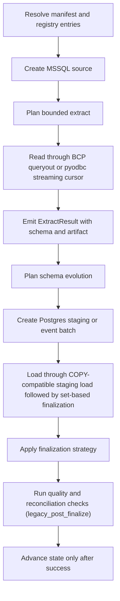

# MSSQL -> Postgres

This guide is a copy/paste-ready starting point for loading data from **MSSQL** into **Postgres** with `dpone`.

**Status:** Batch ETL supported

Type profile: `mssql_to_postgres_native_v1`. Vendor-live evidence uses a
**wide** typed fixture (`dpone_src` → Postgres `dpone_it`) and covers Docker
strategies `full_refresh`, `incremental_append`, `incremental_merge`,
`replace`, `partition_replace`, `snapshot_diff`, `scd2`, and `backfill`
(inner `replace`) via
`tests/integration/mssql/test_mssql_to_postgres_vendor_live_integration.py`.
Extract uses Postgres-safe CSV (Postgres rejects `mssql-delimited`); binary
columns land as `bytea` via `\x` hex CSV. See
[Route live wide certification](../testing/route-live-wide-certification.md).

### Vendor-live IT (manual)

```bash
docker compose -f docker/docker-compose.integration.yml up -d mssql postgres
export DPONE_RUN_INTEGRATION=1 DPONE_RUN_INTEGRATION_LIVE=1
uv run pytest tests/integration/mssql/test_mssql_to_postgres_vendor_live_integration.py -q
```

## When to use this path

Use this path when MSSQL is the system of record or ingestion boundary and Postgres is the landing, warehouse, event-log, or downstream replication target.

## Copy/paste manifest

```yaml
# yaml-language-server: $schema=../../src/dpone/schema/etl-batch-manifest.schema.json
kind: dpone.batch.v1

defaults:
  name: mssql_to_postgres_example
  source:
    type: mssql
    connection_id: mssql_source
    options:
      batch_size: 50000
      export_format: csv
  sink:
    type: postgres
    connection_id: postgres_dwh
    table:
      schema: public
      name: orders
    strategy:
      mode: incremental_merge
      unique_key: order_id
      merge_policy: delete_insert
      duplicate_policy: fail

quality:
  gates:
    - id: source_target_rows
      type: row_count_reconciliation
      severity: error
      tolerance:
        mode: pct
        value: 0.1

schemas:
  dbo:
    tables:
      - orders
```

Run it locally:

```bash
dpone plan examples/source-sink/mssql-to-postgres.yaml --format md
dpone run examples/source-sink/mssql-to-postgres.yaml
```

The checked source file is `examples/source-sink/mssql-to-postgres.yaml`; CI
compares its parsed YAML with this block.

If you change the strategy to `full_refresh` and empty output is invalid,
row-count reconciliation is not enough: it can pass a `0` source / `0` target
comparison. Add an explicit non-empty target gate:

```yaml
quality:
  gates:
    - id: target_min_rows
      type: min_rows
      side: target
      threshold: 1
      severity: error
```

## Supported load strategies

These rows describe public runtime contracts, not certification of this exact
source, sink, transport, schema-evolution mode, and runtime combination.

| Strategy | Status | Notes |
|---|---|---|
| `full_refresh` | Supported | Uses staging first, then applies the target-specific finalization plan. |
| `incremental_append` | Supported | Uses staging first, then applies the target-specific finalization plan. |
| `incremental_merge` | Supported | Default `merge_policy: delete_insert`; `shadow_swap` is available for DB targets. |
| `replace` | Supported | Uses staging first, then applies the target-specific finalization plan. |
| `partition_replace` | Supported | Replaces target partitions represented by staging `partition.column`; see Load strategies for native/fallback paths. |
| `snapshot_diff` | Supported | Requires a complete bounded snapshot and `unique_key`; applies the configured diff/delete policy. |

See [Load strategies](../load-strategies.md) for the detailed algorithm for each strategy.
MSSQL CDC is a source capability, not a load strategy. It uses typed CDC
offsets and advances source state only after sink success; certify the exact
route and environment before enabling it.

## Runtime algorithm

This sink does not currently implement `StagedLoadPort`, so this route records
`governance_finalization=legacy_post_finalize`. Blocking gates run only after
the sink has mutated or finalized the target. A failure prevents source-state
advancement but cannot roll back that target mutation; inspect and repair or
deduplicate the target before retrying. See
[Load governance](../load-governance.md#runtime-lifecycle).



## Strategy behavior

- `full_refresh`: extract the selected source boundary, load into staging, and replace the target according to the target's safe finalization path.
- `incremental_append`: extract only the incremental boundary and append rows through staging or event production.
- `incremental_merge`: load into staging, validate duplicates, then use `delete_insert` by default; `shadow_swap` is available where table swaps are supported.
- `replace`: reload a bounded predicate window through staging and then atomically replace the matching target slice.
- `snapshot_diff`: compare a complete current source snapshot with the target by `unique_key`, then apply the configured insert, update, and delete policy.
- `partition_replace`: extract a complete partition slice, load it into staging, and replace only partitions represented by `partition.column`.

Snapshot reconciliation is separate from the load strategy. Runtime planning
reports that capability as `reconciliation.mode=snapshot`; in the official
`dpone.batch.v1` authoring schema, enable it with `reconciliation: true`.

## Schema evolution and type mapping

Pair profile `mssql_to_postgres_native_v1` maps MSSQL metadata types to Postgres
DDL before staging/final load (`integer`/`smallint`/`bigint`,
`numeric(p,s)`, `boolean`, `timestamp`/`timestamptz`, `varchar`/`text`,
`uuid`, `bytea`, …). Unknown or spatial/`sql_variant` types require an explicit
`schema_contract`.

Schema evolution is enabled by default and runs before the staging/final load path:

1. Read source schema from `ExtractResult.schema` (pair-mapped for Postgres).
2. Introspect the Postgres target schema.
3. Apply safe additions and widening operations.
4. Fail breaking changes by default.
5. If configured, route incompatible type changes to `__dpone__nc__<column>`.

Use [Schema evolution](../schema-evolution.md) and [Type mapping matrix](../type-mapping-matrix.md) when adding columns or changing source types.

## Self-service golden path

Copy-paste CJM for the checked-in example (wide vendor-live certified route):

```bash
dpone doctor --profile local
pip install "dpone[mssql,postgres]"
dpone plan examples/source-sink/mssql-to-postgres.yaml --format md
dpone schema type-matrix --source mssql --sink postgres --format md
dpone run examples/source-sink/mssql-to-postgres.yaml
```

Landing convention (vault/GitOps-oriented): `examples/batch/landing_mssql_to_postgres.batch.yaml`.

See [Route live wide certification](../testing/route-live-wide-certification.md) for the maintainer vendor-live IT evidence path (SKIP ≠ PASS).

## Runbook

1. Start with `dpone doctor --profile local` and fix missing extras or native clients.
2. Run `dpone plan examples/source-sink/mssql-to-postgres.yaml --format md` and review source boundary, staging path, schema evolution, state, and quality gates.
3. Run a small bounded window first.
4. Inspect the run artifact under `.dpone/runs/mssql_to_postgres`.
5. For incremental jobs, verify state before enabling a schedule.
6. For delete-aware jobs, run reconciliation in report-only mode before enabling physical deletes.
7. Promote the manifest through GitOps after the plan and artifact are reviewed.

## Cross-links

- [Source -> sink matrix](../source-sink-matrix.md)
- [Load strategies](../load-strategies.md)
- [Schema evolution](../schema-evolution.md)
- [Type mapping matrix](../type-mapping-matrix.md)
- [Reconciliation and CDC](../cdc.md)
- [Performance guide](../performance.md)

## Type contracts and physical design

This flow supports the shared dpone type-governance stack:

- [Type inference](../type-inference.md) for source metadata, sampled profiling, confidence, and empty string vs `NULL` behavior.
- [Schema contracts](../schema-contracts.md) for explicit logical column types, enforcement modes, and `__dpone__nc__*` variant columns.
- [Physical design](../physical-design.md) for target-specific DDL such as concrete SQL types, indexes, partitioning, compression, ClickHouse `LowCardinality`, and BigQuery clustering.

Use `dpone schema infer --manifest ...` and `dpone schema physical-plan --manifest ...` before enabling new table DDL in production.
