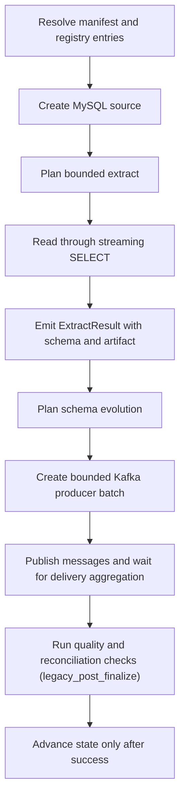

# MySQL -> Kafka

This guide is a copy/paste-ready starting point for loading data from **MySQL**
into **Kafka** with `dpone`.

**Status:** Batch/event-log supported (wide vendor-live certified)

This route uses the MySQL **source family** with Kafka-safe **CSV** export into
existing `KafkaSink` JSON produce (optional `envelope: dpone`). Do **not** set
`export_format: mssql-delimited` or `compress_export: true` for this sink
(fail-closed at plan and runtime). No dedicated PairTypeMatrix profile (parity
with [Postgres -> Kafka](postgres-to-kafka.md)). Wide live certification asserts
typed JSON message payloads from CSV wire — not sink DDL.

## When to use this path

Use this path when MySQL (or MariaDB) is the system of record and Kafka
is the landing, warehouse, event-log, or downstream replication target. v1 uses
watermark/`incremental_column` extract (no binlog CDC).

## Copy/paste manifest

```yaml
# yaml-language-server: $schema=../../src/dpone/schema/etl-batch-manifest.schema.json
kind: dpone.batch.v1

defaults:
  name: mysql_to_kafka_example
  source:
    type: mysql
    connection_id: mysql_source
    options:
      batch_size: 50000
      incremental_column: updated_at
      export_format: csv
  sink:
    type: kafka
    connection_id: kafka_target
    strategy:
      mode: incremental_append
    topic: dwh.orders
    options:
      message_format: json
      envelope: dpone
      key:
        mode: hash_row
      delivery:
        mode: at_least_once

quality:
  gates:
    - id: source_target_rows
      type: row_count_reconciliation
      severity: error
      tolerance:
        mode: pct
        value: 0.1

schemas:
  app:
    tables:
      - orders
```

Run it locally:

```bash
pip install "dpone[mysql,kafka]"
dpone plan examples/source-sink/mysql-to-kafka.yaml --format md
dpone run examples/source-sink/mysql-to-kafka.yaml
```

Landing-oriented batch example:
`examples/batch/landing_mysql_to_kafka.batch.yaml`.

The checked source file is `examples/source-sink/mysql-to-kafka.yaml`; CI
compares its parsed YAML with this block.

If you change the strategy to `full_refresh` and empty output is invalid,
row-count reconciliation is not enough: it can pass a `0` source / `0` target
comparison. Add an explicit non-empty target gate:

```yaml
quality:
  gates:
    - id: target_min_rows
      type: min_rows
      side: target
      threshold: 1
      severity: error
```

## Supported load strategies

Kafka is append-only message publication. Strategy names describe event
semantics; they do not mutate existing topic records or swap topic storage.
Rows marked **Supported** have wide vendor-live PASS evidence in
`tests/integration/mysql/test_mysql_to_kafka_vendor_live_integration.py`.

| Strategy | Status | Notes |
|---|---|---|
| `full_refresh` | Supported | Publishes the bounded snapshot as new messages; existing messages remain. |
| `incremental_append` | Supported | Publishes each bounded incremental row as a new message. |
| `incremental_merge` | Supported | Publishes keyed upsert events with `merge_policy: event_upsert`. |
| `replace` | Supported | Publishes replacement-intent events (`op: replace`); consumers materialize. |
| `snapshot_diff` | Supported | Publishes snapshot rows as keyed upsert events with `__dpone__row_hash` enrichment; tombstone/delete semantics require explicit `deletes` config and consumer idempotency (no target-table convergence). |
| `backfill` | Supported | Keyed upsert replay only: omit `backfill.inner_mode` or set `incremental_merge`. |
| `partition_replace` | N/A | `KafkaSink.load` fails fast — topics are append-only logs. |
| `scd2` | N/A | `KafkaSink` does not implement `scd2`; use keyed change events instead. |
| `backfill` (`inner_mode: replace` / `partition_replace` / `full_refresh`) | N/A | Kafka backfill accepts only keyed upsert replay (`incremental_merge`). |

See [Load strategies](../load-strategies.md) for the detailed algorithm for each strategy.
MySQL binlog CDC is deferred in v1.

## Strategy behavior

- `full_refresh`: publish every row in the bounded snapshot as a new message; existing topic records remain.
- `incremental_append`: publish only the bounded incremental rows as new messages.
- `incremental_merge`: publish keyed upsert/delete events with `merge_policy: event_upsert`; requires `unique_key`.
- `replace`: publish replacement-intent events for a bounded window; no existing message is rewritten.
- `snapshot_diff`: publish keyed upsert events for each bounded snapshot row after `StrategyMetadataEnricher` adds `__dpone__row_hash`; configure `deletes` for tombstones when consumers must observe hard deletes.
- `backfill`: replay bounded chunks as keyed upsert events (`inner_mode: incremental_merge` only).
- `partition_replace`: not supported for Kafka sinks because a topic is an append-only event log.
- `scd2`: not supported for Kafka sinks; use keyed change events instead.

Snapshot reconciliation is separate from the load strategy. Runtime planning
reports that capability as `reconciliation.mode=snapshot`; in the official
`dpone.batch.v1` authoring schema, enable it with `reconciliation: true`.

## Runtime algorithm

This sink does not currently implement `StagedLoadPort`, so this route records
`governance_finalization=legacy_post_finalize`. Blocking gates run only after
messages have been published. A failure prevents source-state advancement but
cannot retract delivered messages; inspect delivery evidence and consumer
idempotency before retrying. See
[Load governance](../load-governance.md#runtime-lifecycle).




## Schema evolution and type mapping

Schema evolution is enabled by default and runs before the staging/final load path:

1. Read source schema from `ExtractResult.schema`.
2. Introspect the Kafka target schema.
3. Apply safe additions and widening operations.
4. Fail breaking changes by default.
5. If configured, route incompatible type changes to `__dpone__nc__<column>`.

Use [Schema evolution](../schema-evolution.md) and [Type mapping matrix](../type-mapping-matrix.md) when adding columns or changing source types.
CSV cells are stringly; JSON serialization follows `JsonRowCodec` (no PairTypeMatrix suite, same as postgres→kafka).

## Self-service golden path

Copy-paste CJM for the checked-in example (wide vendor-live certified route):

```bash
dpone doctor --profile local
pip install "dpone[mysql,kafka]"
dpone plan examples/source-sink/mysql-to-kafka.yaml --format md
dpone schema type-matrix --source mysql --sink kafka --format md
dpone run examples/source-sink/mysql-to-kafka.yaml
```

Landing convention (vault/GitOps-oriented): `examples/batch/landing_mysql_to_kafka.batch.yaml`.

See [Route live wide certification](../testing/route-live-wide-certification.md) for the maintainer vendor-live IT evidence path (SKIP ≠ PASS).

## Runbook

1. Start with `dpone doctor --profile local` and fix missing extras or native clients.
2. Install `pip install "dpone[mysql,kafka]"`.
3. Confirm `export_format: csv` and `compress_export: false`.
4. Run `dpone plan examples/source-sink/mysql-to-kafka.yaml --format md` and review source boundary, publication path, schema evolution, state, and quality gates.
5. Run a small bounded window first.
6. Inspect the run artifact under `.dpone/runs/mysql_to_kafka`.
7. For incremental jobs, verify watermark/`incremental_column` before enabling a schedule.
8. Promote the manifest through GitOps after the plan and artifact are reviewed.

## Cross-links

- [Source -> sink matrix](../source-sink-matrix.md)
- [Load strategies](../load-strategies.md)
- [Schema evolution](../schema-evolution.md)
- [Type mapping matrix](../type-mapping-matrix.md)
- [Postgres -> Kafka](postgres-to-kafka.md)
- [MySQL -> MSSQL](mysql-to-mssql.md)
- [Feature design](../feature-design-mysql-to-kafka-batch-v1.md)
- [Reconciliation and CDC](../cdc.md)
- [Performance guide](../performance.md)
