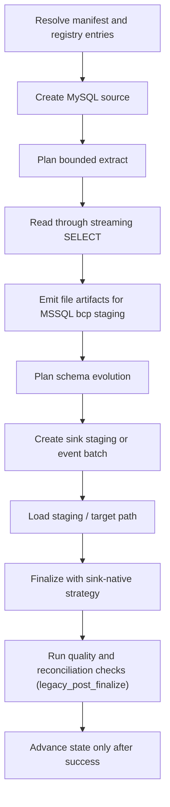

# MySQL -> MSSQL

This guide is a copy/paste-ready starting point for loading data from **MySQL**
into **MSSQL / SQL Server** with `dpone`.

**Status:** Batch ETL supported

This is the MySQL→MSSQL Batch ETL route with native `mssql-delimited` / BCP evidence.
Type profile: `mysql_to_mssql_native_v1` (applied at MySQL extract via sink-aware
schema mapping). Vendor-live evidence uses a **wide** typed fixture and covers
Docker MySQL → MSSQL strategy mechanics. Current generic admission allows
complete/stateless `full_refresh`, `replace`, `partition_replace`,
`snapshot_diff`, `scd2`, and bounded `backfill`; legacy single-column
`incremental_append`/`incremental_merge` evidence does not prove a complete
source boundary and those modes now fail closed. The fixture lives in
`tests/integration/mysql/test_mysql_to_mssql_vendor_live_integration.py`.
`BLOB`/`varbinary` uses the **hex character BCP** wire (Python `bytes.hex()` on
extract, `nvarchar` staging, `CONVERT(varbinary, …, 2)` on finalize). True SQL
Server native (`bcp -n`) producer from MySQL remains a separate path. See
[Route live wide certification](../testing/route-live-wide-certification.md)
and `docs/feature-design-mssql-hex-binary-character-bcp-v1.md`.

### Vendor-live IT (manual)

```bash
docker compose -f docker/docker-compose.integration.yml up -d mysql mssql
export DPONE_RUN_INTEGRATION=1 DPONE_RUN_INTEGRATION_LIVE=1
uv run pytest tests/integration/mysql/test_mysql_to_mssql_vendor_live_integration.py -q
```

For Postgres landing see [MySQL -> Postgres](mysql-to-postgres.md).

## When to use this path

Use this path when MySQL (or MariaDB) is the system of record and MSSQL / SQL Server
is the landing, warehouse, event-log, or downstream replication target. Use a
complete table snapshot or complete bounded replacement window. Binlog CDC is
not available in v1.

## Copy/paste manifest

```yaml
# yaml-language-server: $schema=../../src/dpone/schema/etl-batch-manifest.schema.json
kind: dpone.batch.v1

defaults:
  name: mysql_to_mssql_example
  source:
    type: mysql
    connection_id: mysql_source
    options:
      batch_size: 50000
      export_format: csv
  sink:
    type: mssql
    connection_id: mssql_dwh
    table:
      schema: dbo
      name: orders
    strategy:
      mode: full_refresh
    options:
      bulk:
        mode: bcp
        bcp:
          batch_size: 100000
          packet_size: 65535

quality:
  gates:
    - id: source_target_rows
      type: row_count_reconciliation
      severity: error
      tolerance:
        mode: pct
        value: 0.1

schemas:
  app:
    tables:
      - orders
```

Run it locally:

```bash
dpone plan examples/source-sink/mysql-to-mssql.yaml --format md
dpone run examples/source-sink/mysql-to-mssql.yaml
```

The checked source file is `examples/source-sink/mysql-to-mssql.yaml`; CI
compares its parsed YAML with this block.

If you change the strategy to `full_refresh` and empty output is invalid,
row-count reconciliation is not enough: it can pass a `0` source / `0` target
comparison. Add an explicit non-empty target gate:

```yaml
quality:
  gates:
    - id: target_min_rows
      type: min_rows
      side: target
      threshold: 1
      severity: error
```

## Supported load strategies

These rows describe public runtime contracts, not certification of this exact
source, sink, transport, schema-evolution mode, and runtime combination.

| Strategy | Status | Notes |
|---|---|---|
| `full_refresh` | Supported | Uses staging first, then applies the target-specific finalization plan. |
| `incremental_append` | Fail-closed | Target-derived single-column `MAX + >` is not a complete source boundary. |
| `incremental_merge` | Fail-closed | A `unique_key` protects target identity but does not repair the source cursor. |
| `replace` | Supported | Uses staging first, then applies the target-specific finalization plan. |
| `partition_replace` | Supported where sink allows | See Load strategies for native/fallback paths. |
| `snapshot_diff` | Supported | Requires a complete bounded snapshot and `unique_key`. |
| `scd2` | Supported | Requires `unique_key`; file extracts must carry `__dpone__row_hash` / validity columns. |
| `backfill` | Supported | Inner mode `replace` via bounded `custom_predicate`. |

See [Load strategies](../load-strategies.md) for the detailed algorithm for each strategy.
MySQL binlog CDC is deferred in v1.

## Strategy behavior

- `full_refresh`: extract the selected source boundary, load into staging, and apply the target's safe finalization path.
- `incremental_append` / `incremental_merge`: rejected by generic MSSQL
  admission before target or source I/O when they use the built-in
  single-column target watermark.
- `replace`: reload a bounded predicate window through staging and then atomically replace the matching target slice.
- `snapshot_diff`: compare a complete current source snapshot with the target by `unique_key`, then apply the configured insert, update, and delete policy.
- `partition_replace`: extract a complete partition slice, load it into staging, and replace only partitions represented by `partition.column`.
- `scd2`: maintain type-2 history with expire/ignore delete policy and current-flag columns.
- `backfill`: reload a bounded predicate window using the configured inner mode.

Snapshot reconciliation is separate from the load strategy. Runtime planning
reports that capability as `reconciliation.mode=snapshot`; in the official
`dpone.batch.v1` authoring schema, enable it with `reconciliation: true`.

## Runtime algorithm

This sink does not currently implement `StagedLoadPort`, so this route records
`governance_finalization=legacy_post_finalize`. Blocking gates run only after
the sink has mutated or finalized the target. A failure prevents source-state
advancement but cannot roll back that target mutation; inspect and repair or
deduplicate the target before retrying. See
[Load governance](../load-governance.md#runtime-lifecycle).




## Native fast path

The official `dpone.batch.v1` schema exposes `source.options.export_format` as
`csv` or `binary`; the executable example therefore uses `csv`. The optimized
adapter may report `wire_format: mssql-delimited` in a generated transfer plan.
That is an internal transport label, not a value to copy into the public batch
manifest.

Production wire: `mysql_stream_to_mssql_bcp`.

1. Stream one complete declared MySQL source boundary.
2. Encode text through `BulkTextCodec` as `mssql-delimited`.
3. Import with MSSQL `bcp` into staging.
4. Finalize with set-based merge/replace.
5. Commit the governed MSSQL receipt with finalization.

## Schema evolution and type mapping

Schema evolution is enabled by default and runs before the staging/final load path:

1. Read source schema from `ExtractResult.schema`.
2. Introspect the MSSQL / SQL Server target schema.
3. Apply safe additions and widening operations.
4. Fail breaking changes by default.
5. If configured, route incompatible type changes to `__dpone__nc__<column>`.

Use [Schema evolution](../schema-evolution.md) and [Type mapping matrix](../type-mapping-matrix.md) when adding columns or changing source types.
For the certified MSSQL wire, use profile `mysql_to_mssql_native_v1`.

## Self-service golden path

Copy-paste CJM for the checked-in example (wide vendor-live certified route):

```bash
dpone doctor --profile local
pip install "dpone[mysql,mssql]"
dpone plan examples/source-sink/mysql-to-mssql.yaml --format md
dpone schema type-matrix --source mysql --sink mssql --format md
dpone run examples/source-sink/mysql-to-mssql.yaml
```

Landing convention (vault/GitOps-oriented): `examples/batch/landing_mysql_to_mssql.batch.yaml`.

See [Route live wide certification](../testing/route-live-wide-certification.md) for the maintainer vendor-live IT evidence path (SKIP ≠ PASS).

## Runbook

1. Start with `dpone doctor --profile local` and fix missing extras or native clients.
2. Install `pip install "dpone[mysql,mssql]"`.
3. Run `dpone plan examples/source-sink/mysql-to-mssql.yaml --format md` and review source boundary, staging path, schema evolution, state, and quality gates.
4. Run a small bounded window first.
5. Inspect the run artifact under `.dpone/runs/mysql_to_mssql`.
6. Do not schedule the built-in single-column incremental route; use complete
   full or bounded replacement runs until a source-atomic cursor is available.
7. Promote the manifest through GitOps after the plan and artifact are reviewed.

## Cross-links

- [Source -> sink matrix](../source-sink-matrix.md)
- [Load strategies](../load-strategies.md)
- [Schema evolution](../schema-evolution.md)
- [Type mapping matrix](../type-mapping-matrix.md)
- [MySQL -> Postgres](mysql-to-postgres.md)
- [Reconciliation and CDC](../cdc.md)
- [Performance guide](../performance.md)
