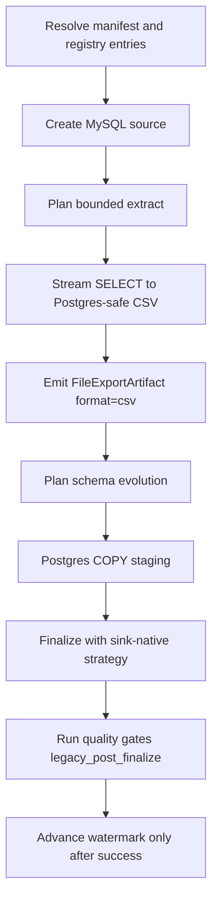

# MySQL -> Postgres

This guide is a copy/paste-ready starting point for loading data from **MySQL**
into **Postgres** with `dpone`.

**Status:** Batch ETL supported

This route uses the MySQL **source family** with Postgres-safe **CSV** export into
existing Postgres `COPY … FROM STDIN` staging. Type profile:
`mysql_to_postgres_native_v1`. Do **not** set `export_format: mssql-delimited`
for this sink (fail-closed at plan and runtime). Vendor-live evidence uses a
**wide** typed fixture and covers Docker MySQL → Postgres strategies
`full_refresh`, `incremental_append`, `incremental_merge`, `replace`,
`partition_replace`, `snapshot_diff`, `scd2`, and `backfill` via
`tests/integration/mysql/test_mysql_to_postgres_vendor_live_integration.py`.
File CSV extracts receive `StrategyMetadataEnricher` hash/SCD2 columns before
staging. See
[Route live wide certification](../testing/route-live-wide-certification.md).

### Vendor-live IT (manual)

```bash
docker compose -f docker/docker-compose.integration.yml up -d mysql postgres
export DPONE_RUN_INTEGRATION=1 DPONE_RUN_INTEGRATION_LIVE=1
uv run pytest tests/integration/mysql/test_mysql_to_postgres_vendor_live_integration.py -q
```

## When to use this path

Use this path when MySQL (or MariaDB) is the system of record and Postgres
is the landing, warehouse, event-log, or downstream replication target. v1 uses
watermark/`incremental_column` extract (no binlog CDC).

## Copy/paste manifest

```yaml
# yaml-language-server: $schema=../../src/dpone/schema/etl-batch-manifest.schema.json
kind: dpone.batch.v1

defaults:
  name: mysql_to_postgres_example
  source:
    type: mysql
    connection_id: mysql_source
    options:
      batch_size: 50000
      incremental_column: updated_at
      export_format: csv
  sink:
    type: postgres
    connection_id: postgres_dwh
    table:
      schema: public
      name: orders
    strategy:
      mode: incremental_merge
      unique_key: order_id
      merge_policy: delete_insert
      duplicate_policy: fail

quality:
  gates:
    - id: source_target_rows
      type: row_count_reconciliation
      severity: error
      tolerance:
        mode: pct
        value: 0.1

schemas:
  app:
    tables:
      - orders
```

Run it locally:

```bash
pip install "dpone[mysql,postgres]"
dpone plan examples/source-sink/mysql-to-postgres.yaml --format md
dpone run examples/source-sink/mysql-to-postgres.yaml
```

Landing-oriented batch example:
`examples/batch/landing_mysql_to_postgres.batch.yaml`.

The checked source file is `examples/source-sink/mysql-to-postgres.yaml`; CI
compares its parsed YAML with this block.

If you change the strategy to `full_refresh` and empty output is invalid,
row-count reconciliation is not enough: it can pass a `0` source / `0` target
comparison. Add an explicit non-empty target gate:

```yaml
quality:
  gates:
    - id: target_min_rows
      type: min_rows
      side: target
      threshold: 1
      severity: error
```

## Supported load strategies

These rows describe public runtime contracts, not six-dimensional route
attestation of every transport/schema-evolution combination.

| Strategy | Status | Notes |
|---|---|---|
| `full_refresh` | Supported | Staging first, then Postgres finalization. |
| `incremental_append` | Supported | Staging first, then Postgres finalization. |
| `incremental_merge` | Supported | Default merge policy follows the sink; requires `unique_key`. |
| `replace` | Supported | Staging first, then Postgres finalization. |
| `partition_replace` | Supported where sink allows | See Load strategies for native/fallback paths. |
| `snapshot_diff` | Supported | Requires a complete bounded snapshot and `unique_key`. |
| `scd2` | Supported | Requires `unique_key`; file extracts must carry `__dpone__row_hash` / validity columns. |
| `backfill` | Supported | Inner mode `replace` via bounded `custom_predicate`. |

See [Load strategies](../load-strategies.md) for the detailed algorithm for each strategy.
MySQL binlog CDC is deferred.

## Strategy behavior

- `full_refresh`: extract the selected source boundary, load into staging, and apply the target's safe finalization path.
- `incremental_append`: extract only the incremental boundary and append rows through staging or event production.
- `incremental_merge`: load into staging, validate duplicates, then apply the sink merge policy.
- `replace`: reload a bounded predicate window through staging and then atomically replace the matching target slice.
- `snapshot_diff`: compare a complete current source snapshot with the target by `unique_key`, then apply the configured insert, update, and delete policy.
- `partition_replace`: extract a complete partition slice, load it into staging, and replace only partitions represented by `partition.column`.
- `scd2`: maintain type-2 history with expire/ignore delete policy and current-flag columns.
- `backfill`: reload a bounded predicate window using the configured inner mode.

Snapshot reconciliation is separate from the load strategy. Runtime planning
reports that capability as `reconciliation.mode=snapshot`; in the official
`dpone.batch.v1` authoring schema, enable it with `reconciliation: true`.

## Runtime algorithm

This sink does not currently implement `StagedLoadPort`, so this route records
`governance_finalization=legacy_post_finalize`. Blocking gates run only after
the sink has mutated or finalized the target. A failure prevents source-state
advancement but cannot roll back that target mutation; inspect and repair or
deduplicate the target before retrying. See
[Load governance](../load-governance.md#runtime-lifecycle).



## Schema evolution and type mapping

Schema evolution is enabled by default and runs before the staging/final load path:

1. Read source schema from `ExtractResult.schema`.
2. Introspect the Postgres target schema.
3. Apply safe additions and widening operations.
4. Fail breaking changes by default.
5. If configured, route incompatible type changes to `__dpone__nc__<column>`.

Pair profile: **`mysql_to_postgres_native_v1`**
(`dpone.type_system.source_sink.mysql_postgres.MySQLPostgresTypeMapper`).

Notable mappings:

| MySQL | Postgres | Notes |
|---|---|---|
| `tinyint(1)` / `bool` | `boolean` | CSV `true`/`false` or `0`/`1` |
| `int unsigned` | `bigint` | Widened signed range |
| `bigint unsigned` | `numeric(20,0)` | Requires explicit contract |
| `datetime` / `timestamp` | `timestamp` | CSV timestamp text |
| `json` | `jsonb` | JSON text via CSV |
| `blob` / `varbinary` | `bytea` | Hex text; confirm consumer contract |
| `ENUM` / `SET` / spatial | `text` | Explicit `schema_contract` required |

Use [Schema evolution](../schema-evolution.md) and [Type mapping matrix](../type-mapping-matrix.md)
when adding columns or changing source types.

## Self-service golden path

Copy-paste CJM for the checked-in example (wide vendor-live certified route):

```bash
dpone doctor --profile local
pip install "dpone[mysql,postgres]"
dpone plan examples/source-sink/mysql-to-postgres.yaml --format md
dpone schema type-matrix --source mysql --sink postgres --format md
dpone run examples/source-sink/mysql-to-postgres.yaml
```

Landing convention (vault/GitOps-oriented): `examples/batch/landing_mysql_to_postgres.batch.yaml`.

See [Route live wide certification](../testing/route-live-wide-certification.md) for the maintainer vendor-live IT evidence path (SKIP ≠ PASS).

## Runbook

1. Start with `dpone doctor --profile local` and fix missing extras or native clients.
2. Install `pip install "dpone[mysql,postgres]"`.
3. Run `dpone plan examples/source-sink/mysql-to-postgres.yaml --format md` and review source boundary, staging path, schema evolution, state, and quality gates.
4. Confirm `source.options.export_format: csv` (never `mssql-delimited` for Postgres).
5. Run a small bounded window first.
6. Inspect the run artifact under `.dpone/runs/mysql_to_postgres`.
7. For incremental jobs, verify watermark/`incremental_column` before enabling a schedule.
8. Promote the manifest through GitOps after the plan and artifact are reviewed.

## Cross-links

- [Source -> sink matrix](../source-sink-matrix.md)
- [Load strategies](../load-strategies.md)
- [Schema evolution](../schema-evolution.md)
- [Type mapping matrix](../type-mapping-matrix.md)
- [MySQL -> MSSQL](mysql-to-mssql.md)
- [Feature design](../feature-design-mysql-to-postgres-batch-v1.md)
- [Route live wide certification](../testing/route-live-wide-certification.md)
- [Reconciliation and CDC](../cdc.md)
- [Performance guide](../performance.md)
