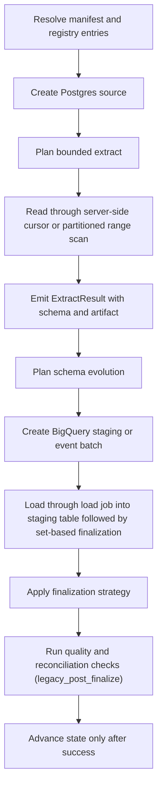

# Postgres -> BigQuery

This guide is a copy/paste-ready starting point for loading data from **Postgres** into **BigQuery** with `dpone`.

**Status:** Batch ETL supported

CSV wire + `postgres_to_bigquery_analytics_v1` type profile are hermetically
contracted. Vendor-live evidence uses a **wide** typed fixture and covers
Docker Postgres → BigQuery strategies
`full_refresh`, `incremental_append`, `incremental_merge`, `replace`,
`partition_replace`, `snapshot_diff`, `scd2`, and `backfill` via
`tests/integration/postgres/test_postgres_to_bigquery_vendor_live_integration.py`
(billing-enabled GCP project required). `bytea` is exported as RFC 4648
base64 for BigQuery CSV `BYTES` (native Postgres `\x…` hex is rejected by
load jobs). Incremental deltas targeting BigQuery use COPY file export so
that wire encoding applies. See
[Route live wide certification](../testing/route-live-wide-certification.md).

### Vendor-live IT (manual)

```bash
docker compose -f docker/docker-compose.integration.yml up -d postgres
export DPONE_RUN_INTEGRATION=1 DPONE_RUN_INTEGRATION_LIVE=1
export BIGQUERY_DWH_PROJECT_ID=<gcp-project>
export BIGQUERY_DWH_SERVICE_ACCOUNT_KEY_FILE=/absolute/path/to/sa.json
export DPONE_IT_BQ_DATASET=dpone_it_postgres
uv run pytest tests/integration/postgres/test_postgres_to_bigquery_vendor_live_integration.py -q
```

Never commit the service-account JSON. Missing credentials or
`billingNotEnabled` are reported as SKIP, not PASS. Live configs use
`batch_commit_mode=whole` (direct CSV load jobs); `separate` batched mode
requires an explicit object_storage bucket.

## When to use this path

Use this path when Postgres is the system of record or ingestion boundary and BigQuery is the landing, warehouse, event-log, or downstream replication target.

## Copy/paste manifest

```yaml
# yaml-language-server: $schema=../../src/dpone/schema/etl-batch-manifest.schema.json
kind: dpone.batch.v1

defaults:
  name: postgres_to_bigquery_example
  source:
    type: postgres
    connection_id: postgres_source
    options:
      batch_size: 50000
      export_format: csv
  sink:
    type: bigquery
    connection_id: bigquery_dwh
    table:
      schema: landing
      name: orders
    strategy:
      mode: incremental_merge
      unique_key: order_id
      merge_policy: delete_insert
      duplicate_policy: fail

quality:
  gates:
    - id: source_target_rows
      type: row_count_reconciliation
      severity: error
      tolerance:
        mode: pct
        value: 0.1

schemas:
  public:
    tables:
      - orders
```

Run it locally:

```bash
dpone plan examples/source-sink/postgres-to-bigquery.yaml --format md
dpone run examples/source-sink/postgres-to-bigquery.yaml
```

The checked source file is `examples/source-sink/postgres-to-bigquery.yaml`;
CI compares its parsed YAML with this block.

If you change the strategy to `full_refresh` and empty output is invalid,
row-count reconciliation is not enough: it can pass a `0` source / `0` target
comparison. Add an explicit non-empty target gate:

```yaml
quality:
  gates:
    - id: target_min_rows
      type: min_rows
      side: target
      threshold: 1
      severity: error
```

## Supported load strategies

Wide vendor-live evidence (Docker Postgres + billing-enabled BigQuery) covers
every BigQuery factory strategy below. Runtime contract details remain in
[Load strategies](../load-strategies.md).

| Strategy | Status | Notes |
|---|---|---|
| `full_refresh` | Supported | Wide vendor-live PASS; staging then target finalization. |
| `incremental_append` | Supported | Wide vendor-live PASS; watermark via `incremental_column`. |
| `incremental_merge` | Supported | Wide vendor-live PASS; default `merge_policy: delete_insert`. |
| `replace` | Supported | Wide vendor-live PASS; bounded predicate window. |
| `partition_replace` | Supported | Wide vendor-live PASS; replaces partitions from staging `partition.column`. |
| `snapshot_diff` | Supported | Wide vendor-live PASS; requires complete snapshot + `unique_key`. |
| `scd2` | Supported | Wide vendor-live PASS; `__dpone__is_current` / `__dpone__row_hash` via enricher. |
| `backfill` | Supported | Wide vendor-live PASS for inner `replace` window. |

See [Load strategies](../load-strategies.md) for the detailed algorithm for each strategy.
Postgres `xmin` boundaries and CDC are source capabilities, not load
strategies. Select them explicitly through supported source configuration;
their state advances only after sink success. Certify the exact CDC route and
environment before enabling it.

## Runtime algorithm

This sink does not currently implement `StagedLoadPort`, so this route records
`governance_finalization=legacy_post_finalize`. Blocking gates run only after
the sink has mutated or finalized the target. A failure prevents source-state
advancement but cannot roll back that target mutation; inspect and repair or
deduplicate the target before retrying. See
[Load governance](../load-governance.md#runtime-lifecycle).



## Strategy behavior

- `full_refresh`: extract the selected source boundary, load into staging, and replace the target according to the target's safe finalization path.
- `incremental_append`: extract only the incremental boundary and append rows through staging or event production.
- `incremental_merge`: load into staging, validate duplicates, then use `delete_insert` by default; `shadow_swap` is available where table swaps are supported.
- `replace`: reload a bounded predicate window through staging and then atomically replace the matching target slice.
- `snapshot_diff`: compare a complete current source snapshot with the target by `unique_key`, then apply the configured insert, update, and delete policy.
- `partition_replace`: extract a complete partition slice, load it into staging, and replace only partitions represented by `partition.column`.

Snapshot reconciliation is separate from the load strategy. Runtime planning
reports that capability as `reconciliation.mode=snapshot`; in the official
`dpone.batch.v1` authoring schema, enable it with `reconciliation: true`.

## Schema evolution and type mapping

Schema evolution is enabled by default and runs before the staging/final load path:

1. Read source schema from `ExtractResult.schema`.
2. Introspect the BigQuery target schema.
3. Apply safe additions and widening operations.
4. Fail breaking changes by default.
5. If configured, route incompatible type changes to `__dpone__nc__<column>`.

Use [Schema evolution](../schema-evolution.md) and [Type mapping matrix](../type-mapping-matrix.md) when adding columns or changing source types.

## Self-service golden path

Copy-paste CJM for the checked-in example (wide vendor-live certified route):

```bash
dpone doctor --profile local
pip install "dpone[gcp,postgres]"
dpone plan examples/source-sink/postgres-to-bigquery.yaml --format md
dpone schema type-matrix --source postgres --sink bigquery --format md
dpone run examples/source-sink/postgres-to-bigquery.yaml
```

Landing convention (vault/GitOps-oriented): `examples/batch/landing_postgres_to_bq.batch.yaml`.

See [Route live wide certification](../testing/route-live-wide-certification.md) for the maintainer vendor-live IT evidence path (SKIP ≠ PASS).

## Runbook

1. Start with `dpone doctor --profile local` and fix missing extras or native clients.
2. Run `dpone plan examples/source-sink/postgres-to-bigquery.yaml --format md` and review source boundary, staging path, schema evolution, state, and quality gates.
3. Run a small bounded window first.
4. Inspect the run artifact under `.dpone/runs/postgres_to_bigquery`.
5. For incremental jobs, verify state before enabling a schedule.
6. For delete-aware jobs, run reconciliation in report-only mode before enabling physical deletes.
7. Promote the manifest through GitOps after the plan and artifact are reviewed.

## Cross-links

- [Source -> sink matrix](../source-sink-matrix.md)
- [Load strategies](../load-strategies.md)
- [Schema evolution](../schema-evolution.md)
- [Type mapping matrix](../type-mapping-matrix.md)
- [Reconciliation and CDC](../cdc.md)
- [Performance guide](../performance.md)

## Type contracts and physical design

This flow supports the shared dpone type-governance stack:

- [Type inference](../type-inference.md) for source metadata, sampled profiling, confidence, and empty string vs `NULL` behavior.
- [Schema contracts](../schema-contracts.md) for explicit logical column types, enforcement modes, and `__dpone__nc__*` variant columns.
- [Physical design](../physical-design.md) for target-specific DDL such as concrete SQL types, indexes, partitioning, compression, ClickHouse `LowCardinality`, and BigQuery clustering.

Use `dpone schema infer --manifest ...` and `dpone schema physical-plan --manifest ...` before enabling new table DDL in production.
