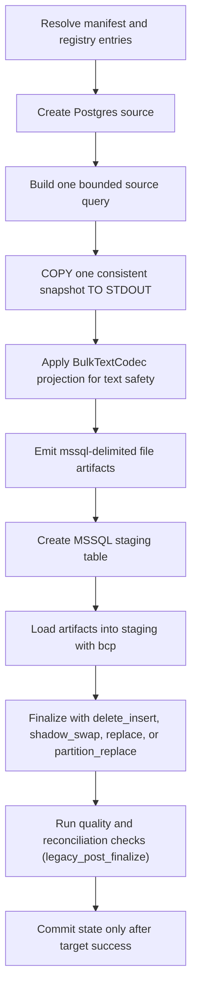

# Postgres -> MSSQL

This guide is a copy/paste-ready starting point for loading data from **Postgres** into **MSSQL** with `dpone`.

**Status:** Batch ETL supported

Type profile: `postgres_to_mssql_native_v2` (applied at Postgres extract via
sink-aware schema mapping). Vendor-live evidence uses a **128-column wide** typed fixture
(`dpone_src` → `dpone_it`) and covers Docker Postgres → MSSQL strategies
`full_refresh`, `replace`, `partition_replace`, `snapshot_diff`, `scd2`, and
`backfill`, plus pre-I/O fail-closed evidence for unsafe column-cursor
`incremental_append`/`incremental_merge`, via
`tests/integration/postgres/test_postgres_to_mssql_vendor_live_integration.py`.
Safe `incremental_merge` is certified separately with XMin, a complete-key
snapshot, and target-atomic MSSQL state in
`tests/integration/postgres/test_postgres_xmin_mssql_snapshot_reconciliation_live.py`.
`bytea` uses the **hex character BCP** wire (`encode(..., 'hex')` on extract,
`nvarchar` staging, `CONVERT(varbinary, …, 2)` on finalize). True SQL Server
native (`bcp -n`) producer from Postgres remains a separate path. See
[Route live wide certification](../testing/route-live-wide-certification.md)
and `docs/feature-design-mssql-hex-binary-character-bcp-v1.md`.

### Vendor-live IT (manual)

```bash
docker compose -f docker/docker-compose.integration.yml up -d postgres mssql
export DPONE_RUN_INTEGRATION=1 DPONE_RUN_INTEGRATION_LIVE=1
uv run pytest \
  tests/integration/postgres/test_postgres_to_mssql_vendor_live_integration.py \
  tests/integration/postgres/test_postgres_xmin_mssql_snapshot_reconciliation_live.py \
  tests/integration/postgres/test_postgres_mssql_schema_evolution_matrix_live.py \
  tests/integration/postgres/test_postgres_mssql_physical_design_matrix_live.py \
  -q -rs
```

The command is one certification unit: any skip is a failure. It covers every
implemented batch strategy, XMin/key-snapshot delete reconciliation, all 4,608
schema-governance enum combinations plus 96 missing-table combinations, and
the MSSQL physical-design/compression policy matrix. Unsupported combinations
must fail before target or staging mutation. Generated evidence remains
`passed_partial`/`release_ready=false` until the exact package pin and the
production-sized compression/soak gates are complete.

## When to use this path

Use this path when Postgres is the system of record or ingestion boundary and MSSQL is the landing, warehouse, event-log, or downstream replication target.

Only PostgreSQL routes that deliver a `StreamingRowsArtifact` to MSSQL create
the sink-owned character spool described in
[ClickHouse -> MSSQL](clickhouse-to-mssql.md#performance-profile). PostgreSQL
`COPY` file, typed-file, native-file, and same-database query artifacts already
own a different physical transport and are not subjected to the spool's
compatibility-default 1 GiB floor. A pre-extract storage gate runs only when
the runtime source can prove the character-spool route. When transport choice
depends on a source-side delta observation, the same gate runs immediately
before the streaming iterator is consumed.

For a streaming route, configure `runtime.storage.work_dir` on a sized worker
volume. `max_spool_bytes` counts the exact serialized UTF-8 payload bytes. It
is a logical write cap derived from observed filesystem availability after
`runtime.storage.min_free_bytes`; it is not a prediction of physical blocks,
filesystem metadata, quotas, or concurrent consumption. Those physical
constraints may stop a write earlier. On POSIX the spool is unnamed before
source iteration and disappears when its held descriptors close. On Windows cleanup
deletes only a reopened handle that still matches the pinned file identity.
Every terminal outcome releases the owned spool; a missing, rebound, or
undeletable Windows object produces stable residue evidence without deleting a
replacement.

## Large initial load: resumable shadow publication

Use a separate manual initial manifest and scheduled incremental manifest. The
initial strategy is `backfill(inner_mode=incremental_append)` with four fixed
lanes, deterministic UUID/range chunks, MSSQL target-atomic audit state and
`publication.mode: shadow_swap`. It must not execute an incremental merge for
every historical chunk.

The runtime creates one stable shadow from the reviewed live catalog, creates
the clustered columnstore once, and marks the table with the immutable campaign
run key. The shadow is a derived artifact of the existing live target binding;
do not provision another `dpone_target_identity` row. Every chunk revalidates
the live binding and shadow owner, loads typed staging, appends without a
target-wide table lock, and commits a generic MSSQL receipt with the target
DML. Operation-scoped application locks protect equal chunk identities while
unrelated ranges remain parallel.

The chunk receipt invocation is stable by the runtime-issued campaign key, not
the current Airflow run. If a pod dies after the target commit but before the
campaign ledger CAS, resume finds the same receipt before PostgreSQL I/O and
repairs the ledger without appending twice. Each lane retains its independent
source/sink/state connection set across chunks; the runtime does not reconnect
hundreds of times.

Each target-atomic lane is a separate interpreter started with `spawn`; it is
not a thread and never inherits a parent ODBC handle. The child serially owns
its source/sink/state calls while the parent event loop serially owns durable
ledger and lease calls. Operation lease control uses exact synchronous IPC at
admission safe points, so no background heartbeat can call `pyodbc` concurrently
with target DML in the same interpreter. An unavailable or non-serializable
bootstrap fails before source I/O.
Immediately after a finite operation is admitted, the child registers it with
the parent and starts parent-owned renewal before preparing a post-admission
source boundary or schema preplan.

Campaign, chunk and operation ownership for this process route share a
90-second TTL renewed by the parent every 30 seconds. This internal recovery
policy does not change authored lease timing for legacy/threaded routes and
ensures a terminated Airflow process whose SQL session closes can be reclaimed
before its five-minute retry. The
MSSQL campaign also holds one session application lock for the complete run.
That session fence stays authoritative during a non-preemptible parent SQL call;
afterward, dpone refreshes an elapsed durable timestamp only when the same
session still reports `APPLOCK_MODE=Exclusive`.
This guarantee does not bypass a server session preserved by a node/network
partition; bounded takeover for that failure mode requires a separate
epoch-fenced lease row and mutation fencing.

After a native lane exit, the parent stops dispatch, terminates a peer that does
not reach a bounded boundary, and probes the last exact operation on a fresh
MSSQL session. The descriptor is retained across `unregister` until ledger CAS;
therefore commit-before-success is recovered from the immutable receipt, while
receipt-absent work remains resumable.
Each POSIX lane sends READY with its process group; the parent validates and
caches the exact spawned PID/PGID, then returns a containment ACK. Only then may
the child enter runtime opener code and emit the separate runtime-ready event
that gates the first claim. Sentinel events are handled before another chunk is
dispatched, and a timed-out peer's validated process group, including inherited
BCP descendants, is terminated and verified before the final receipt probe.

After all receipts exist, dpone checks the sum of chunk counts, exact shadow
`COUNT_BIG`, duplicate unique keys, columns and indexes. It builds deferred
unique indexes once, then transactionally renames live to the retained backup,
shadow to live, and stores the publication receipt. Only then may the XMin
initial handoff commit and the scheduled incremental manifest run.

This explicit initial mode requires reviewed target-schema permission to create
the shadow, add indexes and extended properties, and rename tables. It also
requires the normal staging/target DML and state-journal rights. Existing
incremental routes retain their current least-privilege contract.

See [Backfill](../backfill.md#large-postgresql-to-mssql-initial-load) and
[ADR 0051](../adr/0051-resumable-mssql-shadow-initial-publication.md).

## Signed PostgreSQL source authority

Every strict PostgreSQL→MSSQL route pins the source that is allowed to produce
an artifact. The environment-owned connection registry contains a closed
cluster/database/principal document and a finite map of canonical relations:

```yaml
connection:
  database: sales
  postgres_source_authority:
    version: 2
    verification_profile: catalog_identity
    topology_role: primary
    database: {canonical_name: sales, oid: 16384}
    principals:
      effective: {canonical_name: dpone_source_reader, oid: 16385}
      session: {canonical_name: dpone_source_reader, oid: 16385}
    relations:
      public.orders:
        schema: public
        relation: orders
        namespace_oid: 2200
        relation_oid: 16402
```

Version 2 `catalog_identity` is the recommended least-privilege profile for an
ordinary read-only source or managed standby. It verifies the signed recovery
role plus exact database, principals, schema, relation and OIDs, and it never
queries PostgreSQL control-data functions or statistics views. Registry keys
and catalog spellings are exact. An authored schema or relation
may differ from its canonical spelling only by ASCII `A`–`Z` case and only when
one catalog query resolves it to exactly one pinned OID; Unicode aliases and
ASCII-fold ambiguities fail closed. Runtime then uses the catalog-returned
canonical names for schema planning and extraction. The route identity hashes
only the selected signed authority—not unrelated relation pins. Hostname,
port, DNS, and connection aliases are diagnostics, so a load-balancer alias
change cannot masquerade as a physical source change.

Discover version-2 pins read-only from the same database and principal used at
runtime:

```sql
SELECT current_database(), d.oid
FROM pg_catalog.pg_database AS d
WHERE d.datname = current_database();
SELECT current_user, effective.oid, session_user, session_role.oid
FROM pg_catalog.pg_roles AS effective
JOIN pg_catalog.pg_roles AS session_role ON session_role.rolname = session_user
WHERE effective.rolname = current_user;
SELECT n.nspname, n.oid, c.relname, c.oid
FROM pg_catalog.pg_namespace AS n
JOIN pg_catalog.pg_class AS c ON c.relnamespace = n.oid
WHERE n.nspname = 'public' AND c.relname = 'orders';
```

Grant only database `CONNECT`, schema `USAGE`, and relation `SELECT` (including
the `xmin` system column when column-level grants are used). No
`pg_read_all_stats`, `pg_monitor`, `pg_control_*`, or WAL-function grant is
required for version 2.

Version 1 remains the opt-in `physical_cluster` profile for environments that
also need a signed PostgreSQL system identifier and timeline. Its document
retains `system_identifier` and `timeline_id`. On a primary, dpone derives the
current timeline from `pg_walfile_name(pg_current_wal_lsn())`; on a physical
standby it reads the checkpoint timeline from `pg_control_checkpoint()`. Grant
only those exact functions for version 1:

```sql
REVOKE EXECUTE ON FUNCTION pg_catalog.pg_control_system() FROM PUBLIC;
GRANT EXECUTE ON FUNCTION pg_catalog.pg_control_system() TO dpone_source_reader;
GRANT EXECUTE ON FUNCTION pg_catalog.pg_control_checkpoint() TO dpone_source_reader;
GRANT EXECUTE ON FUNCTION pg_catalog.pg_current_wal_lsn() TO dpone_source_reader;
GRANT EXECUTE ON FUNCTION pg_catalog.pg_walfile_name(pg_lsn) TO dpone_source_reader;
```

`REVOKE ... FROM PUBLIC` is a reviewed platform operation because it affects
every role. Do not grant superuser or `pg_read_all_stats`. Missing function
visibility is `postgres_source_authority.metadata_permission_denied`; an empty
or invalid checkpoint timeline is `postgres_source_authority.timeline_unavailable`.

Runtime never falls back from version 1 to version 2 after a permission error.
Changing profiles is a reviewed registry migration and changes the governed
route digest. Version 2 intentionally delegates endpoint/cluster authenticity
to the environment connection and TLS controls; it still rejects database,
principal, schema, relation, or recovery-role substitution before `COPY`.

The checkpoint timeline can lag immediately after a promotion until PostgreSQL
writes the next checkpoint. In that bounded window dpone may continue to match
the previously signed timeline, but it still verifies the same cluster system
identifier, database/principal/relation OIDs, read-only recovery role and the
locked source relation. A changed checkpoint timeline requires reviewed
registry rotation before the next load.

Admission validates the signed document without source I/O and probes an
existing commit receipt before opening PostgreSQL. For new work it opens one
branded `REPEATABLE READ READ ONLY` session, proves every field declared by the
selected profile, acquires `ACCESS SHARE` on the safely
quoted canonical relation, and re-reads the relation OID after the lock. Schema
projection and extraction consume that same session and cached projection.
Concurrent DROP/rename/recreate is therefore blocked until materialization is
complete; a later same-name relation with another OID is rejected before
`COPY`. Replays with an authoritative receipt remain source-free.

`dpone check --connections` reports
`DPONE_POSTGRES_SOURCE_AUTHORITY_REQUIRED`,
`DPONE_POSTGRES_SOURCE_AUTHORITY_INVALID`, or
`DPONE_POSTGRES_SOURCE_DATABASE_AUTHORITY_MISMATCH` before connector creation.
Never copy pins between environments or update them from runtime-observed
facts. Promotion, restore, database/relation recreation, role rotation, and
intentional topology changes require a reviewed registry rotation and a new
scheduler invocation.

## Signed SQL Server database authority

Every strict `state.atomicity: target_atomic` MSSQL route pins the physical
identity of each target, staging, and state database in the signed environment
connection registry. This applies to the generic four-object transaction
catalog and to the XMin six-object state catalog. Directly constructing either
state adapter without a verifier fails before catalog or PostgreSQL access.

Target and staging pins belong to the sink connection. The state pin belongs to
the state connection:

```yaml
connections:
  dwh_target:
    type: mssql
    connection:
      host: sql-listener.internal
      database: DWH
      schema: dbo
      database_authorities:
        DWH:
          database_id: 7
          create_token: "2026-08-16T09:14:22.1233333"
          database_guid: 01234567-89ab-cdef-0123-456789abcdef
        DWH_Stage:
          database_id: 8
          create_token: "2026-08-16T09:15:01.1000000"
          database_guid: 89abcdef-0123-4567-89ab-cdef01234567
  dwh_state:
    type: mssql
    connection:
      host: sql-listener.internal
      database: Example_System
      schema: governance
      database_authorities:
        Example_System:
          database_id: 9
          create_token: "2026-08-16T09:15:44.0000000"
          database_guid: fedcba98-7654-3210-fedc-ba9876543210
```

Discover exact values from a `master` session using the same server and
effective runtime principal:

```sql
SELECT
    d.name AS database_name,
    d.database_id,
    CONVERT(nvarchar(33), d.create_date, 126) AS create_token,
    CONVERT(nvarchar(36), r.database_guid) AS database_guid,
    d.state_desc,
    d.user_access_desc,
    HAS_DBACCESS(d.name) AS has_dbaccess
FROM master.sys.databases AS d
INNER JOIN master.sys.database_recovery_status AS r
    ON r.database_id = d.database_id
WHERE d.name IN (N'DWH', N'DWH_Stage', N'Example_System')
ORDER BY d.name;
```

The exact metadata permission is:

```sql
GRANT VIEW ANY DATABASE TO [dpone_runtime];
```

SQL Server 2022 vendor verification shows this grant exposes the required
database row and `database_guid`; `VIEW SERVER STATE` is not required. A server
where `VIEW ANY DATABASE` is denied fails closed with
`mssql_transaction.<role>_database_metadata_permission_denied` before catalog
lookup. Map the login as a user and grant `CONNECT` plus only the required
target/staging/state schema operations separately. Do not grant database create,
alter, restore, or runtime state DDL privileges.

Run the credential-free check before deployment:

```bash
dpone check <pipeline> --connections --environment <environment> --format json
```

Missing target, staging, and state pins produce separate stable diagnostics.
Runtime then verifies, in order, target, staging, and state canonical name,
`database_id`, `create_token`, `database_guid`, `ONLINE`, `MULTI_USER`, and
access. It also proves the target/state sessions use the same SQL Server
topology and effective principal.

For every staging artifact, including a route where target and staging resolve
to the same database, the early check is followed by a use-bound lease: dpone
opens a separate session whose current database is the pinned staging DB and
holds it from staging CREATE through BCP/native normalization and cleanup. The
session identity plus master GUID/create token are checked before and after
each staging boundary. This prevents an ordinary same-name DROP/CREATE from
redirecting a long-running load; forced eviction fails with a typed
`mssql_transaction.staging_database_*` error.

Use-bound lease admission happens after extraction owns its artifact but before
any staging/target mutation. A fresh staging or master session that fails with
the exact ODBC SQLSTATE `08001`, `08003`, `08007`, `08S01`, `HYT00`, or `HYT01`
may therefore retry twice: after 5 seconds and then after 10 seconds, within a
45-second admission deadline. It does not repeat extraction. Each failed
attempt closes both fresh sessions; the next attempt constructs new ones and
repeats only identity, current-database, and signed-pin reads. Fresh authority
sessions cap login at 10 seconds and their verification statements at 5 seconds
without widening a lower configured timeout.

Authentication (`28000`), SQL/configuration (`42*`), cancellation (`HY008`),
unknown or missing SQLSTATE, permission denial, offline/access state, pin or
topology mismatch, and current-database mismatch never retry. Exhaustion keeps
the established stable error code and exposes only the safe stage, SQLSTATE,
attempt count, and deadline/exhaustion flags; vendor exception text, DSNs,
hosts, users, and credentials are not copied into the public error or retry log.

Catalog v2 preserves the v1 `attempt_key` formula (scheduler invocation plus
physical target identity) and adds a unique authority on `invocation_digest`.
Allocation takes a SERIALIZABLE range lock and looks up the immutable scheduler
invocation (`run_id`, process, task partition) before the target-derived key.
Consequently, recreating a database or rotating a signed pin cannot turn a
retry into a second attempt: the prior row is returned and strict target/route
decoding fails closed. Legitimate multi-target work uses distinct scheduler
task partitions.

Existing v1 catalogs require an explicit external migration; runtime never
alters them. Render the canonical migration with `--upgrade-from 1`. It proves
the v1 catalog, takes a transaction-owned application lock, aborts on duplicate
historical `invocation_digest` values, adds the exact unique constraint, and
proves v2 before commit. A duplicate requires operator repair and a new
scheduler run; dpone does not choose a winner. Re-running the migration against
an exact v2 catalog is an idempotent proof.

A same-name restore/recreate or an intentional relocation is a reviewed
registry rotation. Re-run discovery, update the signed environment artifact,
review its diff, and start a new invocation. Never let runtime learn the new
token. The role-bound authority digest is part of the invocation route
fingerprint and receipt identity, so an old invocation cannot replay a receipt
after rotation.

## Inline-hook replay contract

Governed MSSQL transaction contract v1 rejects every configured inline
`pre_hook` and `post_hook` before source or target I/O. A pre-hook would run
after catalog preplanning and could invalidate the frozen source/target schema;
it also cannot be replayed exactly after a crash. Even a statement beginning with
`SELECT` is not a proven read-only operation on a normal writable connector
(for example, it can consume a sequence or call a remote side-effecting
function). Author flags and `retry_policy` are not exactly-once evidence. Use
durable quality gates for read-only verification. Inline hooks
remain unsupported until dpone provides a durable per-hook outbox plus a
provider-issued, preplan-safe idempotency or read-only-session receipt. The stable blocker is
`mssql_transaction.hook_exactly_once_capability_required`.

## Copy/paste manifest

```yaml
# yaml-language-server: $schema=../../src/dpone/schema/etl-batch-manifest.schema.json
kind: dpone.batch.v1

defaults:
  name: postgres_to_mssql_example
  source:
    type: postgres
    connection_id: postgres_source
    options:
      batch_size: 50000
      export_format: csv
  sink:
    type: mssql
    connection_id: mssql_dwh
    table:
      schema: dbo
      name: orders
    strategy:
      mode: incremental_merge
      unique_key: order_id
      merge_policy: delete_insert
      duplicate_policy: fail

quality:
  gates:
    - id: source_target_rows
      type: row_count_reconciliation
      severity: error
      tolerance:
        mode: pct
        value: 0.1

schemas:
  public:
    tables:
      - orders
```

Run it locally:

```bash
dpone plan examples/source-sink/postgres-to-mssql.yaml --format md
dpone run examples/source-sink/postgres-to-mssql.yaml
```

The checked source file is `examples/source-sink/postgres-to-mssql.yaml`; CI
compares its parsed YAML with this block.

If you change the strategy to `full_refresh` and empty output is invalid,
row-count reconciliation is not enough: it can pass a `0` source / `0` target
comparison. Add an explicit non-empty target gate:

```yaml
quality:
  gates:
    - id: target_min_rows
      type: min_rows
      side: target
      threshold: 1
      severity: error
```

## Supported load strategies

These rows describe public runtime contracts, not certification of this exact
source, sink, transport, schema-evolution mode, and runtime combination.

| Strategy | Status | Notes |
|---|---|---|
| `full_refresh` | Supported | Uses staging first, then applies the target-specific finalization plan. |
| `incremental_append` | Column cursor fail-closed | Target-derived `MAX + >` is not an atomic source boundary. Use another source mechanism only after its checkpoint/receipt contract is explicitly certified. |
| `incremental_merge` | Supported with XMin key reconciliation | Column mode fails closed. The certified path commits target mutation, key reconciliation, XMin CAS, and receipt atomically. |
| `replace` | Supported | Uses staging first, then applies the target-specific finalization plan. |
| `partition_replace` | Supported | Replaces target partitions represented by staging `partition.column`; see Load strategies for native/fallback paths. |
| `snapshot_diff` | Supported | Requires a complete bounded snapshot and `unique_key`; applies the configured diff/delete policy. |

See [Load strategies](../load-strategies.md) for the detailed algorithm for each strategy.
Postgres `xmin` boundaries and CDC are source capabilities, not load
strategies. Select them explicitly through supported source configuration;
their state advances only after sink success. Certify the exact CDC route and
environment before enabling it.

### Why column cursor is blocked

The removed success claim used `MAX(incremental_column)` from MSSQL as the
next lower bound and PostgreSQL `WHERE column > MAX`. This loses data when two
rows share a finite-precision timestamp and one transaction commits after the
snapshot, when a transaction commits a lower sequence/timestamp out of order,
or when a late row is older than the target maximum. `NULL`, timezone
conversion, file versus stream, and retry timing do not repair the missing
source boundary.

Both manifest validation and runtime therefore reject explicit `column` /
`column_cursor` and legacy `incremental_column` selection for this route. The
runtime check is also inside `PostgresIncrementalExtractStrategy`, so direct
class construction cannot bypass it. Migrate to XMin; add key-snapshot
reconciliation when missing-key/physical-delete semantics are required. A
future column implementation must use typed composite lower/upper bounds from
one repeatable-read snapshot and commit the candidate bound atomically with
the MSSQL receipt.

### Governed portable replace scope

Ordinary PostgreSQL → MSSQL `replace` uses a typed portable scope. The source
extract renders only PostgreSQL SQL; target count/delete renders only SQL
Server SQL. Both use the same immutable typed values as parameters:

```yaml
sink:
  type: mssql
  table:
    database: DWH
    schema: landing
    name: events
  strategy:
    mode: replace
    portable_scope:
      version: 1
      kind: equality
      column: partition_id
      value:
        type: integer
        value: 1
```

Before transaction-state admission, dpone reads the authoritative PostgreSQL
relation projection and SQL Server target catalog. It requires exact column
spelling on both sides, rejects case ambiguity and schema-evolution renames,
and proves that the literal or every range bound is exactly representable by
both physical types. Missing targets bind against the governed target
projection that will create the table. Source values are not read during this
preflight.

The portable identifier is always quoted as one identifier, so a column named
`tenant.id` is not interpreted as a qualified path. PostgreSQL's 63-byte
identifier boundary is the cross-database portability limit. For text
equality, both catalogs must certify binary collations and both renderers use
binary byte/code-unit equality; text ranges remain blocked. The canonical AST
and binding contract enter both route and operation identities, while rendered
SQL never does.

This is a bounded replace transport contract, not a production incremental or
column-cursor claim. Raw cross-dialect `custom_predicate` stays blocked; raw
predicates remain available only for legacy same-dialect routes.

## Runtime algorithm

This sink does not currently implement `StagedLoadPort`, so this route records
`governance_finalization=legacy_post_finalize`. Blocking gates run only after
the sink has mutated or finalized the target. A failure prevents source-state
advancement but cannot roll back that target mutation; inspect and repair or
deduplicate the target before retrying. See
[Load governance](../load-governance.md#runtime-lifecycle).



## Native fast path

The official `dpone.batch.v1` schema exposes `source.options.export_format` as
`csv` or `binary`; the executable example therefore uses `csv`. The optimized
adapter may report `wire_format: mssql-delimited` in a generated transfer plan.
That is an internal transport label, not a value to copy into the public batch
manifest.

Logical `connection_ref` / legacy `connection_id` strings never authorize an
`InternalQueryArtifact`. In particular, giving PostgreSQL and MSSQL endpoints
the same alias does not make them the same connection: canonical resolution
fails closed on a type conflict, while legacy/direct execution emits
`DPONE_INTERNAL_QUERY_CROSS_DIALECT_FILE_FALLBACK` and uses the normal transfer
artifact. Internal-query optimization is available only when runtime hydration
proves one same-dialect canonical database binding and the target session can
read-probe the exact source relation without reading rows.

The preferred high-throughput path is:

1. PostgreSQL builds a bounded `SELECT` for the configured strategy.
2. One PostgreSQL `COPY (...) TO STDOUT` exports one consistent MVCC snapshot.
3. Text-like columns are projected through `BulkTextCodec` before COPY, so `NULL`, empty strings, tabs, newlines, and control characters remain distinguishable for SQL Server `bcp`.
4. MSSQL sink loads the immutable artifact into staging through `bcp`.
5. Finalization is set-based and staging-first.

Source partitioning is fail-closed for this route. Independent PostgreSQL
exports have no shared MVCC snapshot coordinator and could observe different
database states; dpone rejects them before source row I/O.

`dpone plan --format json` includes a `native_transfer_plan.transport_contract`
section for this route. Treat it as the operator-facing safety contract for the
fast path:

```json
{
  "route": "postgres_to_mssql",
  "wire_format": "mssql-delimited",
  "source_encoding": "postgres_copy_to_stdout",
  "ingest_mode": "bcp",
  "null_policy": "empty_bcp_field_is_null",
  "empty_string_policy": "encoded_marker_roundtrip",
  "text_codec": "BulkTextCodec",
  "compression": "none",
  "lossless": true,
  "lossless_enforcement": {
    "declared_types": "reject_structural_narrowing_before_source_row_export",
    "wire": "immutable_sha256_and_row_count_receipt",
    "native_staging": "source_target_source_roundtrip_before_target_transaction"
  }
}
```

If `lossless` is `false`, fix the warnings before using the native path for
production data. The common causes are:

| Warning | Fix |
| --- | --- |
| The plan does not select the internal `mssql-delimited` wire format | Keep the public `source.options.export_format: csv`, verify MSSQL `bcp` readiness, and inspect the generated transport plan; do not put the internal label in the batch manifest. |
| gzip export is enabled | Set `source.options.compress_export: false`; SQL Server `bcp` cannot load gzip files directly. |
| sink bulk mode is not `bcp` | Set `sink.options.bulk.mode: bcp`. |

`lossless: true` is an enforced invariant, not an optimistic label. Dpone
rejects precision, scale, temporal-resolution, integer-width and float-width
narrowing before source export. For XMin key snapshots, one descriptor-bound
artifact pass validates and decodes every bounded text, binary and scalar value
before Microsoft BCP converts the length-prefixed UTF-8 host fields directly
into native staging. Any rounding, truncation, code-page replacement or invalid
conversion fails the run without target or checkpoint mutation.

## Lossless bulk text contract

Postgres `COPY` and SQL Server `bcp` are both extremely fast, but plain
delimiter files are not safe enough by themselves. `dpone` uses a bulk text
codec when the internal `wire_format: mssql-delimited` transport is selected:

| Source value | File representation | Target final value |
| --- | --- | --- |
| `NULL` | empty bcp field | `NULL` |
| empty string | framework marker | empty string |
| tab/newline/control char | escaped framework marker sequence | original text |
| normal text | original text | original text |

The codec metadata is attached to the file artifact and carried into the MSSQL
staging/finalization step. Certified XMin snapshots decode it locally while
verifying the immutable file, then write four-byte length-prefixed UTF-8 fields
for direct native BCP. Delimiters no longer frame the BCP input and SQL Server
does not need a raw text table or a `TRY_CONVERT` scan. If a raw delimited
artifact with text columns does not include codec metadata, the MSSQL sink fails closed unless
`allow_unsafe_raw_mssql_bulk_files: true` is explicitly configured.

This is the important production guarantee: `NULL` and `''` are never silently
collapsed into the same value on the default Postgres -> MSSQL fast path.

Canonical tuning knobs:

| Knob | Path | Meaning |
| --- | --- | --- |
| MSSQL bulk mode | `sink.options.bulk.mode` | `bcp` for native SQL Server bulk load. |
| bcp batch size | `sink.options.bulk.bcp.batch_size` | Rows per bcp transaction batch. |
| bcp packet size | `sink.options.bulk.bcp.packet_size` | SQL Server bulk network packet size. |
| bcp error file | `sink.options.bulk.bcp.error_file` | Error-file path for rejected rows. |

The runtime consumes the same canonical `bulk.bcp.*` settings that `dpone plan`
shows. Legacy flat aliases are accepted only as migration aliases and are
reported as warnings in plan output; keep new manifests on the canonical nested
shape and use [config aliases migration](../migration/config-aliases.md) only
when upgrading older automation.

## Consistent snapshot and certification evidence

The current PostgreSQL -> MSSQL full-refresh artifact represents one complete
`COPY` statement and one source snapshot. Evidence binds the bounded query,
schema, artifact checksum, row count, staging load, finalization, and quality
result. Partition checkpoint/retry evidence is not issued for this route until
a shared-snapshot coordinator is implemented and certified.

For release evidence, run the MSSQL benchmark/certification harnesses from
[Performance guide](../performance.md). The recommended local profiles are
`10k`, `1m` and `10m` rows with wide sparse data and text edge cases.

When running through GitHub Actions, dispatch
`.github/workflows/live-certification.yml` with
`run_native_benchmark_suite=true`. The workflow writes both machine-readable
`summary.json` and human-readable `postgres_mssql_native_benchmark_summary.md`
artifacts under `test_artifacts/live_certification/benchmarks/`.

For a route-level go/no-go report, attach this route's artifacts to
[`dpone ops route-certification-pack`](../route-certification-pack.md), which
generates readiness-compatible evidence and embeds
[`dpone ops route-readiness`](../route-readiness.md). The critical readiness
evidence domains for `postgres -> mssql` are `lossless_transport_contract`,
`benchmark_slo`, `resume_checkpoint`, and `type_matrix`, plus the generic
matrix, manifest, strategy, reconciliation, run artifact, and docs runbook
domains.

Before a release tag, pass the refresh execution, `route_refresh_snapshot_capture`,
exact `route_refresh_verification`, readiness, checklist, and evidence-chain
artifacts to [`dpone ops route-certify`](../route-certify.md). The resulting
`route_certification_bundle.json` is the final route promotion artifact for
this route.

## Strategy behavior

- `full_refresh`: extract the selected source boundary, load into staging, and replace the target according to the target's safe finalization path.
- `incremental_append`: extract only the incremental boundary and append rows through staging or event production.
- `incremental_merge`: load into staging, validate duplicates, then use `delete_insert` by default; `shadow_swap` is available where table swaps are supported.
- `replace`: reload a bounded predicate window through staging and then atomically replace the matching target slice.
- `snapshot_diff`: compare a complete current source snapshot with the target by `unique_key`, then apply the configured insert, update, and delete policy.
- `partition_replace`: extract a complete partition slice, load it into staging, and replace only partitions represented by `partition.column`.

Key-snapshot reconciliation is separate from the load strategy. The typed
contract captures a complete key set from the same PostgreSQL MVCC snapshot as
the bounded XMin delta and finalizes both target changes and checkpoint state
in one SQL Server transaction:

```yaml
reconciliation:
  enabled: true
  mode: key_snapshot
  cadence: every_run
  consistency: same_source_snapshot
  delete_policy: soft_delete
  empty_snapshot: {policy: fail}
  guards:
    max_delete_ratio: 0.05
    max_delete_rows: 100000
```

The deprecated boolean `reconciliation: true` retains only its existing legacy
backend behavior. The legacy `reconciliation.mode=snapshot` capability is not
the same-source target-local contract described above and never activates
MSSQL key-snapshot reconciliation.

On the first XMin baseline, PostgreSQL performs one complete `COPY TO STDOUT`.
After the repeatable-read snapshot closes, dpone reads that immutable wire file
once and writes both the row-checksummed delta and complete-key artifacts. The
projection is sequential I/O only: it does not build a local per-row database.
For each artifact the sink performs one descriptor-bound SHA/checksum/decode
pass, writes a private length-prefixed host file, and BCP loads the final native
stage directly. SQL Server remains the relational authority for `NULL`,
duplicate, padded text and key-parity violations before business DML. The
source artifact, BCP row receipt, physical stage count and native schema digest
must agree exactly.

When the MSSQL connection registry enables `multi_subnet_failover`, the native
BCP process uses the same connector authority through an invocation-owned ODBC
DSN (`bcp -D`). The DSN contains no username or password, is readable only by
the runtime user, exists only for the BCP process lifecycle, and carries the
connector's driver, TLS, login-timeout and `MultiSubnetFailover` settings. Do
not install a `sitecustomize` wrapper or mutate global `ODBCINI` to reach an
[Always On availability-group listener](https://learn.microsoft.com/en-us/sql/connect/odbc/linux-mac/odbc-driver-on-linux-support-for-high-availability-disaster-recovery).

The `POSTGRES_COPY_COMPLETE` and
`POSTGRES_SNAPSHOT_PROJECTION_COMPLETE` progress events separate source-copy
time from local projection time and report bytes, rows, duration, and
throughput inputs. `Rows Exported` is the logical row count; `COPY Reads` is
only the number of driver buffer reads and is never a backfill-chunk count. A
slow first run should therefore be diagnosed by phase;
operators should not seed XMin state or disable integrity checks to bypass a
local-storage bottleneck.

### Large initial load and XMin handoff

Do not run a multi-million-row first load as one unbounded incremental
attempt. Author two processes with one immutable `handoff_id`:

1. a manual `initial` process using `mode: backfill`, deterministic chunk
   bounds, `inner_mode: incremental_merge`, and the `audit_schema` ledger;
2. a scheduled `incremental` process using XMin `incremental_merge` and
   same-snapshot `key_snapshot` reconciliation.

The initial process captures an XMin anchor before the first chunk. Every
chunk has its own target-atomic receipt and can be resumed without reloading
committed windows. Only after all chunk receipts are committed does dpone seed
revision 1 of the XMin state in the same SQL Server transaction as its seed
receipt. The incremental process derives the same state identity from
`handoff_id` and fails before source payload I/O if that seed is absent or
conflicting. Its first run safely replays changes newer than the pre-backfill
anchor; the complete key snapshot also detects physical deletes.

Initial phase:

```yaml
source:
  type: postgres
  connection_id: postgres_oltp
  table: {schema: public, name: orders}
  options:
    incremental_strategy: xmin
    xmin_execution: {mode: initial, handoff_id: orders_v1}

sink:
  type: mssql
  connection_id: mssql_dwh
  table: {schema: landing, name: orders}
  strategy:
    mode: backfill
    unique_key: [id]
    backfill:
      inner_mode: incremental_merge
      parallel_workers: 4
      retry_policy: non_committed
      lease_ttl_minutes: 60
      state: {backend: audit_schema, schema: governance, require_distributed_lock: true}
      chunk: {column: id, from: 1, to: 50000000, step: 250000, kind: integer}

state:
  type: mssql
  connection_id: mssql_dwh
  atomicity: target_atomic
  provisioning: external
  table: {name: dpone_source_state}
  run_table: {name: dpone_run_state}
  receipt_table: {name: dpone_commit_receipt}
  repair_authority_table: {name: dpone_repair_authority}
  repair_consumption_table: {name: dpone_repair_authority_consumption}
  audit_table: {name: dpone_load_audit}
```

If the indexed key is PostgreSQL `uuid`, the same initial contract uses the
complete UUID domain rather than guessed numeric boundaries:

```yaml
chunk: {column: id, kind: uuid, buckets: 64}
```

UUID buckets are adjacent native PostgreSQL UUID ranges and therefore remain
indexable. The canonical scope digest, not rendered SQL, owns resume and
operation identity.

Before a bucket exports rows, admission validates the current SQL Server
catalog against the exact business/framework projection, column behavior,
unique-key authority, and authored external physical design. Equivalent
fixed-width framework storage such as `char(26)` is frozen into that attempt's
preplan and reused by native staging; it is not re-inferred later as
`varchar(26)`. Fresh per-chunk catalog fingerprints, state admission, leases,
predicates and target receipts are correctness boundaries and are not replaced
by a process-local cache. A future campaign receipt may reuse pure compiled
shape only if it still compares a fresh fingerprint and never carries clients,
credentials or per-attempt mutation authority.

Temporal value-domain checks do not run a second filtered `SELECT` over the
bucket. Dpone projects date, timestamp and time guards into the same
repeatable-read `COPY` statement. Valid values pass through unchanged; an
invalid branch raises a versioned per-COPY marker that is translated to
`DPONE_POSTGRES_MSSQL_SOURCE_VALUE_UNREPRESENTABLE` without logging the value.
The incomplete local file is deleted, and no staging or target DML begins.

Each eligible initial bucket uses the one-pass typed BCP boundary: the
business-only PostgreSQL COPY artifact is descriptor- and SHA-verified while
it is decoded into a length-prefixed host file, then BCP loads the business
prefix directly into one native staging table. Framework lineage, row hash and
delete metadata are appended as a nullable physical suffix and projected
set-wise before native evidence. A renamed projection or unsupported native
type stays on the generic validated normalizer; the runtime never silently
claims the direct path.

When the bucket shares an externally owned repeatable-read lease, dpone plans
this exact native shape from the acquired snapshot receipt while the lease is
still open. It never passes that incomplete receipt to the target finalizer:
after materialization, completion is mandatory and the final snapshot boundary,
lineage and native schema must equal the plan. This ordering preserves snapshot
correctness without forcing an eligible bucket through raw `nvarchar(max)` and
`TRY_CONVERT` staging.

When this exact initial route is packed for strict Airflow execution, the
compiler embeds a closed retry authority in the immutable workload pack. A DAG
may request up to three task retries. Each retry starts a new KPO, reconciles the
MSSQL target ledger, skips every committed bucket, and reruns only buckets that
have no durable commit receipt. If a worker died after SQL Server commit but
before acknowledgement, the target receipt resolves that ambiguity without
reapplying business DML. The XMin handoff checkpoint is still published only
after all buckets commit.

Do not change `handoff_id`, chunk boundaries, or bucket count to recover a
failed campaign. Retry with the same immutable plan. If a route does not receive
compiler authority, `DPONE_AIRFLOW_RETRIES_REQUIRE_TARGET_FENCE` requires
`retries=0`; this is a safety decision, not a scheduler limitation.

Incremental phase:

```yaml
source:
  type: postgres
  connection_id: postgres_oltp
  table: {schema: public, name: orders}
  options:
    incremental_strategy: xmin
    xmin_execution: {mode: incremental, handoff_id: orders_v1}

sink:
  type: mssql
  connection_id: mssql_dwh
  table: {schema: landing, name: orders}
  strategy: {mode: incremental_merge, unique_key: [id], merge_policy: delete_insert}

reconciliation:
  enabled: true
  mode: key_snapshot
  cadence: every_run
  consistency: same_source_snapshot
  delete_policy: soft_delete
  empty_snapshot: {policy: fail}
  guards: {max_delete_ratio: 0.05, max_delete_rows: 100000}

state:
  type: mssql
  connection_id: mssql_dwh
  atomicity: target_atomic
  provisioning: external
  table: {name: dpone_source_state}
  run_table: {name: dpone_run_state}
  receipt_table: {name: dpone_commit_receipt}
  repair_authority_table: {name: dpone_repair_authority}
  repair_consumption_table: {name: dpone_repair_authority_consumption}
  audit_table: {name: dpone_load_audit}
```

The manifests may use the same physical MSSQL connection. Database and schema
coordinates remain explicit workload coordinates or registry defaults; no
second Airflow connection is required. Never change `handoff_id` to force a
retry. Resume the initial campaign with the same id, or provision a reviewed
repair/transfer boundary when the source, target, key, or scope identity has
really changed. Copy/paste files are available in
[`examples/batch/postgres-xmin-initial-to-mssql.batch.yaml`](../../examples/batch/postgres-xmin-initial-to-mssql.batch.yaml)
and
[`examples/batch/postgres-xmin-incremental-to-mssql.batch.yaml`](../../examples/batch/postgres-xmin-incremental-to-mssql.batch.yaml).

Before any PostgreSQL read, the route resolves a pre-provisioned row from
`<target_database>.dbo.dpone_target_identity`. Its unique
`(schema_name, table_name)` key uses `COLLATE DATABASE_DEFAULT`, which is the
only authoritative way to make aliases follow the target database's full CI/CS
and accent/kana/width semantics. The row's immutable UUID produces
`target_identity binary(32)` together with SQL-reported server/database facts.
That opaque value, rather than raw coordinate strings, is used by state-key
v2, applock, ownership/transfer, CAS, and receipt confirmation. A missing or
mutable registry, collation drift, ambiguous binding, or a non-table object
fails before source I/O. Runtime DDL never creates registry rows.
Catalog identifiers are matched with their exact provisioned spelling; a CS
database containing case-variant decoy columns or constraints is rejected.
The extracted envelope freezes the canonical target coordinates, and the sink
uses those coordinates (not later mutable config values) for staging,
applock, DDL, DML, and checkpoint finalization.

### One-shot repair and mass-delete approval

`key_snapshot` guards are fail-closed. When reverse parity requires a full
repair, or a verified source delete legitimately exceeds either guard, the
environment owner provisions one immutable repair authority in the configured
MSSQL state location. The authority is bound to state key, scope hash, exact
checkpoint-or-absence, UTC expiry, reason, and explicit upper bounds. It is not
part of the promoted workload manifest.

Run the exceptional attempt with:

```bash
dpone run path/to/pipeline.yaml \
  --repair-authority-ref repair-orders-20260815-001
```

Only an authority with `allow_full_baseline=true` changes source extraction to
a full payload; a delete-only authority leaves the XMin delta unchanged. The
runtime previews the row read-only before extraction, then revalidates it under
the target transaction lock. Authority consumption, target DML, checkpoint
CAS, and commit receipt commit together. Reuse, expiry, digest or binding
drift, unused approval, and actual deletes above the approved row/ratio bounds
all roll back. Full repair uses upsert plus key anti-join and never discards
existing tombstones.

Schema, unique-key, and scope changes create a new state identity. When the old
identity still owns the same physical target, the authority must additionally
bind `transfer_from_state_key`, `transfer_from_xmin`, and
`transfer_from_revision` together. A transfer requires an absent new checkpoint
and `allow_full_baseline=true`. Under the target applock, dpone admits the
authority first, verifies exactly one matching active old owner, marks that row
superseded, then commits baseline DML, new checkpoint/receipt, and one-shot
consumption atomically. The old row and receipts remain as history; an
unnecessary, mismatched, reused, or stale-old-process attempt fails closed.

`empty_snapshot.policy: fail` also applies when both the complete source key
snapshot and target are empty. That baseline is admitted only by an exact
one-shot authority with `allow_full_baseline=true`. When the target has active
rows, an empty key snapshot is a real all-delete operation: both authority
delete bounds must be present, cover the actual missing row count, and cover
the exact observed ratio `1.0`. Admission is repeated after the target applock;
the authority is consumed with the matching CAS receipt in the same transaction.

## Copy/paste strategy snippets

Full refresh:

```yaml
sink:
  strategy:
    mode: full_refresh
```

Incremental merge with the MSSQL default `delete_insert` finalizer:

```yaml
sink:
  strategy:
    mode: incremental_merge
    unique_key: [id]
    merge_policy: delete_insert
```

Partition replace for complete partition slices:

```yaml
sink:
  strategy:
    mode: partition_replace
    partition:
      column: business_date
      values_from_staging: true
      max_partitions_per_run: 64
```

Explicit Postgres XMin source strategy:

```yaml
source:
  type: postgres
  options:
    incremental_strategy: xmin
```

CDC apply from a Postgres logical replication source:

```yaml
sink:
  strategy:
    mode: cdc_apply
    unique_key: [id]
```

## Failure/resume certification

Large native transfers restart from the whole immutable snapshot unless the
strategy exposes another certified atomic boundary. A failed export or BCP load
is never recorded as committed, and source state advances only after target
finalization and quality gates succeed.

Mandatory failure scenarios for this path:

| Scenario | Expected behavior |
| --- | --- |
| `after_export` | Exported files are not treated as committed; source state does not advance. |
| `during_bcp_load` | Partial staging loads do not create final duplicates after retry. |
| `before_finalizer` | Finalizer and reconciliation can rerun; state advances only after commit. |

Use JSON/Markdown evidence with snapshot identity, row counts, target commit,
and quality results. Do not fabricate partition checkpoint or skip evidence for
the current single-snapshot path.

## Type matrix certification

The Postgres -> MSSQL route is covered by the
`postgres_to_mssql_native_v2` certification suite. It validates runtime type
decisions, explicit-contract-required source families, physical target type
overrides, nullable policy and schema evolution explain diagnostics.

Certified source families:

| PostgreSQL family | Default MSSQL contract | Certification notes |
| --- | --- | --- |
| `smallint`, `integer`, `bigint` | `smallint`, `int`, `bigint` | Nullable sources remain nullable in target DDL. |
| `numeric(p,s)` / `decimal(p,s)` | `decimal(p,s)` | Precision and scale must be preserved; narrowing overrides are rejected before export and midpoint/overflow values are certified live. |
| unconstrained `numeric` | `nvarchar(max)` explicit-contract landing | PostgreSQL has no finite precision/scale bound; dpone never invents `decimal(18,0)`. Pin a bounded source declaration or an approved textual contract. |
| `varchar(n)` / `char(n)` with `n > 4000` | `nvarchar(max)` explicit-contract landing | The Unicode SQL Server bounded limit is 4000 code units; dpone never emits an invalid `nvarchar(n)`/`nchar(n)` declaration. |
| `boolean` | `bit` | Exported as `0`/`1` for bcp. |
| `uuid` | `uniqueidentifier` | Native GUID contract. |
| `bytea` | `varbinary(max)` | Hex on character `mssql-delimited` BCP + `CONVERT(..., 2)` decode (wide live). |
| `date`, `time`, timestamp | `date`, `time(6)`, `datetime2(6)` | Timezone-naive timestamps are not converted. |
| `timestamptz` | `datetimeoffset(6)` | Offset-aware timestamp contract. |
| `json`, `jsonb` | `nvarchar(max)` | JSON text via `BulkTextCodec`; use contracts for strict shape. |
| intervals, `timetz`, bit strings, money, network, XML, JSONPath, OID/reg*, search and snapshot types | `nvarchar(max)` explicit-contract landing | A strict `schema_contract.columns.<name>.type: string` authorizes PostgreSQL's canonical text representation. |
| geometric `point`, `line`, `lseg`, `box`, `path`, `polygon`, `circle` | `nvarchar(max)` explicit-contract landing | Every PostgreSQL 16 built-in geometric type is round-trip certified through the real file/BCP route. |
| PostGIS `geometry`, `geography`, `raster` | `nvarchar(max)` explicit-contract landing | A separate disposable PostgreSQL 16/PostGIS 3.5 vendor leg validates missing/wrong contracts and exact canonical `::text` bytes, including empty and coordinate-boundary values. |
| arrays, all built-in ranges/multiranges, enums, domains/composites/custom | `nvarchar(max)` explicit-contract landing | A physical override alone does not authorize serialization. The logical string contract is mandatory; an optional physical override must remain textual and pass the round-trip guard. |

The PostgreSQL 16 vendor suite inventories every defined non-array
`pg_catalog` base/range/multirange type. Array companion types are covered by
the common array policy; `int2vector`/`oidvector` and the seven server-internal
statistics/index payloads are excluded with stable reasons because they are not
application data contracts. Pseudo and catalog composite row types are outside
the user-column inventory. Extension types are an open universe: enum, domain,
composite and `citext` provide real custom representatives. PostGIS is not
treated as unavailable evidence: the spatial leg pins
`postgis/postgis:16-3.5-alpine@sha256:b193e996618e9e632e2c6e268462b350c28a9c871cb0352b32905fc01e0299bd`
and records the SQL extension versions for `geometry`, `geography` and
`raster`. The vanilla image still proves that absence of the extension cannot
turn an unknown spatial declaration into an implicit text fallback.

Explicit `physical_design.columns.*.target_type.mssql` overrides must remain
lossless. Dpone accepts widening declarations and bounded text/binary
declarations that pass the native-staging round-trip proof. It does not offer a
silent lossy mode for the XMin key-snapshot route.

Generate the current matrix:

```bash
dpone schema type-matrix \
  --source postgres \
  --sink mssql \
  --format md
```

Run local contract certification:

```bash
uv run pytest -m type_matrix_certification tests/test_type_matrix_certification.py -q
```

Run the manual Docker-backed certification profile:

```bash
gh workflow run "Live certification" \
  -f profile=type_matrix_certification \
  -f row_count=10000
```

Expected manual artifacts are listed in [Type mapping matrix](../type-mapping-matrix.md#certification-profiles).

## Schema evolution and type mapping

Schema evolution is enabled by default and runs before the staging/final load path:

1. Read source schema from `ExtractResult.schema`.
2. Introspect the MSSQL target schema.
3. Apply safe additions and widening operations.
4. Fail breaking changes by default.
5. If configured, route incompatible type changes to `__dpone__nc__<column>`.

Use [Schema evolution](../schema-evolution.md) and [Type mapping matrix](../type-mapping-matrix.md) when adding columns or changing source types.

For exact source-to-target type decisions, see the `PostgreSQL -> MSSQL detailed
defaults` section in [Type mapping matrix](../type-mapping-matrix.md). Important
production notes:

- `uuid` lands as SQL Server `uniqueidentifier`.
- `json/jsonb`, arrays, ranges and custom types land as `nvarchar(max)` unless
  an explicit schema contract overrides them.
- `bytea` lands via hex character BCP (not raw binary bytes in the delimited
  file). Prefer that path over `allow_unsafe_raw_mssql_bulk_files`.

## Self-service golden path

Copy-paste CJM for the checked-in example (wide vendor-live certified route):

```bash
dpone doctor --profile local
pip install "dpone[mssql,postgres]"
dpone plan examples/source-sink/postgres-to-mssql.yaml --format md
dpone schema type-matrix --source postgres --sink mssql --format md
dpone run examples/source-sink/postgres-to-mssql.yaml
```

Landing convention (vault/GitOps-oriented): `examples/batch/landing_postgres_to_mssql.batch.yaml`.

See [Route live wide certification](../testing/route-live-wide-certification.md) for the maintainer vendor-live IT evidence path (SKIP ≠ PASS).

## Runbook

1. Start with `dpone doctor --profile local` and fix missing extras or native clients.
2. Run `dpone plan examples/source-sink/postgres-to-mssql.yaml --format md` and review source boundary, staging path, schema evolution, state, and quality gates.
3. Run a small bounded window first.
4. Inspect the run artifact under `.dpone/runs/postgres_to_mssql`.
5. For incremental jobs, verify state before enabling a schedule.
6. For delete-aware jobs, run reconciliation in report-only mode before enabling physical deletes.
7. Promote the manifest through GitOps after the plan and artifact are reviewed.

## Troubleshooting

### bcp error file has rejected rows

Inspect the configured `sink.options.bulk.bcp.error_file`, then compare the
rejected column with [Type mapping matrix](../type-mapping-matrix.md). Most
production failures are either precision/scale mismatches, unsafe binary values,
or a raw third-party file that bypassed `BulkTextCodec`.

### NULL and empty string look identical

Use `source.options.export_format: mssql-delimited`. dpone-generated artifacts
encode empty strings with the framework marker and keep `NULL` as the empty bcp
field. Raw TSV files cannot safely distinguish those values.

### Target load/finalize is the bottleneck

If `postgres_to_mssql.target_load_finalize` dominates runtime, tune SQL Server
first: `bulk.bcp.batch_size`, `bulk.bcp.table_lock`, transaction log throughput,
staging indexes, finalizer policy, and post-load statistics.

### Schema evolution reports false type changes

Compare canonical logical types, not raw strings. Example: Postgres `integer`
and MSSQL `int` are expected-compatible. If a custom type lands as text, declare
it in `schema_contract.columns` before enabling production auto-evolution.

### Partitioned export is rejected

Remove `source.options.partitioning` from PostgreSQL -> MSSQL manifests. The
route requires one `COPY` statement until a shared MVCC snapshot coordinator is
available; independent range exports cannot be promoted as complete evidence.

### SQL Server locks during finalizer

For bounded deltas keep `merge_policy: delete_insert`. If readers are sensitive
to delete/insert locks, try `merge_policy: shadow_swap`, smaller partitions, or
safe-window execution.

## Cross-links

- [Source -> sink matrix](../source-sink-matrix.md)
- [Load strategies](../load-strategies.md)
- [Schema evolution](../schema-evolution.md)
- [Type mapping matrix](../type-mapping-matrix.md)
- [Reconciliation and CDC](../cdc.md)
- [Performance guide](../performance.md)

## Type contracts and physical design

This flow supports the shared dpone type-governance stack:

- [Type inference](../type-inference.md) for source metadata, sampled profiling, confidence, and empty string vs `NULL` behavior.
- [Schema contracts](../schema-contracts.md) for explicit logical column types, enforcement modes, and `__dpone__nc__*` variant columns.
- [Physical design](../physical-design.md) for target-specific DDL such as concrete SQL types, indexes, partitioning, compression, ClickHouse `LowCardinality`, and BigQuery clustering.

Use `dpone schema infer --manifest ...` and `dpone schema physical-plan --manifest ...` before enabling new table DDL in production.

## CDC/replay reliability contract

For `cdc_apply`, `dpone plan --explain-strategy` exposes a replay contract in
the native transfer plan. The contract is intentionally target-agnostic and
answers four operational questions before a run starts:

- Which state boundary is durable enough to resume from.
- Which delete semantics are expected in MSSQL.
- Whether idempotent replay is possible from the configured `unique_key`.
- Which evidence artifacts should exist after the run.

Example:

```yaml
source:
  type: postgres
  table: {schema: public, name: events}
  options:
    cdc:
      mode: logical_replication
      state_boundary: logical_lsn

sink:
  type: mssql
  table: {schema: dbo, name: events}
  strategy:
    mode: cdc_apply
    unique_key: [event_id]
  options:
    deletes:
      mode: soft_delete
```

Plan output includes:

```text
native_transfer_replay: postgres_to_mssql lossless=True
native_transfer_state_boundary: logical_lsn
native_transfer_state_commit: after_target_finalize_and_quality
native_transfer_delete_mode: soft_delete
native_transfer_idempotency: unique_key
```

The state commit boundary is always
`after_target_finalize_and_quality`: `dpone` must not advance CDC state after
only exporting or staging rows. This follows the same production rule used by
Airbyte/Fivetran-style connectors: source state moves only after the destination
accepted the batch and quality/reconciliation checks passed.

### Replay warnings and fixes

| Warning | Meaning | Fix |
|---|---|---|
| `unique_key is required for idempotent cdc_apply replay` | The same event could be replayed after retry and create duplicates. | Configure `sink.strategy.unique_key`. |
| `source.options.cdc.state_boundary is required for durable replay` | The plan cannot prove whether resume uses LSN, XMin, or another cursor. | Set `source.options.cdc.state_boundary`, for example `logical_lsn`. |
| `sink.options.deletes.mode is not set; defaulting to ignore` | Delete events will not be represented in the target contract. | Set `sink.options.deletes.mode` to `soft_delete` or `hard_delete` where supported. |

Expected evidence artifacts:

- `cdc_replay_plan.json`
- `state_transition.json`
- `typed_reconciliation.json`

These artifacts are designed for release gates and incident runbooks: they show
the exact replay boundary, state transition and typed reconciliation result for
the batch.

## Native transfer evidence contract

`dpone plan --explain-strategy` also emits
`native_transfer_plan.evidence_contract`. This is the release-gate checklist for
`Postgres -> MSSQL`: it tells CI, operators and incident runbooks which evidence
files must exist before a run can be considered production-safe.

For partitioned CDC plans the contract includes:

```text
native_transfer_evidence: artifacts=8 checks=4
native_transfer_partition_retry: True
```

Required artifacts:

- `native_transfer_plan.json`
- `transfer_diagnostics.json`
- `cdc_replay_plan.json`
- `partition_checkpoints.json`
- `partition_retry_plan.json`
- `typed_reconciliation.json`
- `quality_results.json`
- `state_transition.json`

Required checks:

- `partition_checkpoint_consistency`
- `typed_reconciliation`
- `quality_gate`
- `state_transition_after_commit`

For single-partition transfers, `partition_retry.enabled` is `false` and the
partition checkpoint artifacts are not required. This avoids noisy fake evidence
while keeping the same top-level contract shape for all native transfer routes.

### Partition retry semantics

Each partition checkpoint is keyed by `transfer_partition_id`. The idempotent
skip rule is:

```text
matching_source_target_strategy_query_schema_and_bounds_hash
```

A retry can skip a partition only when the source route, target route, strategy,
query hash, schema hash and partition bounds match the previously committed
checkpoint. This prevents accidental reuse of stale artifacts after a schema,
query or partition-boundary change.

### Evidence artifact writer contract

Runtime code should materialize the evidence contract through
`NativeTransferEvidenceArtifactWriter`. The writer is deliberately strict:

- it writes only payloads provided by runtime or certification code;
- it fails when any `required_artifacts` payload is missing;
- it writes `evidence_index.json` and `evidence_index.md` with SHA-256 checksums;
- it does not fabricate successful `typed_reconciliation` or `quality_results`
  payloads.

Example Python usage for certification helpers:

```python
from dpone.strategy_intelligence.native_transfer_evidence_artifacts import (
    NativeTransferEvidenceArtifactWriter,
)

writer = NativeTransferEvidenceArtifactWriter("test_artifacts/native-transfer/postgres-mssql")
writer.write(
    run_id=run_id,
    evidence_contract=plan.evidence_contract,
    payloads={
        "native_transfer_plan.json": plan.to_dict(),
        "transfer_diagnostics.json": diagnostics,
        "cdc_replay_plan.json": replay_plan,
        "partition_checkpoints.json": checkpoint_payload,
        "partition_retry_plan.json": retry_payload,
        "typed_reconciliation.json": reconciliation_payload,
        "quality_results.json": quality_payload,
        "state_transition.json": state_transition_payload,
    },
)
```

If `typed_reconciliation.json` or another required artifact is absent, the writer
raises before producing an incomplete evidence index.

### Build the evidence bundle from CLI

After a run or certification job has produced the required payload JSON files,
use the strategy command to build a checksumed evidence bundle:

```bash
dpone strategy native-transfer-evidence \
  --run-id 01J00000000000000000000000 \
  --plan-json test_artifacts/native-transfer/postgres-mssql/plan.json \
  --payload native_transfer_plan.json=test_artifacts/native-transfer/postgres-mssql/native_transfer_plan.json \
  --payload transfer_diagnostics.json=test_artifacts/native-transfer/postgres-mssql/transfer_diagnostics.json \
  --payload cdc_replay_plan.json=test_artifacts/native-transfer/postgres-mssql/cdc_replay_plan.json \
  --payload partition_checkpoints.json=test_artifacts/native-transfer/postgres-mssql/partition_checkpoints.json \
  --payload partition_retry_plan.json=test_artifacts/native-transfer/postgres-mssql/partition_retry_plan.json \
  --payload typed_reconciliation.json=test_artifacts/native-transfer/postgres-mssql/typed_reconciliation.json \
  --payload quality_results.json=test_artifacts/native-transfer/postgres-mssql/quality_results.json \
  --payload state_transition.json=test_artifacts/native-transfer/postgres-mssql/state_transition.json \
  --output-dir test_artifacts/native-transfer/postgres-mssql/evidence \
  --format json
```

The command accepts either `--plan-json` or `--contract-json`. `--plan-json` can
be the full `dpone plan --explain-strategy --format json` payload or a smaller
object containing `native_transfer_plan.evidence_contract`.

The command fails if any payload from `required_artifacts` is missing. This is
intentional: incomplete evidence must not pass certification quietly.

### Add evidence to the strategy certification bundle

After building `evidence_index.json`, include it in the strategy certification
bundle:

```bash
dpone strategy certification-bundle \
  --bundle-id postgres_mssql_native_rc \
  --native-transfer-evidence test_artifacts/native-transfer/postgres-mssql/evidence/01J00000000000000000000000/evidence_index.json \
  --matrix-artifact test_artifacts/integration_matrix/certification_report.json \
  --docs-link docs/source-sink/postgres-to-mssql.md \
  --output-dir test_artifacts/strategy_certification/postgres_mssql \
  --format json
```

Use the resulting `strategy_certification_bundle.json` as diagnostic input to
`dpone ops release-evidence-pack`. The raw manual live workflow does not build
or authorize a release pack.

### Release gate for Postgres -> MSSQL native transfer

For local diagnostic review of `Postgres -> MSSQL` native transfer, assemble
the full native profile (the abbreviated example below is intentionally red
until every normal required role is supplied):

```bash
dpone ops release-evidence-pack \
  --release vX.Y.Z \
  --profile native_transfer \
  --artifact strategy_certification_bundle=test_artifacts/strategy_certification/postgres_mssql/strategy_certification_bundle.json
```

The diagnostic profile requires `strategy_certification_bundle`, which should
include the native transfer `evidence_index.json` generated for this route.
Minor/major publication instead uses the fixed strict-superset
[`Release candidate evidence`](../release-evidence.md#canonical-pre-tag-workflow)
workflow, where both critical routes are mandatory and the unique newest
exact-SHA provider-bound artifact eligible at the paired tag-run cutoff is the
authority; post-cutoff dispatches are ignored.

## Postgres -> MSSQL refresh executor live certification

The route refresh executor has an opt-in Docker-live certification gate for the
bounded native refresh path:

```bash
DPONE_RUN_INTEGRATION=1 \
DPONE_RUN_REFRESH_EXECUTOR_LIVE=1 \
uv run pytest tests/integration/mssql/test_postgres_mssql_refresh_executor_live_integration.py -q
```

The test builds a `postgres -> mssql -> incremental_merge` plan, runs
`route-refresh-execute` through the `postgres_mssql` backend contract, and
then replays the same plan. After replay it runs
`route-refresh-capture-snapshots` through `RouteRefreshSnapshotCaptureService`
and `route-refresh-verify` through `RouteRefreshVerificationService` to produce
`route_refresh_snapshot_capture.json`, `source_route_refresh_snapshot.json`,
`sink_route_refresh_snapshot.json`, and `route_refresh_verification.json`.
The replay must leave exactly one copy of every source row in MSSQL. The gate
uses 10,000 rows and 200 columns, covers physical-contract conversions, checks
deterministic typed hash equality, per-chunk transfer checksums, Postgres COPY
export evidence, MSSQL bounded prepare evidence, MSSQL bcp load evidence, and
source/sink verification snapshots, then repeats execution, capture, and exact
verification after additive schema evolution.

Release evidence is written under:

```text
test_artifacts/live_certification/refresh-executor/postgres-mssql/
```

Important files:

| File | Meaning |
|---|---|
| `plan/route_refresh_plan.json` | Matrix-backed bounded refresh plan. |
| `executor-config.json` | Native Postgres COPY and MSSQL bcp config. |
| `execute-first/route_refresh_execution.json` | First execution receipt. |
| `execute-replay/route_refresh_execution.json` | Idempotency replay receipt. |
| `capture/route_refresh_snapshot_capture.json` | Read-only snapshot capture receipt for replayed chunks. |
| `capture/source_route_refresh_snapshot.json` | Postgres-side per-chunk typed hash snapshot artifact. |
| `capture/sink_route_refresh_snapshot.json` | MSSQL-side per-chunk typed hash snapshot artifact. |
| `verify/route_refresh_verification.json` | Post-load source/sink row-count, boundary, duplicate/null key, and typed hash verification receipt. |
| `execute-replay/chunks/*.json` | Chunk-level route id, query hash, prepare command, export/load evidence, transfer checksum, row counts, and blockers. |

Attach the replay `route_refresh_execution.json`,
`route_refresh_snapshot_capture.json`, `source_route_refresh_snapshot.json`,
`sink_route_refresh_snapshot.json`, and `route_refresh_verification.json` to
route live certification and route release gates whenever a release claims
production support for the bounded `postgres_mssql` refresh executor.
