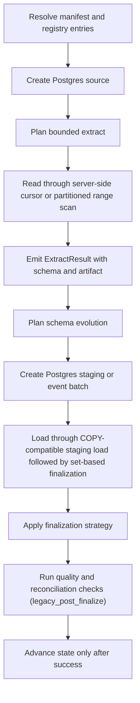

# Postgres -> Postgres

This guide is a copy/paste-ready starting point for loading data from **Postgres** into **Postgres** with `dpone`.

**Status:** Batch ETL supported

Identity profile `postgres_to_postgres_identity_v1` (including `bytea`→`bytea`)
is hermetically contracted. Vendor-live evidence uses a **wide** typed fixture
across schemas (`dpone_src` → `dpone_it`) and covers Docker Postgres strategies
`full_refresh`, `incremental_append`, `incremental_merge`, `replace`,
`partition_replace`, `snapshot_diff`, `scd2`, and `backfill` via
`tests/integration/postgres/test_postgres_to_postgres_vendor_live_integration.py`.
See [Route live wide certification](../testing/route-live-wide-certification.md).

### Vendor-live IT (manual)

```bash
docker compose -f docker/docker-compose.integration.yml up -d postgres
export DPONE_RUN_INTEGRATION=1 DPONE_RUN_INTEGRATION_LIVE=1
uv run pytest tests/integration/postgres/test_postgres_to_postgres_vendor_live_integration.py -q
```

## When to use this path

Use this path when Postgres is the system of record or ingestion boundary and Postgres is the landing, warehouse, event-log, or downstream replication target.

## Copy/paste manifest

```yaml
# yaml-language-server: $schema=../../src/dpone/schema/etl-batch-manifest.schema.json
kind: dpone.batch.v1

defaults:
  name: postgres_to_postgres_example
  source:
    type: postgres
    connection_id: postgres_source
    options:
      batch_size: 50000
      export_format: csv
  sink:
    type: postgres
    connection_id: postgres_target
    table:
      schema: public
      name: orders
    strategy:
      mode: incremental_merge
      unique_key: order_id
      merge_policy: delete_insert
      duplicate_policy: fail

quality:
  gates:
    - id: source_target_rows
      type: row_count_reconciliation
      severity: error
      tolerance:
        mode: pct
        value: 0.1

schemas:
  public:
    tables:
      - orders
```

Run it locally:

```bash
dpone plan examples/source-sink/postgres-to-postgres.yaml --format md
dpone run examples/source-sink/postgres-to-postgres.yaml
```

The checked source file is `examples/source-sink/postgres-to-postgres.yaml`;
CI compares its parsed YAML with this block.

If you change the strategy to `full_refresh` and empty output is invalid,
row-count reconciliation is not enough: it can pass a `0` source / `0` target
comparison. Add an explicit non-empty target gate:

```yaml
quality:
  gates:
    - id: target_min_rows
      type: min_rows
      side: target
      threshold: 1
      severity: error
```

## Supported load strategies

These rows describe public runtime contracts, not certification of this exact
source, sink, transport, schema-evolution mode, and runtime combination.

| Strategy | Status | Notes |
|---|---|---|
| `full_refresh` | Supported | Uses staging first, then applies the target-specific finalization plan. |
| `incremental_append` | Supported | Uses staging first, then applies the target-specific finalization plan. |
| `incremental_merge` | Supported | Default `merge_policy: delete_insert`; `shadow_swap` is available for DB targets. |
| `replace` | Supported | Uses staging first, then applies the target-specific finalization plan. |
| `partition_replace` | Supported | Replaces target partitions represented by staging `partition.column`; see Load strategies for native/fallback paths. |
| `snapshot_diff` | Supported | Requires a complete bounded snapshot and `unique_key`; applies the configured diff/delete policy. |

See [Load strategies](../load-strategies.md) for the detailed algorithm for each strategy.
Postgres `xmin` boundaries and CDC are source capabilities, not load
strategies. Select them explicitly through supported source configuration;
their state advances only after sink success. Certify the exact CDC route and
environment before enabling it.

## Runtime algorithm

This sink does not currently implement `StagedLoadPort`, so this route records
`governance_finalization=legacy_post_finalize`. Blocking gates run only after
the sink has mutated or finalized the target. A failure prevents source-state
advancement but cannot roll back that target mutation; inspect and repair or
deduplicate the target before retrying. See
[Load governance](../load-governance.md#runtime-lifecycle).



## Strategy behavior

- `full_refresh`: extract the selected source boundary, load into staging, and replace the target according to the target's safe finalization path.
- `incremental_append`: extract only the incremental boundary and append rows through staging or event production.
- `incremental_merge`: load into staging, validate duplicates, then use `delete_insert` by default; `shadow_swap` is available where table swaps are supported.
- `replace`: reload a bounded predicate window through staging and then atomically replace the matching target slice.
- `snapshot_diff`: compare a complete current source snapshot with the target by `unique_key`, then apply the configured insert, update, and delete policy.
- `partition_replace`: extract a complete partition slice, load it into staging, and replace only partitions represented by `partition.column`.

Snapshot reconciliation is separate from the load strategy. Runtime planning
reports that capability as `reconciliation.mode=snapshot`; in the official
`dpone.batch.v1` authoring schema, enable it with `reconciliation: true`.

## Schema evolution and type mapping

Schema evolution is enabled by default and runs before the staging/final load path:

1. Read source schema from `ExtractResult.schema`.
2. Introspect the Postgres target schema.
3. Apply safe additions and widening operations.
4. Fail breaking changes by default.
5. If configured, route incompatible type changes to `__dpone__nc__<column>`.

Use [Schema evolution](../schema-evolution.md) and [Type mapping matrix](../type-mapping-matrix.md) when adding columns or changing source types.

## Self-service golden path

Copy-paste CJM for the checked-in example (wide vendor-live certified route):

```bash
dpone doctor --profile local
pip install "dpone[postgres]"
dpone plan examples/source-sink/postgres-to-postgres.yaml --format md
dpone schema type-matrix --source postgres --sink postgres --format md
dpone run examples/source-sink/postgres-to-postgres.yaml
```

Landing convention (vault/GitOps-oriented): `examples/batch/landing_postgres_to_postgres.batch.yaml`.

See [Route live wide certification](../testing/route-live-wide-certification.md) for the maintainer vendor-live IT evidence path (SKIP ≠ PASS).

## Runbook

1. Start with `dpone doctor --profile local` and fix missing extras or native clients.
2. Run `dpone plan examples/source-sink/postgres-to-postgres.yaml --format md` and review source boundary, staging path, schema evolution, state, and quality gates.
3. Run a small bounded window first.
4. Save and inspect one report per attempt as shown below; check exit status, `passed` and `result.errors`.
5. For incremental jobs, verify state before enabling a schedule.
6. For delete-aware jobs, run reconciliation in report-only mode before enabling physical deletes.
7. Promote the manifest through GitOps after the plan and artifact are reviewed.

### Observe and retry a constrained refresh

For `full_refresh`, omit `overwrite_type` or set `truncate_insert`; see the
[PostgreSQL guide](../postgres.md#refresh-an-existing-table-without-replacing-its-structure)
for prerequisites and the explicit exchange boundary. The same-database internal
query optimization changes transport, not the selected write strategy.

`dpone run --format json` writes its report to stdout. Retain each attempt:

```bash
attempt_dir=$(mktemp -d .dpone-pg-attempt.XXXXXX)
dpone run examples/source-sink/postgres-to-postgres.yaml --format json \
  > "$attempt_dir/run.json" 2> "$attempt_dir/run.log"
run_status=$?
printf 'Exit status: %s; reports: %s\n' "$run_status" "$attempt_dir"
```

Adapt the checked example to `full_refresh` before using it for this regression.
Progress events, including `PG_EXCHANGE_COMPLETE`, precede commit and are not
success receipts. See [run output](../run.md) for the JSON contract. Default full
refresh is stateless; no checkpoint advancement is claimed.

Use a separate database connection before and after two changed-source refreshes
and one unchanged replay. Save exact expected/actual business rows and run these
queries with your target relation substituted for `landing.orders`:

```sql
SELECT 'landing.orders'::regclass::oid AS logical_oid;
SELECT conname, contype, pg_get_constraintdef(oid)
FROM pg_constraint WHERE conrelid = 'landing.orders'::regclass ORDER BY conname;
SELECT a.attname, a.attnotnull, pg_get_expr(d.adbin, d.adrelid) AS default_expression
FROM pg_attribute a
LEFT JOIN pg_attrdef d ON d.adrelid = a.attrelid AND d.adnum = a.attnum
WHERE a.attrelid = 'landing.orders'::regclass AND a.attnum > 0 AND NOT a.attisdropped
ORDER BY a.attnum;
SELECT indexname, indexdef FROM pg_indexes
WHERE schemaname = 'landing' AND tablename = 'orders' ORDER BY indexname;
```

Check existing views, grants and triggers too. Logical OID remains stable under
default refresh; physical `relfilenode` can change during TRUNCATE.

| Failure | Operator action |
| --- | --- |
| PK/NOT NULL/CHECK violation after TRUNCATE | Confirm rollback and previous rows using the independent connection; correct source data and retry with a fresh attempt. Do not remove constraints to pass. |
| Source query failure | Fix SQL or permissions; materialization fails before target truncation. |
| Incoming FK or missing TRUNCATE privilege | Review target design/permissions with its owner; dpone does not use CASCADE or silently choose exchange. |
| Exchange rejected by a dependent object | Confirm original table/view restoration by rollback and use an approved loading design. |
| Lock timeout or cancellation | Confirm the prior state, resolve contention and retry; concurrent refreshes do not guarantee snapshot-freshness ordering. |
| Lost commit or rollback acknowledgement | Database outcome is unverified. Inspect independently before retry; a client error does not prove rollback. |

An empty source is a valid empty refresh unless a separately configured quality
gate rejects it. The earlier `legacy_post_finalize` warning still applies:
a quality failure after commit cannot roll back that committed load.

### Recover a previously replaced target

An affected older internal-query refresh could succeed while losing constraints,
then fail schema validation on its next run. An upgrade cannot infer lost DDL.

1. Pause affected writers and retain current rows plus catalog evidence.
2. Obtain approved target DDL from migrations or a schema backup.
3. Check NULLs, duplicate keys and other violations; resolve them under the data
   owner's rules without automatic deduplication or guessed keys.
4. Restore missing constraints, indexes, grants and dependent objects from that
   authority. This is a separate controlled repair.
5. Use the corrected runtime and verify two refreshes and replay with both rows
   and catalog metadata. Returning to the affected runtime does not repair data.

Maintainers can reproduce the bounded internal-query regression separately from
wide file-route tests with
`tests/integration/postgres/test_postgres_strategy_preservation_live.py` using an
approved local PostgreSQL environment and `DPONE_RUN_INTEGRATION=1`. This checks
real sink transactions, constraints, failures and scoped replacement; it does
not certify every PostgreSQL source/strategy combination.

## Cross-links

- [Source -> sink matrix](../source-sink-matrix.md)
- [Load strategies](../load-strategies.md)
- [Schema evolution](../schema-evolution.md)
- [Type mapping matrix](../type-mapping-matrix.md)
- [Reconciliation and CDC](../cdc.md)
- [Performance guide](../performance.md)

## Type contracts and physical design

This flow supports the shared dpone type-governance stack:

- [Type inference](../type-inference.md) for source metadata, sampled profiling, confidence, and empty string vs `NULL` behavior.
- [Schema contracts](../schema-contracts.md) for explicit logical column types, enforcement modes, and `__dpone__nc__*` variant columns.
- [Physical design](../physical-design.md) for target-specific DDL such as concrete SQL types, indexes, partitioning, compression, ClickHouse `LowCardinality`, and BigQuery clustering.

Use `dpone schema infer --manifest ...` and `dpone schema physical-plan --manifest ...` before enabling new table DDL in production.
