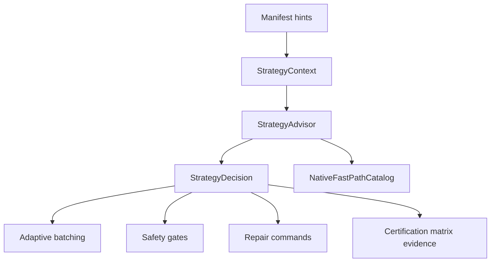
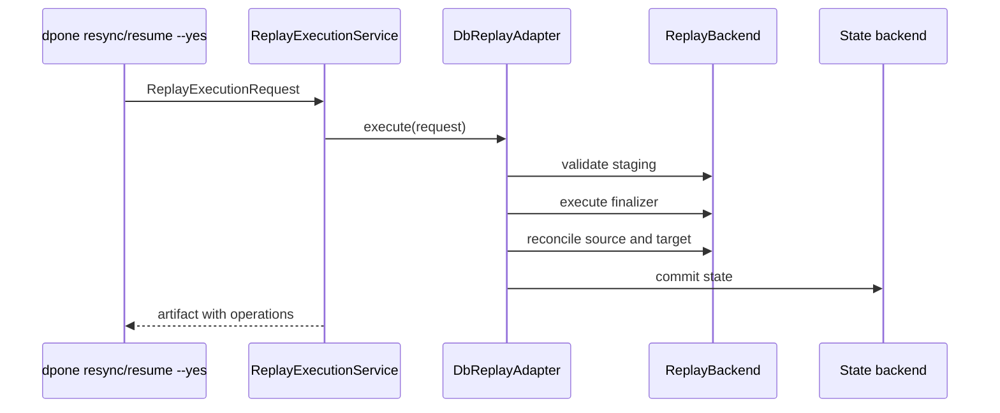
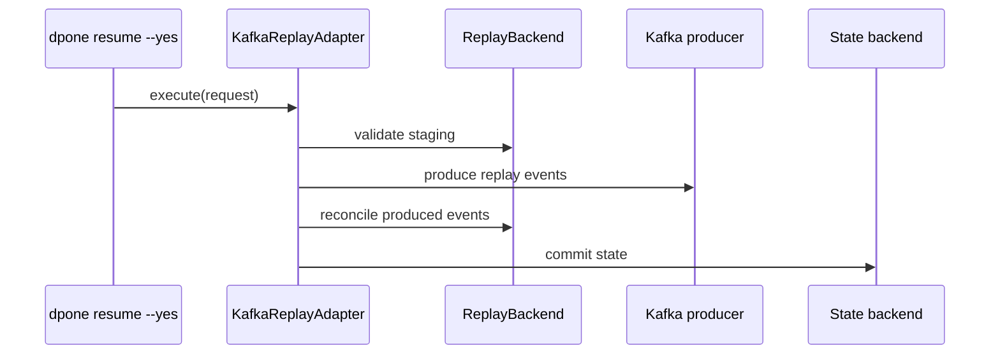
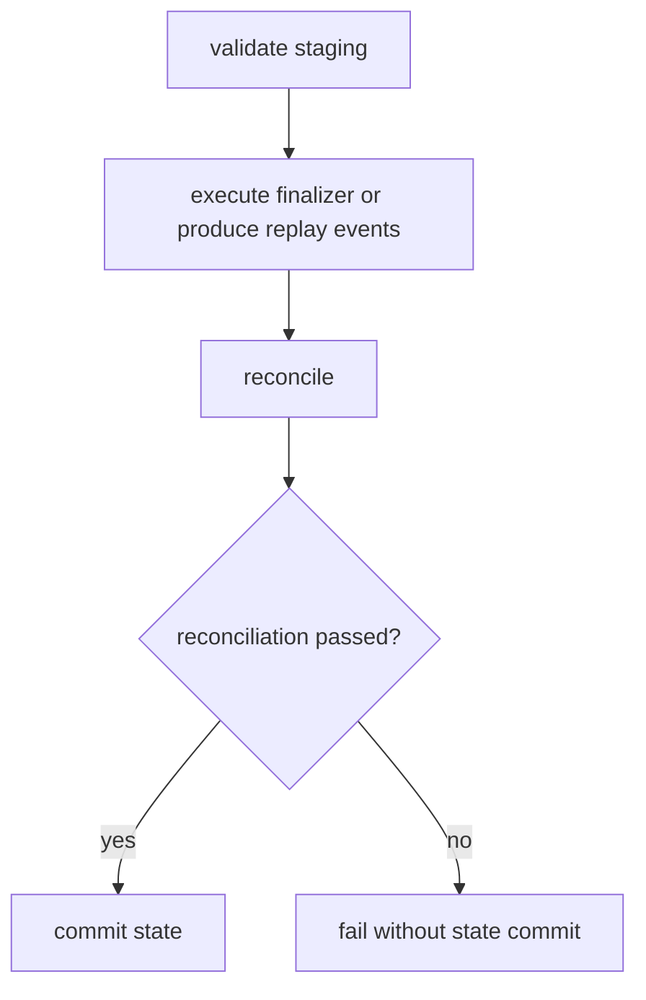

# Strategy Intelligence

Strategy Intelligence is the `dpone` control-plane layer for choosing, explaining, repairing, certifying, and optimizing load strategies before a pipeline writes data.

It does not replace explicit manifests. It helps users move from "I picked a strategy by hand" to "`dpone` explained the safest and fastest target-native plan for this source -> sink pair".

## What it covers

| Capability | User value | CLI/API |
| --- | --- | --- |
| Strategy Advisor | Selects `full_refresh`, append, merge, `partition_replace`, `cdc_apply`, or other strategies from manifest hints. | `dpone strategy advise` |
| Explainable plan | Shows why a strategy was selected and which safety gates apply. | `dpone strategy advise --format md` |
| Adaptive batching | Suggests initial batch size and parallel workers from row estimates and partition hints. | included in decision payload |
| Repair / resume UX | Produces deterministic repair commands for failed runs. | included in `repair_commands` |
| Certification matrix | Classifies source -> sink -> strategy support as contract, manual live gate, or not supported. | Python API v1 |
| Native fast paths | Documents target-native bulk commands and fallbacks. | included in decision payload |
| Runtime-native auto compile | Compiles `strategy.mode: auto` into a concrete `LoadStrategy` before hydration. | `dpone run`, `dpone plan` |
| Native preflight | Checks whether local fast-path tools are available. | `dpone strategy preflight` |
| Certification artifacts | Writes source -> sink -> strategy evidence matrix. | `dpone strategy certification-artifact` |

## Strategy Advisor

Run the advisor against a manifest:

```bash
dpone strategy advise orders.yaml \
  --estimated-rows 50000000 \
  --changed-percent 0.20 \
  --delete-percent 0.05 \
  --format md
```

Example output highlights:

```text
strategy: partition_replace
merge_policy: delete_insert
native_fast_path: postgres_copy_to_mssql_bcp
adaptive_batching: true
```

## Runtime-native `mode: auto`

`strategy.mode: auto` is compiled before runtime hydration, so sinks receive a concrete `LoadStrategy`.

```yaml
sink:
  strategy:
    mode: auto
    unique_key: [order_id]
```

For a large partitioned Postgres -> MSSQL load, this can compile to:

```text
partition_replace
```

The decision is saved in `LoadConfig.options.strategy_intelligence`, so run artifacts and plan output can explain why the strategy was selected.

Use `dpone plan --explain-strategy` to see the decision payload:

```bash
dpone plan orders.yaml --explain-strategy --format json
```

## Native preflight

Check whether the local machine has the tools needed for the recommended fast path:

```bash
dpone strategy preflight --source-type postgres --sink-type mssql --format md
```

With `--fail-on-missing`, the command exits non-zero when required tools are missing:

```bash
dpone strategy preflight --source-type mssql --sink-type clickhouse --fail-on-missing
```

## Auto selection rules v1

The v1 advisor is deliberately conservative:

| Manifest/runtime signal | Recommended strategy |
| --- | --- |
| CDC is available and `unique_key` is configured | `cdc_apply` |
| Large partitioned delta on DB sink | `partition_replace` |
| `unique_key` is configured on mutable DB/Kafka target | `incremental_merge` |
| Cursor exists but no `unique_key` | `incremental_append` |
| No safe incremental hints | `full_refresh` |

Kafka intentionally rejects `partition_replace` because it is an event log, not a partitioned mutable table target.

## Repair / resume UX

When a finalization step fails, Strategy Intelligence returns safe repair steps and actionable commands.

For partition replacement:

```bash
dpone resync --run-id RUN_ID --partitions from-run-artifact --plan
```

Safe runbook:

1. Inspect the run report and load IDs.
2. Validate staging files/tables and row counts.
3. Replay only affected partitions or resume from an idempotent stage.
4. Run source-target reconciliation.
5. Commit state only after sink success.

CLI:

```bash
dpone strategy repair-plan RUN_ID \
  --source-type postgres \
  --sink-type mssql \
  --strategy partition_replace \
  --failed-stage finalize \
  --partition 2026-01-01 \
  --format md
```

## Certification artifacts

Write the strategy support matrix as JSON and Markdown:

```bash
dpone strategy certification-artifact --artifact-dir test_artifacts/strategies
```

The artifact records support status for source -> sink -> strategy combinations:

- `contract_gate`: unit/contract evidence is sufficient for normal CI.
- `manual_live_gate`: run the local/live integration matrix before claiming certification.
- `not_supported`: fail early with a clear diagnostic.

## Native fast paths

| Source -> sink | Fast path | Required tools | Fallback |
| --- | --- | --- | --- |
| Postgres -> MSSQL | `postgres_copy_to_mssql_bcp` | `psycopg`, `bcp` | fail closed for certified key snapshots |
| MSSQL -> ClickHouse | `mssql_odbc_row_stream_to_clickhouse_rowbinary` | `pyodbc`, ClickHouse HTTP | `mssql_bcp_queryout_to_clickhouse_typed_wire` for certified text-safe routes |
| Postgres -> ClickHouse | `postgres_copy_to_clickhouse_http_tsv` | `psycopg`, `clickhouse-client` or `curl` | `streaming_rows` |
| MSSQL -> MSSQL | `mssql_bcp_queryout_to_bcp_import` | `bcp` | `pyodbc_fast_executemany` |

For `postgres_copy_to_mssql_bcp`, the displayed `COPY` command is schematic.
Runtime exports first wrap text-like source columns with `BulkTextCodec`
projections, then verifies and decodes the immutable artifact once into a
delimiter-free length-prefixed UTF-8 host file. SQL Server BCP consumes the
explicit format file directly into native staging, preserving `NULL`, empty
values and arbitrary controls without a raw `nvarchar(max)` normalization scan.

`dpone plan --explain-strategy` also renders the native transfer
`transport_contract`. For `Postgres -> MSSQL`, `lossless=true` means the plan
uses `mssql-delimited` artifacts, no gzip compression, SQL Server `bcp`, and the
`BulkTextCodec` marker roundtrip for empty strings, tabs, newlines and control
characters. If `lossless=false`, fix the plan warnings before treating the fast
path as production-certified.

## Mermaid flow



## Python API

```python
from dpone.strategy_intelligence.advisor import StrategyAdvisor, StrategyContext

decision = StrategyAdvisor().advise(
    StrategyContext(
        source_type="postgres",
        sink_type="mssql",
        requested_mode="auto",
        unique_key=("order_id",),
        estimated_rows=50_000_000,
        changed_percent=0.20,
        delete_percent=0.05,
        partition_column="business_date",
    )
)
print(decision.strategy_mode)
```

## Troubleshooting

| Symptom | Cause | Fix |
| --- | --- | --- |
| Advisor returns `full_refresh` | Manifest has no cursor, key, CDC, or partition hints. | Add `unique_key`, `incremental_column`, CDC config, or partition config. |
| Advisor rejects `partition_replace` for Kafka | Kafka is not a mutable partitioned table sink. | Use keyed `incremental_merge` event upserts. |
| Native fast path says fallback | Required local tool is missing. | Run `dpone doctor` and install the target-specific client. |
| Repair plan is not auto-resumable | Failure happened during finalization. | Replay staged partitions or run `resync --plan` before state commit. |

## Live preflight

`dpone strategy preflight` checks local tools such as `bcp` and `clickhouse-client`. The live execution layer also exposes a probe contract for target-specific readiness checks:

- ODBC/driver availability;
- staging schema accessibility;
- target write permissions;
- target lock risk before finalization.

The default OSS probe is plan-only and safe. Live adapters can inject concrete probes for MSSQL, Postgres, ClickHouse, or BigQuery without changing CLI code.

## Adaptive runtime batching

`mode: auto` now stores an adaptive batch plan in `LoadConfig.options.strategy_intelligence`. When a user has not explicitly set `batch_size`, the initial adaptive batch size becomes `LoadConfig.batch_size`.

Runtime observations can be fed into `AdaptiveBatchController`:

```python
from dpone.strategy_intelligence import AdaptiveBatchController, BatchObservation

controller = AdaptiveBatchController(initial_batch_size=50000, min_batch_size=10000, max_batch_size=200000)
adjustment = controller.observe(BatchObservation(rows=50000, duration_seconds=1.0, target_backpressure=0.05))
print(adjustment.next_batch_size)
```

Rules are intentionally simple in v1:

- increase batch size when throughput is healthy and backpressure is low;
- decrease batch size when target backpressure is high;
- always stay within configured min/max bounds.

## Resync and resume commands

Repair commands are now first-class top-level CLI commands. They are safe by default: without `--yes`, they write a replay artifact and do not mark replay as executed.

Plan a partition resync:

```bash
dpone resync \
  --run-id RUN_ID \
  --source-type postgres \
  --sink-type mssql \
  --strategy partition_replace \
  --partition 2026-01-01 \
  --format md
```

Approve execution contract:

```bash
dpone resync \
  --run-id RUN_ID \
  --source-type postgres \
  --sink-type mssql \
  --strategy partition_replace \
  --partition 2026-01-01 \
  --yes
```

Plan a resume from an idempotent failed stage:

```bash
dpone resume RUN_ID \
  --from-stage stage \
  --source-type postgres \
  --sink-type mssql \
  --strategy incremental_merge
```

Execution semantics in v1:

- `mode: plan`: write replay artifact only;
- `mode: execute`: mark replay artifact as approved/executed after `--yes`;
- live database mutation remains an adapter-level next step, not implicit CLI behavior.

## Replay adapters

Replay adapters turn an approved replay artifact into a sink-specific execution sequence. They are still dependency-injected: the default OSS backend records an artifact-only execution contract, while live deployments can provide database or Kafka backends.

Database replay sequence:



Kafka replay sequence:



Safety rules:

1. Always validate staging before finalization or event production.
2. Always reconcile before state commit.
3. Never commit state when reconciliation fails.
4. Keep Kafka replay append/event-log only; do not emulate partition replacement.
5. Record operations in the replay artifact for auditability.

In artifact-only mode, `--yes` marks the replay contract as executed but does not mutate external systems. Live mutation requires an injected `ReplayBackend` from a deployment/runtime adapter.

## Live replay backends

Live replay backends are the sink-specific implementation layer behind approved `dpone resync --yes` and `dpone resume --yes` requests. They use injected clients, so `dpone` core does not create DB/Kafka connections inside CLI commands.

Supported backend contracts:

| Sink | Backend | Finalization path |
| --- | --- | --- |
| MSSQL | `MssqlReplayBackend` | partition switch for `partition_replace`, delete+insert fallback for merge-like replay. |
| Postgres | `PostgresReplayBackend` | partition attach/detach contract for `partition_replace`, delete+insert fallback. |
| ClickHouse | `ClickHouseReplayBackend` | native `ALTER TABLE ... REPLACE PARTITION ... FROM staging`. |
| BigQuery | `BigQueryReplayBackend` | partition-scoped delete+insert contract. |
| Kafka | `KafkaLiveReplayBackend` | replay event production, no mutable target operations. |

All live backends follow the same safety invariant:



The default package still ships an artifact-only backend for safe OSS use. Deployments can inject SQL/Kafka clients that satisfy the backend protocols.

## Runtime replay clients

Runtime replay clients bridge the control-plane replay contracts to the existing runtime connector and credential layer.

| Class | Role |
|---|---|
| `ReplayBackendConnection` | Declarative reference to sink type, connection id, target table, staging schema, and credentials source |
| `RuntimeSqlReplayClient` | Wraps runtime SQL connectors and exposes the narrow `exists`, `scalar`, `execute` replay port |
| `RuntimeKafkaReplayClient` | Wraps `KafkaConnector.create_producer()` and exposes `produce`, `flush`, `scalar` |
| `RuntimeReplayBackendFactory` | Builds MSSQL/Postgres/ClickHouse/BigQuery/Kafka replay backends through existing `BaseFactory` credential resolution |

Example:

```python
from dpone.strategy_intelligence import ReplayBackendConnection, RuntimeReplayBackendFactory

backend = RuntimeReplayBackendFactory().build(
    ReplayBackendConnection(
        sink_type="mssql",
        connection_id="mssql_dwh",
        target_schema="dbo",
        target_table="orders",
        staging_schema="staging",
        credentials_source="env",
    )
)
```

The factory does not import `pyodbc`, `psycopg`, `clickhouse-driver`, or `confluent-kafka` directly. Those SDKs stay behind runtime connectors and are loaded only when a live connector is actually built.

## Native transfer plan details

For native database routes, strategy intelligence includes an optional
`native_transfer_plan` inside the decision payload. `dpone plan
--explain-strategy` renders the selected export method, ingest method,
finalizer, partitioning strategy and transport contract.

Example decision fields:

```json
{
  "native_fast_path": "mssql_bcp_queryout_to_clickhouse_typed_wire",
  "native_transfer_plan": {
    "export_method": "bcp_queryout",
    "ingest_method": "clickhouse_typed_staging",
    "finalizer": "lightweight_delete_insert",
    "native_ingest_settings": {
      "bulk_wire": {
        "selected_route": "typed_raw_direct",
        "input_format": "CustomSeparated",
        "mssql_source_escaping": false
      }
    },
    "retry_boundaries": ["export", "load_staging", "finalize"]
  }
}
```

## Replay contracts for CDC/native transfer plans

`native_transfer_plan.replay_contract` describes retry and state guarantees for
stateful strategies such as `cdc_apply`. It is separate from
`transport_contract` by design:

- `transport_contract` explains the wire format, text codec, NULL policy and
  whether the exported artifact is lossless.
- `replay_contract` explains the state boundary, delete semantics, idempotency
  requirement and evidence artifacts required for safe replay.

For `Postgres -> MSSQL` with `cdc_apply`, the lossless contract requires a
configured `unique_key`, an explicit `source.options.cdc.state_boundary` and an
explicit delete mode when delete events must be represented.

```yaml
source:
  type: postgres
  options:
    cdc:
      mode: logical_replication
      state_boundary: logical_lsn

sink:
  type: mssql
  strategy:
    mode: cdc_apply
    unique_key: [event_id]
  options:
    deletes:
      mode: soft_delete
```

`dpone plan --explain-strategy` renders the contract in text, Markdown and JSON
outputs so CI release evidence can assert state is advanced only after target
finalization and quality gates.

## Native transfer evidence contracts

`native_transfer_plan.evidence_contract` is the self-service checklist for
release gates and incident runbooks. It is intentionally separate from runtime
implementation details:

- The planner declares required artifacts and checks.
- Runtime writers produce those artifacts.
- CI/manual certification verifies them.

For partitioned transfers, the contract requires partition checkpoints and a
retry plan. For single-partition transfers, the same contract shape is used but
`partition_retry.enabled=false`, so operators do not chase non-existent partition
artifacts.

This keeps native transfer routes extensible: `MSSQL -> ClickHouse`,
`Postgres -> MSSQL` and future routes can share the same evidence taxonomy while
retaining route-specific transport and replay contracts.

### Runtime evidence writer

`NativeTransferEvidenceArtifactWriter` materializes the checklist declared by
`native_transfer_plan.evidence_contract`. It is a runtime/certification utility,
not a planner: callers must pass real payloads for every required artifact.

The writer produces:

- one JSON file per required artifact;
- `evidence_index.json` with SHA-256 checksums and byte sizes;
- `evidence_index.md` for pull requests and incident reviews.

This keeps evidence generation deterministic and auditable while avoiding fake
success artifacts.

### CLI evidence bundle command

Use `dpone strategy native-transfer-evidence` to turn the declared evidence
contract and runtime payloads into a checksumed evidence bundle:

```bash
dpone strategy native-transfer-evidence \
  --run-id 01J00000000000000000000000 \
  --plan-json test_artifacts/native-transfer/plan.json \
  --payload typed_reconciliation.json=test_artifacts/native-transfer/typed_reconciliation.json \
  --output-dir test_artifacts/native-transfer/evidence \
  --format json
```

Use repeated `--payload artifact_name=path` values for every artifact listed in
`native_transfer_plan.evidence_contract.required_artifacts`. The command writes
`evidence_index.json` and `evidence_index.md`; both include checksums so release
gates can detect stale or modified evidence files.

### Add native transfer evidence to strategy certification bundles

`dpone strategy certification-bundle` treats native transfer evidence as a
first-class evidence kind. Pass the generated `evidence_index.json` with
`--native-transfer-evidence`:

```bash
dpone strategy certification-bundle \
  --bundle-id postgres_mssql_rc \
  --native-transfer-evidence test_artifacts/native-transfer/postgres-mssql/evidence/01J00000000000000000000000/evidence_index.json \
  --matrix-artifact test_artifacts/integration_matrix/certification_report.json \
  --output-dir test_artifacts/strategy_certification/postgres_mssql \
  --format json
```

The bundle records the native transfer route, strategy, state commit gate and
artifact count. A native transfer evidence item is green only when the evidence
index has the expected schema, contract and checksumed artifacts.
