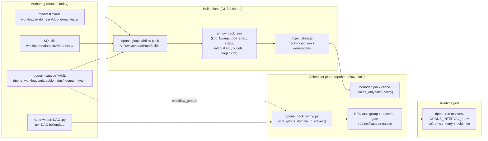

# Airflow integration maturity: declarative DAGs, scaffolding, and asset-driven wiring

- **Date:** 2026-07-08
- **Status:** research + design proposal (no code changed by this document).
- **Driving user pains:** (1) hand-creating the workload/manifest directory scaffolding for every new pipeline; (2) hand-writing a Python DAG file and its dependencies for every pipeline although everything could be declared in YAML.
- **Evidence base:** dpone source (`src/dpone/gitops/airflow_*`, `packages/dpone-airflow-pack/`), and 2026-current web research on Cosmos, DAG Factory, gusty, Dagster, dlt, Kestra, and Airflow 3.x.

---

## Table of contents

- [1. Current state](#1-current-state)
- [2. Maturity assessment matrix](#2-maturity-assessment-matrix)
- [3. Gap list and missed ideas](#3-gap-list-and-missed-ideas)
- [4. Design proposal](#4-design-proposal)
- [5. What we borrow and where dpone leads](#5-what-we-borrow-and-where-dpone-leads)
- [6. Sources](#6-sources)

---

## 1. Current state

### 1.1. Architecture today

The integration is a strict two-plane design. The build plane (full dpone) compiles GitOps workloads into static `airflow-pack.json` artifacts; the scheduler plane (`dpone-airflow-pack`, a dependency-light provider) parses those artifacts and materializes KubernetesPodOperator task groups. The scheduler never imports the dpone runtime, connectors, or Kubernetes clients at parse time.



Strengths already in place (identified in source code):

- **Static pack contract** (`gitops.airflow_pack` schema v3) with `pack_fingerprint` (sha256), pod spec, inline workload bootstrap archive, connection projection, XCom sidecar pinning, and an outcome gate.
- **Remote pack cache** with generations, checksums, size budgets, `cached://` references, and local fallback with provenance annotations propagated into task params.
- **Interval contract**: `DPONE_INTERVAL_START/END`, `DPONE_LOGICAL_DATE`, `DPONE_DAG_ID/DAG_RUN_ID/TRY_NUMBER` templated into `env_vars`, consumed by `dpone run` for token substitution and run-state identity.
- **Asset/Dataset outlets** from `airflow.execution.outlets` with lazy Airflow 2.4+/3.x compatibility.
- **Evidence governance**: XCom summary (`interval` + bounded `backfill` sections), runtime evidence files, provenance-annotated pods — stronger than anything the compared DAG generators ship.

---

## 2. Maturity assessment matrix

Legend: ✅ strong / leading · 🟡 adequate with caveats · ❌ weak / missing. "A3" = Airflow 3.x native (3.2–3.3).

| Axis | dpone | Cosmos | DAG Factory | gusty | Dagster | dlt | A3 native |
|---|---|---|---|---|---|---|---|
| Declarativeness of pipeline definition | ✅ manifest YAML covers source/sink/strategy/quality | ✅ dbt project is the source | ✅ whole DAG in YAML | ✅ task-per-file YAML/SQL | ✅ assets in code, Components in YAML | 🟡 Python decorators | ❌ Python DAGs |
| DAG generation UX (no per-DAG boilerplate) | ❌ one Python wrapper per DAG + wiring module | ✅ one `DbtDag(...)` call renders the whole graph | ✅ one `load_yaml_dags()` loader for all YAML | ✅ one `create_dags()` loader scans directories | ✅ `dg` CLI + definitions auto-load | ✅ `dlt deploy` generates the DAG | 🟡 DAG bundles organize but do not generate |
| Scheduling contract (intervals / data-aware) | ✅ `DPONE_INTERVAL_*` env + token substitution + outlets | 🟡 inherits DAG schedule; data-aware via Airflow | 🟡 supports Assets scheduling in YAML, "not as well integrated" (their docs) | ❌ cron-centric | ✅ AutomationCondition (eager/on_cron), partition-aware | ✅ `allow_external_schedulers` interval pickup | ✅ Assets, asset partitioning (3.2), partition mappers (3.3) |
| Dependency wiring between pipelines | ❌ manual waves (`>>` in fixed-width batches) | 🟡 dbt `ref()` graph inside the project only | 🟡 explicit `dependencies:` lists in YAML | ✅ `dependencies:` + external DAG sensors from file layout | ✅ asset graph inferred from code deps | ❌ single pipeline scope | ✅ asset-driven DAG triggering |
| Scaffolding / onboarding | ❌ none (`mkdir` + copy-paste) | 🟡 delegated to `dbt init` | ❌ none | 🟡 create a folder = create a DAG | ✅ `dg scaffold` project/component generators | ✅ `dlt init` source+pipeline scaffold | ❌ none |
| Multi-env promotion | ✅ GitOps packs, object-storage generations, fingerprints, cache-only scheduler | 🟡 manifest per env, profile mapping | ❌ user concern | ❌ user concern | ✅ code locations, branch deployments | 🟡 env-var config | 🟡 bundles per env |
| Secrets handling | ✅ connection projection (explicit non-prod unsafe env bridge; Secret/Vault projection path), never read at parse time | ✅ profile mapping from Airflow connections | 🟡 whatever operators do | 🟡 whatever operators do | ✅ resources + env | ✅ credential providers | ✅ connections/Secrets backends |
| Observability / lineage / evidence | ✅ XCom summary contract, runtime evidence + sha256, outcome gate, pack provenance in task params | 🟡 dbt artifacts, OpenLineage extras | ❌ nothing beyond Airflow | ❌ nothing beyond Airflow | ✅ asset lineage, catalogs, quality signals native | 🟡 load packages + trace | 🟡 lineage via providers |
| Versioning / rollback of orchestration | ✅ pack generations + sha256 + `keep_generations` rollback; reproducible pods | ❌ re-render from project | ❌ git only | ❌ git only | ✅ code versioning per location | ❌ git only | ✅ DAG bundle versioning, `rerun_with_latest_version` (3.3) |

**Honest overall placement.** dpone is best-in-class on the *runtime* half of the integration — the static pack contract, evidence/XCom governance, multi-env promotion, and interval semantics exceed every compared tool (none of Cosmos/DAG Factory/gusty carry signed artifacts, provenance, outcome gates, or an env-interval contract for external pods). On the *authoring* half it sits near the bottom: DAG definition is imperative Python boilerplate, dependencies are hand-chained waves, and there is no scaffolding. The exact layer that Cosmos, DAG Factory, gusty, and Dagster made trivial (one loader, zero per-DAG files) is the layer dpone still does by hand. Maturity in one sentence: **industrial runtime contract, artisanal authoring UX.**

---

## 3. Gap list and missed ideas

Ordered by user-pain impact.

1. **No DAG-from-YAML materialization (top gap, pain 2).** The domain catalog already knows workloads, groups, and ordering; the compact pack already knows everything about the task. Only the DAG envelope (schedule, dag_id, defaults) lives in Python. The pattern proven by DAG Factory (`load_yaml_dags()`), gusty (`create_dags()` over a directory tree), and Cosmos (`DbtDag` from a compiled manifest) — one generic loader file materializing many DAGs from declarative artifacts — was never applied, even though dpone's compiled-artifact philosophy matches Cosmos's `LoadMode.DBT_MANIFEST` ("parse a pre-compiled artifact, never run tooling at parse time") better than any of them.
2. **No scaffolding CLI (pain 1).** Creating a pipeline means hand-building the four-directory convention (`manifests/`, `sql/`, `docs/`, domain YAML entry). Dagster ships `dg scaffold`, dlt ships `dlt init`; dpone — which has a far stronger convention to generate against — ships nothing. A generator can also emit the pieces users forget (ownership entry, docs stub, catalog registration) and validate them immediately.
3. **Asset-driven cross-workload wiring is half-built.** Producer outlets exist (`airflow.execution.outlets` → Asset/Dataset objects), but nothing consumes them: no inlets, no asset-schedule DAGs, no producer/consumer graph. Wave wiring remains order-of-a-YAML-list. Meanwhile Airflow 3.2/3.3 made asset partitioning and partition mappers native — dpone manifests already contain the ground truth (source table, sink table) to *infer* the asset graph automatically, something even Cosmos cannot do outside a single dbt project.
4. **Auto-dependencies from lineage are not derived.** Every manifest declares its source and sink tables; a `workload A sinks into table T, workload B sources from T` edge is mechanically derivable at pack-build time. Dagster infers the asset graph from code; dpone can infer it from manifests — today nobody does, and humans re-encode the graph as wave order.
5. **DAG-level definition has no schema.** `schedule`, `catchup`, `tags`, `owner`, `retries`, alerting, wave width — none of these have a validated home in the workload catalog or manifest schema; they float in per-repo Python. DAG Factory's `defaults.yml` hierarchical inheritance and gusty's `METADATA.yml` both solved this years ago.
6. **Airflow 3 bundle versioning is unexploited.** Packs already have generations and fingerprints; mapping a pack generation to a DAG bundle version (and honoring `rerun_with_latest_version` semantics for reproducible reruns) would close the loop between dpone's artifact versioning and Airflow's run-time code versioning.
7. **Params/UI-driven operations are absent.** Backfill campaigns are triggered by templating `params` into CLI flags by hand in DAG code. Airflow 3 `params` with typed UI forms + the scheduler-managed backfill API could make "run a campaign for window X" a UI form on a generated DAG rather than a copy-pasted operator argument block.
8. **Multi-DAG topologies (fan-in/fan-out across domains) have no declarative expression.** Waves are linear within one DAG; cross-domain dependencies (marketing after core-DWH) require either sensors or asset events — neither is wired.

---

## 4. Design proposal

Four coordinated features. Design constraint honored throughout: **the scheduler plane stays static** — parse time reads only pre-built JSON/YAML artifacts from the bounded cache, exactly as today.

### 4.1. `dags:` section in the domain catalog (single source of DAG truth)

DAG-level definition moves into the domain YAML — the file that already owns workload membership and ordering. The manifest keeps only workload-level execution hints (it already carries `airflow.execution.outlets`); a DAG spans workloads, so the catalog is its natural home.

```yaml
# dpone_workloads/gitops/domains/marketing.yaml (extended)
domain: marketing
defaults:
  owner: marketing_team
  airflow: { ... }                      # unchanged pod-level defaults

workloads:
  marketing_sample_web_sync:
    manifest: ../../../workloads/marketing/dpone/manifests/sample_web_sync.yaml
  marketing_sample_web_sync_web:
    manifest: ../../../workloads/marketing/dpone/manifests/sample_web_sync_web.yaml

dags:
  DAG__marketing__sample_web_sync__sync:
    description: "work-item governed sample_web_sync app/web sync"
    schedule: null                      # cron string | null | {assets: [...]}
    start_date: 2026-07-07
    timezone: Europe/Moscow
    catchup: false
    max_active_runs: 1
    tags: [dpone, marketing, sample_web_sync, manual]
    default_args: {retries: 0, retry_delay_minutes: 5}
    operator_overrides: {in_cluster: true}
    workloads:                          # ordered; replaces workflow_groups binding
      - marketing_sample_web_sync
      - marketing_sample_web_sync_web
    wiring:
      mode: waves                       # waves | assets | explicit
      max_parallel_workloads: 2
      # mode: explicit → dependencies: {web: [app]}
      # mode: assets   → edges derived from lineage (see 4.4)
```

**Algorithm (build plane).** `dpone gitops airflow pack` gains a sibling output: for every `dags:` entry it validates the block against a new JSON Schema (`gitops/airflow-dag-spec.schema.json`), resolves workload references, computes the wiring edge list (waves expanded to explicit edges; asset mode resolved via 4.4), and emits `.dpone/gitops/airflow/_dags/<dag_id>.dag-spec.json` with kind `gitops.airflow_dag_spec`, `schema_version`, a `spec_fingerprint` (sha256, same discipline as `pack_fingerprint`), and the fully resolved edge list. Dag-specs ship through the existing object-storage index and scheduler cache unchanged — they are just more small JSON artifacts.

**Invariants.** Unknown workload ids fail the build (same rule as `workload_ids_from_gitops_domain` today); a workload may appear in multiple DAGs; `schedule: {assets: [...]}` entries must reference URIs producible by some pack's outlets or declared external.

### 4.2. One static loader file per repository

All per-DAG Python files are replaced by one ~10-line file, the same shape as `load_yaml_dags()` (DAG Factory) and `create_dags()` (gusty):

```python
# dags/dpone_dags.py — the only dpone DAG file in the deployment repo
from dpone_airflow_pack import load_dpone_dags

load_dpone_dags(
    globals(),
    repo_root="/opt/airflow/dags",
    domains=None,               # None = all domains found in the cache/index
    operator_overrides={},      # optional repo-wide overrides, last-resort escape hatch
)
```

**Algorithm (scheduler plane, parse time).**

```text
load_dpone_dags(globals_dict, repo_root, domains):
    specs ← enumerate *.dag-spec.json from the pack cache (cached:// first,
            local .dpone/gitops/airflow/_dags fallback, provenance recorded)
    for each spec (deterministic order, filtered by domains):
        validate kind/schema_version/fingerprint          # reject unknown majors
        dag ← DAG(**spec.dag_kwargs)                      # schedule resolved:
              cron/null verbatim; assets → [Asset(uri)...] via existing lazy factory
        tasks ← {wid: build_dpone_gitops_task_group_from_pack(cached://wid, dag=dag,
                                                              operator_overrides=merged)
                 for wid in spec.workloads}
        for (up, down) in spec.edges:
            tasks[up].terminal >> tasks[down].entrypoints # same WiredPackWorkload shape
        globals_dict[spec.dag_id] = dag
```

**Why scheduler-static guarantees survive.** The loader touches exactly what `wire_gitops_domain_in_waves` touches today — cached JSON — plus equally cached dag-specs. No YAML manifest parsing, no dbt-ls-style subprocess, no network beyond the existing fail-open cache sync sidecar. Parse cost is O(number of DAGs × workloads), identical to the current hand-written files; per-file Python import overhead actually drops (one module instead of N). Cosmos documents this as its fastest mode (`DBT_MANIFEST`: "parse a pre-compiled artifact"); dpone adopts the same stance with stronger integrity (fingerprints + bounded cache).

**Failure isolation.** A malformed dag-spec registers a quarantined placeholder DAG (paused, single no-op task, `dpone_spec_error` tag with blocker text in the DAG doc) instead of throwing at import — one bad spec must not take down the whole loader file (a known DAG Factory weakness).

### 4.3. Scaffolding CLI: `dpone workload init`

```console
$ dpone workload init marketing/sample_web_sync \
    --source clickhouse --sink mssql --strategy full_refresh \
    --domain marketing --dag DAG__marketing__sample_web_sync__sync \
    --schedule "0 6 * * *" --owner marketing_team
```

**Algorithm.**

```text
1. Resolve repo conventions (workloads root, domain dir) from gitops.yaml.
2. Plan (default, no writes): render the full file plan and diffs —
   manifests/<name>.yaml   from a source/sink/strategy template pack
   sql/<name>.sql          stub with the manifest's sql_file contract
   docs/<name>.md          stub with ownership/runbook skeleton
   domains/<domain>.yaml   additive edit: workloads entry (+ dags entry or
                           workload appended to an existing dag's list)
   ownership.yaml          additive entry
3. --apply executes the plan; every file idempotent (re-running with the same
   args is a no-op); conflicting names → blocker with a rename hint.
4. Post-generate validation: dpone gitops validate + airflow pack --plan for
   the new workload, so the scaffold is proven compilable before commit.
```

Templates live next to the existing schema (source of truth for options), so generated manifests always validate. This directly kills pain 1: one command replaces steps 1–5 and 7 of the table in §1.2, and CI regenerates the pack (step 6).

### 4.4. Asset-driven cross-workload dependencies

Two layers, both derived at **build time** (never at parse time):

1. **Explicit:** manifests/catalog may declare `airflow.execution.outlets` (exists) and, new, `airflow.execution.inlets` — consumed asset URIs.
2. **Inferred from lineage:** the pack builder already loads every manifest; it derives canonical dataset URIs from sink tables (`mssql://dwh_example/marketing/sample_web_sync`) and source tables. Producer/consumer edges = sink-URI of A matches source-URI of B. Inferred edges are emitted into the domain's dag-specs (same-DAG edges) and, for cross-DAG pairs, into producer outlets + consumer asset-schedules.

```text
build_asset_graph(all_packs):
    producers ← {canonical_sink_uri(w): w for w in workloads}
    for w in workloads:
        for uri in canonical_source_uris(w) ∪ declared_inlets(w):
            if uri in producers and producers[uri] != w:
                emit edge (producers[uri] → w)
    same-dag edges   → dag-spec.edges (wiring mode: assets)
    cross-dag edges  → producer pack outlets += uri;
                       consumer dag-spec.schedule = {assets: [uri, ...]}
    report: dpone gitops airflow deps --format md   # reviewable graph, diffable in MR
```

On Airflow 3.2+ the same URIs can carry partition keys (asset partitioning), giving interval-scoped triggering downstream; on 2.10 they degrade to whole-Dataset events — the existing lazy Asset/Dataset factory already handles both.

### 4.5. Trade-offs, migration, compatibility

| Decision | Trade-off accepted |
|---|---|
| DAG definition in domain YAML, not manifest | A DAG spans workloads; manifests stay orchestrator-agnostic. Cost: one more place to look, mitigated by scaffolder writing both. |
| Edges resolved at build time | Graph changes require a pack rebuild (already true for any workload change); parse stays fast and deterministic. |
| One loader file | A repo-wide parse-time bug has bigger blast radius → mitigated by quarantined-DAG isolation and the loader living in the versioned provider package with its own CI matrix. |
| Lineage inference is assistive | Ambiguous URIs (multi-writer tables) → inference emits a warning and requires an explicit inlet/edge; never guesses silently. |

**Migration path from `wire_gitops_domain_in_waves`:**

1. Ship dag-spec schema + builder output (additive; packs untouched, `workflow_groups` still honored — a `dags:` entry can reference a group instead of listing workloads).
2. Ship `load_dpone_dags`; deployment repos add the loader file while legacy per-DAG files keep working (loader skips dag_ids already present in `globals()` — collision-safe coexistence).
3. Convert one domain (marketing: 49-line file → 12-line `dags:` block), delete its DAG file.
4. `dpone workload init` for new pipelines; existing wiring module stays available indefinitely as the escape hatch for genuinely custom DAGs (its functions are what the loader calls internally).

Backward compatibility: no pack schema break (dag-specs are new artifacts); `wire_*` API unchanged; repos that never adopt `dags:` lose nothing.

---

## 5. What we borrow and where dpone leads

### 5.1. Borrowings

| System | Idea taken | Where it lands |
|---|---|---|
| **Cosmos** | Parse pre-compiled artifacts only (`DBT_MANIFEST` mode); render modes as an explicit, documented performance contract | Loader reads dag-specs/packs from cache only (§4.2); parse-cost guardrails documented in the provider |
| **DAG Factory** | One `load_yaml_dags()` loader; hierarchical `defaults.yml` inheritance; whole-DAG YAML schema | `load_dpone_dags()` (§4.2); domain `defaults` → `dags` inheritance (§4.1) |
| **gusty** | Convention-over-configuration: directory layout *is* the definition; METADATA-per-DAG | Scaffolder enforces the same convention it generates (§4.3); dag-spec = validated METADATA |
| **Dagster** | Asset graph as the wiring source of truth; `dg scaffold` generators; declarative automation conditions | Lineage-inferred edges (§4.4); `dpone workload init` (§4.3); asset-schedules for consumers |
| **dlt** | `dlt init`/`dlt deploy` one-command onboarding that emits the orchestrator wrapper | Scaffolder emits catalog + dag entry, not just the manifest (§4.3) |
| **Kestra** | Everything-as-YAML including triggers/retries/concurrency; no Python between the user and the engine | `dags:` block covers schedule/retries/concurrency so zero Python is required for the standard path (§4.1) |
| **Airflow 3** | Asset partitioning + partition mappers; DAG bundle versioning with `rerun_with_latest_version`; typed params/UI backfill | Partition-keyed outlets on 3.2+ (§4.4); pack-generation to bundle-version mapping and params-driven campaign DAGs as follow-ups (gaps 6 and 7 in §3) |
| **Informatica/Airbyte/Fivetran/SSIS** | (Context check) All four keep orchestration inside their own closed control plane — confirmation that an *open* artifact contract (packs + specs in git + object storage) is the differentiator worth protecting | Design keeps every artifact reviewable JSON/YAML in git — no UI-only state |

### 5.2. Where dpone leads after this design

1. **Only stack where the DAG, the pod, and the evidence share one signed artifact chain.** Cosmos/DAG Factory/gusty generate tasks and stop; dpone dag-specs + packs carry fingerprints, provenance, outcome gates, XCom contracts, and interval env — the generated DAG is auditable end-to-end.
2. **Declarative *and* scheduler-static.** DAG Factory parses YAML at parse time; Cosmos at best parses a compiled manifest. dpone parses nothing authored by humans at parse time — only validated, fingerprinted build outputs from a bounded cache with generation rollback.
3. **Cross-tool asset graph.** Dagster infers dependencies within its own code; Cosmos within one dbt project. dpone infers them from source/sink declarations across *any* engine pair it moves data between (MSSQL/Postgres/ClickHouse/Kafka), then expresses them as native Airflow Assets — the orchestrator stays vanilla.
4. **Governed onboarding.** `dlt init` scaffolds code; `dg scaffold` scaffolds components; `dpone workload init` scaffolds a *governed* pipeline — manifest, docs, ownership, catalog registration, and a compile-proof validation in one plan-first command.
5. **Two-plane secrets and runtime isolation preserved.** Everything above happens without ever teaching the scheduler to talk to databases — a guarantee Kestra/Dagster achieve only by owning the whole runtime, and plain Airflow patterns routinely violate.

---

## 6. Sources

- Cosmos: [astronomer-cosmos repository](https://github.com/astronomer/astronomer-cosmos), [Render Config / LoadMode](https://astronomer.github.io/astronomer-cosmos/configuration/render-config.html), [Optimize DAG parsing (DBT_MANIFEST recommendation)](https://astronomer.github.io/astronomer-cosmos/optimize_performance/optimize_rendering.html)
- DAG Factory: [documentation home (load_yaml_dags, defaults, Assets scheduling)](https://astronomer.github.io/dag-factory/latest/), [Astronomer guide (hierarchical defaults.yml)](https://www.astronomer.io/docs/learn/dag-factory), [v1.0 migration guide](https://astronomer.github.io/dag-factory/latest/migration_guide/)
- gusty: [repository (task-per-file, METADATA.yml, create_dags)](https://github.com/chriscardillo/gusty)
- Dagster: [software-defined assets](https://dagster.io/blog/software-defined-assets), [Declarative Automation](https://docs.dagster.io/guides/automate/declarative-automation), [Dagster vs Airflow](https://dagster.io/blog/dagster-airflow)
- dlt: [Airflow interval pickup (`allow_external_schedulers`)](https://dlthub.com/docs/general-usage/incremental/cursor)
- Airflow 3.x: [3.2.0 release blog (asset partitioning)](https://airflow.apache.org/blog/airflow-3.2.0/), [3.3.0 release notes (partition mappers, bundle rerun_with_latest_version)](https://airflow.apache.org/docs/apache-airflow/stable/release_notes.html), [DAG bundles](https://airflow.apache.org/docs/apache-airflow/stable/administration-and-deployment/dag-bundles.html), [Asset definitions](https://airflow.staged.apache.org/docs/apache-airflow/stable/authoring-and-scheduling/assets.html)
- Kestra: [Flows (declarative YAML orchestration)](https://kestra.io/docs/workflow-components/flow), [Airflow-to-Kestra migration comparison](https://kestra.io/blogs/airflow-to-kestra-migration-with-ai)
- dpone internals referenced: `src/dpone/gitops/airflow_compact_pack.py`, `src/dpone/gitops/airflow_interval_env.py`, `packages/dpone-airflow-pack/src/dpone_airflow_pack/{pack_tasks,workload_catalog,asset_outlets,cache_sync}.py`, [GitOps Airflow runner pack](../../gitops-airflow-runner-pack.md), [Lightweight Airflow pack provider](../../airflow-pack-provider.md)
