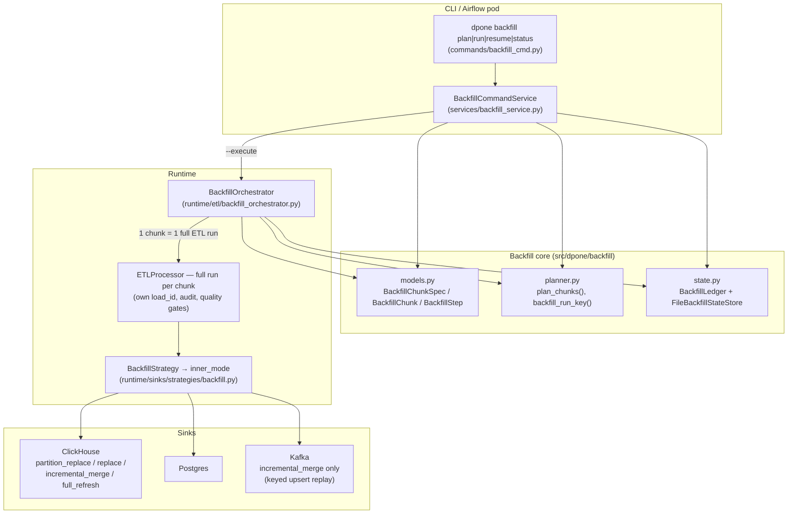

# Specification: chunked backfill subsystem and interval-aware Airflow integration

- **Date:** 2026-07-08 (updated the same day after the interval-aware Airflow integration was implemented)
- **Status:** the whole document describes **implemented code** (source of truth — the modules listed in §1.3 and §9); Part 2 (§10–§12) compares dpone with industrial systems.
- **Audience:** data architects and platform engineers; the document is written for self-service reading without opening the code.
- **User guide:** [docs/backfill.md](../../backfill.md); example DAGs — `examples/dags/` in the repository root.

---

## Table of contents

- [1. Overview](#1-overview)
  - [1.1. Problem and user value](#11-problem-and-user-value)
  - [1.2. Subsystem architecture](#12-subsystem-architecture)
  - [1.3. Source of truth](#13-source-of-truth)
- [2. Declarative chunk specification model](#2-declarative-chunk-specification-model)
- [3. Deterministic chunk planner](#3-deterministic-chunk-planner)
- [4. Durable JSON ledger and resume semantics](#4-durable-json-ledger-and-resume-semantics)
- [5. Chunked backfill orchestrator](#5-chunked-backfill-orchestrator)
- [6. Inner-mode delegation in sinks](#6-inner-mode-delegation-in-sinks)
- [7. dpone backfill CLI: plan-first UX](#7-dpone-backfill-cli-plan-first-ux)
- [8. Evidence contract: ProcessResult.details and XCom](#8-evidence-contract-processresultdetails-and-xcom)
- [9. Interval-aware Airflow integration](#9-interval-aware-airflow-integration)
- [10. Comparison with industrial systems](#10-comparison-with-industrial-systems)
- [11. Feature-by-feature matrix](#11-feature-by-feature-matrix)
- [12. What we borrow and where dpone leads](#12-what-we-borrow-and-where-dpone-leads)
- [13. Sources](#13-sources)

---

## 1. Overview

### 1.1. Problem and user value

Loading the full history of a large table with a single query is an anti-pattern: one failure at the 90% mark forces a full reload, the source system takes uncontrolled load, and progress can be neither observed nor verified. The chunked backfill subsystem solves this:

1. **Declaratively.** The user describes the historical window in the YAML manifest (`sink.strategy.backfill.chunk`) — column, boundaries, step. No imperative code.
2. **Deterministically.** The planner splits the window into non-overlapping chunks; the same spec always yields the same plan and the same idempotency keys — the plan can be reviewed and diffed before execution.
3. **Resumably.** Every committed chunk is recorded in a durable JSON ledger; after a failure `dpone backfill resume` continues from the first non-committed chunk instead of starting over.
4. **Idempotently.** Every chunk is loaded through the chosen `inner_mode` (default `partition_replace`), so re-loading a chunk replaces exactly its own data slice.
5. **Observably.** Every chunk is a complete ETL run with its own `load_id`, audit record and quality gates; the aggregate result carries per-chunk evidence and a verification section suitable for XCom/CI.

### 1.2. Subsystem architecture



The key architectural decision: **orchestration is separated from loading**. Planning, the ledger, resume and parallelism live in `BackfillOrchestrator`; the sink strategy `BackfillStrategy` stays a thin delegation point that merely swaps `load_strategy` for `inner_mode`. Any sink that already implements the inner strategies gets backfill for free.

### 1.3. Source of truth

| Module | Responsibility |
|---|---|
| `src/dpone/backfill/models.py` | Spec/chunk/step models, parsing and validation of `options.backfill` |
| `src/dpone/backfill/planner.py` | Deterministic chunk plan, `run_key` |
| `src/dpone/backfill/state.py` | Durable JSON ledger, atomic writes, thread safety |
| `src/dpone/runtime/etl/backfill_orchestrator.py` | Orchestration: detection, plan, resume, parallelism, aggregation |
| `src/dpone/runtime/sinks/strategies/backfill.py` | Delegating a chunk to the sink's inner strategy |
| `src/dpone/runtime/sinks/clickhouse_staged_load.py` | `BACKFILL → effective inner strategy` mapping in the ClickHouse staged cycle |
| `src/dpone/runtime/sinks/kafka.py` | Kafka backfill: keyed upsert replay, inner_mode validation |
| `src/dpone/services/backfill_service.py`, `src/dpone/commands/backfill_cmd.py` | CLI `dpone backfill plan\|run\|resume\|status` |
| `src/dpone/schema/etl-config.schema.json` | JSON Schema of the `options.backfill` block |
| `src/dpone/contracts/process_types.py` | `ProcessResult.details` — carrier of structured evidence for XCom |
| `src/dpone/contracts/run_interval.py` | Interval contract: `DPONE_*` env, `RunInterval`, substitution tokens |
| `src/dpone/services/interval_context.py`, `src/dpone/commands/run_cmd.py` | Applying the interval to LoadConfig; `dpone run --interval-start/--interval-end` flags |
| `src/dpone/gitops/airflow_interval_env.py` | Jinja templates of the env contract for `KubernetesPodOperator.env_vars` |
| `src/dpone/gitops/airflow_xcom_outcome.py`, `airflow_runtime_profile_models.py` | `interval` and `backfill` sections in the XCom summary |
| `src/dpone/commands/state_cmd.py`, `src/dpone/readiness/managed_state.py` | `dpone state rewind` — approval-gated watermark rewind |
| `src/dpone/backfill/verification.py` | Post-backfill verification bridge to the route-refresh toolchain |
| `src/dpone/ops/route_refresh_plan.py` | Route refresh on the shared backfill planner (timestamp windows) |
| `packages/dpone-airflow-pack/src/dpone_airflow_pack/asset_outlets.py`, `pack_tasks.py` | Asset/Dataset outlets from `airflow.execution.outlets` |
| `.github/workflows/airflow-pack-compat.yml` | Airflow 2.10 / 3.x compatibility CI matrix |

---

## 2. Declarative chunk specification model

### 2.1. Purpose

The single declaration point of a backfill campaign is the YAML manifest:

```yaml
sink:
  strategy:
    mode: backfill
    backfill:
      inner_mode: partition_replace     # how each chunk is loaded
      chunk:
        column: business_date           # window column
        from: "2025-01-01"              # first boundary
        to: "2025-12-31"                # last boundary (inclusive for date/integer)
        step: 1d                        # chunk size: Nh|Nd|Nw|Nmo|Ny or an integer
        kind: date                      # date|timestamp|integer; inferred from `from` when omitted
      parallel_workers: 4               # concurrent chunks (default 1)
      max_chunks: 1000                  # guard against plan explosion (default 1000)
      state_dir: .dpone/backfill        # ledger directory (or env DPONE_BACKFILL_STATE_DIR)
      backfill_id: q1-repair-2026       # optional: pin an explicit campaign key
```

Without the `chunk` block, `backfill` mode works in the historical single-shot mode: the whole payload is delegated to `inner_mode` in one run (backward compatibility).

### 2.2. Data contracts

Three frozen dataclasses (`models.py`):

| Type | Fields | Invariants |
|---|---|---|
| `BackfillChunkSpec` | `column, start, end, step, kind, max_chunks` | `kind ∈ {date, timestamp, integer}`; `from <= to`; `step` consistent with `kind`; `max_chunks >= 1` |
| `BackfillStep` | `count, unit` | `unit ∈ {h, d, w, mo, y}` for temporal; `unit=None` for integer; `h` forbidden for `kind: date` |
| `BackfillChunk` | `index, start, end, predicate, idempotency_key` | `index` starts at 1; `predicate` fully encodes the window boundaries |

`BackfillChunkSpec.fingerprint_parts()` returns `(column, start, end, step, kind)` — the material for computing the `run_key` (§3.1): any window change starts a new campaign.

### 2.3. Window semantics

This is the subsystem's most important contract:

- **`date` / `timestamp`** — half-open windows `column >= start AND column < end`. Adjacent chunks **never overlap**, and a re-run of one chunk replaces exactly its own slice (idempotent replay).
- **`date`**: the user-facing `to` boundary is **inclusive** (a human writing `to: 2025-12-31` expects that day loaded), so the final exclusive boundary is `to + 1 day`.
- **`integer`** — inclusive windows `column >= start AND column <= end`, matching the route-refresh contract (one integer-window semantics across the whole framework).

### 2.4. Parsing and validation algorithm

```text
chunk_spec_from_options(options):
    if options.chunk is absent → None (single-shot mode)
    column/from/to/step ← required strings; missing ones → ValueError listing the keys
    kind ← options.chunk.kind OR inferred from `from`:
        YYYY-MM-DD           → date
        integer literal      → integer
        ISO-8601 datetime    → timestamp
    parse_step(step, kind):
        "N{h|d|w|mo|y}"      → temporal step (h requires kind=timestamp)
        integer N >= 1       → integer step (kind=integer only)
        otherwise            → ValueError with a format hint
    boundary validation: both boundaries parse under kind; from <= to
    max_chunks ← options.max_chunks (default 1000, >= 1)
```

All errors are `ValueError` with a self-service message (what exactly is wrong and how to fix it), no stack traces into internals.

---

## 3. Deterministic chunk planner

### 3.1. run_key — campaign identity

```text
run_key = sha256("{dataset}|{inner_mode}|{column}|{from}|{to}|{step}|{kind}")[:16]
where dataset = "{target_schema}.{target_table}"
```

Properties:

- A re-invocation with identical parameters → the same `run_key` → **the same ledger is resumed**.
- Any window/step/inner_mode change → a new `run_key` → **a fresh campaign with a clean ledger** (a campaign cannot be accidentally "continued" with different boundaries).
- `backfill_id` in the manifest/CLI overrides the derived key — for campaigns that need a human-readable name or an explicitly pinned ledger.

### 3.2. plan_chunks algorithm

The planner is a pure function: no I/O, no clocks, the same spec → the same tuple of chunks.

```text
plan_chunks(spec, run_key):
    step ← parse_step(spec.step, spec.kind)

    if kind == integer:
        cursor ← int(from)
        while cursor <= int(to):
            chunk_end ← min(cursor + step - 1, int(to))
            predicate ← "col >= {cursor} AND col <= {chunk_end}"     # inclusive
            emit chunk(index, cursor, chunk_end, predicate)
            cursor ← chunk_end + 1

    if kind == date:      end_exclusive ← date(to) + 1 day           # to is inclusive
    if kind == timestamp: end_exclusive ← datetime(to)               # to is exclusive

    for temporal kinds:
        cursor ← parse(from)
        while cursor < end_exclusive:
            window_end ← min(advance(cursor, step), end_exclusive)
            predicate ← "col >= '{cursor}' AND col < '{window_end}'" # half-open
            emit chunk(index, cursor, window_end, predicate)
            cursor ← window_end

    if len(chunks) > spec.max_chunks → ValueError (hint: raise max_chunks or use a larger step)
```

Temporal cursor advancement (`advance`): `h/d/w` via `timedelta`; `mo/y` via calendar arithmetic with the day clamped to the month length (e.g. `2025-01-31 + 1mo = 2025-02-28`), so monthly chunks neither drift nor fail on short months.

### 3.3. Chunk idempotency key

```text
idempotency_key = "{run_key}:{index}:{start}..{end}"
```

The key is stable across runs and uniquely ties together the ledger record, the per-chunk `load_id` and the data window — the foundation of the evidence chain (ledger → audit → XCom).

### 3.4. Planning failure modes

| Scenario | Behavior |
|---|---|
| Window/step produce more than `max_chunks` chunks | Error at plan time, before any I/O |
| `step: 6h` with `kind: date` | Validation error hinting at `kind: timestamp` |
| `from > to` | Validation error |
| Boundaries of an existing campaign changed | New `run_key`, the old ledger is untouched |

---

## 4. Durable JSON ledger and resume semantics

### 4.1. Purpose

The ledger is the single source of truth about campaign progress: which chunks are committed, how many rows moved, which `load_id`s correspond to them. It is stored as one JSON file per campaign: `{state_dir}/{run_key}.json` (default `.dpone/backfill`, overridable via `state_dir` or the `DPONE_BACKFILL_STATE_DIR` env variable).

The filesystem (rather than a database) is a deliberate choice:

- it works identically for CLI, Airflow pods (mounted work dirs) and CI;
- the ledger is human-readable and can be attached to reviews as evidence;
- no extra DDL is required in any of the supported state backends.

### 4.2. Ledger structure

```json
{
  "kind": "dpone.backfill_ledger",
  "schema_version": "1",
  "run_key": "9f2c41d0a7b3e815",
  "dataset": "analytics.orders",
  "inner_mode": "partition_replace",
  "chunk_config": {"column": "business_date", "from": "2025-01-01",
                    "to": "2025-12-31", "step": "1mo", "kind": "date"},
  "created_at": "2026-07-08T09:00:00+00:00",
  "updated_at": "2026-07-08T09:41:12+00:00",
  "chunks": [
    {
      "index": 1,
      "start": "2025-01-01", "end": "2025-02-01",
      "idempotency_key": "9f2c41d0a7b3e815:1:2025-01-01..2025-02-01",
      "status": "success",
      "attempts": 1,
      "rows_extracted": 1204331, "rows_loaded": 1204331,
      "run_id": "orders-backfill", "load_id": "1720424412001",
      "error": null,
      "updated_at": "2026-07-08T09:07:44+00:00"
    },
    {
      "index": 2, "start": "2025-02-01", "end": "2025-03-01",
      "idempotency_key": "9f2c41d0a7b3e815:2:2025-02-01..2025-03-01",
      "status": "failed", "attempts": 2,
      "rows_extracted": 0, "rows_loaded": 0,
      "error": "source connection reset", "updated_at": "2026-07-08T09:41:12+00:00"
    }
  ]
}
```

Chunk state machine: `pending → running → success | failed`; `failed → running` on retry/resume. `attempts` grows monotonically and survives process restarts.

### 4.3. Write guarantees

- **Atomicity**: every write is `tmp file + rename` (POSIX-atomic replace); a reader never sees a half-written JSON.
- **Thread safety**: all store operations run under a re-entrant lock — the orchestrator can commit chunks from parallel threads.
- **Recreation**: if an existing ledger contains a different chunk count than the current plan (e.g. `backfill_id` was changed but the window was not), the ledger is recreated from scratch — plan/state desync is impossible.

### 4.4. Resume semantics

```text
committed ← {index : status == success}          # from the ledger
pending   ← [chunk for chunk in plan if chunk.index not in committed]
```

Resume granularity is **one chunk**. Chunks in `failed` and `running` states (the process was killed mid-chunk) count as non-committed and are reloaded in full; replay idempotency is provided by the `inner_mode` (§6). Anything stricter than row-level exactly-once is unnecessary: half-open windows + partition/predicate replace give exactly-once at the data-slice level.

---

## 5. Chunked backfill orchestrator

### 5.1. Entry point and detection

`execute_process_with_backfill(processor, load_config, ...)`:

- `is_chunked_backfill(config)` is true ⟺ `load_strategy == BACKFILL` **and** `options.backfill.chunk` is set.
- Otherwise — a direct `processor.run(...)` (single-shot backfill or any other mode); behavior stays historical.

### 5.2. Full run algorithm

```mermaid
sequenceDiagram
    participant U as CLI / Airflow pod
    participant O as BackfillOrchestrator
    participant P as planner
    participant L as FileBackfillStateStore
    participant E as ETLProcessor (per chunk)
    participant S as Sink (inner_mode)

    U->>O: run(load_config)
    O->>O: parse spec / inner_mode / workers
    O->>P: run_key = backfill_id | sha256(...)
    O->>P: plan_chunks(spec, run_key)
    Note over O: full_refresh + >1 chunk → ValueError
    O->>L: load(run_key) or create ledger
    L-->>O: committed indexes
    O->>O: pending = plan − committed
    loop for each pending chunk (seq or ThreadPool)
        O->>L: chunk.status=running, attempts+=1 (atomic write)
        O->>E: run(chunk_load_config) — predicate injected
        E->>S: load(payload) via inner_mode
        alt success
            E-->>O: {extracted_rows, loaded_rows, run_id, load_id}
            O->>L: status=success + metrics (atomic write)
        else exception
            O->>L: status=failed + error
            Note over O: sequential — stop at first failure;<br/>parallel — remaining futures finish
        end
    end
    O-->>U: aggregate result + verification
```

### 5.3. Predicate injection into the per-chunk LoadConfig

Every chunk gets an **isolated copy** of the LoadConfig (`dataclasses.replace` + `deepcopy(options)`):

```text
custom_predicate                ← "({user_predicate}) AND ({chunk.predicate})"   # when the user set one
options.source_custom_predicate ← the same combination                           # bound on the source side
options.backfill.chunk_context  ← chunk.to_jsonable()                            # evidence down the stack
```

Invariant: each chunk's extract is bounded by exactly its own window and cannot read another chunk's slice; the user predicate (e.g. `region = 'EU'`) is preserved in every chunk.

### 5.4. Parallelism

`parallel_workers > 1` and more than one pending chunk → `ThreadPoolExecutor` (`dpone-backfill` thread-name prefix). Properties:

- every chunk is independent (isolated LoadConfig, its own `load_id`);
- ledger writes are serialized through the store's RLock;
- when one chunk fails, the remaining futures **run to completion** (unlike the sequential mode, which stops at the first failure to avoid hammering an unhealthy source);
- user requirement (captured in the JSON Schema): thread-safe connectors and independent chunk windows (e.g. distinct partitions with `partition_replace`).

### 5.5. Guard invariants

| Invariant | Where enforced |
|---|---|
| `full_refresh` truncates the whole target ⇒ valid only for a single-chunk plan | Orchestrator, before creating the ledger |
| The plan does not exceed `max_chunks` | Planner |
| The ledger matches the plan (chunk count) | Orchestrator, when loading the ledger |
| Kafka rejects sink-side inner modes | Kafka sink (§6.3) |

### 5.6. Aggregate result

```json
{
  "status": "success | error",
  "extracted_rows": 14512890, "loaded_rows": 14512890,
  "inserted_rows": 14512890, "updated_rows": 0, "final_rows": 14512890,
  "duration_seconds": 2411.7,
  "errors": ["chunk 7 [2025-07-01..2025-08-01]: source connection reset"],
  "backfill": {
    "run_key": "9f2c41d0a7b3e815",
    "dataset": "analytics.orders",
    "inner_mode": "partition_replace",
    "state_path": ".dpone/backfill/9f2c41d0a7b3e815.json",
    "chunks_total": 12, "chunks_committed": 11,
    "chunks_failed": 1, "chunks_skipped_resume": 6,
    "verification": {
      "check": "row_count_parity",
      "status": "passed | warning",
      "mismatched_chunks": []
    },
    "verification_execution_path": ".dpone/backfill/9f2c41d0a7b3e815.execution.json",
    "chunks": []
  }
}
```

The compact example omits the full per-chunk ledger records by using an empty
array; successful production evidence contains the complete records.

- `status = success` ⟺ **all** chunks of the plan are committed and there are no errors.
- `chunks_skipped_resume` — how many chunks were skipped thanks to resume (a direct measure of saved work).
- `verification.row_count_parity` — per-chunk extracted-vs-loaded comparison; a mismatch produces a `warning` listing the exact chunks and windows.
- `verification_execution_path` appears only on full campaign success: the orchestrator exports `<run_key>.execution.json` — the bridge to deep source/sink verification (§9.5).

### 5.7. Failure modes / idempotency (summary)

| Failure | Behavior | Recovery |
|---|---|---|
| Exception inside a chunk | `failed` + error in the ledger; sequential — stop, parallel — the rest finish | `dpone backfill resume` reloads only non-committed chunks |
| Process killed mid-chunk | The chunk stays `running`, not counted as committed | resume reloads it in full; inner_mode makes the replay idempotent |
| Re-running a finished campaign | pending = ∅, instant success with no data I/O | — |
| Window changed between runs | New run_key → new campaign | The old ledger stays untouched (audit) |
| Two processes on one campaign | Not serialized (the lock is in-process) | Orchestration responsibility; the Airflow pattern is one pod per campaign |

---

## 6. Inner-mode delegation in sinks

### 6.1. BackfillStrategy — a thin delegation point

The `backfill` sink strategy (a wrapper over the sink's `strategy_map`) does exactly one thing: it resolves `inner_mode` (default `partition_replace`) and invokes the inner strategy with a `load_config` whose `load_strategy` is replaced by the inner mode. No planning, no state — delegation only. An inner mode unsupported by the sink → an explicit `ValueError`.

| `inner_mode` | Per-chunk semantics | Replay idempotency |
|---|---|---|
| `partition_replace` (default) | staged load → `REPLACE PARTITION` of the affected partitions | Full: the partition is replaced atomically |
| `replace` | staged load → replacement of the predicate window (shadow table + swap in ClickHouse) | Full: the chunk predicate equals the replacement window |
| `incremental_merge` | keyed upsert via `unique_key` + merge_policy | Per key: a re-load overwrites the same keys |
| `full_refresh` | truncate + load | Single-chunk plans only (guard §5.5) |

### 6.2. ClickHouse: BACKFILL to the effective inner strategy

`ClickHouseStagedLoadService` calls `_effective_config` at the start of `stage()` and `finalize()`: when `load_strategy == BACKFILL`, the config is swapped for the inner strategy. From there the regular ClickHouse staged cycle runs:

- `partition_replace`: staging → enumerate affected partitions from staging → `max_partitions_per_run` guard → `ALTER TABLE ... REPLACE PARTITION ... FROM staging` for each;
- `replace`: shadow table, copy of the target excluding the predicate window, staging insert, atomic swap;
- `incremental_merge`: merge_policy `lightweight_delete_insert` / `mutation_delete_insert` / `shadow_swap` with staging duplicate validation;
- `full_refresh`: swap staging into the target.

A backfill chunk therefore goes through **the same production staged path** (staging → finalize → cleanup/abort) as regular loads — no separate "backfill code" on the sink side.

### 6.3. Kafka: keyed upsert replay

A topic is an append-only log; sink-side replacement is impossible. Therefore:

- only `inner_mode: incremental_merge` is allowed (or no explicit inner_mode); anything else → a `ValueError` with an explanation;
- every chunk row is produced as an upsert event keyed by `unique_key` (a compacted topic or an upsert-semantics consumer collapses repeats) — chunk replay is idempotent at the key level;
- deletes with tombstones enabled — `value = null` for the key.

---

## 7. dpone backfill CLI: plan-first UX

### 7.1. Workflow

```console
$ dpone backfill plan manifest.yml            # 1. review the chunk plan (no data movement)
$ dpone backfill run manifest.yml             # 2. dry-run: the same plan + next_actions hint
$ dpone backfill run manifest.yml --execute   # 3. load the pending chunks
$ dpone backfill resume manifest.yml          # 4. continue after a failure (= run --execute)
$ dpone backfill status manifest.yml          # 5. ledger progress at any time
```

Principles:

- **plan-first / dry-run by default** — `run` without `--execute` moves no data; an accidental campaign launch is impossible;
- **plan and status stitch the plan with the ledger**: every chunk is shown with its persistent status (`pending/running/success/failed`) and `load_id`;
- **exit code**: an executed run returns 1 when the campaign did not pass — ready for CI and Airflow.

### 7.2. Window overrides

Every window parameter can be overridden by flags and is merged into the manifest `backfill` block:

```console
$ dpone backfill run manifest.yml --execute \
    --from "{{ params['from'] }}" --to "{{ params['to'] }}" --step "{{ params['step'] }}" \
    --parallel-workers 2 --backfill-id q1-repair-2026
```

Flags: `--column/--from/--to/--step/--kind` (window), `--inner-mode`, `--parallel-workers`, `--max-chunks`, `--state-dir`, `--backfill-id`; output formats `--format text|json|md`. This is the Airflow bridge for one-off campaigns: a parameterized DAG templates `params` into the overrides (see `examples/dags/dpone_backfill_campaign_dag.py`). Interval-driven catchup takes a different path — the `DPONE_*` env contract and `{{ token }}` substitution in `dpone run` (§9.1); for a manifest with `mode: backfill` + `chunk`, `dpone run` is equivalent to `backfill run --execute` — the runtime orchestrates the campaign automatically.

### 7.3. Example output

```text
dpone.backfill_plan

- manifest: manifest.yml
- dataset: analytics.orders
- run_key: 9f2c41d0a7b3e815
- inner_mode: partition_replace
- parallel_workers: 4
- state_path: .dpone/backfill/9f2c41d0a7b3e815.json
- chunks_total: 12
- counts: pending=5, success=7
- next: re-run with --execute to load the pending chunks

chunks:
  1 | 2025-01-01 .. 2025-02-01 | success
  2 | 2025-02-01 .. 2025-03-01 | success
  ...
  8 | 2025-08-01 .. 2025-09-01 | pending
```

`--format json` returns the same payload machine-readably (`kind: dpone.backfill_plan|dpone.backfill_status|dpone.backfill_run`) — one contract for CI, Airflow and humans.

---

## 8. Evidence contract: ProcessResult.details and XCom

`ProcessResult` (frozen dataclass, `contracts/process_types.py`) carries an optional `details: dict` field — the carrier of structured evidence; for chunked backfill it holds the `backfill` section of the aggregate result (§5.6). `to_dict()` includes `details` in serialization, so evidence reaches, without loss:

- CLI run reports (`dpone backfill run --format json`, `dpone run --format json`);
- the Airflow pod XCom contract: the pod pushes `gitops.airflow_xcom_summary` (schema `docs/schemas/gitops/airflow-xcom-summary.schema.json`: `status`, `runtime_evidence_path` + `sha256`, `step_counts`, `blockers`, `artifact_paths`, inline `runtime_evidence`, plus the `interval` and `backfill` sections — mechanics in §9.2).

---

## 9. Interval-aware Airflow integration

> **Status: implemented.** User guide — [docs/backfill.md](../../backfill.md) ("Airflow integration", "Watermark safety" sections); working examples — `examples/dags/dpone_interval_catchup_dag.py` and `examples/dags/dpone_backfill_campaign_dag.py` in the repository root.

### 9.1. Interval contract: DPONE_* env to dpone run

**Purpose.** Make the Airflow run interval a first-class input of the dpone pod: catchup runs, task clears and `airflow dags backfill` automatically become windowed, idempotent runs. The contract is scheduler-agnostic: any orchestrator exporting the same env variables gets identical behavior.

**Mechanics (the two-sided contract in `contracts/run_interval.py`).**

On the scheduler side (`gitops/airflow_interval_env.py`) the env variables are **not rendered by the operator at execute time**; they are baked into the pack artifacts as static Jinja templates in `KubernetesPodOperator.env_vars` — Airflow itself renders `env_vars` when the task instance is created, so pack artifacts stay static while every pod receives the concrete interval of its DAG run:

| Variable | Jinja template in the pack |
|---|---|
| `DPONE_DAG_ID` | `{{ dag.dag_id }}` |
| `DPONE_DAG_RUN_ID` | `{{ run_id }}` |
| `DPONE_TRY_NUMBER` | `{{ ti.try_number }}` |
| `DPONE_LOGICAL_DATE` | `{{ (logical_date \| ts) if logical_date else '' }}` |
| `DPONE_INTERVAL_START` | `{{ (data_interval_start \| ts) if data_interval_start else '' }}` |
| `DPONE_INTERVAL_END` | `{{ (data_interval_end \| ts) if data_interval_end else '' }}` |

The conditional templates solve the Airflow 3 problem: asset-triggered and manual runs have `logical_date=None` and no interval fields ([release notes 3.0](https://airflow.apache.org/docs/apache-airflow/3.0.0/release_notes.html)) — the template renders an empty string, and the runtime treats `""`/`"None"`/`"null"` as "no interval" (`RunInterval.is_empty`): the pod behaves byte-for-byte like an unscheduled CLI run. The contract is injected into all three surfaces: the compact pack (`airflow_compact_pack.py`), the pod contract (`airflow_pod_contract.py`) and the DAG-factory renderer.

On the pod side, `dpone run` assembles the `RunInterval` with the precedence **CLI flags > env**:

```console
$ dpone run manifest.yml \
    --interval-start 2025-07-01T00:00:00+00:00 \   # default: DPONE_INTERVAL_START
    --interval-end   2025-07-02T00:00:00+00:00 \   # default: DPONE_INTERVAL_END
    --execution-date 2025-07-01T00:00:00+00:00     # default: DPONE_LOGICAL_DATE
```

**Interval application (`services/interval_context.py`) — token substitution, not an implicit override.** The interval does not rewrite `chunk.from/to` automatically: the manifest explicitly asks for the interval via `{{ token }}` placeholders in any string options and predicates:

```yaml
sink:
  strategy:
    mode: backfill
    backfill:
      inner_mode: partition_replace
      chunk:
        column: business_date
        from: "{{ data_interval_start }}"
        to: "{{ data_interval_end }}"
        step: 1d
```

Supported tokens: `data_interval_start`, `data_interval_end`, `logical_date`, `ds` (logical date as `YYYY-MM-DD`, the Airflow convention), `dag_run_id`. The `IntervalContextService.apply` algorithm:

```text
if interval.is_empty → the LoadConfig is untouched (no-op, full backward compatibility)
otherwise:
    recursive {{ token }} substitution across all option strings (dict/list — recursively)
    substitution inside custom_predicate
    options["interval"] ← interval.to_jsonable()      # interval metadata into evidence
unrecognized tokens are left as is (they neither fail nor get erased)
```

**Run-state identity.** The `execution_date` for run state resolves as a cascade: explicit `--execution-date` → `DPONE_LOGICAL_DATE` → `DPONE_INTERVAL_START` (`RunInterval.execution_datetime()`); `--dag-id` defaults to `DPONE_DAG_ID`. The boundary parser tolerates the Airflow `Z` suffix (normalized to `+00:00`).

```mermaid
sequenceDiagram
    participant AF as Airflow scheduler
    participant KPO as KPO (pack, static env_vars templates)
    participant POD as dpone pod
    participant RUN as dpone run

    AF->>KPO: task instance creation
    Note over KPO: Airflow renders env_vars:<br/>DPONE_INTERVAL_START/END, DPONE_LOGICAL_DATE,<br/>DPONE_DAG_ID / DAG_RUN_ID / TRY_NUMBER
    KPO->>POD: pod starts with the rendered env
    POD->>RUN: dpone run manifest.yml --format json
    RUN->>RUN: RunInterval ← CLI flags > env
    RUN->>RUN: {{ data_interval_start }}/{{ ds }}/... → values<br/>options.interval ← metadata; run-state identity
    RUN->>RUN: mode: backfill + chunk → orchestrator (§5),<br/>window = exactly this interval
```

Result: `catchup=True`, task clears and `airflow dags backfill` replace exactly their own slice (functional data engineering) — see `examples/dags/dpone_interval_catchup_dag.py`. For large one-off campaigns the second pattern remains — a parameterized DAG (`params: from/to/step`) templating `dpone backfill run --execute --from/--to/--step` (`examples/dags/dpone_backfill_campaign_dag.py`); the `dpone backfill` window overrides are the CLI flags of §7.2 and need no token contract.

### 9.2. XCom extension: interval and bounded backfill sections

**Purpose.** Downstream tasks and monitoring get from XCom not just "passed/failed" but a verifiable "which window was loaded and how far the campaign progressed".

**Contract.** `GitOpsAirflowXComOutcomeBuilder` adds two optional sections to `gitops.airflow_xcom_summary` (additively; `schema_version` stays `"1"`; both are pinned in `docs/schemas/gitops/airflow-xcom-summary.schema.json`):

```json
{
  "kind": "gitops.airflow_xcom_summary",
  "schema_version": "1",
  "interval": {
    "interval_start": "2025-01-01T00:00:00+00:00",
    "interval_end": "2025-01-02T00:00:00+00:00",
    "logical_date": "2025-01-01T00:00:00+00:00",
    "dag_id": "dpone_orders_daily", "dag_run_id": "scheduled__2025-01-01", "try_number": "1"
  },
  "backfill": {
    "run_key": "9f2c41d0a7b3e815",
    "dataset": "analytics.orders",
    "inner_mode": "partition_replace",
    "state_path": ".dpone/backfill/9f2c41d0a7b3e815.json",
    "chunks_total": 12, "chunks_committed": 12, "chunks_failed": 0,
    "chunks_skipped_resume": 7,
    "verification": {"check": "row_count_parity", "status": "passed", "mismatched_chunks": []}
  }
}
```

Assembly algorithm:

- `interval` — `run_interval_from_env()` inside the pod (the same contract as §9.1); the section is omitted when the interval is empty;
- `backfill` — a **bounded** projection of `inline_payload.result.details.backfill` (the `dpone run --format json` evidence, §8): only campaign counters pass into XCom through an allowlist of 9 fields (`run_key`, `dataset`, `inner_mode`, `state_path`, `chunks_total/committed/failed/skipped_resume`, `verification`). The per-chunk list is **deliberately not pushed** — it stays in the runtime evidence file and the ledger, so the XCom payload does not grow with the chunk count.

Difference from the original plan: there is no `watermarks` section in XCom — instead of "watermark advancement" a stronger guarantee is implemented, **watermark safety**: chunked backfill never mutates incremental watermarks (extraction uses the chunk predicate, not saved state), and an explicit watermark shift is a separate gated operation, §9.3.

### 9.3. dpone state rewind: the approval gate for watermarks

**Purpose.** Before replaying history on an incremental route, a watermark sometimes has to be rolled back deliberately. It is a destructive operation (the next incremental run re-reads history), so it lives in the shared state toolchain behind a mandatory two-factor approval gate — not in the backfill ledger, which needs no rewind (reloading committed chunks is solved by a new `run_key`/`--backfill-id`, and idempotent replay is an inner_mode property).

**Mechanics (`commands/state_cmd.py` + `readiness/managed_state.py::StateInspectorService.rewind`).**

```console
$ dpone state rewind --backend postgres --state-type xmin analytics.orders \
    --to "2025-01-01" --reason "range replay" \
    --yes --approved-by "data-arch" \
    --evidence-output .dpone/state/rewind-orders.json
```

- `--backend bigquery|postgres|mssql`, `--state-type xmin|kafka_offsets|cdc_offsets|run_state`, positional `identity`, required `--to` (target watermark);
- **approval gate**: `execute` mode turns on only with `--yes` **and** a non-empty `--approved-by`; otherwise — `preview` with no mutations whatsoever, plus `next_actions` listing the missing flags;
- **evidence JSON**: the returned payload (`operation/backend/state_type/identity/target_watermark/reason/mode` + the `approval {required, granted, approved_by, missing}` block) is both the result and reviewable evidence of who rewound what and why; `--evidence-output` writes it to a file;
- `--strict` — exit code 1 while the operation stays in preview mode (CI gating);
- `--reason` is recorded in the evidence (default `"unspecified"`).

Difference from the original plan: what was implemented is **not** a `dpone backfill rewind` that flips chunks `success → pending` with a rewind journal in the ledger, but a universal watermark rewind at the state-backend level — one gate for every state type (xmin, Kafka/CDC offsets, run state) instead of a private mechanism of one subsystem.

### 9.4. Unifying route refresh with the backfill planner

**Implemented** at the shared window-planner level. `ops/route_refresh_plan.py::_timestamp_chunks` builds the multi-chunk timestamp windows of a route refresh through **the same** `dpone.backfill.chunk_spec_from_options` + `plan_chunks`:

```text
_timestamp_chunks(route, dataset, window, max_chunks):
    window.chunk_size (days per chunk) → step "{chunk_size}d"    # the Nd contract of §2.4
    spec ← chunk_spec_from_options({max_chunks, chunk: {column: "window",
                                     from: window.start, to: window.end, step}})
    planned ← plan_chunks(spec, run_key=f"{route.case_id}:{dataset}")
    ValueError("max_chunks")  → blocker route_refresh.chunk_count_exceeded
    any other ValueError      → blocker route_refresh.window_invalid
```

The unification invariant: route refresh and `dpone backfill` produce **identical deterministic windows** for the same boundaries (half-open semantics, identical step arithmetic, the shared `max_chunks` guard). Inclusive integer windows already followed one contract (§2.3); now the timestamp branch is one code path too, not two parallel planners. Route refresh keeps its own ledger model and execution (the route-refresh-execution/verification chain) — and that is exactly what the verification bridge of §9.5 builds on.

### 9.5. Post-backfill verification: the bridge to route-refresh tooling

Two automatic layers:

1. **Row-count parity** (§5.6) — extracted vs loaded for every committed chunk; mismatches → `verification.status: warning` with the chunk list.
2. **Reconciliation bridge** (`backfill/verification.py`) — instead of duplicating a source-vs-sink comparison inside backfill, a completed campaign is exported in the route-refresh-execution format and verified by the **existing** evidence toolchain:

```text
after result aggregation, only when status == "success":
    payload ← {kind: "dpone.backfill_verification_execution", schema_version: "1",
               producer: "dpone backfill",
               route: {source, sink, strategy: "backfill"},
               dataset, run_key, inner_mode,
               status: "succeeded", passed: true, executed: true,
               chunks: [{ordinal, start, end, source_boundary: "start..end",
                         sink_boundary: "start..end", idempotency_key}, ...],  # committed chunks
               blockers: []}
    path: {state_dir}/{run_key}.execution.json               # next to the ledger
    result.backfill.verification_execution_path ← path
```

From there — the standard deep source/sink reconciliation chain (snapshots by keys and the boundary column, row-count and typed-hash reconciliation):

```console
$ dpone ops route-refresh-capture-snapshots \
    --route-refresh-execution-json .dpone/backfill/<run_key>.execution.json \
    --runner-id <id> --key <col> --boundary-column <col> --column <col> ...
$ dpone ops route-refresh-verify \
    --route-refresh-execution-json .dpone/backfill/<run_key>.execution.json \
    --source-snapshot-json ... --sink-snapshot-json ... ...
```

The document is written only for a fully committed campaign (a partial campaign never pretends to be a verifiable receipt); the chunk ordinals/boundaries in the document come from the ledger, so reconciliation runs over exactly the windows that were loaded.

### 9.6. Airflow 2.10/3.x CI matrix and Asset/Dataset outlets

**CI matrix** (`.github/workflows/airflow-pack-compat.yml`) validates the scheduler-side `dpone-airflow-pack` provider against the supported Airflow release lines:

| Airflow | cncf-kubernetes provider | Python |
|---|---|---|
| 2.10.5 | 10.1.0 | 3.11 |
| 2.10.5 | 10.1.0 | 3.12 |
| 3.0.2 | 10.4.2 | 3.12 |

Steps per matrix cell: a scheduler-like venv (Airflow + provider + only the pack package, no heavy dpone runtime) → an import-safety check (`build_dpone_gitops_task_group_from_pack` etc. import cleanly on a bare scheduler image) → provider pytest against the pinned Airflow. Triggers — changes to the pack package, `src/dpone/gitops/airflow_*`, `src/dpone/contracts/run_interval.py` and the related tests.

**Asset/Dataset outlets** (`asset_outlets.py` + `pack_tasks.py`). The workload catalog declares produced datasets:

```yaml
airflow:
  execution:
    outlets:
      - "clickhouse://analytics/orders"
```

Algorithm: the pack builder copies the block verbatim into `airflow.execution` of the compact pack → at DAG parse time `outlet_uris_from_pack` extracts the URIs, `build_asset_outlets` builds the objects with lazy version compatibility (`airflow.sdk.Asset` on 3.x → fallback to `airflow.datasets.Dataset` on 2.4+ → skipped when Airflow is not importable — the pack stays parse-safe on minimal images) → the outlets are attached to the runtime task (`kwargs["outlets"]`). Airflow emits the Asset/Dataset event on task success — downstream DAGs start on data readiness rather than on a timer. Difference from the original plan: events are emitted by the standard Airflow task-success mechanism with declared outlets, not by custom "on campaign completion / watermark advancement" logic.

---

## 10. Comparison with industrial systems

> Research is current as of July 2026. For each system: its backfill/re-sync mechanics, strengths, weaknesses.

### 10.1. dlt (dlthub)

**Mechanics.** Backfill is expressed via `dlt.sources.incremental(initial_value, end_value)` — a stateless load of a bounded cursor range; a full reset is the `refresh` parameter (`drop_data` / `drop_resources` / `drop_sources`: truncate/drop tables + incremental-state reset) plus `write_disposition` (`append`/`replace`/`merge`) ([incremental loading](https://dlthub.com/docs/general-usage/incremental-loading)). Airflow integration: with `allow_external_schedulers=True` a resource picks up `data_interval_start/end` from the task context (or from the `DLT_INTERVAL_START/END` env variables), maps them onto `initial_value/end_value`, and backfill runs as a catchup DAG, interval by interval ([cursor docs](https://dlthub.com/docs/general-usage/incremental/cursor)).

**Strengths:** the cleanest Airflow interval contract on the market (context → cursor bounds, precedence: injection → env → context); half-open/closed ranges are configurable (`range_start/range_end`); state is stored next to the destination data.

**Weaknesses:** no chunk plan inside a single run — resume granularity equals the whole Airflow run (a failed interval means reloading the interval); no durable per-chunk ledger, no diffable plan, no dry-run for a backfill campaign; `refresh` is a blunt hammer (drop/truncate of the whole table, not a slice); no built-in post-load verification; a manual DAG trigger yields a `(now, now)` interval — a classic user trap.

### 10.2. Informatica (PowerCenter / IDMC)

**Mechanics.** Session-level "resume from last checkpoint" recovery: requires pass-through partitioning on every transformation, incompatible with bulk mode into relational targets and with grid execution ([recovery rules](https://docs.informatica.com/data-integration/powercenter/10-5-8/advanced-workflow-guide/workflow-recovery/rules-and-guidelines-for-session-recovery/configuring-recovery-to-resume-from-the-last-checkpoint.html)). With full pushdown optimization incremental recovery is impossible altogether — the database rolls back the transaction and the generated SQL reruns in full ([pushdown recovery](https://docs.informatica.com/data-integration/powercenter/10-5-8/advanced-workflow-guide/pushdown-optimization/error-handling--logging--and-recovery/recovery.html)). Historical loads in IDMC — mass ingestion accelerators + staged bulk loads through object storage.

**Strengths:** mature session partitioning for parallel throughput; pushdown as an execution model; industrial workflow recovery with a journal.

**Weaknesses:** recovery is tied to constraints (no bulk, no grid, pass-through only) — in practice often unavailable for heavy historical loads; modifying a workflow between the failure and the recovery run yields "unexpected results"; everything is configured through a GUI/repository — no declarative diffable plan, no plan-first CLI; licensing and operational weight.

### 10.3. Airbyte

**Mechanics.** Resumable Full Refresh — checkpointing of a full re-sync via "artificial cursors" (pagination tokens, system columns like Postgres CTID): a failed attempt continues from the last checkpoint; state is passed between attempts but wiped at the start of a new job ([resumability](https://docs.airbyte.com/platform/understanding-airbyte/resumability)). Refresh Syncs replaced hard Resets: a stream reload without data downtime (old data stays queryable until successful completion; versions are distinguished by `_airbyte_generation_id`) ([refreshes](https://docs.airbyte.com/platform/operator-guides/refreshes)). The "Backfill new or renamed columns" option automatically re-syncs the whole stream when a new column appears ([schema change management](https://docs.airbyte.com/platform/using-airbyte/schema-change-management)).

**Strengths:** resumability even without a natural cursor; generation_id as a reload versioning mechanism; no data downtime during refresh; automatic backfill of new columns.

**Weaknesses:** at-least-once with destination-side dedup — semantics depend on the sync mode; management granularity is "the whole stream" (no way to reload an arbitrary `2025-Q3` window); artificial cursors are best-effort and unstable by definition; no user-facing chunk plan, dry-run or human-readable ledger; column backfill = a full stream re-sync (expensive).

### 10.4. Fivetran

**Mechanics.** Historical re-sync at the connection or table level (dashboard/REST `POST /connections/{id}/resync`); incrementality on "bookmark" cursors; when a connector does not support table re-sync — a cursor reset through support (a full or partial re-import by shifting the cursor) ([sync overview](https://fivetran.com/docs/core-concepts/syncoverview), [re-syncs](https://fivetran.com/docs/connectors/troubleshooting/trigger-historical-re-syncs), [cursor reset](https://fivetran.com/docs/connectors/troubleshooting/cursor-reset)). Progress — the Sync History Chart in the UI.

**Strengths:** the simplest possible "click Re-sync" UX; priority-first sync (fresh data before history); History Mode marks old records inactive instead of deleting them.

**Weaknesses:** a black box — no plan, no predicate, no step/parallelism control; the reload window is not selectable (everything or a whole table; a partial re-import only via a support ticket to shift the cursor); state is neither inspectable nor versionable by the user; vendor lock-in by the very management model.

### 10.5. Pentaho (PDI / Kettle)

**Mechanics.** Restartable Checkpoints on hops between job entries (Enterprise Edition only): on restart the job continues from the last checkpoint; state (parameters, result rows/files) is kept in a checkpoint log table; retry behavior is configurable (max attempts, retry period), `-custom:IgnoreCheckpoints=true` forces a fresh start ([checkpoints docs](https://docs.pentaho.com/pdia-data-integration/10.2-data-integration/data-integration-perspective-in-the-pdi-client/advanced-topics-pdi-perspective/use-checkpoints-to-restart-jobs.md), [community wiki](https://pentaho-public.atlassian.net/wiki/spaces/EAI/pages/386803310)). Backfill/increments — a manual watermark pattern: query max(cursor) from the target → a variable → a filter in the transformation.

**Strengths:** the checkpoint log in a database as operational history; a configurable retry budget (a useful idea: "staged data goes stale after N hours").

**Weaknesses:** checkpoints only at the job-entry level — the transformation (the data flow itself) restarts from scratch; watermark backfill is fully manual (no planner, no ledger, no idempotent windows); restartability is a paid EE feature; a checkpoint after a "live" source can desync data between steps (a documented trap).

### 10.6. Microsoft SSIS

**Mechanics.** Control-flow-level checkpoints: `SaveCheckpoints=True`, `CheckpointUsage=IfExists`, `FailPackageOnFailure=True` on restart-point tasks; the checkpoint XML file stores completed containers and variable values and is deleted on success ([restart packages](https://learn.microsoft.com/en-us/sql/integration-services/packages/restart-packages-by-using-checkpoints?view=sql-server-ver17)).

**Strengths:** a simple, predictable restart-point model; protection against a foreign checkpoint (the package id in the file); zero-cost entry for SQL Server teams.

**Weaknesses:** the Data Flow is not checkpointed — a failed data flow restarts in full; For/Foreach Loop containers are not saved to the checkpoint (a "day-by-day loop" reload does not resume per iteration — the exact opposite of chunked backfill); Object variables are not saved; configuration is frozen from the checkpoint file on restart; chunking/windows — hand-written T-SQL.

---

## 11. Feature-by-feature matrix

Legend: ✅ full · 🟡 partial/with caveats · ❌ none.

| Capability | dpone | dlt | Informatica | Airbyte | Fivetran | Pentaho | SSIS |
|---|---|---|---|---|---|---|---|
| Deterministic chunk plan (pre-run review) | ✅ plan = pure function, diffable | ❌ granularity = Airflow run | ❌ | ❌ | ❌ | ❌ | ❌ |
| Resume granularity | ✅ chunk | 🟡 DAG-run interval | 🟡 session checkpoint, many constraints | 🟡 checkpoint within an attempt, wiped between jobs | ❌ full re-sync | 🟡 job entry (not the data flow) | 🟡 control flow (not the data flow, not loops) |
| Durable, user-readable state ledger | ✅ atomic JSON, versioned schema | 🟡 state in the destination, not per-chunk | 🟡 internal repository | 🟡 internal state, not user-facing | ❌ closed (cursor reset via support) | 🟡 checkpoint log table | 🟡 XML file, deleted on success |
| Chunk parallelism | ✅ `parallel_workers`, independent windows | 🟡 parallel DAG runs (max_active_runs) | ✅ session partitioning | 🟡 inside the connector | 🟡 internal | ❌ | 🟡 manual |
| Per-chunk inner-mode flexibility | ✅ 4 modes + Kafka upsert replay | 🟡 write_disposition per resource | 🟡 mapping strategy | ❌ fixed sync mode | ❌ | ❌ manual design | ❌ manual T-SQL |
| Airflow-native interval contract | ✅ `DPONE_*` env + `{{ token }}` substitution + CLI flags (§9.1) | ✅ `allow_external_schedulers` | ❌ | ❌ (own scheduler/API) | ❌ | ❌ | ❌ |
| Plan-first / dry-run UX | ✅ dry-run by default | 🟡 none for backfill | ❌ | ❌ | ❌ | ❌ | ❌ |
| Evidence / XCom progress contract | ✅ per-chunk evidence, `load_id` chain; XCom `interval` + bounded `backfill` sections (§9.2) | ❌ | 🟡 session logs | 🟡 logs/generation_id | 🟡 Sync History UI | 🟡 checkpoint log | ❌ |
| Post-load verification | ✅ per-chunk row_count_parity + reconciliation bridge to route-refresh-verify (§9.5) | ❌ | ❌ (external DQ products) | ❌ | ❌ | ❌ | ❌ |
| Governed rewind of committed state | ✅ `dpone state rewind` gated by `--yes` + `--approved-by` with evidence JSON (§9.3) | 🟡 `refresh` (blunt drop) | 🟡 session cold start | 🟡 whole-stream Refresh | 🟡 cursor reset via support | 🟡 clear checkpoint | 🟡 delete the file |

---

## 12. What we borrow and where dpone leads

### 12.1. Borrowings (the best of each system)

| System | What we take | Where it landed |
|---|---|---|
| **dlt** | The interval contract: explicit values → env (`DLT_INTERVAL_START/END`) → scheduler context, with precedence | Implemented (§9.1): `DPONE_INTERVAL_*` env in KPO + CLI-flags-over-env precedence in `dpone run` |
| **Airbyte** | The generation/reload-version idea and "no data downtime" (staged swap already gives this in dpone); new-column backfill as a triggered operation | The `dpone state rewind` evidence JSON (§9.3) as a reviewable rollback history; the link to route schema evolution |
| **Fivetran** | One-click re-sync UX and priority-first ordering (fresh data before history) | Candidate: a `--run-backwards` analog — newest-first chunk ordering as a planner option |
| **Informatica** | Partition-parallelism discipline and explicit rules for when recovery is impossible | Guard invariants §5.5: the prohibitions are formalized, not buried in fine print |
| **Pentaho** | A retry budget with a staleness period (staged data ages) | Candidate: a TTL on `running` chunks in the ledger |
| **SSIS** | Protection against foreign state (the package id in the checkpoint) | Implemented more strictly: the `run_key` cryptographically binds the ledger to the campaign parameters |
| **Airflow 3 (AIP-78)** | Backfill as a first-class scheduler object with dry-run and reprocess policies | Course confirmation: dpone provides the same model at the data level, Airflow at the run level; §9.1/§9.6 stitch them together (env contract, 2.10/3.x CI matrix, Asset outlets) |

### 12.2. Where dpone leads

1. **The plan as an artifact.** None of the six systems provides a deterministic, diffable chunk plan before execution. In dpone the plan is a pure function of the YAML declaration: it can be reviewed in an MR, attached to a change request, and reconciled against the ledger.
2. **Chunk-grained resume under any failure.** dlt resumes by DAG-run intervals, Airbyte within an attempt, SSIS/Pentaho do not resume the data flow at all, Fivetran reloads the whole table. dpone reloads exactly the non-committed chunks, and `chunks_skipped_resume` explicitly shows the saved work.
3. **Idempotency as a contract, not a hope.** Half-open windows + inner_mode (`partition_replace`/`replace`) give exactly-once at the data-slice level; the guards (single-chunk-only full_refresh, upsert-replay-only Kafka) make unsafe combinations inexpressible rather than "not recommended".
4. **The evidence chain.** `idempotency_key → ledger → per-chunk load_id → audit → ProcessResult.details → XCom` — campaign progress is verifiable at every level; for the competitors progress is a UI bar (Fivetran) or logs (Informatica/Airbyte).
5. **One mechanism for all sinks.** The orchestrator is sink-agnostic; ClickHouse/Postgres get staged idempotency and Kafka gets keyed upsert replay from the same YAML block. Competitors fragment backfill semantics per connector.
6. **Plan-first UX by default.** `run` without `--execute` moves no data — a property none of the compared systems has; there a reload starts immediately on a click/command.
7. **Verification built into the result.** Per-chunk row_count_parity is part of the result contract, and the `<run_key>.execution.json` bridge (§9.5) plugs deep source-vs-sink reconciliation into the existing route-refresh toolchain — not a separate DQ product at extra cost.

---

## 13. Sources

- dlt: [Cursor-based incremental loading (Airflow schedule, `DLT_INTERVAL_*`)](https://dlthub.com/docs/general-usage/incremental/cursor), [Incremental loading / refresh / write_disposition](https://dlthub.com/docs/general-usage/incremental-loading)
- Airbyte: [Resumability & Resumable Full Refresh](https://docs.airbyte.com/platform/understanding-airbyte/resumability), [Refreshing your data](https://docs.airbyte.com/platform/operator-guides/refreshes), [Schema change management (backfill new columns)](https://docs.airbyte.com/platform/using-airbyte/schema-change-management)
- Fivetran: [Sync overview](https://fivetran.com/docs/core-concepts/syncoverview), [Trigger historical re-syncs](https://fivetran.com/docs/connectors/troubleshooting/trigger-historical-re-syncs), [Re-sync API](https://fivetran.com/docs/rest-api/api-reference/connectors/resync-connector), [Cursor reset](https://fivetran.com/docs/connectors/troubleshooting/cursor-reset)
- Informatica: [Pushdown recovery](https://docs.informatica.com/data-integration/powercenter/10-5-8/advanced-workflow-guide/pushdown-optimization/error-handling--logging--and-recovery/recovery.html), [Resume from last checkpoint — rules](https://docs.informatica.com/data-integration/powercenter/10-5-8/advanced-workflow-guide/workflow-recovery/rules-and-guidelines-for-session-recovery/configuring-recovery-to-resume-from-the-last-checkpoint.html)
- Pentaho: [Use checkpoints to restart jobs](https://docs.pentaho.com/pdia-data-integration/10.2-data-integration/data-integration-perspective-in-the-pdi-client/advanced-topics-pdi-perspective/use-checkpoints-to-restart-jobs.md), [Job checkpoints and restartability (wiki)](https://pentaho-public.atlassian.net/wiki/spaces/EAI/pages/386803310)
- SSIS: [Restart packages by using checkpoints](https://learn.microsoft.com/en-us/sql/integration-services/packages/restart-packages-by-using-checkpoints?view=sql-server-ver17), [Checkpoints not honored for loops](https://learn.microsoft.com/en-us/troubleshoot/sql/integration-services/ssis-checkpoints-not-honored-for-loop)
- Airflow: [3.0 release notes (AIP-78 scheduler-managed backfill, AIP-83 logical_date, Assets)](https://airflow.apache.org/docs/apache-airflow/3.0.0/release_notes.html), [Backfill core concepts](https://airflow.staged.apache.org/docs/apache-airflow/stable/core-concepts/backfill.html), [AIP-78](https://cwiki.apache.org/confluence/spaces/AIRFLOW/pages/311627729/AIP-78+Scheduler-managed+backfill)
