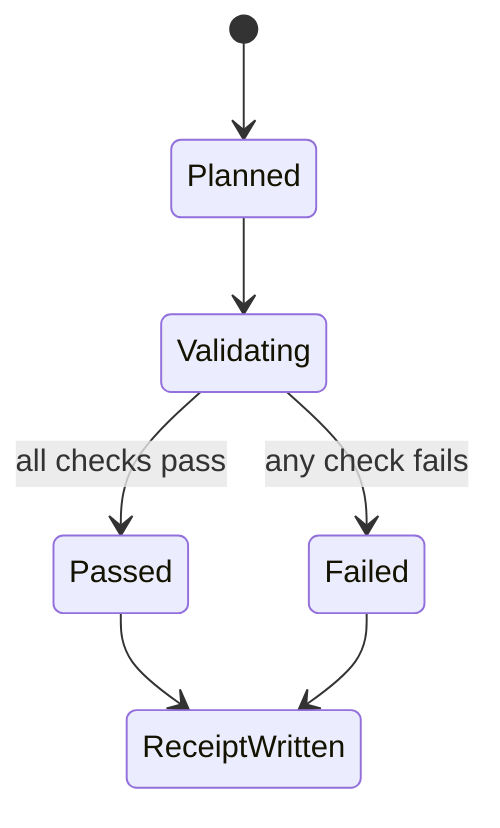
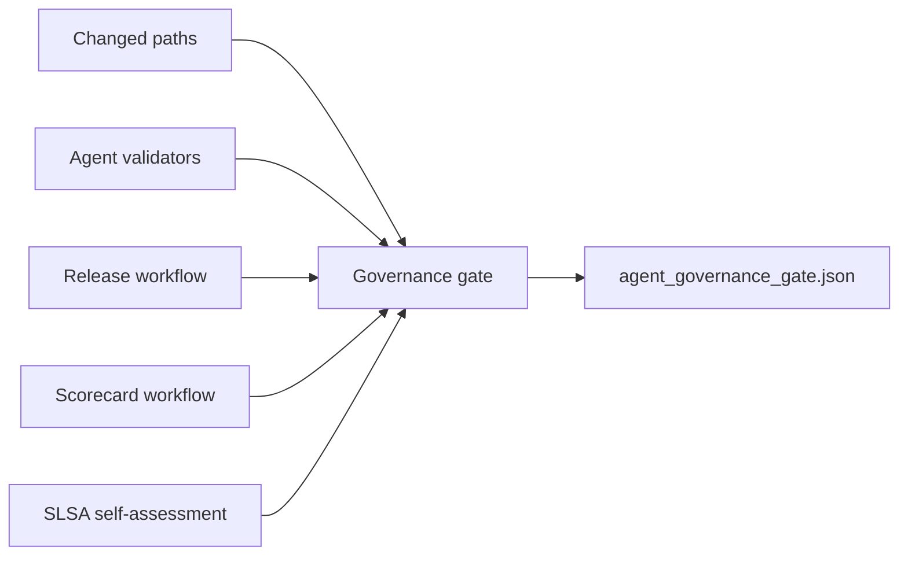

# Feature design: Agent governance SLSA gate

- Status: APPROVED
- Owner: Codex
- Issue: Codex thread request, 2026-07-11
- Target release: next patch after 0.68.24
Last verified: 2026-07-11

## Executive summary

dpone already documents agent governance, red-team scenarios, release
attestations, and Scorecard posture. The missing operational layer is a single
machine-readable receipt that proves those controls were checked on the current
commit. This design adds an executable agent governance gate and a scoped SLSA
release self-assessment so reviewers can audit agent-control and release-policy
changes without reconstructing evidence by hand.

## Personas and customer journey

| Persona | Goal | Current pain | Success signal |
|---|---|---|---|
| Maintainer | Review agent or workflow changes safely. | Must inspect several docs and workflows manually. | CI uploads `agent_governance_gate.json`. |
| Release auditor | Prove package provenance before publishing. | Attestation receipts and policy posture are separate. | Release evidence links SLSA posture, receipts, and Scorecard. |
| Agent integrator | Work beside parallel branches without drift. | Easy to use stale branch context or miss policy changes. | Gate records changed paths, head commit, and relevant risk IDs. |

Journey:

1. The contributor changes agent policy, workflows, release evidence, or
   supply-chain docs.
2. CI runs `tools/agent_policy/governance_gate.py`.
3. The gate validates agent inventory, red-team catalog, release attestation
   workflow controls, Scorecard workflow controls, and SLSA self-assessment.
4. CI uploads `test_artifacts/agent-policy/agent_governance_gate.json`.
5. Reviewers use the receipt with normal tests, docs checks, and release
   artifacts.

## Scope

### In scope

- Repo-local executable gate under `tools/agent_policy/`.
- JSON receipt schema under `evals/agent/`.
- SLSA release self-assessment documentation.
- CI artifact upload for the governance receipt.
- Focused tests for gate behavior and workflow integration.

### Non-goals

- No new public `dpone` CLI command.
- No claim of a specific SLSA level for all artifacts.
- No replacement for branch protection, CodeQL, dependency review, or human
  workflow-security review.
- No live warehouse, Airflow, or connector certification changes.

### Assumptions and constraints

- Release artifacts are produced by `.github/workflows/release.yml`.
- Agent policy files are repository-local and can be validated without secrets.
- GitHub Artifact Attestation receipts remain release-workflow evidence.
- Parallel branches may be active, so implementation happens in an isolated
  worktree from `origin/master`.

## Public contract

### CLI

The gate is a repository maintenance script, not a package CLI:

```bash
uv run python tools/agent_policy/governance_gate.py \
  --base-ref origin/master \
  --output test_artifacts/agent-policy/agent_governance_gate.json
```

Exit code `0` means the report status is `PASS`; exit code `1` means `FAIL`.

### Python API

No public Python package API is added. Tests may import the script through
`importlib.util.spec_from_file_location`, matching existing agent policy tests.

### Manifest/schema

`evals/agent/governance-gate.schema.json` defines the JSON receipt shape:
schema version, timestamp, status, base ref, head commit, changed paths,
control-surface flag, checks, standards, and risk IDs.

### Artifacts and evidence

The primary artifact is:

```text
test_artifacts/agent-policy/agent_governance_gate.json
```

### Compatibility and migration

Existing agent policy validation keeps working. The change only adds a stronger
gate and documentation. No user manifests, runtime APIs, package metadata, or
connector behavior change.

## Detailed algorithm

1. Read changed paths from positional arguments or `select_checks.changed_paths`.
2. Normalize changed paths and detect whether any agent-control surface changed.
3. Run `validate_setup.validate(root)`.
4. Run `red_team.validate_file(evals/agent/red_team_scenarios.yml)`.
5. If an agent-control surface changed, require the red-team catalog check to
   pass; otherwise mark that check `N/A`.
6. Inspect `.github/workflows/release.yml` for release-artifact attestation
   generation, `gh attestation verify`, source-ref/source-digest constraints,
   and receipt upload paths.
7. Inspect `.github/workflows/scorecard.yml` for Scorecard SARIF publication.
8. Inspect `docs/supply-chain-slsa.md` for SLSA v1.2 Build Track scope,
   GitHub Artifact Attestation evidence, receipt paths, and explicit non-claims.
9. Emit a deterministic JSON report and fail if any check failed.

### Pseudocode

```text
paths = explicit_paths or changed_paths(base_ref)
checks = [
  validate_agent_setup(root),
  validate_red_team_catalog(root),
  require_red_team_if_control_surface_changed(paths),
  verify_release_attestation_workflow(root),
  verify_scorecard_workflow(root),
  verify_slsa_self_assessment(root),
]
status = FAIL if any check failed else PASS
write receipt when --output is provided
return 0 for PASS else 1
```

### State machine



### Edge cases

- Empty changed path set: gate still validates global controls and marks the
  changed-control-surface check `N/A`.
- Missing SLSA doc, release workflow, or Scorecard workflow: gate fails.
- Invalid red-team catalog: gate fails.
- Git base ref unavailable: `select_checks.changed_paths` fallback behavior is
  reused; global controls still run.
- Missing output path parent: the writer creates parent directories.

## Architecture

### Components and responsibilities

| Component | Existing/new | Responsibility | Dependencies |
|---|---|---|---|
| `tools/agent_policy/governance_gate.py` | New | Build JSON governance receipt and enforce control checks. | `validate_setup.py`, `red_team.py`, `select_checks.py`. |
| `evals/agent/governance-gate.schema.json` | New | Document receipt contract. | JSON Schema draft 2020-12. |
| `.github/workflows/ci.yml` | Existing | Run gate and upload receipt. | GitHub Actions. |
| `docs/supply-chain-slsa.md` | New | Explain SLSA posture and non-claims. | Release workflow and supply-chain docs. |

### Ports, adapters, and composition root

The composition root is the script `main()`. Existing validators stay separate
and are loaded as sibling modules so the tool remains runnable without packaging
changes.

### Data and control flow



### Alternatives and tradeoffs

| Alternative | Advantages | Disadvantages | Decision |
|---|---|---|---|
| Docs-only SLSA page | Simple. | Does not create evidence. | Rejected. |
| Full public `dpone ops` command | Consistent CLI UX. | Bigger public contract for a repo-maintenance gate. | Rejected for this PR. |
| Repo-local script plus CI artifact | Small, testable, easy to review. | Not a user-facing command. | Adopted. |

### ADR requirement

No ADR is required. This is governance tooling and documentation, not a new
runtime architecture decision.

### Quality-budget impact

One focused script under the 400 SLOC budget and one focused test module. No new
runtime package imports or graph edges.

## Market comparison

The named ETL comparators are not directly relevant to a repository-local agent
and release-governance gate. Standards are the relevant comparator set.

| System/version | Relevant capability | Observed design | Strength | Limitation | Adopt/reject | Source/date |
|---|---|---|---|---|---|---|
| dlt | N/A | ETL framework, not a repo-local agent governance gate. | N/A | N/A | N/A | Checked 2026-07-11 |
| Informatica | N/A | Managed data platform, not this repository-control layer. | N/A | N/A | N/A | Checked 2026-07-11 |
| Airbyte | N/A | Connector platform, not this repository-control layer. | N/A | N/A | N/A | Checked 2026-07-11 |
| Fivetran | N/A | Managed ELT service, not this repository-control layer. | N/A | N/A | N/A | Checked 2026-07-11 |
| Pentaho | N/A | ETL suite, not this repository-control layer. | N/A | N/A | N/A | Checked 2026-07-11 |
| Microsoft SSIS | N/A | ETL runtime, not this repository-control layer. | N/A | N/A | N/A | Checked 2026-07-11 |
| gusty | N/A | Airflow DAG helper, not this repository-control layer. | N/A | N/A | N/A | Checked 2026-07-11 |
| Astronomer Cosmos | N/A | dbt/Airflow integration, not this repository-control layer. | N/A | N/A | N/A | Checked 2026-07-11 |
| Apache Beam | N/A | Data processing model, not this repository-control layer. | N/A | N/A | N/A | Checked 2026-07-11 |

Relevant standards:

- SLSA v1.2 Build Track: adopt scoped provenance and non-claim discipline.
- OpenSSF Scorecard: adopt automated posture signal and SARIF evidence.
- OWASP LLM Top 10 2025 and OWASP Agentic Applications 2026: adopt explicit
  prompt, tool-use, autonomy, and agentic supply-chain risk mapping.

## Measurable differentiation

```yaml
axis: executable agent/release governance evidence
scenario: a PR changes agent policy, release workflow, or supply-chain docs
baseline: existing docs and separate validators
metric: one JSON receipt exists and contains PASS/FAIL/N/A checks for required controls
target: governance gate exits 0 and writes agent_governance_gate.json on a clean commit
procedure: uv run python tools/agent_policy/governance_gate.py --base-ref origin/master --output test_artifacts/agent-policy/agent_governance_gate.json
artifact: test_artifacts/agent-policy/agent_governance_gate.json
limitations: does not replace human review, branch protection, or live certification
```

## Security, privacy, and operations

The gate reads repository files only. It does not access secrets, live systems,
PyPI, GitHub APIs, or warehouse credentials. It records file paths, commit SHA,
standards links, and risk IDs. It must never print or persist secret values.

## Test and certification plan

| Layer | Scenario | Environment | Expected artifact |
|---|---|---|---|
| Unit | Gate passes on current repository controls. | Local pytest. | Test result. |
| Negative | Missing SLSA doc or release workflow fails gate. | Local pytest with monkeypatch. | Test result. |
| Contract | JSON schema is parseable and required by setup validation. | Local pytest. | Test result. |
| CI | CI runs gate and uploads receipt. | GitHub Actions. | `agent-governance-gate` artifact. |
| Docs | MkDocs strict build includes SLSA page. | Local and CI docs build. | Built site. |

## Documentation plan

Add `docs/supply-chain-slsa.md`, update supply-chain, developer supply-chain,
developer CI/CD, release evidence, agent governance, agent security mapping,
agent risk register, and MkDocs navigation.

## Rollout and rollback

Rollout is immediate through CI. Rollback removes the CI step and the new script,
but should keep the SLSA self-assessment if release attestation controls remain.

## Agent execution plan

| Agent/role | Owned paths | Read-only paths | Forbidden paths | Dependency |
|---|---|---|---|---|
| Integrator | `tools/agent_policy/**`, `tests/test_agent_*`, `.github/workflows/ci.yml`, `docs/**`, `mkdocs.yml`, `CHANGELOG.md` | Release workflow, Scorecard workflow, existing policy docs | `pyproject.toml`, `uv.lock`, runtime source outside `tools/agent_policy` | Fresh worktree from `origin/master` |

## Approval checklist

- [x] User problem and CJM are clear.
- [x] Algorithm and failure semantics are implementable without guessing.
- [x] Public contracts and compatibility are explicit.
- [x] Architecture and alternatives are justified.
- [x] Relevant standards research uses current official sources.
- [x] Claimed differentiation is measurable.
- [x] Tests, evidence, docs, rollout, and rollback are complete.
- [x] Path ownership and integration plan are conflict-safe.
- [x] Maintainer instructed implementation to continue in an isolated worktree.
