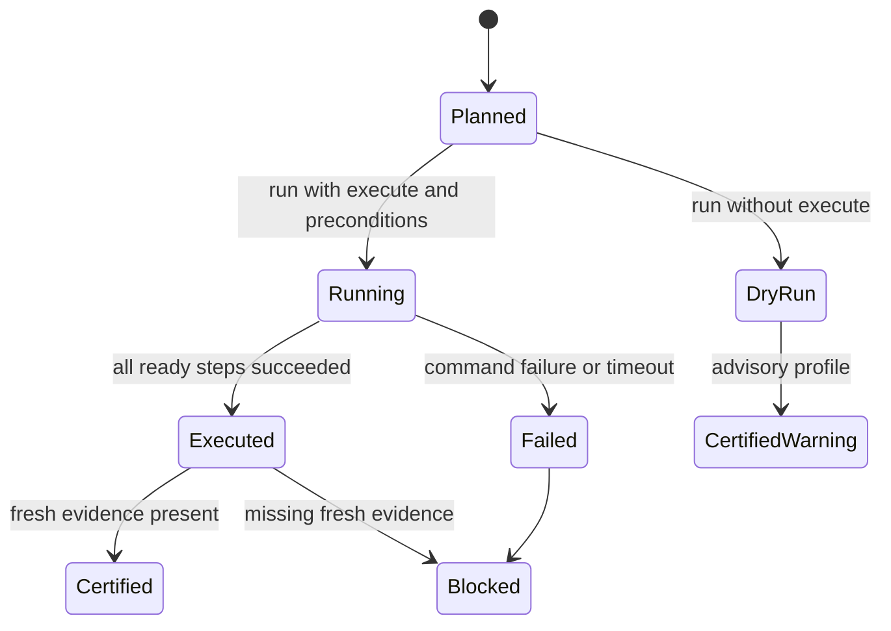

# Feature design: Data Product Remediation Execution Receipts

- Status: APPROVED
- Owner: data-platform
- Issue: N/A
- Target release: v0.72.0, or next free minor if v0.72.0 is occupied
- Last verified: 2026-07-13
- Approval: user approved implementation in Codex thread on 2026-07-13

## Executive summary

`v0.71.0` turns blocked Trust Center and data-product gates into deterministic
remediation plans and human runbooks. The remaining production gap is proving
what happened after an operator starts remediation: which approved actions were
eligible to run, what command was planned, whether execution was dry-run or
explicit `--execute`, which lock and idempotency key protected the run, what
fresh evidence was produced, and whether closeout can trust the repair.

This feature adds a controlled, provider-neutral execution receipt layer:

```text
remediation plan + remediation gate + authority/lock/idempotency
-> execution plan
-> dry-run or explicit execution receipt
-> execution certificate
-> report/registry/bundle/governance evidence
```

V1 remains local and deterministic. Generic readiness code never imports target
clients, Airflow, SCM, catalog, notification, or ticketing SDKs. Commands are
not run through a shell. Execution is blocked unless a plan action resolves to an
allowlisted `dpone` command, authority evidence is present when required, and
`--execute` is explicit. Unresolved command templates remain manual handoff
steps and cannot be falsely certified as executed.

## Personas and customer journey

| Persona | Goal | Current pain | Success signal |
|---|---|---|---|
| Platform SRE | Execute safe repair steps with proof. | v0.71 runbooks say what to do, but proof of what actually ran is manual. | Gets a command-level execution receipt with idempotency, lock, status, stdout/stderr digests, and expected evidence. |
| Data product owner | Know whether blocked release repair finished. | Closeout can see fresh evidence, but not the repair execution path. | Gets a certificate that links plan actions to fresh artifacts and closeout. |
| Governance reviewer | Verify separation between recommendation and mutation. | A runbook can be followed outside dpone without consistent receipts. | Sees authority gate, lock, command allowlist, dry-run/execute status, and immutable evidence ids. |
| CI/CD maintainer | Require repair proof before retrying release closeout. | Bundle gates can require remediation gate/closeout but not execution receipts. | Bundle policy can require `data_product_remediation_execution_certificate`. |

Journey:

1. A data product release is blocked and v0.71 emits a remediation plan.
2. The operator renders a runbook and attaches an authority gate when any action
   is high risk.
3. `dpone data product remediation execution plan` converts actionable plan
   actions into executable or manual steps.
4. `execution run` without `--execute` emits a dry-run receipt and performs no
   command execution.
5. `execution run --execute` requires an idempotency key and lock evidence, then
   executes only allowlisted resolved `dpone` commands through `shell=False`.
6. `execution certify` verifies every required action has a safe receipt and
   expected fresh evidence or remains explicitly manual with a blocker.
7. Registry, bundle gate, compliance, and governance export consume the
   certificate before release closeout proceeds.

## Scope

### In scope

- Manifest config under `sink.options.data_product.remediation.execution`.
- CLI group `dpone data product remediation execution`.
- Execution plan, run, certificate, and report artifacts.
- Deterministic action-to-step normalization from v0.71 remediation actions.
- Parameter substitution for approved command templates using explicit local
  JSON/YAML parameter artifacts.
- Command allowlist, unresolved placeholder detection, idempotency key, lock
  receipt, authority-gate validation, dry-run and explicit execution modes.
- Local subprocess command adapter in the service layer only; readiness modules
  stay pure and provider-neutral.
- Bundle artifact kinds and evidence registry stages for execution proof.
- Documentation, JSON schemas, CLI reference, changelog, and release metadata.

### Non-goals

- No DB/catalog/SCM/ticketing/notification API calls.
- No scheduler mutation, traffic shifting, or background daemon.
- No arbitrary shell, pipelines, glob expansion, environment mutation, or
  command generation by AI.
- No target-specific rollback implementation in this layer. Existing target
  commands such as `schema migration remediation apply` remain their own
  controlled execution paths.
- No claim that a remediation succeeded unless a certificate links execution
  receipts to fresh expected evidence.

### Assumptions and constraints

- Base branch is `codex/data-product-remediation-v071` until PR #307 is merged;
  after merge, the branch can be rebased onto `origin/master`.
- Feature is additive and opt-in.
- v0.71 artifacts are public inputs and remain backward compatible.
- New production modules stay below `max_sloc: 400`; global architecture fitness
  must remain `avg_clustering <= 0.180`.

## Public contract

### Manifest/schema

```yaml
sink:
  options:
    data_product:
      remediation:
        enabled: true
        execution:
          enabled: true
          mode: gate                  # observe | gate
          profile: prod_strict        # advisory | stage | prod_strict | regulated
          require_remediation_gate: true
          require_authority_gate: true
          require_lock: true
          require_idempotency_key: true
          unresolved_command_policy: block # warn | block
          dry_run_status: warning     # allowed | warning | blocked
          command_timeout_seconds: 300
          allowed_command_prefixes:
            - ["dpone", "data", "product", "assertions"]
            - ["dpone", "data", "product", "slo"]
            - ["dpone", "data", "product", "trust"]
            - ["dpone", "data", "product", "cost"]
            - ["dpone", "schema", "migration", "remediation"]
```

Default `execution.enabled` is `false`. Disabled config emits deterministic
no-op artifacts and does not change v0.71 behavior.

### CLI

```bash
dpone data product remediation execution plan \
  --manifest manifests/orders.yaml \
  --remediation-plan orders.remediation-plan.json \
  --remediation-gate orders.remediation-gate.json \
  --authority-gate orders.authority-gate.json \
  --parameters orders.remediation-params.json \
  --format json \
  --output orders.remediation-execution-plan.json

dpone data product remediation execution run \
  --plan orders.remediation-execution-plan.json \
  --idempotency-key orders-remediation-20260713-1 \
  --lock orders.remediation-lock.json \
  --format json \
  --output orders.remediation-execution-run.json

dpone data product remediation execution run \
  --plan orders.remediation-execution-plan.json \
  --idempotency-key orders-remediation-20260713-1 \
  --lock orders.remediation-lock.json \
  --execute \
  --format json \
  --output orders.remediation-execution-run.json

dpone data product remediation execution certify \
  --run orders.remediation-execution-run.json \
  --evidence-dir .dpone/data-products/orders/after-remediation \
  --profile prod_strict \
  --format json \
  --output orders.remediation-execution-certificate.json

dpone data product remediation execution report \
  --certificate orders.remediation-execution-certificate.json \
  --format md \
  --output orders.remediation-execution-report.md
```

Behavior:

- `run` without `--execute` never executes commands and emits status `dry_run`.
- `run --execute` uses `shell=False`, an allowlist, timeout, redacted stdout and
  stderr digests, and per-step receipts.
- Missing required evidence returns exit code `2`.
- `--output` writes the same payload as console output.

### Python API

```python
from dpone.services.data_product_remediation_execution import (
    DataProductRemediationExecutionFacade,
)

facade = DataProductRemediationExecutionFacade()
plan = facade.plan(
    manifest_path="manifests/orders.yaml",
    remediation_plan_path="orders.remediation-plan.json",
    remediation_gate_path="orders.remediation-gate.json",
    authority_gate_path="orders.authority-gate.json",
    parameters_path="orders.remediation-params.json",
)
```

### Artifacts and evidence

New artifacts:

- `dpone.data_product_remediation_execution_plan.v1`
- `dpone.data_product_remediation_execution_run.v1`
- `dpone.data_product_remediation_execution_certificate.v1`
- `dpone.data_product_remediation_execution_report.v1`

Bundle artifact kinds:

- `data_product_remediation_execution_run`
- `data_product_remediation_execution_certificate`
- `data_product_remediation_execution_report`

Registry stages:

- `data_product_remediation_execution_planned`
- `data_product_remediation_executed`
- `data_product_remediation_execution_certified`
- `data_product_remediation_execution_report_rendered`

## Detailed algorithm

### Execution plan

1. Load manifest, v0.71 remediation plan, optional remediation gate, authority
   gate, and parameter artifact.
2. If execution is disabled, emit status `disabled`.
3. Validate product, plan id, pack id, and bundle id consistency where present.
4. Require remediation gate status `allowed|warning` when configured.
5. For each remediation action:
   - read command templates from `action.commands`;
   - substitute `<name>` placeholders from explicit parameters only;
   - split the resolved command with `shlex.split`;
   - reject unresolved placeholders when policy is `block`;
   - reject command prefixes not in `allowed_command_prefixes`;
   - create a step with status `ready`, `manual_required`, or `blocked`.
6. Compute deterministic `remediation_execution_plan_id`.

### Execution run

1. Read execution plan.
2. Validate idempotency key and lock when configured.
3. Without `--execute`, emit `dry_run`, copy steps, and execute nothing.
4. With `--execute`, execute only `ready` steps through the injected command
   executor. Manual or blocked steps remain unexecuted and generate blockers in
   strict profiles.
5. Each step receipt records argv, status, exit code, duration, stdout/stderr
   SHA-256 digests, redacted snippets, and blocker/warning codes.
6. Stop after first failed critical step; later steps are marked `skipped`.
7. Compute deterministic `remediation_execution_run_id` from plan id,
   idempotency key, lock id, step receipts, and execution mode.

### Certification

1. Read execution run and fresh evidence directory.
2. For every planned step, require one of:
   - executed receipt with status `succeeded`;
   - dry-run receipt accepted only in `advisory`;
   - explicit manual status, which blocks `prod_strict|regulated`.
3. Verify expected evidence kinds from the source remediation action are present,
   have allowed status, and have fresh ids.
4. In `regulated`, require authority gate, lock evidence, and no manual
   unresolved commands.
5. Emit status `certified | warning | blocked`.

### Pseudocode

```text
options = execution_options(manifest)
if not options.enabled:
    return disabled_plan()

steps = []
for action in remediation_plan.actions:
    for template in action.commands:
        resolved = substitute(template, parameters)
        argv = shlex_split(resolved)
        status = validate(argv, options.allowlist, unresolved_policy)
        steps.append(step(action_id, argv, status, expected_evidence))

run:
    if not execute:
        return dry_run_receipt(steps)
    require(idempotency_key, lock)
    for step in ready_steps:
        receipt = executor.execute(step.argv, timeout)
        if receipt.failed:
            mark_remaining_skipped()
            break

certify:
    require successful receipts and fresh expected evidence
```

### State machine



## Architecture

| Component | Existing/new | Responsibility | Dependencies |
|---|---|---|---|
| `RemediationExecutionOptions` | New | Immutable manifest config for execution policy. | Manifest helpers. |
| `RemediationExecutionPlanner` | New | Convert v0.71 actions into command steps. | Options, safe command policy. |
| `SafeRemediationCommandPolicy` | New | Placeholder resolution, argv parsing, allowlist validation. | Standard library only. |
| `RemediationCommandExecutor` | New protocol | Narrow port for command execution. | Readiness protocol. |
| `LocalDponeCommandExecutor` | New service adapter | Run local `dpone` commands with `shell=False`. | `subprocess`, injected by facade. |
| `RemediationExecutionRunner` | New | Dry-run or execute steps and emit receipts. | Command executor port. |
| `RemediationExecutionCertifier` | New | Certify receipts and fresh evidence. | Evidence helper. |
| `RemediationExecutionRenderer` | New | JSON/text/md/table rendering. | No business rules. |
| `DataProductRemediationExecutionFacade` | New | File I/O and CLI composition root. | Readiness modules, local executor. |

Dependency direction stays `commands -> services -> readiness`; generic
readiness code has no subprocess or target SDK imports.

## Market comparison

| System/version | Relevant capability | Observed design | Strength | Limitation | Adopt/reject | Source/date |
|---|---|---|---|---|---|---|
| dlt docs | Schema contracts/evolution | dlt controls destination schema evolution with contract modes and evolution behavior. | Clear contract-as-code guardrails. | Not a cross-domain remediation execution receipt layer. | Adopt contract ergonomics; reject load-time-only repair proof. | [schema contracts](https://dlthub.com/docs/general-usage/schema-contracts), [schema evolution](https://dlthub.com/docs/general-usage/schema-evolution), checked 2026-07-13 |
| Airbyte docs | Schema review and rejected records | Airbyte exposes schema change review and rejected records for connection operations. | Good operator UX around failed records and schema review. | Platform connection state, not GitOps execution receipts. | Adopt review trail; reject platform-only execution proof. | [schema change management](https://docs.airbyte.com/platform/using-airbyte/schema-change-management), [rejected records](https://docs.airbyte.com/platform/move-data/rejected-records), checked 2026-07-13 |
| Fivetran docs | Platform logs/schema changes | Platform Connector exposes log events and schema changes. | Queryable audit trail. | Post-hoc log model, not pre-approved repair orchestration. | Adopt log-like receipts; reject passive-only evidence. | [Platform Connector](https://fivetran.com/docs/logs/fivetran-platform), [schema changes](https://fivetran.com/docs/logs/troubleshooting/track-schema-changes), checked 2026-07-13 |
| Informatica docs | Observability and issue remediation | Data quality/observability positions issue detection and resolution as managed capabilities. | Enterprise remediation framing. | Vendor platform semantics, not local deterministic artifacts. | Adopt remediation lifecycle framing; reject closed execution engine. | [Data Quality and Observability](https://www.informatica.com/products/data-quality.html), checked 2026-07-13 |
| Pentaho docs | Operations Mart/monitoring | Operations Mart aggregates logs into audit reports. | Mature execution reporting. | Report-oriented; repair execution remains external. | Adopt operations-mart evidence mindset; reject report-only closeout. | [Operations Mart](https://docs.pentaho.com/pdia-admin/10.2-admin/optimize-the-pentaho-system/monitoring-system-performance/pentaho-operations-mart), checked 2026-07-13 |
| Microsoft SSIS docs | Catalog executions | SSIS Catalog is the central point to execute, troubleshoot, configure environments, and manage operations. | Strong operational execution catalog. | SQL Server/package-specific; not connector-neutral data-product evidence. | Adopt execution catalog semantics; reject target-specific control plane. | [SSIS Catalog](https://learn.microsoft.com/en-us/sql/integration-services/catalog/ssis-catalog?view=sql-server-ver17), [catalog.executions](https://learn.microsoft.com/en-us/sql/integration-services/system-views/catalog-executions-ssisdb-database?view=sql-server-ver17), checked 2026-07-13 |
| gusty | Declarative Airflow DAG construction | gusty renders directories of YAML/Python/SQL/notebook tasks into DAGs. | Simple declarative task ergonomics. | N/A for remediation certification. | Adopt declarative command/task mapping; reject Airflow-only dependency. | [gusty docs](https://pipeline-tools.github.io/gusty-docs/), [GitHub](https://github.com/pipeline-tools/gusty), checked 2026-07-13 |
| Astronomer Cosmos | dbt tasks in Airflow | Cosmos makes dbt models/tests Airflow tasks. | Turns model/test units into orchestrated tasks. | Not a data-product remediation evidence layer. | Adopt first-class step mapping; reject scheduler-bound proof. | [Astronomer guide](https://www.astronomer.io/docs/learn/airflow-dbt), [Cosmos docs](https://astronomer.github.io/astronomer-cosmos/), checked 2026-07-13 |
| dbt | Run artifacts | `run_results.json` contains status and timing info for executed nodes. | Excellent execution evidence artifact. | Scoped to dbt nodes; no cross-domain authority/lock/bundle gate. | Adopt node-level status/timing artifact pattern. | [run results JSON](https://docs.getdbt.com/reference/artifacts/run-results-json), checked 2026-07-13 |
| Apache Hop | Execution information | Hop stores execution status, logs, metrics, and profile data. | Good drilldown for workflows/pipelines. | GUI/runtime oriented, not GitOps release certificates. | Adopt status/log/metric fields; reject GUI-centric proof. | [Execution Information Perspective](https://hop.apache.org/manual/latest/hop-gui/perspective-execution-information.html), checked 2026-07-13 |
| Sling | Replication modes | Sling YAML/JSON replications support modes including full-refresh and incremental. | Simple declarative replication execution. | N/A for repair authority/closeout evidence. | Adopt readable command examples; reject mode as sufficient repair proof. | [replications](https://docs.slingdata.io/concepts/replication), [modes](https://docs.slingdata.io/concepts/replication/modes), checked 2026-07-13 |
| Apache Beam | Retry/DLQ behavior | Beam BigQuery IO documents retry strategies and failed rows side output. | Clear error routing and retry semantics. | Pipeline-code scoped; not release-governance receipts. | Adopt retry/error classification vocabulary; reject pipeline-only implementation. | [BigQuery IO retry](https://beam.apache.org/releases/pydoc/2.61.0/apache_beam.io.gcp.bigquery.html), checked 2026-07-13 |

## Measurable differentiation

```yaml
axis: deterministic remediation execution proof
scenario: blocked data product with three remediation actions, one manual
  placeholder, one dry-run action, and one executable allowlisted dpone command
baseline: v0.71 remediation runbook without execution receipts
metric: number of command receipts and fresh evidence refs required to certify
target: one command produces execution plan, dry-run receipt, and certificate
  with stable ids; strict profile blocks unresolved manual action
procedure: run focused pytest fixture and CLI output parity checks
artifact:
  - test_artifacts/data_product_remediation_execution/execution-plan.json
  - test_artifacts/data_product_remediation_execution/execution-run.json
  - test_artifacts/data_product_remediation_execution/execution-certificate.json
limitations: does not prove target-specific rollback correctness; that remains
  in target remediation certificates and live tests.
```

## Security, privacy, and operations

- Secret values are never included in command receipts.
- Commands are run with `shell=False`; no shell metacharacter execution.
- Only explicitly allowlisted `dpone` command prefixes can execute.
- stdout/stderr are truncated and hashed; full logs are not persisted by default.
- `--execute` requires idempotency key and lock when configured.
- Replays with the same plan/idempotency/lock produce deterministic ids.
- Live target mutation is possible only through a nested dpone command that
  itself requires its own explicit `--execute` and approvals.

## Test and certification plan

| Layer | Scenario | Environment | Expected artifact |
|---|---|---|---|
| Unit | Disabled execution emits no-op plan/run/certificate. | local pytest | execution plan status `disabled` |
| Unit | Unresolved placeholders block strict execution plan. | local pytest | `data_product_remediation_execution.unresolved_placeholder:*` |
| Unit | Non-allowlisted command blocks. | local pytest | `data_product_remediation_execution.command_not_allowed:*` |
| Unit | Dry-run executes nothing and emits warning/blocked according to profile. | local pytest | run status `dry_run` |
| Unit | Execute requires idempotency and lock. | local pytest | blockers for missing preconditions |
| Unit | Fake executor success/failure yields deterministic receipts. | local pytest | run id stable |
| Unit | Certificate blocks manual unresolved step in prod strict. | local pytest | certificate status `blocked` |
| CLI | Help and output parity for all new commands. | local pytest | console equals `--output` |
| Integration | Bundle gate accepts execution certificate kind. | local pytest | bundle policy fixture |
| Integration | Registry records execution stages. | local pytest | registry audit fixture |
| Compatibility | Existing remediation commands unchanged. | local pytest | v0.71 tests continue passing |
| Live | No new live target test in V1. | N/A | target mutation delegated to existing target remediation tests |

## Documentation plan

- Extend `docs/data-product-remediation.md` with execution receipts.
- Add `docs/developer-data-product-remediation-execution.md`.
- Add JSON schemas under `docs/schemas/data-product/`.
- Update CLI reference, quality metrics, docs index, changelog, and release
  metadata.

## Rollout and rollback

Rollout is additive and opt-in. Disable with:

```yaml
sink:
  options:
    data_product:
      remediation:
        execution:
          enabled: false
```

Rollback removes optional execution artifacts from bundle requirements and
registry records. Existing v0.71 remediation plan/runbook/gate/closeout remains
valid.

## Agent execution plan

| Agent/role | Owned paths | Read-only paths | Forbidden paths | Dependency |
|---|---|---|---|---|
| Integrator | Shared CLI, docs, schemas, registry/bundle glue, version metadata | Whole repo | Main dirty checkout, PR #291 | All phases |
| Readiness implementer | `src/dpone/readiness/data_product_remediation_execution*.py`, focused tests | v0.71 remediation modules | shared release metadata | After spec |
| CLI/facade implementer | `src/dpone/services/data_product_remediation_execution.py`, `src/dpone/commands/data_product_remediation_execution_cmd.py`, CLI tests | command patterns | readiness business rules | After readiness |
| Docs/test reviewer | docs, schema fixtures, integration tests | implementation modules | production logic | After implementation |

## Approval checklist

- [x] User problem and CJM are clear.
- [x] Algorithm and failure semantics are implementable without guessing.
- [x] Public contracts and compatibility are explicit.
- [x] Architecture and alternatives are justified.
- [x] Relevant market research uses current official sources.
- [x] Claimed differentiation is measurable.
- [x] Tests, evidence, docs, rollout, and rollback are complete.
- [x] Path ownership and integration plan are conflict-safe.
- [x] Maintainer changed status to `APPROVED`.
