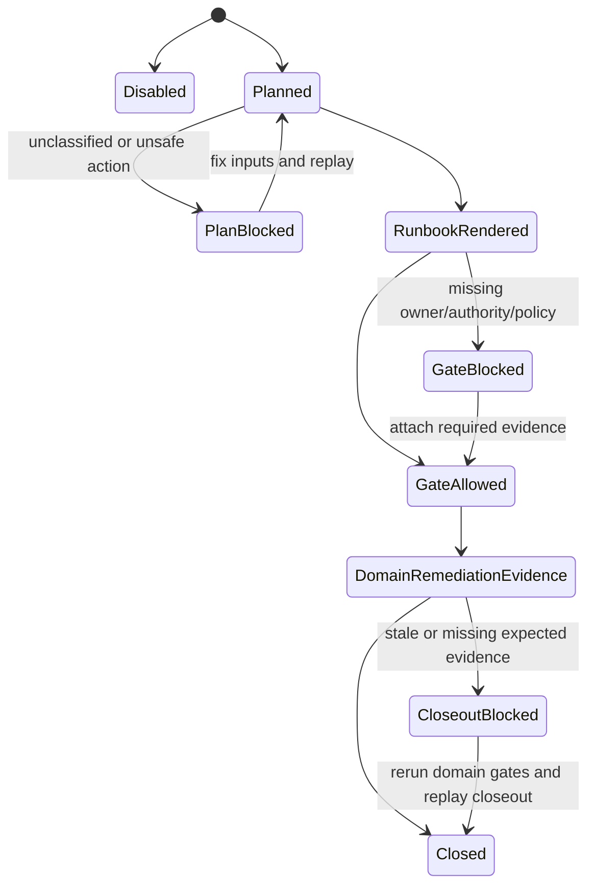
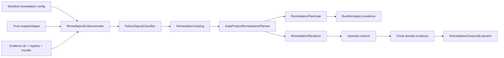

# Feature design: Data Product Remediation Runbooks and Auto-Repair Plans

> **Historical design record.** Commands below are preserved as implementation evidence and are not current runbooks. Use [Module-size debt ratchet](../../module-size-ratchet.md) for the supported exact-SHA command.

- Status: IMPLEMENTED
- Owner: data-platform
- Issue: N/A
- Target release: v0.71.0, or next free minor if v0.71.0 is occupied
- Last verified: 2026-07-13
- Approval: user approved implementation in Codex thread on 2026-07-13
- Implementation evidence: focused remediation pytest, full non-live pytest,
  ruff, format check, mypy, docs checks, architecture fitness, package builds,
  twine check, and Python 3.11 wheel smoke were run on the implementation
  branch.

## Executive summary

`dpone` already emits deterministic evidence for contracts, assertions, SLOs,
error budgets, incidents, policy, authority, compliance, audit retention, access,
connection security, cost, rollout, and Trust Center snapshots. The remaining
operator gap is the moment after a gate says `blocked`: teams still need to
translate scattered blockers into a safe remediation plan, owner-routed tasks,
prechecks, commands, expected closeout evidence, and a proof that the issue was
resolved without unsafe hidden mutation.

This feature adds an opt-in Data Product Remediation layer:

```text
trust snapshot/gate + failed domain gates + registry evidence
-> failure signal classification
-> deterministic remediation plan
-> operator runbook and safe handoff commands
-> remediation-plan quality gate
-> closeout proof after fresh evidence is supplied
```

V1 is offline and evidence-plane only. It does not execute SQL, mutate
warehouses, call SCM/catalog/ticketing systems, or send notifications. When a
target-specific repair already exists, such as `schema migration remediation`,
V1 references that command as a controlled handoff with required evidence rather
than reimplementing the target operation.

The measurable outcome is mean-time-to-safe-action for blocked data product
releases: for a fixture with eight blocked domains, `dpone` must produce a
complete owner-routed remediation plan with deterministic ids, ordered actions,
commands, preconditions, and expected evidence in one CLI command.

## Personas and customer journey

| Persona | Goal | Current pain | Success signal |
|---|---|---|---|
| Data product owner | Know what must be fixed before release closeout. | A blocked Trust Center report lists evidence problems but not a prioritized fix plan. | Gets an owner-routed Markdown runbook with exact next actions and expected artifacts. |
| Platform SRE | Recover safely without ad hoc scripts. | Must manually map SLO/assertion/access/cost failures to commands and approvals. | Gets prechecks, dry-run commands, handoff commands, rollback notes, and closeout evidence requirements. |
| Governance reviewer | Verify that a release exception or remediation was handled correctly. | Needs to reconstruct why a gate was blocked and who fixed it. | Registry records remediation plan, runbook, gate, and closeout artifacts. |
| CI/CD maintainer | Fail closed when blocked evidence has no remediation path. | Existing bundle gates can block but cannot require a coherent remediation campaign. | Bundle gate can require `data_product_remediation_gate` for prod or regulated closeout. |

Customer journey:

1. A release produces a blocked `data_product_trust_gate`.
2. The user runs `dpone data product remediation plan` with the manifest,
   Trust Center artifacts, registry, bundle, and evidence directory.
3. `dpone` classifies blockers by domain, severity, owner, and repair class.
4. The user renders `remediation runbook` for humans and optionally records the
   plan in the registry.
5. Operators execute the referenced domain commands manually or through existing
   controlled apply paths, for example `schema migration remediation apply`.
6. The user reruns the original gates and then runs `remediation closeout`.
7. Closeout verifies fresh evidence ids, no unresolved critical blockers, and
   expected artifacts before a bundle or release closeout consumes the result.

## Scope

### In scope

- Manifest config under `sink.options.data_product.remediation`.
- CLI group `dpone data product remediation`.
- Offline evidence indexing over manifest, Trust Center snapshot/gate, bundle,
  evidence directory, and registry records.
- Failure signal taxonomy for contract, quality, SLO, incident, governance,
  compliance, audit, access, connection security, cost, rollout, and trust.
- Deterministic remediation plans with ordered actions, owner routing,
  preconditions, command templates, expected evidence, risk class, and closeout
  criteria.
- Markdown/text/table/JSON renderers for operator runbooks and reports.
- Gate that validates the remediation plan is actionable; it does not claim the
  underlying release is safe.
- Closeout evaluator that proves the planned remediation was satisfied by fresh
  follow-up evidence.
- Bundle artifact kinds, registry stages, Trust Center integration, compliance
  and governance export refs.

### Non-goals

- No target mutation, scheduler mutation, SCM write, catalog write, Slack/Jira
  write, PagerDuty write, or webhook delivery in V1.
- No AI-generated free-form repair commands. V1 uses a versioned remediation
  catalog with deterministic templates.
- No replacement for existing `schema migration remediation`; this feature
  references it as a target-specific handoff.
- No legal or regulatory compliance claim. Framework labels remain evidence
  mapping labels, not legal advice.
- No long-running daemon or hosted Trust Center API.

### Assumptions and constraints

- Base implementation starts from clean `origin/master` after `v0.70.0` and the
  later `#306` master merge observed on 2026-07-13.
- Open PR #291 is unrelated Airflow self-service work and must not be touched.
- Feature is additive and opt-in; existing commands behave unchanged without new
  flags/artifacts.
- Generic readiness modules do not import ClickHouse, DB clients, Airflow, SCM,
  catalog, ticketing, notification, cloud billing, or object-store SDKs.
- Production modules stay below `max_sloc: 400`; global architecture fitness
  stays at `avg_clustering <= 0.180`.

## Public contract

### CLI

New commands:

```bash
dpone data product remediation plan \
  --manifest manifests/orders.yaml \
  --trust-snapshot .dpone/trust/orders.trust-snapshot.json \
  --trust-gate .dpone/trust/orders.trust-gate.json \
  --bundle .dpone/schema-migration/review/orders/bundle.json \
  --registry .dpone/schema-migration/registry.sqlite3 \
  --evidence-dir .dpone/data-products/orders \
  --format json \
  --output .dpone/data-products/orders.remediation-plan.json

dpone data product remediation runbook render \
  --plan .dpone/data-products/orders.remediation-plan.json \
  --format md \
  --output .dpone/data-products/orders.remediation-runbook.md

dpone data product remediation gate \
  --plan .dpone/data-products/orders.remediation-plan.json \
  --authority-gate .dpone/authority/orders.authority-gate.json \
  --profile prod_strict \
  --format json \
  --output .dpone/data-products/orders.remediation-gate.json

dpone data product remediation closeout \
  --plan .dpone/data-products/orders.remediation-plan.json \
  --evidence-dir .dpone/data-products/orders/after-remediation \
  --trust-gate .dpone/trust/orders.after-remediation.trust-gate.json \
  --format json \
  --output .dpone/data-products/orders.remediation-closeout.json

dpone data product remediation report \
  --closeout .dpone/data-products/orders.remediation-closeout.json \
  --format md
```

Common options:

- `--format json|md|text|table`, where `md` is supported by runbook/report and
  `json|text|table` by all commands.
- `--output PATH` writes exactly the console payload, atomically via temporary
  file plus rename.
- Invalid artifacts return exit code `2` with a machine-readable blocker code
  and no partial output file.
- Missing optional evidence is a warning in `observe`; missing required evidence
  is a blocker in `gate`.

### Python API

Public service facade:

```python
from dpone.services.data_product_remediation import DataProductRemediationFacade

facade = DataProductRemediationFacade()
plan = facade.plan(
    manifest_path="manifests/orders.yaml",
    trust_snapshot_path=".dpone/trust/orders.trust-snapshot.json",
    trust_gate_path=".dpone/trust/orders.trust-gate.json",
    bundle_path=".dpone/schema-migration/review/orders/bundle.json",
    registry_path=".dpone/schema-migration/registry.sqlite3",
    evidence_dir=".dpone/data-products/orders",
)
```

Provider-neutral readiness classes:

- `DataProductRemediationOptions`
- `RemediationEvidenceIndex`
- `FailureSignalClassifier`
- `RemediationCatalog`
- `DataProductRemediationPlanner`
- `RemediationPlanGate`
- `RemediationCloseoutEvaluator`
- `RemediationRenderer`

All application facades perform file I/O only; business rules live in readiness
modules.

### Manifest/schema

```yaml
sink:
  options:
    data_product:
      id: analytics.orders
      owner: data-platform
      tier: gold
      criticality: high

      remediation:
        enabled: true
        mode: gate                  # observe | gate
        profile: prod_strict        # advisory | stage | prod_strict | regulated
        stale_evidence_policy: block # warn | block
        unknown_failure: block       # allow | warn | block
        plan_only: true

        action_policy:
          require_owner: true
          require_authority_gate_for: [rollback, waiver, access_change, cost_exception]
          require_policy_gate_for: [waiver, regulated_closeout]
          max_open_critical_actions: 0
          allow_manual_action: warn   # allow | warn | block

        catalog:
          enabled_actions:
            - rerun_assertions
            - rerun_slo
            - extend_watch
            - schema_migration_remediation
            - request_policy_waiver
            - recertify_access
            - rerun_cost_gate
            - hold_rollout
            - refresh_trust_snapshot
```

Default `remediation.enabled` is `false`.

### Artifacts and evidence

New artifacts:

- `dpone.data_product_remediation_plan.v1`
- `dpone.data_product_remediation_runbook.v1`
- `dpone.data_product_remediation_gate.v1`
- `dpone.data_product_remediation_closeout.v1`
- `dpone.data_product_remediation_report.v1`

Bundle artifact kinds:

- `data_product_remediation_gate`
- `data_product_remediation_runbook`
- `data_product_remediation_closeout`

Evidence registry stages:

- `data_product_remediation_planned`
- `data_product_remediation_runbook_rendered`
- `data_product_remediation_gate_passed`
- `data_product_remediation_closed`

Trust Center integration:

- `data_product_remediation_gate` maps to a new optional `remediation` domain.
- Existing Trust Center required domains remain unchanged unless the manifest
  explicitly includes `remediation`.

Artifact status vocabulary:

- Plan: `disabled | planned | warning | blocked`
- Runbook: `rendered | warning | blocked`
- Gate: `allowed | warning | blocked`
- Closeout: `closed | warning | blocked`

### Compatibility and migration

Old behavior remains unchanged. Existing `schema migration remediation` commands,
schemas, and registry stages continue to work. The new data-product layer can
reference a schema remediation plan/certificate but does not alter its schema.

Rollback for the feature is removing the new optional remediation artifacts from
bundle policy and disabling `sink.options.data_product.remediation.enabled`.
Generated remediation artifacts are additive evidence and do not mutate target
state.

## Detailed algorithm

### 1. Input acquisition and validation

`plan` reads:

- manifest and `sink.options.data_product.remediation`;
- optional Trust Center snapshot and gate;
- optional bundle;
- optional registry records;
- evidence directory JSON/YAML artifacts;
- optional explicit domain gates in a future-compatible argument family.

Validation rules:

- disabled/missing config emits deterministic no-op plan;
- malformed artifact emits `data_product_remediation.artifact_invalid:<path>`;
- product id mismatch emits `data_product_remediation.product_id_mismatch`;
- bundle/pack mismatch emits `data_product_remediation.bundle_id_mismatch`;
- stale evidence follows `stale_evidence_policy`;
- a blocked Trust Center gate is input evidence, not an automatic plan blocker;
  the plan is blocked only if the failure cannot be classified or assigned.

### 2. Normalization and capability negotiation

`RemediationEvidenceIndex` normalizes every evidence item into:

```yaml
evidence_ref_id: sha256:...
product_id: analytics.orders
domain: quality
artifact_kind: data_product_assertion_gate
status: blocked
owner: data-platform
evidence_id: sha256:...
blockers: [...]
warnings: [...]
updated_at: 2026-07-13T00:00:00Z
```

Capability negotiation is catalog-driven. Each failure signal maps to one or
more action templates. Unsupported actions are rendered as manual blockers in
`prod_strict|regulated`, warnings in `advisory|stage` unless policy says block.

### 3. Planning and deterministic identity

`FailureSignalClassifier` creates one `failure_signal` per distinct domain,
artifact, code, owner, and evidence id. Signals are deduplicated by:

```text
product_id + domain + artifact_kind + blocker_or_warning_code + evidence_id
```

`RemediationCatalog` selects actions:

| Failure pattern | Primary action | Handoff |
|---|---|---|
| missing/blocked assertion gate | `rerun_assertions` | `dpone data product assertions evaluate|gate` |
| SLO gate blocked | `rerun_slo` or `open_incident_lifecycle` | `dpone data product slo ...` |
| watch requires rollback | `schema_migration_remediation` | existing schema remediation commands |
| policy rule failed | `request_policy_waiver` or `fix_required_artifact` | policy waiver commands |
| authority missing | `verify_authority` | authority check/quorum/signature commands |
| compliance failed | `refresh_compliance_controls` | compliance controls commands |
| access/privacy blocked | `recertify_access` or `update_entitlement` | access governance commands |
| connection posture blocked | `rotate_or_fix_connection_ref` | connection security commands |
| cost gate blocked | `budget_waiver_or_capacity_reduce` | cost gate/forecast commands |
| rollout ring held | `hold_rollout_or_rerun_shadow` | rollout commands |
| trust domain missing | `refresh_trust_snapshot` | trust lake/snapshot/gate commands |

Action ids are stable fingerprints of normalized signal, template id,
preconditions, owner, and expected evidence. Plan id is a stable fingerprint of
product identity, source evidence ids, action ids, blockers, warnings, and mode.

### 4. Execution and transaction boundaries

V1 has no execution transaction. It renders commands and preconditions only.
Where a future action needs mutation, it must delegate to an existing command
with its own transaction and evidence semantics. The remediation plan records
that dependency but does not bypass it.

`runbook render`, `gate`, and `closeout` are pure file-read/file-write commands.
Output file writes are atomic. A process crash before rename leaves no committed
output; a crash after rename leaves a complete artifact.

### 5. State/checkpoint and evidence ordering

Registry recording order:

```text
data_product_remediation_planned
-> data_product_remediation_runbook_rendered
-> data_product_remediation_gate_passed
-> domain-specific remediation evidence
-> data_product_remediation_closed
```

Closeout requires fresh follow-up evidence created after the plan timestamp when
timestamps are available. If timestamps are unavailable, it requires different
evidence ids from the source failures.

### 6. Retries, resume, replay, cancellation, rollback

- Retry/replay is safe because planning is deterministic and side-effect free.
- Re-running `plan` with unchanged inputs yields the same plan id.
- Re-running `runbook render` with unchanged plan yields the same runbook id.
- `closeout` is idempotent over the same plan and follow-up evidence.
- Cancellation before output rename has no durable side effect.
- Rollback means discarding generated remediation artifacts; domain rollback
  remains in target-specific commands.

### 7. Concurrency, ordering, partitioning, and resource limits

- Evidence files are sorted by absolute path before loading.
- Registry records are sorted by recorded timestamp and record id when available.
- Actions are ordered by severity, owner, domain priority, and action id.
- Default max evidence files: 10,000; excess yields
  `data_product_remediation.evidence_limit_exceeded`.
- Default max actions per plan: 500; excess yields
  `data_product_remediation.action_limit_exceeded`.

### 8. Failure classification and user recovery

Representative blocker codes:

- `data_product_remediation.product_id_missing`
- `data_product_remediation.product_id_mismatch`
- `data_product_remediation.unknown_failure:<code>`
- `data_product_remediation.owner_required:<action_id>`
- `data_product_remediation.authority_gate_required:<action_id>`
- `data_product_remediation.manual_action_blocked:<signal_id>`
- `data_product_remediation.closeout_expected_evidence_missing:<action_id>`
- `data_product_remediation.closeout_stale_evidence:<evidence_ref_id>`

Every blocker includes a recommendation in the plan or report.

### 9. Output and artifacts

The plan embeds:

- product identity;
- source evidence refs;
- failure signals;
- ordered actions;
- prechecks;
- handoff commands;
- expected evidence;
- closeout criteria;
- blockers, warnings, recommendations.

The runbook renders the same data for humans, with commands grouped by owner and
severity.

### Pseudocode

```text
function plan(manifest, trust_snapshot, trust_gate, bundle, registry, evidence_dir):
    options = DataProductRemediationOptions.from_manifest(manifest)
    if !options.enabled:
        return disabled_plan(product_id)

    index = RemediationEvidenceIndex.build(
        manifest, trust_snapshot, trust_gate, bundle, registry, evidence_dir
    )
    validate_product_and_bundle_refs(index)
    signals = FailureSignalClassifier.classify(index.blocked_or_warning_refs)
    actions = []
    for signal in signals:
        templates = RemediationCatalog.match(signal, options.enabled_actions)
        if templates.empty:
            record_unknown_failure(signal)
        for template in templates:
            actions.append(template.instantiate(signal, options))

    blockers = validate_action_policy(actions, options)
    status = profile_status(blockers, warnings, default="planned")
    return stable_id(plan_payload(status, index.refs, signals, actions))

function closeout(plan, follow_up_evidence, trust_gate):
    expected = plan.expected_evidence
    observed = RemediationEvidenceIndex.build(follow_up_evidence, trust_gate)
    for action in plan.actions:
        require_matching_fresh_evidence(action, observed)
    require_no_unresolved_critical_signals(plan, observed)
    return stable_id(closeout_payload(status, observed))
```

### State machine



### Edge cases

- Empty evidence directory: plan blocks in `gate` when Trust Center gate is
  blocked or required domains are missing; advisory emits warnings.
- Missing Trust Center: plan can still use direct evidence artifacts, but warns
  `data_product_remediation.trust_center_missing`.
- Duplicate blocker codes from multiple artifacts: actions are deduped only when
  domain, owner, artifact kind, code, and evidence id match.
- Stale evidence: `block` in `prod_strict|regulated`; warning otherwise.
- Unknown artifact kind: ignored when no blockers are present; warning/blocker
  when it contains unresolved blockers and `unknown_failure` demands it.
- Unsupported target repair: rendered as a manual action; blocked in strict
  profiles unless `allow_manual_action` permits it.
- Waived gate: accepted only when policy/waiver evidence is fresh and not
  expired; otherwise closeout blocks.
- Process crash: no mutation; output atomicity determines whether artifact
  exists.

## Architecture

### Components and responsibilities

| Component | Existing/new | Responsibility | Dependencies |
|---|---|---|---|
| `DataProductRemediationOptions` | New | Immutable manifest config for mode, profile, stale policy, action policy, and catalog settings. | Standard library only. |
| `RemediationEvidenceIndex` | New | Normalize Trust Center, bundle, registry, and evidence-dir artifacts into evidence refs. | Reuses trust support helpers where dependency direction allows. |
| `FailureSignalClassifier` | New | Convert blockers/warnings into typed failure signals. | No file I/O. |
| `RemediationCatalog` | New | Deterministic mapping from failure signals to action templates. | No target SDKs. |
| `DataProductRemediationPlanner` | New | Build stable remediation plans from options, evidence, signals, and catalog actions. | Classifier/catalog/options. |
| `RemediationPlanGate` | New | Validate that the plan is actionable for the requested profile. | Planner output and optional authority/policy refs. |
| `RemediationCloseoutEvaluator` | New | Verify expected follow-up evidence and unresolved critical signals. | Evidence index. |
| `RemediationRenderer` | New | JSON/text/md/table runbooks and reports. | Readiness models only. |
| `DataProductRemediationFacade` | New | Thin file-I/O facade for CLI. | Lazy imports of readiness modules. |
| Bundle/registry glue | Existing + small helpers | Register artifact kinds and stages. | Shared-file owner/integrator. |

### Ports, adapters, and composition root

V1 needs no live target adapter. The only port-like boundary is the remediation
catalog template interface:

```python
class RemediationActionTemplate(Protocol):
    def matches(self, signal: FailureSignal) -> bool: ...
    def instantiate(self, signal: FailureSignal, options: DataProductRemediationOptions) -> RemediationAction: ...
```

The composition root is the CLI command module, which creates
`DataProductRemediationFacade`. The facade loads files and delegates to pure
readiness services.

### Data and control flow



### Alternatives and tradeoffs

| Alternative | Advantages | Disadvantages | Decision |
|---|---|---|---|
| Extend `schema migration remediation` into data-product remediation | Reuses existing name and target rollback concepts. | Would mix target mutation with cross-domain evidence orchestration and risk a god module. | Reject. Keep schema remediation as a handoff target. |
| Add free-form Markdown recommendations to Trust Center report | Small implementation. | Not testable enough; no stable action ids, closeout proof, or bundle/registry integration. | Reject. Trust Center remains a snapshot/gate. |
| Build external ticket/Slack routing in V1 | Better operational integration. | Requires credentials, network writes, idempotency, and vendor semantics. | Reject for V1. Render artifacts only. |
| Catalog-driven deterministic remediation plans | Testable, provider-neutral, safe, compatible with existing gates. | Requires more schema/docs/test work. | Adopt. |

### ADR requirement

No ADR is required for V1 because this is an additive feature behind an opt-in
manifest key and uses established readiness/service/CLI patterns. An ADR is
required before adding live execution or external ticketing adapters because that
would introduce new mutation and idempotency semantics.

### Quality-budget impact

Expected new production modules:

- `src/dpone/readiness/data_product_remediation.py`
- `src/dpone/readiness/data_product_remediation_catalog.py`
- `src/dpone/readiness/data_product_remediation_rendering.py`
- `src/dpone/services/data_product_remediation.py`
- `src/dpone/commands/data_product_remediation_cmd.py`

Each module must stay under 400 SLOC and keep CLI/service layers thin. Shared
bundle/registry additions should be small constants/helper updates; if a shared
module approaches a budget, introduce a focused glue module rather than growing
central policy modules.

## Market comparison

Sources were checked on 2026-07-13 and are official primary sources unless noted
as N/A. The comparison is capability-specific: evidence-driven remediation
planning and closeout for data product releases.

| System/version | Relevant capability | Observed design | Strength | Limitation | Adopt/reject | Source/date |
|---|---|---|---|---|---|---|
| dlt docs | Schema contracts and schema evolution | dlt controls schema evolution with contract modes such as evolve/freeze/discard-style behavior at load time. | Clear contract-as-code ergonomics for accepted schema changes. | Not a cross-domain remediation runbook or closeout evidence plane. | Adopt contract ergonomics; reject load-time-only remediation scope. | [dlt schema contracts](https://dlthub.com/docs/general-usage/schema-contracts), [schema evolution](https://dlthub.com/docs/general-usage/schema-evolution), checked 2026-07-13 |
| Airbyte Cloud/Self-Managed docs | Timeline, schema change review, rejected records | Airbyte surfaces connection events, logs, schema changes, and rejected records in connection-level UX. | Strong operator trail for a single connection. | Platform state is not a deterministic GitOps remediation artifact across product gates. | Adopt timeline/log UX and rejected-record evidence; reject platform-only closeout. | [connection timeline](https://docs.airbyte.com/platform/cloud/managing-airbyte-cloud/review-connection-timeline), [schema changes](https://docs.airbyte.com/platform/using-airbyte/schema-change-management), [rejected records](https://docs.airbyte.com/platform/move-data/rejected-records), checked 2026-07-13 |
| Fivetran docs | Platform connector logs and schema changelog | Fivetran exposes logs/account metadata and schema/table events in destination metadata schemas. | Queryable audit trail and schema event history. | Mostly post-hoc observability; not a pre-release remediation planner. | Adopt queryable evidence and schema-change event model; reject passive log-only remediation. | [Platform Connector](https://fivetran.com/docs/logs/fivetran-platform), [track schema changes](https://fivetran.com/docs/logs/troubleshooting/track-schema-changes), checked 2026-07-13 |
| Informatica docs | Data observability and issue remediation | Informatica positions observability around detecting anomalies, solving issues, and monitoring consumption/protection/compliance. | Enterprise remediation and governance framing. | Closed platform semantics; not local deterministic artifacts. | Adopt issue-to-remediation mindset; reject opaque platform dependency. | [Data Observability](https://www.informatica.com/products/data-quality/data-observability.html), [Data Quality and Observability](https://www.informatica.com/products/data-quality.html), checked 2026-07-13 |
| Pentaho docs | Operations Mart and monitoring/logging | Operations Mart aggregates log files into audit/performance reports; monitoring docs describe logging and event monitoring. | Mature operational reporting discipline. | Passive reporting; remediation remains operator-driven. | Adopt operational report inputs; reject report-only runbooks. | [Operations Mart](https://support.pentaho.com/hc/en-us/articles/360000244806-Guidelines-Pentaho-Operations-Mart), [performance monitoring](https://docs.pentaho.com/pdia-admin/optimize-the-pentaho-system/monitoring-system-performance), checked 2026-07-13 |
| Microsoft SSIS docs | Catalog execution, troubleshooting, checkpoints | SSIS Catalog centralizes package execution/troubleshooting; docs recommend logging, transactions, and restarting from checkpoints. | Strong execution history and restart discipline. | Package-specific and SQL Server-centered; not data-product governance closeout. | Adopt checkpoint/restart evidence concept; reject package-catalog lock-in. | [SSIS Catalog](https://learn.microsoft.com/en-us/sql/integration-services/catalog/ssis-catalog?view=sql-server-ver17), [troubleshooting package execution](https://github.com/MicrosoftDocs/sql-docs/blob/live/docs/integration-services/troubleshooting/troubleshooting-tools-for-package-execution.md), checked 2026-07-13 |
| gusty docs/GitHub | Declarative Airflow DAG construction | gusty builds Airflow DAGs from YAML/Python/SQL/notebook task files. | Lightweight task-file ergonomics. | N/A for remediation evidence; it orchestrates DAG construction, not release repair governance. | Adopt declarative runbook/task style; mark execution/remediation closeout N/A. | [gusty docs](https://pipeline-tools.github.io/gusty-docs/), [gusty GitHub](https://github.com/pipeline-tools/gusty), checked 2026-07-13 |
| Astronomer Cosmos docs | dbt as Airflow tasks | Cosmos converts dbt projects into Airflow DAGs/task groups and can run tests after models. | Makes dbt nodes/tests first-class orchestration units. | Orchestration integration, not cross-domain remediation planning. | Adopt first-class task/evidence mapping; reject Airflow-only execution dependency. | [Cosmos docs](https://astronomer.github.io/astronomer-cosmos/), [Astronomer dbt with Airflow](https://www.astronomer.io/docs/learn/airflow-dbt), checked 2026-07-13 |
| dbt docs | Run artifacts and exposures | `run_results.json` records timing/status for executed nodes; exposures describe downstream uses. | Artifact-first status and downstream owner metadata. | dbt artifacts cover dbt invocations, not dpone-wide gates/access/compliance. | Adopt run-results and exposure ownership patterns; reject dbt-only evidence scope. | [run-results JSON](https://docs.getdbt.com/reference/artifacts/run-results-json), [exposures](https://docs.getdbt.com/docs/build/exposures), checked 2026-07-13 |
| Apache Hop docs | Execution information and logging | Hop can send execution information to locations and provides an execution information perspective with status, logging, metrics, and profiled data. | Good execution drilldown and metadata perspective. | GUI/runtime oriented; not GitOps remediation artifacts. | Adopt execution-info drilldown concepts; reject GUI-centric closeout. | [Execution Information Location](https://hop.apache.org/manual/latest/metadata-types/execution-information-location.html), [Execution Information Perspective](https://hop.apache.org/manual/latest/hop-gui/perspective-execution-information.html), checked 2026-07-13 |
| Sling docs | Declarative replications and modes | Sling uses YAML/JSON replication definitions; modes include full-refresh, incremental and temp-table final load behavior. | Simple self-service data movement config. | N/A for governance remediation; limited cross-domain evidence planning. | Adopt simple declarative command examples; reject treating replication mode as enough remediation proof. | [Sling introduction](https://docs.slingdata.io/), [replications](https://docs.slingdata.io/concepts/replication), [modes](https://docs.slingdata.io/concepts/replication/modes), checked 2026-07-13 |
| Apache Beam docs | Error handling and failed rows | Beam YAML error handling documents error outputs/dead-letter queue pattern; BigQuery IO exposes failed rows and extended error info. | Strong bad-record isolation pattern. | Runner/output schemas are pipeline-specific and not release closeout evidence. | Adopt failure-channel classification; reject runner-specific schema dependency. | [Beam YAML error handling](https://beam.apache.org/documentation/sdks/yaml-errors/), [BigQuery IO patterns](https://beam.apache.org/documentation/patterns/bigqueryio/), checked 2026-07-13 |

## Measurable differentiation

```yaml
axis: deterministic cross-domain remediation planning
scenario: >
  A gold data product has blocked Trust Center domains for quality, SLO,
  compliance, access, connection security, cost, rollout and trust freshness.
baseline: >
  Current dpone v0.70 Trust Center report plus domain gates require manual
  operator synthesis of the remediation path.
metric:
  - complete_action_coverage_ratio
  - deterministic_id_replay
  - owner_route_coverage_ratio
  - closeout_false_success_count
target:
  complete_action_coverage_ratio: 1.0 for known failure catalog fixtures
  deterministic_id_replay: identical plan id for identical normalized inputs
  owner_route_coverage_ratio: 1.0 for strict profiles when owner metadata exists
  closeout_false_success_count: 0 in stale/missing follow-up evidence tests
procedure: >
  Run unit and CLI fixtures with known blocked artifacts, rerun plan twice,
  validate action coverage and ids, then run closeout with missing/stale/fresh
  evidence variants.
artifact:
  - test_artifacts/data_product_remediation/remediation-plan.json
  - test_artifacts/data_product_remediation/remediation-closeout.json
limitations: >
  The claim covers local deterministic evidence and does not prove external
  ticketing delivery, target mutation, or legal compliance.
```

## Security, privacy, and operations

- Artifacts must not include secrets. Evidence indexing redacts fields named
  `password`, `token`, `secret`, `api_key`, `private_key`, and known credential
  payload keys.
- Runbooks may include commands but never embed secret values.
- V1 does not execute commands, so least-privilege concerns remain in the
  domain command invoked by the operator.
- Strict profiles require authority evidence for rollback, waiver, access
  change, and cost exception actions when configured.
- Regulated profile requires product owner metadata and blocks manual actions
  unless policy explicitly permits them.
- Logs include artifact paths, ids, statuses, blockers, and warnings; not full
  raw evidence bodies by default in Markdown.

## Test and certification plan

| Layer | Scenario | Environment | Expected artifact |
|---|---|---|---|
| Unit | Disabled config emits no-op plan/gate/closeout. | local pytest | `dpone.data_product_remediation_plan.v1` status `disabled` |
| Unit | Blocked quality/SLO/access/cost/trust gates map to known actions. | local pytest | Plan with one action per failure signal |
| Unit | Unknown failure follows `allow|warn|block`. | local pytest | Profile-specific blockers/warnings |
| Unit | Missing owner blocks strict plan gate when `require_owner`. | local pytest | `data_product_remediation.owner_required:*` |
| Unit | Authority-required action blocks without authority gate. | local pytest | `data_product_remediation.authority_gate_required:*` |
| Unit | Closeout blocks stale or same evidence id. | local pytest | `data_product_remediation.closeout_stale_evidence:*` |
| Unit | Stable ids for identical inputs. | local pytest | identical plan/runbook/gate/closeout ids |
| CLI | Help and output parity for all commands. | local pytest | console JSON equals `--output` JSON |
| CLI | Malformed evidence returns actionable blocker and no partial output. | local pytest | exit code 2 |
| Integration | Bundle build/gate accepts remediation gate and closeout. | local pytest | bundle artifact refs |
| Integration | Registry records remediation lifecycle stages. | local pytest | registry audit report includes stages |
| Integration | Trust Center can include optional `remediation` domain. | local pytest | trust snapshot domain matrix |
| Integration | Existing schema migration remediation remains unchanged. | local pytest | old tests continue passing |
| Live certification | N/A for V1. | N/A | No live mutation in V1 |
| Performance | 10k evidence refs produce plan under bounded time and memory. | local benchmark test | timing summary |
| Compatibility | Existing data product and schema migration commands unchanged without flags. | non-live pytest | compatibility tests pass |

Quality gates:

```bash
uv run ruff check .
uv run ruff format --check .
uv run mypy --config-file mypy.ini
uv run dpone docs check-import-rules
uv run dpone docs check-layer-metrics --baseline docs/layer_metrics_baseline.json
uv run dpone docs check-module-size --baseline docs/module_size_baseline.json
uv run dpone docs update-cli-reference --check
uv run dpone docs check-docs
uv run dpone docs check-architecture-fitness --target-avg-clustering 0.18 --max-avg-clustering 0.18
uv run pytest -m "not integration_live" -n auto --dist loadfile
uv build
uv build packages/dpone-native-accel --out-dir dist
uv build packages/dpone-airflow-pack --out-dir dist
uv tool run twine check dist/*
```

## Documentation plan

- User guide: `docs/data-product-remediation.md`.
- CI/CD recipe: blocked Trust Center to remediation closeout path in
  `docs/ci-cd.md`.
- CLI reference regeneration.
- JSON Schemas under `docs/schemas/data-product/`.
- Developer taxonomy entry explaining separation from `schema migration
  remediation`.
- Runbook entry for common blocker codes and closeout failures.
- Trust Center docs update showing optional remediation domain.

## Rollout and rollback

Rollout:

1. Land RESEARCHED spec.
2. Maintainer marks spec `APPROVED`.
3. Implement provider-neutral readiness modules and CLI behind opt-in config.
4. Add docs, schemas, tests, bundle/registry integration.
5. Release as v0.71.0 or next free minor.

Rollback:

- Disable `sink.options.data_product.remediation.enabled`.
- Remove `data_product_remediation_*` artifacts from bundle policy requirements.
- Existing domain gates and Trust Center remain valid.
- No target state rollback is needed because V1 performs no mutation.

## Agent execution plan

| Agent/role | Owned paths | Read-only paths | Forbidden paths | Dependency |
|---|---|---|---|---|
| Integrator | shared CLI registry, bundle/registry constants, docs navigation, changelog | entire repo | PR #291 paths unless rebased into master | Owns final reconciliation |
| Readiness implementer | `src/dpone/readiness/data_product_remediation*.py`, focused tests | existing data product readiness modules | shared registries | After APPROVED |
| CLI/facade implementer | `src/dpone/services/data_product_remediation.py`, `src/dpone/commands/data_product_remediation_cmd.py`, CLI tests | existing CLI command patterns | readiness business rules | After readiness models |
| Docs/schema implementer | docs, JSON schemas, generated CLI reference | implemented CLI/schema payloads | production code | After public contract stabilizes |
| Reviewer/test certifier | no writes | full diff, tests, docs | N/A | Before PR ready |

Implementation must use an isolated worktree from current `origin/master`. Shared
semantic files are integrator-owned.

## Approval checklist

- [x] User problem and CJM are clear.
- [x] Algorithm and failure semantics are implementable without guessing.
- [x] Public contracts and compatibility are explicit.
- [x] Architecture and alternatives are justified.
- [x] Relevant market research uses current official sources.
- [x] Claimed differentiation is measurable.
- [x] Tests, evidence, docs, rollout, and rollback are complete.
- [x] Path ownership and integration plan are conflict-safe.
- [ ] Maintainer changed status to `APPROVED`.
