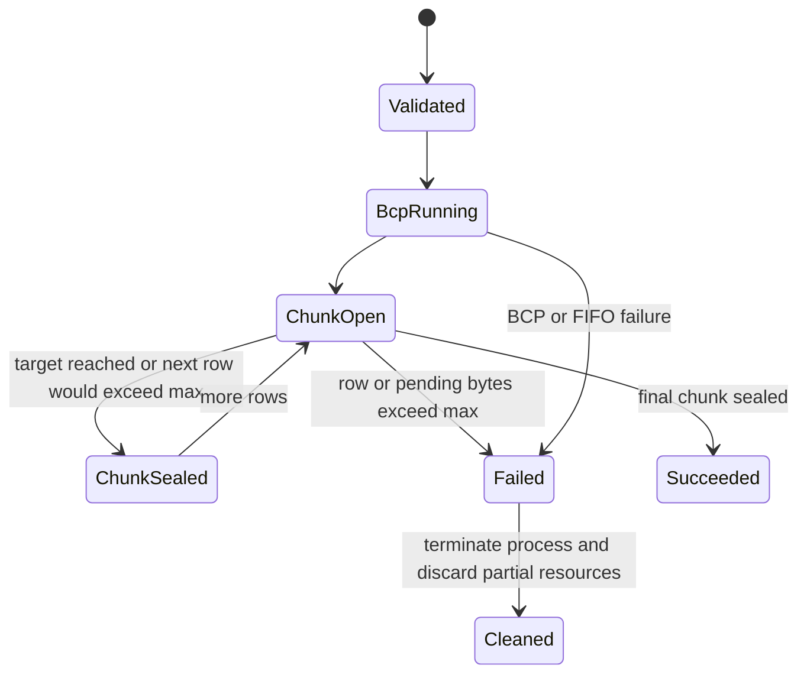
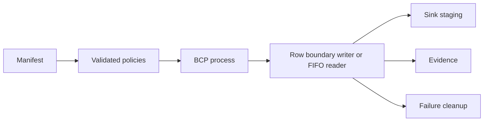

# Feature design: BCP chunk limits and streaming read buffer

- Status: IMPLEMENTED
- Owner: dpone maintainers
- Issue: Codex thread request, 2026-07-14
- Target release: 0.72.4
- Implementation evidence: [validation report](../../../test_artifacts/agent-policy/bcp-chunk-limits-validation.md)
Last verified: 2026-07-16

## Executive summary

The MSSQL BCP physical writer previously parsed `max_chunk_bytes` without
enforcing it, and the FIFO streaming route advertised `target_chunk_bytes` while
reading fixed 4 MiB blocks. This bug fix restores the documented physical hard
limit, introduces the accurately named `read_buffer_bytes` streaming policy,
and keeps the old streaming key as a one-release compatibility input.

The measurable outcome is that every emitted physical chunk is no larger than
`max_chunk_bytes`, except that an individual oversized row fails closed instead
of being split, and every BCP pipe read uses the validated effective buffer.

## Personas and customer journey

| Persona | Goal | Current pain | Success signal |
|---|---|---|---|
| Data engineer | Configure predictable BCP memory and spool limits. | One option is ignored and another is named for behavior it does not control. | Manifest validation is early and evidence reports the effective policy. |
| Platform engineer | Bound temporary-disk and stream-buffer use. | A large row can silently exceed the configured physical maximum. | Oversized rows stop the run and leave no FIFO or partial chunk. |
| Operator | Diagnose a failed transfer without seeing source data. | Generation failures do not have a dedicated physical-chunk evidence event. | Evidence contains a stable code and safe limit metadata. |

Journey: the engineer configures physical chunk limits and optionally a pipe
read buffer, runs the existing MSSQL-to-ClickHouse route, observes normalized
decision evidence, and either receives bounded chunks or an actionable stable
error. On upgrade, existing manifests using the old streaming key still run
with the historical 4 MiB effective buffer and receive one migration warning.

## Scope

### In scope

- Validate physical target/max limits before BCP starts.
- Enforce the physical maximum on complete row boundaries.
- Fail closed when one row exceeds the maximum.
- Remove FIFO and incomplete chunk files after generation failure.
- Add safe `generation_failed` evidence.
- Add validated `streaming.read_buffer_bytes` with a 4 MiB default.
- Accept `streaming.target_chunk_bytes` for one dedicated deprecation release.
- Migrate repository-owned manifests, tests, schemas, and docs immediately.

### Non-goals

- Splitting a source row across physical files.
- A shared abstraction for physical chunk size and stream read buffers.
- Changing sink staging acceptance, checkpoint, or finalization semantics.
- Changing the BCP query or introducing a new transport route.
- Live route certification without an explicitly available environment.

### Assumptions and constraints

- Physical chunks use complete rows separated by the configured terminator.
- The existing effective FIFO read size of 4 MiB is the compatibility baseline.
- `target_chunk_bytes` is a physical soft target; `max_chunk_bytes` is a hard
  physical limit; `read_buffer_bytes` is only an in-memory read size.
- An oversized row is a safety violation and cannot be auto-repaired.

## Public contract

### CLI

No new command is added. Existing manifest validation and execution surfaces
return stable error codes. Configuration errors fail before BCP is launched:

- `physical_chunk_target_bytes_invalid`;
- `physical_chunk_max_bytes_invalid`;
- `physical_chunk_target_exceeds_max_bytes`.

An oversized row fails execution with
`physical_chunk_row_exceeds_max_bytes`. The deprecated streaming key emits
`streaming_target_chunk_bytes_deprecated_use_read_buffer_bytes`.
An invalid canonical stream buffer fails with
`streaming_read_buffer_bytes_out_of_range`.
Malformed legacy-only input fails with `streaming_target_chunk_bytes_invalid`;
it is ignored only when the valid canonical field is also present.
Malformed physical byte-size strings are normalized to the corresponding
`physical_chunk_*_bytes_invalid` code instead of exposing parser text. When the
canonical streaming field is present, an invalid legacy value is ignored and
still reported as the deprecated full public path.
Physical numeric values must be integers, and string values must match the
public schema grammar; permissive normalization such as `"1 2MiB"` is rejected.
The planner and runtime constructor use the same policy parser. Decimal string
sizes are converted with exact decimal arithmetic so a hard maximum cannot be
rounded upward by binary floating point.

### Python API

`PhysicalChunkPolicy` validates positive values and `target <= max` during
construction. `PhysicalChunkLimitExceeded` exposes only `chunk_index`,
`row_bytes`, and `max_chunk_bytes`; it never stores row bytes.

`StreamingTransferPolicy` adds `read_buffer_bytes` and preserves constructor
compatibility for `target_chunk_bytes` during the deprecation release. The old
value does not determine the effective read buffer.

### Manifest/schema

```yaml
physical_chunking:
  target_chunk_bytes: 64MiB
  max_chunk_bytes: 128MiB

streaming:
  provider: bcp_pipe
  read_buffer_bytes: 4MiB
```

`read_buffer_bytes` accepts `64KiB..16MiB` and defaults to `4MiB`. Manifest
strings use whole `KiB` or `MiB` units; integer values are bytes. Both public
JSON schemas and runtime parsing carry identical grammar, defaults, and bounds. The legacy
`target_chunk_bytes` property remains accepted with `deprecated: true` and a
migration description. When both keys are present, `read_buffer_bytes` wins.
The schema conditional applies strict legacy validation only when the canonical
field is absent; an ignored alias cannot invalidate a canonical configuration.

Physical and legacy chunk-size strings retain the existing decimal-unit syntax.
JSON Schema validates that lexical shape; the canonical policy parser performs
the semantic whole-byte lower-bound check before BCP starts. For example,
`0.5GiB` remains valid, while `0.1B` is rejected with the field's stable invalid
value code because it resolves below one whole byte. This division avoids
duplicating unit arithmetic in schema regular expressions.

### Artifacts and evidence

Streaming route evidence adds `configured_read_buffer_bytes`,
`effective_read_buffer_bytes`, and `deprecated_aliases`.

Physical chunk evidence retains successful chunk sizes, rows, checksum, and
status in `chunks`. Generation failure adds an optional top-level
`generation_failure` record with status `generation_failed`, a stable error code,
and safe limit metadata. Keeping the two shapes separate preserves compatibility
for existing `chunks` consumers. Source row values are never persisted.
Loader exception text is not evidence-safe and is replaced by the stable
`physical_chunk_staging_load_failed` code. Cleanup retains exact owned paths;
it never discovers files with a shared-directory glob.
The evidence producer accepts limit metadata only from the exact base exception
type and copies the three validated scalar fields explicitly; subclass methods
and arbitrary mappings are never invoked at this security boundary. Values are
snapshotted once before validation and serialization.

### Compatibility and migration

Repository-owned examples move to `read_buffer_bytes: 4MiB` immediately in
0.72.4. External manifests using only the legacy key remain valid through the
0.73.x dedicated deprecation release and keep the historical effective 4 MiB
behavior. The earliest removal is 0.74.0 and still requires the normal public
deprecation gate.

## Detailed algorithm

1. Parse and validate physical target/max and streaming read-buffer limits.
2. Start BCP only after normalized policy construction succeeds.
3. Accumulate bytes until complete rows are available.
4. If an incomplete pending row grows beyond the maximum, fail immediately.
5. For each complete row, reject it if the row alone exceeds the maximum.
6. If adding the row would exceed the maximum, seal the non-empty current chunk
   and start another chunk before writing the row.
7. Write the whole row. Seal when the physical soft target is reached.
8. Apply the same checks to a final row without a terminator.
9. On failure, discard the open chunk, abort BCP with bounded terminate/wait,
   kill fallback and output-drainer join, unlink the FIFO, publish safe failure
   evidence, and do not advance checkpoint/finalization.
10. In pipe mode, read FIFO bytes using the normalized effective buffer.
11. Open FIFO reads in non-blocking mode and observe the BCP process so an exit
    before writer open cannot leave the consumer waiting forever.

### Pseudocode

```text
validate target > 0, max > 0, target <= max
for each source byte block:
    split complete rows from pending bytes
    if pending bytes > max: fail and discard open chunk
    for each complete row:
        if row bytes > max: fail and discard open chunk
        if open chunk is not empty and open bytes + row bytes > max:
            seal open chunk
            open next chunk
        append complete row
        if open bytes >= target:
            seal open chunk
            open next chunk
apply identical checks to final unterminated row
seal final non-empty chunk
```

### State machine



### Edge cases

- Empty input emits no chunks.
- Exact target and exact maximum values are accepted.
- A final row without a terminator is counted once and checked against max.
- The next row starts a new chunk when appending it would exceed max.
- A row larger than max is never split or included in evidence.
- Generator cancellation discards the open incomplete chunk.
- Already yielded chunks remain owned by the artifact lifecycle and are removed
  only after sink staging accepts or rejects them under existing semantics.

## Architecture

### Components and responsibilities

| Component | Existing/new | Responsibility | Dependencies |
|---|---|---|---|
| `PhysicalChunkPolicy` | Existing | Normalize and validate physical limits. | byte-size parser |
| `RowBoundaryChunkWriter` | Existing | Enforce row-preserving target/max boundaries. | policy, filesystem state |
| `PhysicalChunkLimitExceeded` | New | Typed, data-safe oversized-row error. | none |
| `PhysicalChunkedFileExportArtifact` | Existing | Load/cleanup chunks and publish lifecycle evidence. | writer output, sink loader |
| `StreamingTransferPolicy` | Existing | Normalize canonical buffer and legacy alias. | byte-size parser |
| `BcpPipeStreamExporter` | Existing | Read FIFO with the effective buffer. | process launcher, filesystem |
| `BcpProcess` | Existing | Bounded terminate/reap/kill/drainer cleanup after failure. | subprocess, process drainer |
| JSON schemas | Existing | Validate and document both manifest forms. | JSON Schema |

### Ports, adapters, and composition root

The policies remain connector-neutral runtime models. MSSQL strategies consume
the normalized policies through constructor arguments. BCP process launch and
filesystem access stay in MSSQL adapters. No global client or import-time I/O is
introduced.

### Data and control flow



### Alternatives and tradeoffs

| Alternative | Advantages | Disadvantages | Decision |
|---|---|---|---|
| Split oversized rows | Preserves progress. | Corrupts row-oriented BCP input. | Rejected. |
| Let one oversized row exceed max | Avoids failure. | Violates the hard-limit contract. | Rejected. |
| Reuse `target_chunk_bytes` for FIFO reads | No schema change. | Conflates disk chunks and memory buffers. | Rejected. |
| Add dedicated `read_buffer_bytes` | Accurate name and bounded behavior. | Requires deprecation handling. | Adopted. |

### ADR requirement

No ADR is required. This corrects violations of existing physical chunk and
streaming responsibilities without changing dependency direction or introducing
a new architectural component.

### Quality-budget impact

The change is confined to existing cohesive runtime and strategy modules. No
new import-layer edge is expected. All modified modules must remain within
`docs/benchmarks/quality_budgets.yml`; existing debt may not grow.

## Market comparison

This is an internal contract bug fix, not a new competitive capability. dlt,
Informatica, Airbyte, Fivetran, Pentaho, SSIS, gusty, Astronomer Cosmos, and
Apache Beam are all `N/A`: their current product behavior does not determine how
dpone must enforce its already-published BCP row/chunk contract. No market
superiority claim is made.

## Measurable differentiation

```yaml
axis: N/A - existing contract correctness
scenario: MSSQL BCP physical and pipe transfer
baseline: max ignored and FIFO read fixed but mislabeled
metric: boundary and compatibility test outcomes
target: 100% required focused cases pass
procedure: uv run pytest tests/test_physical_chunking.py tests/test_streaming_transfer.py tests/test_mssql_pipe_streaming.py -q
artifact: focused pytest output
limitations: live source/sink parity remains unverified without the approved local-live environment
```

## Security, privacy, and operations

Errors and evidence contain only sizes, indices, checksums, status, and stable
codes. They exclude row data and credentials. Resource limits are validated
before BCP starts. Failure cleanup reaps the child process, removes FIFO and
incomplete files, and drops raw/decoded ClickHouse staging created before a
failure. The decoded table identity is planned before DDL so an ambiguous
create timeout remains cleanable; the same rule applies to raw staging. Output
drainers are joined even when the
post-kill reap reports `process_abort_unreaped`. One route decision emits the
legacy warning once. Operators migrate the deprecated key using the warning and
compatibility guide.

## Test and certification plan

| Layer | Scenario | Environment | Expected artifact |
|---|---|---|---|
| Unit | Policy invalid/edge values and row boundaries. | Local pytest. | Focused test output. |
| Unit | Oversized row, cleanup, and safe evidence. | Local pytest. | Focused test output and temp evidence. |
| Unit | Concurrent artifact cleanup and loader-error confidentiality. | Local pytest. | Ownership and redaction assertions. |
| Unit | Ambiguous staging DDL and post-kill reap timeout. | Local pytest. | Cleanup and drainer assertions. |
| Unit | Early BCP exit before FIFO writer open. | Local pytest. | Non-blocking FIFO/process-poll assertion. |
| Contract | Two schemas have equal default/bounds/deprecation. | Local pytest. | Schema assertions. |
| Compatibility | Legacy key warns and keeps 4 MiB; canonical key wins. | Local pytest. | Decision evidence assertions. |
| Integration | MSSQL pipe uses configured read buffer. | Local fake process/FIFO. | Streaming test output. |
| Live certification | MSSQL to ClickHouse row/count parity and limits. | Approved local-live only. | PASS or explicit SKIP/UNVERIFIED. |
| Quality | Import, layer, module size, lint, type, docs gates. | Local CI-equivalent. | Command outputs. |

## Documentation plan

Update the changelog, compatibility guide, MSSQL guide, performance guide,
native-transfer runtime reference, configuration reference, schemas, executable
examples, and live integration manifest. Document the distinction between a
physical soft target, physical hard maximum, and FIFO read buffer.

## Rollout and rollback

Ship canonical support and the compatibility alias together. Rollback is the
previous release; manifests migrated to `read_buffer_bytes` require reverting
that key when rolling back. The alias is removed only in a later approved
deprecation change. Post-release verification checks warnings, evidence, chunk
sizes, and route parity.

## Agent execution plan

| Agent/role | Owned paths | Read-only paths | Forbidden paths | Dependency |
|---|---|---|---|---|
| Primary integrator | Runtime, tests, schemas, docs, changelog, spec, task contract | Architecture/testing standards | Dependency/workflow files | Approved spec |
| Explorer | None | Runtime execution path and existing tests | All writes | None |
| Architect | None | Contract, cleanup, evidence, compatibility | All writes | None |
| Test certifier | None | Test gaps and required gates | All writes | None |
| Docs/UX reviewer | None | User-facing configuration and migration docs | All writes | None |

The primary Codex agent is the integrator and shared-file owner.

## Approval checklist

- [x] User problem and CJM are clear.
- [x] Algorithm and failure semantics are implementable without guessing.
- [x] Public contracts and compatibility are explicit.
- [x] Architecture and alternatives are justified.
- [x] Market comparison is explicitly N/A for this internal bug fix.
- [x] No unqualified differentiation claim is made.
- [x] Tests, evidence, docs, rollout, and rollback are complete.
- [x] Path ownership and integration plan are conflict-safe.
- [x] Maintainer approved the specification in the Codex thread.
