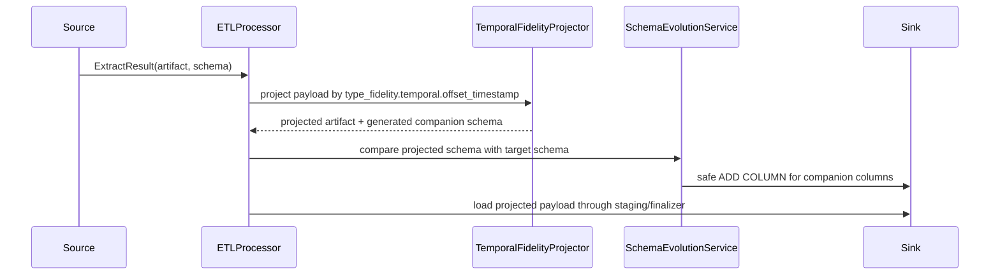

# Temporal fidelity

`dpone` treats temporal values as a data contract, not as connector
formatting trivia. The same policy is used by runtime materialization,
`dpone plan`, physical DDL planning, schema evolution, and typed
reconciliation.

Use this guide when a source has:

- MSSQL `datetime`, `datetime2`, or `smalldatetime` without offset metadata;
- MSSQL `datetimeoffset`;
- Postgres `timestamptz`;
- REST/API ISO-8601 strings such as `2026-06-09T12:30:00+03:00`;
- Kafka JSON, Avro, JSON Schema, or Protobuf fields that carry an instant with
  timezone/offset semantics.

## Configuration

`type_fidelity.temporal` has two timestamp families:

- `naive_timestamp`: source values without offset metadata, such as MSSQL
  `datetime`, `datetime2`, and `smalldatetime`.
- `offset_timestamp`: source values with offset/timezone metadata, such as
  MSSQL `datetimeoffset`, PostgreSQL `timestamptz`, or API ISO offset strings.

### Naive timestamp transport

Use `naive_timestamp` when the source timestamp has no offset metadata but the
target should remain a typed analytical timestamp:

```yaml
source:
  options:
    type_fidelity:
      temporal:
        naive_timestamp:
          mode: datetime64
          transfer_encoding: auto
          timezone: UTC
```

`mode: datetime64` means the target semantic type remains ClickHouse
`DateTime64(p)`. `transfer_encoding` controls only the wire format:

| Encoding | Behavior |
| --- | --- |
| `auto` | Uses epoch ticks for certified native MSSQL -> ClickHouse paths and text elsewhere. |
| `epoch` | Exports numeric ticks for `DateTime64(p)` ingestion. Faster and smaller, but less human-readable. |
| `text` | Exports `yyyy-MM-dd HH:mm:ss[.fraction]` without ISO `T`. Easier to inspect in artifacts. |

MSSQL `datetime` and `datetime2` do not store timezone or offset. When epoch
transport is used, `timezone` is the explicit assumption for interpreting those
wall-clock values.

Certified MSSQL -> ClickHouse behavior:

| Source type | Target type | `auto` transfer |
| --- | --- | --- |
| `datetime` | `DateTime64(3)` | Epoch milliseconds on the native path, text fallback elsewhere. |
| `datetime2(p)` | `DateTime64(p)` | Epoch ticks scaled to `p` on the native path, text fallback elsewhere. |
| `smalldatetime` | `DateTime64(0)` | Epoch seconds/minute-safe value on the native path, text fallback elsewhere. |

Epoch is a transport encoding, not storage semantics: target columns remain
typed ClickHouse `DateTime64`, so analytical predicates and ordering still work.

### MSSQL -> ClickHouse epoch TSV runbook

For native MSSQL -> ClickHouse loads, `transfer_encoding: auto` selects epoch
only when the ClickHouse sink resolves to HTTP bulk or `clickhouse-client`. If
the sink resolves to the Python fallback, the source does not generate
ClickHouse-specific TSV and stays on the regular textual path.

For epoch transport, dpone creates raw staging with `Int64` /
`Nullable(Int64)`, loads TSV without Python row parsing, then builds decoded
staging:

```sql
CAST(fromUnixTimestamp64Nano(toInt64(<raw_epoch>) * <scale_factor>, 'UTC') AS DateTime64(p))
```

Nullable columns preserve `NULL` as `NULL`. The user-facing manifest API does
not change: `auto`, `epoch`, and `text` stay the same public values. Use `text`
only for audit/debug scenarios or when ClickHouse is older than 20.5 and does
not support `fromUnixTimestamp64Nano`.

### Offset-aware timestamps

Canonical config:

```yaml
source:
  options:
    type_fidelity:
      temporal:
        offset_timestamp:
          mode: preserve_offset
          timezone: UTC
          malformed: fail
```

Supported modes:

| Mode | Runtime value | Extra columns | Best for |
| --- | --- | --- | --- |
| `utc_instant` | UTC instant, timezone removed before staging | none | Default analytics and joins across regions |
| `fixed_timezone` | Instant converted to `timezone`, timezone removed before staging | none | Business reporting in one local timezone |
| `preserve_offset` | UTC instant plus original offset minutes | `__dpone__tz_offset_minutes__<column>` | Lossless production loads |
| `preserve_text` | Original offset timestamp text | none | Raw audit or landing-zone tables |

`utc_instant` is the default because it is simple and safe for most analytical
tables. `preserve_offset` is recommended when the source offset is part of the
contract and must survive reconciliation or downstream replay.

The `MSSQL -> ClickHouse` certification suite validates all four
`offset_timestamp` modes: `utc_instant`, `fixed_timezone`, `preserve_offset`,
and `preserve_text`. `Postgres -> MSSQL` validates `timestamptz` as an
offset-aware source family landing in `datetimeoffset(6)`.

### Per-column policy

Use column overrides when one table has multiple temporal semantics:

```yaml
source:
  options:
    type_fidelity:
      temporal:
        offset_timestamp:
          mode: utc_instant
          malformed: fail
          columns:
            business_at:
              mode: fixed_timezone
              timezone: Europe/Moscow
            source_event_at:
              mode: preserve_offset
            raw_received_at:
              mode: preserve_text
```

The global policy is used for every offset-aware timestamp column unless a
column-specific override exists. Overrides inherit global values unless they
set their own `mode`, `timezone`, `sql_server_timezone`, or `malformed`.

### Malformed values

`malformed` controls values that are declared as offset-aware timestamps but
cannot be parsed at runtime.

| Mode | Behavior | Recommended for |
| --- | --- | --- |
| `fail` | Stop before loading the bad row into target. | Database sources and strict contracts |
| `preserve_text` | Keep malformed values as text and plan the affected column as string/text. | Dirty API/Kafka landing tables |

The production default is `fail`. Use `preserve_text` only when the target table
is explicitly a landing/audit table or when a downstream quarantine process
handles dirty records.

## Runtime flow



The projector supports row-addressable and streaming artifacts:

- `InMemoryRowsArtifact`: rows are transformed before load;
- `StreamingRowsArtifact`: rows are transformed lazily during materialization;
- file/native artifacts: source/sink native codecs own projection, so the
  runtime projector does not parse files in Python.

## Target DDL behavior

`dpone schema physical-plan` and runtime physical design use the same policy.

Example:

```yaml
source:
  type: postgres
  options:
    columns:
      - {name: occurred_at, type: timestamptz}
    type_fidelity:
      temporal:
        offset_timestamp:
          mode: fixed_timezone
          timezone: Europe/Moscow

sink:
  type: clickhouse
  table: {schema: landing, name: events}
```

For ClickHouse this plans:

```sql
`occurred_at` DateTime64(6, 'Europe/Moscow')
```

For `preserve_text`, target columns become string/text types. For
`preserve_offset`, db targets keep a timestamp-compatible target type and add
the framework companion column when schema evolution is enabled. If
`malformed: preserve_text` is configured for a column, the planner treats that
column as string/text because valid and invalid values would otherwise share one
physical column.

## Schema evolution guardrails

`__dpone__*` is reserved for framework-generated columns. User source columns
that start with `__dpone__` fail by default.

The temporal companion family is explicitly allowed:

```text
__dpone__tz_offset_minutes__<column>
```

The companion column is added through normal staging-first schema evolution. If
it already exists with an incompatible type, the load fails before data is
written. If schema evolution is disabled, pre-create the companion column or use
`utc_instant`, `fixed_timezone`, or `preserve_text`.

## Typed reconciliation

Typed reconciliation compares offset-aware timestamps through canonical values:

- `utc_instant`: compares the UTC instant;
- `fixed_timezone`: compares the instant converted to the configured timezone;
- `preserve_offset`: compares UTC instant and source offset minutes;
- `preserve_text`: compares the preserved textual representation.

This avoids false mismatches between connector representations such as
`2026-06-09 12:30:00+03:00`, `2026-06-09T09:30:00Z`, and Python aware
`datetime` objects.

## Runbook

| Symptom | Action |
| --- | --- |
| BI users expect local time but see UTC | Use `fixed_timezone` with the business timezone. |
| Original source offset is required for audit | Use `preserve_offset`; keep schema evolution enabled. |
| Target rejects companion column | Check target DDL permissions and existing column type for `__dpone__tz_offset_minutes__<column>`. |
| Reconciliation reports timestamp mismatches | Confirm source schema marks the column as offset-aware: `datetimeoffset`, `timestamptz`, `timestamp with time zone`, or `iso8601_offset_timestamp`. |
| API timestamps are mixed with non-offset strings | Use `malformed: preserve_text` only for raw landing tables, or quarantine dirty rows before loading strict tables. |
| Only one timestamp column needs original offset | Use `columns.<name>.mode: preserve_offset` instead of changing the global mode. |

## Related docs

- [Type inference](type-inference.md)
- [Schema evolution](schema-evolution.md)
- [Type mapping matrix](type-mapping-matrix.md)
- [MSSQL -> ClickHouse](source-sink/mssql-to-clickhouse.md)
