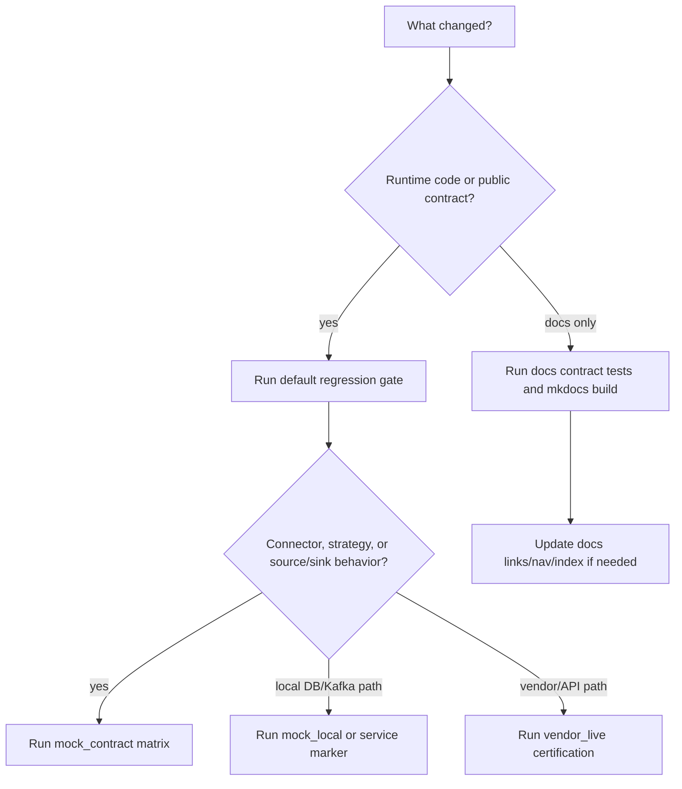

# Testing documentation

This folder is the single home for dpone testing documentation. Start here when you need to choose a test layer, run a gate, debug a red workflow, or understand the source -> sink certification matrix.

## Documentation map

| Need | Doc |
| --- | --- |
| Credential-free pipeline behavior and CI fixtures | [Hermetic pipeline tests](hermetic-pipeline-tests.md) |
| Local/default regression gate, package smoke, generated docs checks | [Local/default testing](overview.md) |
| Service markers, live/vendor boundaries, Docker services, artifact policy | [Integration tests](integration-tests.md) |
| End-to-end chunked backfill matrix and Airflow interval integration | [Backfill integration](backfill-integration.md) |
| Replay recovery/control-plane gate for resync/resume adapters | [Replay integration](replay-integration.md) |
| Manual source -> sink matrix category and GitHub Actions workflow | [Manual integration matrix](manual-integration-matrix.md) |
| Critical-route type matrix, physical DDL and temporal fidelity certification | [Type mapping matrix](../type-mapping-matrix.md#certification-profiles) |
| Manual local-live/vendor-live connector certification and benchmark/SLO evidence | [Live certification](../live-certification.md) |
| Detailed 200-case source -> sink strategy behavior model, volumes, artifacts, failure recovery | [Source/sink matrix runbook](integration-matrix.md) |
| SQL Server local wide-table mock matrix and MSSQL-specific troubleshooting | [Local MSSQL mock matrix](local-mssql-mock-matrix.md) |
| Local native transfer benchmarks for Postgres -> MSSQL and MSSQL -> ClickHouse | [Native transfer benchmark artifact: 2026-06-11](native-transfer-benchmarks-2026-06-11.md) |
| Connector capability evidence | [Connector certification](../connector-certification.md) |
| CI/CD workflow map and red-build runbooks | [CI/CD](../ci-cd.md) |
| PR-reachable workflow authority, exact streams/exits, mutations, and recovery | [Semantic privilege runbook](../cicd/runbooks.md#semantic-pr-privilege-boundary) |

## TDD policy

dpone development follows red-green-refactor across the test pyramid:

1. **Red** — before touching implementation code, write (or extend) a failing
   test at the lowest layer that can express the requirement.
2. **Green** — implement the minimal change that makes the test pass; run the
   focused test file, then the affected suites.
3. **Refactor** — clean up under a green bar; architecture fitness, import
   rules, and module-size gates must stay green
   (`uv run pytest tests/test_architecture_fitness_gate.py`,
   `uv run dpone docs check-import-rules`,
   `uv run dpone docs check-module-size --baseline docs/module_size_baseline.json --base-ref "$BASE_SHA" --head-ref "$HEAD_SHA"`; see [quality tooling](../quality-tooling.md) for setup).

Which layer is mandatory for what:

| Layer | Mandatory when | Example |
| --- | --- | --- |
| Unit (pure logic, fakes) | always — every behavior change ships with unit coverage | chunk planner boundaries, config validation |
| Contract (module boundaries, schemas, CLI output) | public contract, schema, CLI, or artifact format changes | XCom summary schema, strategy registration |
| Integration (`integration_*` markers, local Docker) | data movement semantics, sink/source finalization, state/ledger behavior | backfill route matrix, staging finalizers |
| E2E / certification (matrix and live workflows) | release gates, cross-route guarantees, vendor paths | `mock_local` matrix, live certification |

Rules of thumb:

- a bug fix starts with a regression test that reproduces the bug;
- new sink/source/strategy mechanics are not "done" without an
  `integration_*` case that moves real rows and checks parity;
- shared test helpers live in reusable toolkits (see
  `tests/integration/backfill/backfill_toolkit.py`) instead of per-test SQL
  copy-paste;
- the coverage gate (`fail_under` in `pyproject.toml`) is a ratchet: raise it
  as the measured baseline grows, never lower it.

## Quick decision guide



## Test layers

| Layer | Marker / workflow | External credentials | Purpose |
| --- | --- | --- | --- |
| Unit/contract | default pytest | no | Fast local confidence for models, planners, codecs, SQL builders, docs contracts, CLI output. |
| Default non-live gate | `pytest -m "not integration_live"` | no | Release-quality local gate for ordinary changes. |
| `mock_contract` matrix | `integration_matrix` | no | Validates all 25 source -> sink pairs and 200 strategy contracts, including `snapshot_diff`, DB-target `partition_replace`/`scd2`/`backfill`, Postgres `xmin`, and Postgres/MSSQL `cdc`, without starting services. |
| `mock_local` matrix | `integration_matrix_mock` | no | Starts disposable local services where possible and validates local/mock pipelines. |
| Type matrix certification | `type_matrix_certification` / `live-certification.yml profile=type_matrix_certification` | no for contract suite, no external credentials for local Docker profile | Validates MSSQL -> ClickHouse and Postgres -> MSSQL type decisions, physical DDL decisions, LowCardinality, temporal fidelity, schema explain and local-live fixture handoff. |
| Native transfer certification | `live-certification.yml profile=native_transfer` | no external credentials | Runs critical native-transfer fixtures and retains raw route evidence; it does not create pre-tag authority. |
| Service-specific integration | `integration_postgres`, `integration_mysql`, `integration_mssql`, `integration_clickhouse`, `integration_kafka` | no for local Docker, yes for external endpoints | Exercises native clients, staging, bulk paths, state, CDC, and connector behavior. |
| Backfill E2E matrix | `integration_backfill` / `backfill-integration.yml` | no external credentials | Real chunked backfill runs (route x inner-strategy matrix, resume/parallel/verification scenarios, interval-driven Airflow runs) against local Docker services. |
| `local_live` certification | `live-certification.yml` | no external credentials | Starts local Postgres/MySQL/MSSQL/ClickHouse/Kafka/MinIO, requires all seven local MySQL route cells with zero skips, and retains raw matrix/route evidence. |
| `real_local` certification | `live-certification.yml` | no external credentials | Runs the disposable stack and fail-closed service/route fixtures under its behavioral `real_local` profile; release-only assemblers remain disabled. |
| Pre-tag release campaign | `release-candidate-evidence.yml` | no external credentials | Runs fixed `native_transfer` as a strict `real_local` superset and publishes the exact-SHA provider-bound receipt consumed by both publishing workflows. |
| Replay integration | `integration_replay` | no by default | Validates replay adapter ordering, injected live-backend contracts, reconciliation, and state commit behavior for `dpone resync` and `dpone resume`. |
| `vendor_live` | `integration_live` and provider markers | yes | Exercises real managed/vendor systems such as BigQuery or external APIs. |

Credentials are only required for `vendor_live`. The `mock_contract`,
`mock_local`, and `real_local` layers use deterministic local test passwords,
local containers, or in-process mock servers.

## Where tests live

| Area | Path |
| --- | --- |
| Source -> sink strategy matrix | `tests/integration/matrix/` |
| Matrix registry contracts | `tests/test_integration_matrix_contracts.py` |
| CI/CD documentation contracts | `tests/test_cicd_docs_contracts.py` |
| Semantic workflow privilege contracts | `tests/agent_policy/test_workflow_privilege_*.py`, `tests/agent_policy/test_workflow_security_privileged_cli.py`, `tests/agent_policy/test_workflow_security_pr3b_compatibility.py` |
| Docs and language contracts | `tests/test_docs_*` |
| PostgreSQL live/local tests | `tests/integration/postgres/` |
| MSSQL live/local tests | `tests/integration/mssql/` |
| ClickHouse live/local tests | `tests/integration/clickhouse/` |
| Kafka live/local tests | `tests/integration/kafka/` |
| Backfill E2E matrix and scenarios | `tests/integration/backfill/` |
| Airflow interval-driven backfill runs | `tests/integration/airflow/` |
| Replay recovery/control-plane tests | `tests/integration/replay/` |
| Provider/API mock and live tests | `tests/integration/<provider>/` |

Focused Postgres -> MSSQL native transfer coverage lives in
`tests/integration/mssql/test_postgres_to_mssql_native_transfer_integration.py`.
It uses the same local Docker Postgres and SQL Server services as the broader
matrix, but directly exercises `COPY -> mssql-delimited artifact -> bcp ->
staging/finalizer` with lossless text codec assertions.

Current focused cases:

- `full_refresh`: PostgreSQL `COPY` into lossless `mssql-delimited` artifacts,
  SQL Server `bcp`, staging-first shadow swap, empty-string/NULL separation, and
  text values containing newline/tab characters.
- `incremental_merge`: MSSQL default `delete_insert` finalization with
  one existing key updated, new keys inserted, and unrelated target rows
  preserved.
- `partitioned full_refresh`: Spark-like range partitioning with
  `partitioning.export_workers`, `partitioning.load_workers`, deterministic
  `transfer_partition_id`, partition bounds metadata, and parallel partition
  load into MSSQL staging.

## Common commands

Default release-quality gate:

```bash
uv sync --locked --all-extras
uv run ruff check .
uv run ruff format --check .
uv run mypy --config-file mypy.ini
uv run pytest -m "not integration_live" --cov=src/dpone --cov-report=xml
uv build
```

Docs-only gate:

```bash
uv run dpone docs check-docs
uv run pytest tests/test_cicd_docs_contracts.py tests/test_docs_mermaid_contracts.py -q
uv run pytest tests/test_docs_language_contracts.py -q
uv run mkdocs build --strict
```

## Changed-workflow gate

Start with the PR3A contract/governance tests when the CI, Airflow compatibility,
Pages, Dependency Review, Dependabot, or workflow-security surface changes:

```bash
uv run pytest \
  tests/test_ci_shadow_pr3a_dependabot_and_sync.py \
  tests/test_ci_shadow_pr3a_workflow_concurrency.py \
  tests/test_ci_shadow_pr3a_pages_implementation.py \
  tests/test_ci_shadow_pr3a_dependency_review.py \
  tests/test_github_workflow_governance.py \
  tests/agent_policy/test_workflow_security.py \
  tests/agent_policy/test_ci_shadow_pr3a_implementation_contract.py -q
```

Use only checksum-pinned actionlint `1.7.12`; require the first version line to
equal `1.7.12`. Every invocation uses
`-no-color -format '{{json .}}' -shellcheck '' -pyflakes ''`.

Run the changed non-queue files together with no ignore:

```bash
actionlint \
  -no-color -format '{{json .}}' -shellcheck '' -pyflakes '' \
  .github/workflows/ci.yml \
  .github/workflows/airflow-pack-compat.yml \
  .github/workflows/pages.yml \
  .github/workflows/dependency-review.yml
```

The contract is exit `0`, stdout exactly `[]\n`, and empty stderr. Then run
`.github/workflows/airflow-pack-compat-nightly.yml` twice:

| Invocation | Exit | stdout | stderr |
| --- | --- | --- | --- |
| Unwaived common flags | `1` | one JSON array containing exactly one `syntax-check` object for the original file and full `unexpected key "queue" for "concurrency" section. expected one of "cancel-in-progress", "group"` message | empty |
| Common flags plus exact file/message ignore | `0` | exactly `[]\n` | empty |

The only permitted ignore is:

```text
^unexpected key "queue" for "concurrency" section\. expected one of "cancel-in-progress", "group"$
```

Line, column, and snippet in the one unwaived object are diagnostic; filepath,
kind, full message, object count, exit code, and every stream byte are
contractual. Any extra diagnostic is FAIL. An unwaived exit `0` triggers
`ACTIONLINT_QUEUE_WAIVER_OBSOLETE` until the waiver and obsolete expected-error
branch are removed together.

These are local/static results. Mocked tests, skipped hosted jobs, or an
unavailable GitHub environment never establish live PASS. Hosted PR
cancellation, nightly queue/rerun, Pages attempt/order/deploy, native PR and
exact-master Dependency Review, and protected exact-head checks require
provider-authenticated run evidence; otherwise report `UNVERIFIED` or `SKIP`
with the reason.

## Semantic PR privilege boundary gate

Run the complete focused semantic layer for workflow, policy, schema, or
governance-topology changes. Prepare the locked environment once:

```bash
uv sync --locked --all-extras
```

This prerequisite may access the network, write `.venv` or the uv cache, and
use stderr. It is outside the scanner process contract. Run the focused suite
after preparation:

```bash
uv run pytest \
  tests/agent_policy/test_workflow_privilege_snapshot.py \
  tests/agent_policy/test_workflow_privilege_parser.py \
  tests/agent_policy/test_workflow_privilege_graph.py \
  tests/agent_policy/test_workflow_privilege_expressions.py \
  tests/agent_policy/test_workflow_privilege_permissions.py \
  tests/agent_policy/test_workflow_privilege_profiles.py \
  tests/agent_policy/test_workflow_privilege_report.py \
  tests/agent_policy/test_workflow_privilege_service.py \
  tests/agent_policy/test_workflow_security_fail_closed.py \
  tests/agent_policy/test_workflow_security_job_scope.py \
  tests/agent_policy/test_workflow_security_privileged_cli.py \
  tests/agent_policy/test_workflow_security_pr3b_compatibility.py \
  tests/agent_policy/test_workflow_privilege_mutations.py \
  tests/agent_policy/test_workflow_privilege_limits.py -q
```

Then exercise both public repository surfaces:

```bash
uv run --locked --no-sync --offline --no-python-downloads python -B \
  tools/agent_policy/workflow_security_privileged.py \
  --root . \
  --format text
uv run --locked --no-sync --offline --no-python-downloads python -B \
  tools/agent_policy/workflow_security_privileged.py \
  --root . \
  --format json
uv run --locked --no-sync --offline --no-python-downloads python -B \
  tools/agent_policy/workflow_security.py . --format json
```

Those are prepared-environment convenience invocations. For exact scanner
exit-code and stdout/stderr evidence, bypass uv and run the prepared interpreter
directly:

```bash
.venv/bin/python -B tools/agent_policy/workflow_security_privileged.py \
  --root . \
  --format text
.venv/bin/python -B tools/agent_policy/workflow_security_privileged.py \
  --root . \
  --format json
```

The standalone stream and exit contract below is process-scoped and applies to
those direct scanner invocations from Python process start. It does not include
uv preparation or wrapper behavior:

| Result | Exit | stdout | stderr |
| --- | --- | --- | --- |
| `PASS` | `0` | one complete text or canonical JSON report | empty |
| `FAIL` / `UNVERIFIED` | `1` | one schema-valid text or canonical JSON report | empty |
| invalid CLI arguments | `2` | empty | argparse usage/type diagnostic |
| internal report failure | `3` | empty | exactly `PRIVILEGE_INTERNAL_REPORT_INVALID: report construction or schema validation failed\n` |

The text report ends with the stable runbook anchor and exact recheck command.
The JSON report is compact ASCII JSON with sorted keys and one trailing
newline. Two scans over identical policy/workflow bytes must compare equal.
Schema-valid shape alone is not enough: the report validator also binds the
policy digest, inventory manifest, complete graph route IDs, authority records,
profile matches, finding order, status, and output bounds.

The report's frozen bare `uv run python ...` recheck is a convenience that
assumes a prepared environment. It remains unchanged, but it is not the exact
evidence invocation and does not extend scanner guarantees to uv.

Boundary tests exercise every closed N/N+1 dimension from the policy, including
snapshot bytes/files, YAML depth/nodes, graph closure, routes, authority and
profile records, findings, and rendered output. They also replay identical
snapshots and concurrent-mutation fixtures. Do not copy numeric limits into a
test-local allowlist: the closed policy, schemas, and report are the shared
authority.

The umbrella JSON keeps exactly `status`, `errors`, and `warnings`. It appends
semantic findings atomically after legacy errors. A service/report/serialization
failure produces only
`semantic-pr-privilege-internal=PRIVILEGE_INTERNAL_REPORT_INVALID`, never a
partial semantic list; ordinary compatibility handling exits `1`. Tests also
prove `KeyboardInterrupt`, `SystemExit`, and other `BaseException` subclasses
are not relabeled as evidence.

The umbrella root defaults to `.`. Its `--policy` and `--workflows-dir` options
override only legacy general lint and resolve relative to the process working
directory; semantic policy/workflow acquisition and fixed release/runtime
SS-47 checks remain below root. Tests cover help, invalid arguments, both
`.yml`/`.yaml` suffixes, deterministic legacy-before-semantic ordering, and
sanitized policy/workflow/boundary failures with empty stderr.

The tracked certification artifact is producer-owned canonical stdout:

```bash
.venv/bin/python -B tools/agent_policy/workflow_security_privileged.py \
  --root . \
  --format json > /tmp/pr3b-semantic-privilege-report.json
cmp /tmp/pr3b-semantic-privilege-report.json \
  test_artifacts/agent-policy/pr3b-semantic-privilege-certification.json
```

Validate the captured JSON against
`evals/agent/workflow-security-privileged-report.schema.json`, require
`status=PASS`, and compare a second fresh invocation byte-for-byte. The tracked
artifact has no wrapper, timestamp, hostname, absolute path, or independent
authority. Never hand-edit it to manufacture a pass.

These checks are credential-free static evidence. Hosted CodeQL, governance
artifact identity and attestation, protected required contexts, App binding,
owner attestation, and Agent PR receipt require provider-authenticated evidence
for the exact head. Report unavailable hosted evidence as `UNVERIFIED`, not
`PASS`.

Credential-free source/sink matrix:

```bash
DPONE_RUN_INTEGRATION=1 \
DPONE_RUN_INTEGRATION_MATRIX=1 \
DPONE_MATRIX_RUN_MODE=mock_contract \
DPONE_MATRIX_ARTIFACT_DIR=test_artifacts/integration_matrix/mock_contract_latest \
uv run pytest -m integration_matrix tests/integration/matrix -q
```

Local/mock source/sink matrix:

```bash
DPONE_RUN_INTEGRATION=1 \
DPONE_RUN_INTEGRATION_MATRIX=1 \
DPONE_MATRIX_RUN_MODE=mock_local \
DPONE_MATRIX_ARTIFACT_DIR=test_artifacts/integration_matrix/mock_local_latest \
uv run pytest -m integration_matrix_mock tests/integration/matrix -q
```

Replay recovery/control-plane gate:

```bash
DPONE_RUN_INTEGRATION_REPLAY=1 uv run pytest -m integration_replay tests/integration/replay -q
```

Focused Postgres -> MSSQL native path:

```bash
docker compose -f docker/docker-compose.integration.yml up -d postgres mssql
DPONE_RUN_INTEGRATION=1 \
uv run pytest tests/integration/mssql/test_postgres_to_mssql_native_transfer_integration.py -q
```

Critical-route type matrix certification:

```bash
uv run pytest -m type_matrix_certification tests/test_type_matrix_certification.py -q
gh workflow run "Live certification" -f profile=type_matrix_certification -f row_count=10000
```

## Matrix behavior artifacts

When `DPONE_MATRIX_ARTIFACT_DIR` is set, the matrix writes one metadata artifact and one strategy behavior artifact per selected case. Each behavior artifact uses a configurable deterministic volume profile: 10,000 base source rows by default, 20% changed rows, 5% physical deletes, and 120 `wide_*` source columns with mixed null sparsity.

Use the `__behavior.json` artifact to compare full-volume counts/checksums first, then inspect `target_before`, `source_rows`, `expected_rows`, and `actual_rows` samples when a strategy case turns red.

## Benchmark artifacts

Use benchmark artifacts when a change touches native bulk transfer, partitioning,
or target ingest performance:

- [Native transfer benchmark artifact: 2026-06-11](native-transfer-benchmarks-2026-06-11.md): latest local-live evidence for `10k`, `1M`, and `10M` rows across `Postgres -> MSSQL` and `MSSQL -> ClickHouse`.
- [Native transfer benchmark artifact: 2026-06-09](native-transfer-benchmarks-2026-06-09.md): previous local-live release suite.
- [Native transfer benchmark artifact: 2026-06-08](native-transfer-benchmarks-2026-06-08.md): historical local-live evidence and extended tuning context.

## Runbook: choose the right layer

1. Use default pytest for every PR.
2. Use `mock_contract` when docs, manifests, strategy support, or source -> sink coverage changes.
3. Use `mock_local` when connector runtime, staging, type mapping, or load strategy behavior changes.
4. Use service-specific markers when native clients or local DB/Kafka behavior changed.
5. Use `vendor_live` before release or after changes that affect managed external systems.

## Runbook: common failures

Failure: `mock_contract` fails.

- Check `dpone.integration_matrix` first; it is the canonical registry.
- Check that every pair has a guide in [docs/source-sink](https://github.com/PaulKov/dpone/tree/master/docs/source-sink).
- Check [Source -> sink matrix](../source-sink-matrix.md) and [Load strategies](../load-strategies.md) links.

Failure: `mock_local` service does not start.

- Re-run `docker compose -f docker/docker-compose.integration.yml ps`.
- Inspect logs for the failing service with `docker logs <container>`.
- For MSSQL, verify the password satisfies SQL Server complexity rules and that the runner has enough memory.
- For Kafka, verify `kafka` becomes healthy before `schema-registry` starts.

Failure: `vendor_live` fails.

- Verify credentials are present in GitHub Actions secrets or local environment.
- Re-run a focused case with `DPONE_MATRIX_CASE_ID=<case>` when the matrix is involved.
- Never copy credentials into artifacts or logs.

Failure: docs links break after moving testing pages.

- Keep testing pages under `docs/testing/`.
- Update `mkdocs.yml`, [Documentation index](../README.md), and README links together.
- Run `mkdocs build --strict` before pushing.

## Related docs

- [Local/default testing](overview.md)
- [Integration tests](integration-tests.md)
- [Replay integration](replay-integration.md)
- [Manual integration matrix](manual-integration-matrix.md)
- [Source/sink matrix runbook](integration-matrix.md)
- [Local MSSQL mock matrix](local-mssql-mock-matrix.md)
- [Native transfer benchmark artifact: 2026-06-11](native-transfer-benchmarks-2026-06-11.md)
- [Native transfer benchmark artifact: 2026-06-09](native-transfer-benchmarks-2026-06-09.md)
- [Native transfer benchmark artifact: 2026-06-08](native-transfer-benchmarks-2026-06-08.md)
- [CI/CD](../ci-cd.md)

## Nested normalization evidence

- [Nested normalization testing](nested/index.md) covers spill-to-disk, lint,
  certification, benchmark evidence, reverse readback and guardrail runbooks.

### Native transfer certification route evidence

`live-certification.yml profile=native_transfer` executes both route-specific
fixture sets and retains their JUnit and refresh evidence. Its placeholder
native indexes and strategy/release assemblers remain disabled; these are
historical planned paths, not raw-workflow outputs:

- `postgres-mssql/evidence/.../evidence_index.json`
- `mssql-clickhouse/evidence/.../evidence_index.json`

The authoritative `release-candidate-evidence.yml` campaign validates both
routes as mandatory roles in a fixed strict superset. This keeps publication
symmetric and prevents a caller from certifying only one side.
