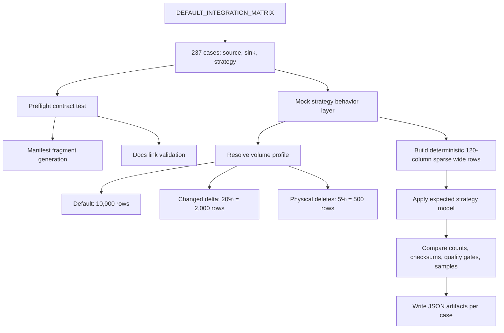

# Source -> Sink Integration Matrix Runbook

The source -> sink matrix validates every supported source family, sink family, and load strategy through one canonical registry: `dpone.integration_matrix`.

The registry currently contains:

- 5 source families: Postgres, MSSQL, ClickHouse, REST API, Kafka.
- 5 sink families: MSSQL, Postgres, ClickHouse, BigQuery, Kafka.
- 4 common base strategies: `full_refresh`, `incremental_append`, `incremental_merge`, `replace`.
- 1 common production diff strategy: `snapshot_diff` for all sinks.
- 3 DB-target production strategies: `partition_replace`, `scd2`, and `backfill` for MSSQL, Postgres, ClickHouse, and BigQuery sinks.
- Source-specific strategies: Postgres `xmin`, Postgres `cdc`, MSSQL `cdc`.
- 237 source -> sink -> strategy cases. The executable
  `DEFAULT_INTEGRATION_MATRIX` registry is authoritative for the exact
  source/sink/strategy breakdown.

## Run modes

| Run mode | External credentials | Services | Scope |
| --- | --- | --- | --- |
| `mock_contract` | no | none | All 237 cases. Manifest shape, docs links, source-specific `xmin`/`cdc`, common `snapshot_diff`, DB-target `partition_replace`/`scd2`/`backfill`, wide-column strategy behavior model, configurable row/change/delete volumes, and artifact generation. |
| `mock_local` | no | local Postgres, MySQL, ClickHouse, MSSQL, Kafka, Schema Registry, REST mock where needed | Local/mock-capable cases. BigQuery sink cases are documented-contract only and skipped. |
| `real_local` | no | local Postgres, MySQL, ClickHouse, MSSQL, Kafka, Schema Registry, REST mock where needed | Release-candidate behavioral mode. Retains raw service/matrix evidence that a separate exact-SHA pre-tag workflow validates; it does not itself produce release authority. |
| `vendor_live` | yes | caller-provided managed services | Real BigQuery, real APIs, managed Kafka, or other external endpoints. |

Credentials are only required for `vendor_live`. `mock_contract`, `mock_local`,
and `real_local` use deterministic fixtures, local containers, or in-process
mock services.

## Manual GitHub Actions

Workflow:

```text
.github/workflows/integration-matrix.yml
```

Default manual run:

```text
run_mode=mock_local
source_filter=*
sink_filter=*
strategy_filter=*
case_id_filter=*
```

Focused run:

```text
run_mode=mock_local
case_id_filter=postgres_to_mssql__incremental_merge
```

Backfill-specific managed/vendor certification is exposed through
`.github/workflows/live-certification.yml` with `profile=vendor_live` and
`run_vendor_live=true`. That profile fixes `DPONE_MATRIX_STRATEGY=backfill`,
does not start local Docker services, and lets operators narrow the managed
blast radius with `vendor_backfill_source_filter`,
`vendor_backfill_sink_filter`, and `vendor_backfill_case_id_filter`.

The vendor-live backfill workflow also runs
`dpone ops managed-credentials-readiness` before the matrix, then its matrix and
load-step artifacts can be fed back into the performance advisor:

```bash
dpone backfill plan <manifest.yml> --advisor \
  --advisor-evidence test_artifacts/live_certification_vendor/backfill_matrix/certification_report.json \
  --advisor-evidence test_artifacts/acceptance/load_steps.json
```

## Local commands

All 237 contract cases without external services:

```bash
DPONE_RUN_INTEGRATION=1 \
DPONE_RUN_INTEGRATION_MATRIX=1 \
DPONE_MATRIX_RUN_MODE=mock_contract \
DPONE_MATRIX_ARTIFACT_DIR=test_artifacts/integration_matrix/mock_contract_latest \
uv run pytest -m integration_matrix tests/integration/matrix -q
```

Local/mock layer with artifacts:

```bash
DPONE_RUN_INTEGRATION=1 \
DPONE_RUN_INTEGRATION_MATRIX=1 \
DPONE_MATRIX_RUN_MODE=mock_local \
DPONE_MATRIX_ARTIFACT_DIR=test_artifacts/integration_matrix/mock_local_latest \
uv run pytest -m integration_matrix_mock tests/integration/matrix -q
```

Focused case:

```bash
DPONE_RUN_INTEGRATION=1 \
DPONE_RUN_INTEGRATION_MATRIX=1 \
DPONE_MATRIX_RUN_MODE=mock_local \
DPONE_MATRIX_CASE_ID=mssql_to_clickhouse__replace \
DPONE_MATRIX_ARTIFACT_DIR=test_artifacts/integration_matrix/focused \
uv run pytest -m integration_matrix_mock tests/integration/matrix -q
```

## How it works under the hood



### Preflight contract layer

The preflight test validates that each case has:

- A source and sink family from the canonical matrix.
- One of the common base strategies, common `snapshot_diff`, DB-target `partition_replace`/`scd2`/`backfill`, or a supported source-specific strategy: Postgres `xmin`, Postgres `cdc`, or MSSQL `cdc`.
- Required install extras and local/live profiles.
- A copy/paste guide under [docs/source-sink](https://github.com/PaulKov/dpone/tree/master/docs/source-sink).
- Links from `source-sink-matrix.md` and `load-strategies.md`.
- A generated manifest fragment with the expected source, sink, and strategy mode.

### Mock strategy behavior layer

The mock behavior layer runs for every selected case through `IntegrationMatrixCase.simulate_mock_strategy_behavior()`. It is intentionally credential-free, but it is not a toy two-row fixture anymore.

Default behavior per case:

| Setting | Default | Override | Limit |
| --- | ---: | --- | ---: |
| Base source snapshot | 10,000 rows | `DPONE_MATRIX_MOCK_ROW_COUNT` or `row_count=` | 100,000 rows |
| Changed delta | 20% = 2,000 rows | `DPONE_MATRIX_CHANGE_RATIO` or `change_ratio=` | 0.0 to 1.0 |
| Physical deletes | 5% = 500 rows | `DPONE_MATRIX_DELETE_RATIO` or `delete_ratio=` | Must be <= change ratio |
| Wide payload | 120 columns | fixed contract | 120 columns |

The delta is deterministic. With defaults, every incremental-like strategy models:

- 500 physical delete keys.
- 1,000 updated rows.
- 500 inserted rows.
- Target/source reconciliation checks that the target matches the source snapshot after the load.

Only compact samples are written to JSON artifacts. Full-volume invariants are still checked through count fields, checksums, quality gates, and deterministic row id ranges. This keeps artifacts small while proving 10k/2k/500 behavior across every matrix case.

## Fixtures and volumes

### Mock source/target fixtures

The credential-free matrix uses deterministic in-memory fixtures generated by `IntegrationMatrixCase.simulate_mock_strategy_behavior()`. It does not create physical database tables. The goal is to prove strategy semantics for every source -> sink combination without requiring services or credentials.

| Fixture | Logical volume | Purpose |
| --- | ---: | --- |
| `target_before` | `configured_row_count` | Existing target state before a strategy is applied. Samples include rows that will be deleted, stale rows that will be updated, and stable rows that should remain valid. |
| `source_rows` for `full_refresh` | `configured_row_count` | Complete source snapshot boundary. |
| `source_rows` for `incremental_append` | `changed_row_count` | Append delta with update/insert/delete event semantics preserved as row metadata. |
| `source_rows` for `incremental_merge` | `changed_row_count` | Delete-aware upsert delta: delete keys, updates, and inserts. |
| `source_rows` for `replace` | `changed_row_count - deleted_row_count` | Replacement window rows after physical deletes are accounted for by the bounded replace predicate. |
| `source_rows` for `partition_replace` | `changed_row_count - deleted_row_count` | Complete replacement rows for staged partition values. |
| `source_rows` for `snapshot_diff` | current source snapshot | Complete source snapshot after changed rows, inserted rows, and physical deletes are accounted for. |
| `source_rows` for `scd2` | current source snapshot | Dimension snapshot that closes changed/deleted current rows and inserts new current versions. |
| `source_rows` for `backfill` | `changed_row_count - deleted_row_count` | Historical chunk rows passed to the configured inner strategy, usually `partition_replace`. |
| `source_rows` for `xmin` | `changed_row_count` | Postgres transaction-id delta plus snapshot reconciliation semantics for physical deletes. |
| `source_rows` for `cdc` | `changed_row_count` | CDC update, insert, and delete events. |

Each mock row has stable business fields plus 120 wide columns named `wide_<source>_<ordinal>_<type_family>`. The wide columns have deterministic null sparsity so tests exercise dense columns, 25% sparse columns, 50% sparse columns, and 90% sparse columns in the same fixture.

The wide payload covers representative type families rather than one physical dialect table:

- numeric and monetary: integer, unsigned-like integer, decimal, numeric, money, float;
- temporal: date, time, timestamp, timestamptz, datetime2, datetimeoffset;
- text: char, varchar, text, nchar, nvarchar;
- binary: binary and varbinary encoded values;
- semi-structured: JSON, JSONB-like, XML, map, tuple, nested, composite;
- collection/range: arrays and range-like values;
- spatial/network/system-ish: point, geometry, geography, inet, cidr, macaddr, bit, varbit, pg_lsn, oid, rowversion, sql_variant, hierarchyid;
- ClickHouse-like families: low-cardinality-like, nullable-like, IPv4, IPv6.

## Strategy semantics

| Strategy | Database sink behavior | Kafka sink behavior | Delete handling |
| --- | --- | --- | --- |
| `full_refresh` | Target is replaced by the full source snapshot through staging/shadow flow. | Emits `snapshot` events. | Source snapshot is authoritative. |
| `incremental_append` | Delta rows are appended; existing rows are preserved. | Emits insert/update/delete events as an append-only log. | Delete events are preserved as append rows/events, not target mutations. |
| `incremental_merge` | Delete-aware upsert by key; target count/checksum must match source snapshot after reconciliation. | Emits keyed `upsert` and `delete` events. | Physical delete keys must be absent from DB targets after load. |
| `replace` | Bounded predicate window is replaced through staging; no heavy direct writes to final target. | Emits `replace` and optional delete events with predicate metadata. | Missing rows inside the replacement window are removed by the replace boundary. |
| `partition_replace` | Complete staged partition slices replace matching target partitions. | Not supported. | Missing rows inside replaced partitions are removed by the partition boundary. |
| `snapshot_diff` | Complete snapshot is compared by `unique_key` and `__dpone__row_hash`; target-only keys follow `delete_policy`. | Emits keyed `upsert` and `delete` events. | Physical delete keys must be absent or tombstoned according to sink behavior. |
| `scd2` | Changed current rows are expired and new current versions are inserted with `__dpone__valid_*` columns. | Not supported. | Deletes expire current rows by default. |
| `backfill` | Deterministic chunks delegate to an inner staged strategy and commit chunk state independently. | Not supported. | Delete handling is inherited from the configured inner strategy. |
| `xmin` | Postgres-only bounded XMin delta merged by key and paired with snapshot reconciliation for physical deletes. | Emits keyed `upsert` and `delete` events. | Supported only for Postgres sources. |
| `cdc` | Insert/update/delete events are applied after sink success. | Emits original `insert`, `update`, and `delete` events. | Supported for Postgres and MSSQL sources in this matrix. |

### Volume profile

| Layer | Physical services | Default rows per case | Changed rows | Physical deletes | Wide columns | Main proof |
| --- | --- | ---: | ---: | ---: | ---: | --- |
| `mock_contract` | none | 10,000 | 2,000 | 500 | 120 | Every matrix case has explicit strategy semantics, quality gates, and artifacts. |
| `mock_local` | local services may be started by workflow, but matrix runner remains credential-free | 10,000 | 2,000 | 500 | 120 | Local/mock-capable cases are selected correctly; BigQuery target cases are skipped intentionally. |
| connector-specific integration tests | Postgres, MySQL, MSSQL, ClickHouse, Kafka where available | connector-dependent | connector-dependent | connector-dependent | connector-dependent | Native connector behavior such as staging, bcp, COPY, ClickHouse insert, Kafka codecs. |
| stress/benchmark suites | real local or managed services | millions of rows / GB-scale when enabled | workload-specific | workload-specific | source-specific wide schemas | Throughput, memory, native bulk paths, lock behavior, and long-running SLOs. |

Therefore, this matrix is a strategy-correctness and documentation/certification contract. It is not a throughput benchmark. Large tables such as 10GB/50M rows belong to stress artifacts and live/local benchmark workflows.

## Live certification handoff

When matrix behavior changes touch native clients, staging, state, deletes, CDC,
or target finalizers, run [Live certification](../live-certification.md) after
the default `mock_contract` layer.

```bash
dpone ops live-certification-plan \
  --profile local_live \
  --row-count 25000 \
  --output-dir test_artifacts/live_certification/plan \
  --format json
```

The `local_live` profile starts services from
`docker/docker-compose.integration.yml`, runs service markers, seven MySQL
route cells, and the complete matrix in `mock_contract` mode. Retained status is derived
from the exact JUnit cases; planning output is not certification evidence.
Run `benchmark-slo-gate`, certification-pack, and evidence-chain producers
separately when those domains are required.

Use `vendor_live` only for provider/API cases that require real external
credentials.

For minor and major release candidates, use `real_local`:

```bash
dpone ops live-certification-plan \
  --profile real_local \
  --row-count 25000 \
  --output-dir test_artifacts/live_certification/plan \
  --format json
```

`real_local` keeps the generic matrix in complete, credential-free
`DPONE_MATRIX_RUN_MODE=mock_contract` mode and records service-backed fixtures
under the `real_local` evidence profile. It is the required local test profile
before minor and major releases. It does not manufacture
`performance-certification`, `live-state-reconciliation`, or
`pre-release-checklist` / `release-evidence-pack` artifacts. Run their real
producers with observed inputs; otherwise record those domains as `UNVERIFIED`.
The pre-release checklist records `docker_live_routes=true` only after the
Postgres -> MSSQL and MSSQL -> ClickHouse Docker-live route evidence exists,
and records `documentation_mkdocs=true` only after the strict documentation
build is green.
Route-heavy release candidates should also generate
`route_schema_evolution.json` and `route_reconciliation_repair.json` with
`dpone ops route-schema-evolution` and
`dpone ops route-reconciliation-repair`, then attach those artifacts to route
readiness before the final route release gate.

## Why direct mock_local and real_local matrix runs have 86 skipped tests

Direct `mock_local` and `real_local` matrix modes intentionally skip BigQuery
target cases because
BigQuery is a managed service and these workflows do not require GCP
credentials or a BigQuery emulator.

The arithmetic is explicit:

| Reason | Cases | Tests per case | Skipped tests |
| --- | ---: | ---: | ---: |
| BigQuery target documented-contract cases | 43 | 2 | 86 |

Those 43 BigQuery cases are validated by the workflow's `mock_contract` matrix
and should be exercised against a real project through `vendor_live`
certification.

## Artifact schema

When `DPONE_MATRIX_ARTIFACT_DIR` is set, each case writes two JSON artifacts:

```text
<case_id>.json
<case_id>__behavior.json
```

Metadata artifact example:

```json
{
  "case_id": "postgres_to_mssql__incremental_merge",
  "source": "postgres",
  "sink": "mssql",
  "strategy": "incremental_merge",
  "guide": "source-sink/postgres-to-mssql.md"
}
```

Behavior artifact example:

```json
{
  "case_id": "postgres_to_mssql__incremental_merge",
  "strategy": "incremental_merge",
  "configured_row_count": 10000,
  "changed_row_count": 2000,
  "deleted_row_count": 500,
  "target_before_count": 10000,
  "source_row_count": 2000,
  "expected_row_count": 10000,
  "actual_row_count": 10000,
  "expected_checksum": "e4f2a111",
  "actual_checksum": "e4f2a111",
  "quality_checks": [
    "row_count_matches_source_snapshot",
    "checksum_matches_source_snapshot",
    "delete_keys_absent",
    "wide_columns_preserved",
    "no_unexpected_null_density"
  ],
  "passed": true
}
```

Artifacts are intentionally safe to upload because they contain deterministic mock rows and no credentials.

## What mock_contract proves

`mock_contract` proves:

- Every documented source -> sink pair exists in the canonical registry.
- Every pair has the four base strategy contracts.
- Postgres `xmin`, Postgres `cdc`, and MSSQL `cdc` are included where supported.
- Every pair has copy/paste documentation links.
- Generated manifests are structurally consistent.
- Strategy semantics are explicitly modeled for all 237 cases.
- Default matrix behavior uses 10,000 rows, 2,000 changed rows, and 500 physical delete keys per case.
- Per-case artifacts can be produced without credentials.
- Wide 120-column source rows with deterministic sparsity are preserved across append/merge/replace/xmin/cdc mock behavior checks.

## What mock_contract does not prove

`mock_contract` does not prove:

- Native database clients are installed.
- MSSQL `bcp`, Postgres `COPY`, ClickHouse direct insert, or Kafka producer/consumer are working.
- BigQuery managed writes work in a real project.
- Vendor API credentials or network paths are valid.
- Production-size performance, lock behavior, or cloud IAM is correct.

Use `mock_local` for local service behavior and `vendor_live` for managed service certification.

## Runbook: failure recovery

Failure: a case is missing a guide.

- Add or fix the guide under [docs/source-sink](https://github.com/PaulKov/dpone/tree/master/docs/source-sink).
- Link it from [Source -> sink matrix](../source-sink-matrix.md) and [Load strategies](../load-strategies.md).
- Run `uv run pytest tests/test_docs_source_sink_contracts.py tests/test_integration_matrix_contracts.py -q`.

Failure: strategy behavior artifact differs from expected rows.

- Open `<case_id>__behavior.json` under `DPONE_MATRIX_ARTIFACT_DIR`.
- Compare `configured_row_count`, `changed_row_count`, `deleted_row_count`, `expected_row_count`, `actual_row_count`, `expected_checksum`, and `actual_checksum` before inspecting samples.
- Inspect sampled `target_before`, `source_rows`, `expected_rows`, and `actual_rows` only after count/checksum differences are understood.
- If the strategy semantics changed intentionally, update `IntegrationMatrixCase.simulate_mock_strategy_behavior()` and this runbook in the same commit.
- If only one system behaves differently, keep the generic matrix model stable and add a connector-specific integration test instead.

Failure: a case should run locally but is skipped.

- Check `IntegrationMatrixCase.local_service_supported`.
- For BigQuery, keep `local_service_supported=false` unless a real emulator-backed strategy is added.
- For REST API, use an in-process mock server instead of real API credentials.

Failure: artifacts are missing.

- Set `DPONE_MATRIX_ARTIFACT_DIR=test_artifacts/integration_matrix`.
- Check that the workflow upload step runs with `if: always()`.
- Re-run a focused case with `DPONE_MATRIX_CASE_ID=<case>`.

Failure: vendor credentials are requested in mock mode.

- Treat this as a bug.
- `case.external_credentials_required` must remain `False` for matrix mock modes.
- Move real credential checks into `vendor_live` docs and workflows.

## Related docs

- [Testing overview](index.md)
- [Local MSSQL mock matrix](local-mssql-mock-matrix.md)
- [Integration tests](integration-tests.md)
- [Source -> sink matrix](../source-sink-matrix.md)
- [Load strategies](../load-strategies.md)
