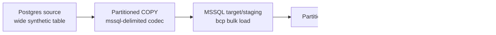

# Native transfer benchmark artifact: Postgres -> MSSQL -> ClickHouse

Artifact ID: `native-transfer-benchmarks-2026-06-08`

Date: `2026-06-08`

Executed by: `Codex`

Environment: local Docker live-certification stack from `docker/docker-compose.integration.yml`.

Scope:

- `Postgres -> MSSQL` native fast path through PostgreSQL `COPY`, lossless MSSQL-delimited artifacts, and MSSQL `bcp`.
- `MSSQL -> ClickHouse` native fast path through MSSQL `bcp queryout` partition artifacts and ClickHouse HTTP `INSERT ... FORMAT TabSeparated`.
- Full-refresh correctness for `10,000`, `1,000,000`, and `10,000,000` source rows.

Raw JSON artifacts:

- `test_artifacts/live_certification/benchmarks/postgres_mssql_native_fast_path_local_10k.json`
- `test_artifacts/live_certification/benchmarks/postgres_mssql_native_fast_path_local_1m.json`
- `test_artifacts/live_certification/benchmarks/postgres_mssql_native_fast_path_local_10m.json`
- `test_artifacts/live_certification/benchmarks/postgres_mssql_native_fast_path_local_10k_diagnostics.json`
- `test_artifacts/live_certification/benchmarks/postgres_mssql_native_fast_path_local_10k_optimizer_profile.json`
- `test_artifacts/live_certification/benchmarks/native_tuning_matrix_10k_2026_06_08/summary.json`
- `test_artifacts/live_certification/benchmarks/native_tuning_matrix_10k_2026_06_09/summary.json`
- `test_artifacts/live_certification/benchmarks/native_resume_certification_2026_06_08/native_transfer_resume_mssql_clickhouse_after_export_2026_06_08.json`
- `test_artifacts/live_certification/benchmarks/native_resume_certification_2026_06_08/native_transfer_resume_mssql_clickhouse_during_load_2026_06_08.json`
- `test_artifacts/live_certification/benchmarks/native_resume_certification_2026_06_08/native_transfer_resume_mssql_clickhouse_before_finalizer_2026_06_08.json`
- `test_artifacts/live_certification/benchmarks/native_fault_injection_2026_06_08/summary.json`
- `test_artifacts/live_certification/benchmarks/native_fault_injection_2026_06_09/summary.json`
- `test_artifacts/live_certification/benchmarks/native_fault_injection_2026_06_09/partition_checkpoints.jsonl`
- `test_artifacts/live_certification/benchmarks/native_resume_correctness_2026_06_09/summary.json`
- `test_artifacts/live_certification/benchmarks/native_resume_correctness_2026_06_09/partition_checkpoints.jsonl`
- `test_artifacts/live_certification/benchmarks/native_runtime_resume_2026_06_09/summary.json`
- `test_artifacts/live_certification/benchmarks/native_runtime_resume_2026_06_09/partition_checkpoints.jsonl`
- `test_artifacts/live_certification/benchmarks/native_dpone_run_2026_06_09/mssql_to_clickhouse_native_run_cert.yml`
- `test_artifacts/live_certification/benchmarks/native_dpone_run_2026_06_09/native_transfer_run_certification.json`
- `test_artifacts/live_certification/benchmarks/native_dpone_run_2026_06_09/native_transfer_run_certification.md`
- `test_artifacts/live_certification/benchmarks/native_benchmark_certification_2026_06_09.json`
- `test_artifacts/live_certification/benchmarks/native_benchmark_certification_2026_06_09.md`

!!! note
    This artifact is local-live evidence, not a vendor-neutral hardware SLO. Use it to compare dpone changes on the same runner and to prove correctness/shape of the native transfer path. Publish customer-facing SLOs from dedicated x86_64 runners with stable CPU, disk, network, and database sizing.

## Full `dpone run` certification

Artifact ID: `native-dpone-run-2026-06-09`

This check proves the complete user-facing execution path:

- a disposable single-process manifest is generated with `connection_type: params`;
- `state.type: mssql` creates an SQL-backed `partition_checkpoint_table`;
- the first execution runs through `dpone.api.run`, the Python equivalent of
  `dpone run`;
- the second execution reuses the same manifest and state table and must be a
  no-op skip with `inserted_rows = 0`;
- evidence is written as JSON and Markdown for audit/release review.

Run command:

```bash
uv run python tools/mssql_clickhouse_run_certification.py \
  --rows 10000 \
  --target-rows-per-partition 2500 \
  --export-workers 4 \
  --load-workers 4 \
  --output-dir test_artifacts/live_certification/benchmarks/native_dpone_run_2026_06_09
```

Passing criteria:

| Check | Expected |
|---|---|
| `first_run_passed` | `true` |
| `second_run_passed` | `true` |
| `committed_checkpoints_exist` | `true` |
| `runtime_reports_exist` | `true` |
| `second_run_noop_skip` | `true` |

## Test topology



## Dataset and parameters

| Rows | Partitions | Export workers | Load workers | Batch size | Partition column | ClickHouse ingest |
| ---: | ---: | ---: | ---: | ---: | --- | --- |
| 10,000 | 4 | 2 | 2 | 5,000 | `id` | HTTP TabSeparated |
| 1,000,000 | 8 | 4 | 4 | 100,000 | `id` | HTTP TabSeparated |
| 10,000,000 | 8 | 4 | 4 | 250,000 | `id` | HTTP TabSeparated |

The benchmark table is generated by `tools/mssql_stress.py` and includes mixed numeric, text, Unicode, decimal, timestamp, nullable, and empty-string values. The native bulk safety layer rejects character-mode bulk transfer for unsafe binary/spatial/variant SQL types unless a lossless projection is available.

## Diagnostics smoke

The diagnostic smoke run writes
`test_artifacts/live_certification/benchmarks/postgres_mssql_native_fast_path_local_10k_diagnostics.json`.

Observed split on the local runner:

| Phase | Rows | Seconds | Rows/sec |
| --- | ---: | ---: | ---: |
| `postgres_to_mssql.source_export` | 10,000 | 0.033 | 307,225.96 |
| `postgres_to_mssql.target_load_finalize` | 10,000 | 0.239 | 41,869.71 |
| `mssql_to_clickhouse.source_export` | 10,000 | 0.383 | 26,141.95 |
| `mssql_to_clickhouse.target_load_finalize` | 10,000 | 0.066 | 151,763.49 |
| `mssql_count_reconciliation` | 10,000 | 0.002 | 6,167,764.43 |
| `clickhouse_count_reconciliation` | 10,000 | 0.002 | 6,349,371.63 |

This split shows the local 10k bottleneck is MSSQL `bcp queryout`, not
ClickHouse HTTP ingest.

## Optimizer profile smoke

`high_throughput_safe` was smoke-tested on 10k rows with:

```bash
PYTHONUNBUFFERED=1 uv run python tools/mssql_stress.py \
  --rows 10000 \
  --batch-size 5000 \
  --bcp-path /opt/homebrew/bin/bcp \
  --optimizer-profile high_throughput_safe \
  --partition-column id \
  --lower-bound 1 \
  --upper-bound 10000 \
  --num-partitions 4 \
  --export-workers 2 \
  --load-workers 2 \
  --reconciliation-profile count_and_checksum \
  --clickhouse-bulk-mode http \
  --clickhouse-http-host 127.0.0.1 \
  --clickhouse-http-port 58123 \
  --json-output test_artifacts/live_certification/benchmarks/postgres_mssql_native_fast_path_local_10k_optimizer_profile.json
```

Use `--reconciliation-profile sample_hash` when validating codec, escaping, or
ClickHouse insert-format changes. Use `--reconciliation-profile full_partition_hash`
for bounded release-certification slices where stronger evidence is more
important than runtime cost.

Result: count reconciliation passed for MSSQL and ClickHouse. On this tiny
10k smoke, ClickHouse `target_load_finalize` was slower with the profile
because async insert acceptance has fixed overhead. Treat this as a correctness
smoke, not as proof that the profile is faster for small loads. Compare profile
performance on 1M/10M+ tuning matrix runs before changing production defaults.

## Failure/resume certification contract

The next production certification layer for this native path is failure/resume
evidence. The reusable contract is documented in
[MSSQL -> ClickHouse failure/resume certification](../source-sink/mssql-to-clickhouse.md#failureresume-certification).

Required scenarios:

| Scenario | Must prove |
|---|---|
| `after_export` | Exported partitions are not treated as committed and source state does not advance before retry success. |
| `during_load` | Partial target loads do not create duplicates after retry. |
| `before_finalizer` | Finalizer/reconciliation can be rerun and state advances only after committed checkpoints. |

The evidence writer emits JSON/Markdown with schema version
`dpone.native_transfer.resume_evidence.v1`.

Sample evidence artifacts generated on `2026-06-08`:

| Scenario | JSON artifact | Markdown artifact |
|---|---|---|
| `after_export` | `test_artifacts/live_certification/benchmarks/native_resume_certification_2026_06_08/native_transfer_resume_mssql_clickhouse_after_export_2026_06_08.json` | `test_artifacts/live_certification/benchmarks/native_resume_certification_2026_06_08/native_transfer_resume_mssql_clickhouse_after_export_2026_06_08.md` |
| `during_load` | `test_artifacts/live_certification/benchmarks/native_resume_certification_2026_06_08/native_transfer_resume_mssql_clickhouse_during_load_2026_06_08.json` | `test_artifacts/live_certification/benchmarks/native_resume_certification_2026_06_08/native_transfer_resume_mssql_clickhouse_during_load_2026_06_08.md` |
| `before_finalizer` | `test_artifacts/live_certification/benchmarks/native_resume_certification_2026_06_08/native_transfer_resume_mssql_clickhouse_before_finalizer_2026_06_08.json` | `test_artifacts/live_certification/benchmarks/native_resume_certification_2026_06_08/native_transfer_resume_mssql_clickhouse_before_finalizer_2026_06_08.md` |

Local-live fault-injection evidence:

```bash
PYTHONUNBUFFERED=1 uv run python tools/mssql_clickhouse_fault_injection.py \
  --rows 10000 \
  --batch-size 5000 \
  --bcp-path /opt/homebrew/bin/bcp \
  --optimizer-profile high_throughput_safe \
  --partition-column id \
  --lower-bound 1 \
  --upper-bound 10000 \
  --num-partitions 4 \
  --export-workers 2 \
  --load-workers 2 \
  --clickhouse-bulk-mode http \
  --clickhouse-http-host 127.0.0.1 \
  --clickhouse-http-port 58123 \
  --output-dir test_artifacts/live_certification/benchmarks/native_fault_injection_2026_06_08 \
  --json-output test_artifacts/live_certification/benchmarks/native_fault_injection_2026_06_08/summary.json
```

Result: `summary.json` passed for `after_export`, `during_load`, and
`before_finalizer`. The workflow performs real MSSQL exports and real
ClickHouse retry loads, then evaluates controlled checkpoint boundaries through
the reusable resume certification service.

The same workflow writes an append-only partition checkpoint trail:

```text
test_artifacts/live_certification/benchmarks/native_fault_injection_2026_06_08/partition_checkpoints.jsonl
```

Each line is one partition transition. The latest-state view must end in
`committed` for every partition after a successful retry, while pre-retry states
such as `exported`, `loaded`, or `finalized` remain in the audit log for
forensics.

`native_resume_correctness_2026_06_09/summary.json` extends this evidence with
checkpoint-driven resume plans and partition-level data correctness:

| Evidence field | Meaning |
|---|---|
| `resume_plan.summary.skip` | Partitions that can be skipped because durable checkpoints are already `committed` with matching hashes. |
| `resume_plan.summary.retry` | Partitions that must be retried because they are missing, partial, stale or hash-mismatched. |
| `partition_correctness.total_source_rows` | Sum of source rows across all partition observations. |
| `partition_correctness.total_target_rows` | Sum of target rows across all partition observations. |
| `partition_correctness.checks` | Per-partition count and checksum checks. |

The 10k local-live run passed for `after_export`, `during_load` and
`before_finalizer`. Each stage produced `retry: 4`, `skip: 0` after the injected
partial state, then completed with `partition_correctness_passed: true` and
`checkpoint_summary.committed: 4`.

`native_runtime_resume_2026_06_09/summary.json` adds runtime report artifacts
for each stage:

- `native_transfer_runtime_mssql_clickhouse_after_export_*.json`;
- `native_transfer_runtime_mssql_clickhouse_during_load_*.json`;
- `native_transfer_runtime_mssql_clickhouse_before_finalizer_*.json`.

Each runtime report contains the checkpoint summary, resume plan, partition
correctness result and overall pass flag in schema
`dpone.native_transfer.runtime_report.v1`.

Normal `dpone run` uses the same checkpoint contract when a SQL-backed
partition checkpoint store is hydrated from `state.type: mssql` or
`state.type: postgres`. Runtime execution writes the same report schema under
`runtime_evidence.output_dir`; the live fault-injection harness adds
partition-correctness observations around the same skip/retry decisions.

## Benchmark certification summary

`native_benchmark_certification_2026_06_09.json` certifies the existing 10k,
1M and 10M live artifacts through `NativeBenchmarkCertificationService`.

| Dataset | Purpose | Throughput SLO | Result |
|---|---|---|---|
| `10k` | Correctness smoke | Not enforced because fixed overhead dominates | passed |
| `1m` | Large local-live benchmark | PG -> MSSQL >= 80k rps, MSSQL -> ClickHouse >= 30k rps | passed |
| `10m` | Large local-live benchmark | PG -> MSSQL >= 80k rps, MSSQL -> ClickHouse >= 30k rps | passed |

The service supports both current split `phase_metrics` artifacts and older
aggregate `metrics` artifacts, so historical benchmark evidence stays
certifiable.

## Postgres -> MSSQL results

| Rows | Seconds | Rows/sec | MSSQL final count | Status |
| ---: | ---: | ---: | ---: | --- |
| 10,000 | 0.280 | 35,746.72 | 10,000 | passed |
| 1,000,000 | 10.783 | 92,734.52 | 1,000,000 | passed |
| 10,000,000 | 117.466 | 85,131.25 | 10,000,000 | passed |

Correctness assertion: `mssql_count == source rows` for every run.

### Diagnostic fields for new runs

New benchmark artifacts include a split timing and artifact diagnostics block:

```json
{
  "phase_metrics": [
    {"name": "postgres_to_mssql.source_export"},
    {"name": "postgres_to_mssql.target_load_finalize"},
    {"name": "mssql_to_clickhouse.source_export"},
    {"name": "mssql_to_clickhouse.target_load_finalize"},
    {"name": "mssql_count_reconciliation"},
    {"name": "clickhouse_count_reconciliation"}
  ],
  "transfers": {
    "postgres_to_mssql_full_refresh": {
      "artifact": {
        "partition_count": 8,
        "total_bytes": 0,
        "total_mb": 0.0,
        "mb_per_second": 0.0,
        "partition_row_skew": 0
      }
    }
  }
}
```

Use the split metrics to decide where to tune:

- `source_export` slow: tune source partitioning, `export_workers`, source SQL, disk artifact path, and native export settings.
- `target_load_finalize` slow: tune `load_workers`, target bulk settings, staging table design, target indexes, and finalizer policy.
- `count_reconciliation` slow: tune count/checksum strategy or run heavy reconciliation asynchronously.

## MSSQL -> ClickHouse results

| Rows | Seconds | Rows/sec | ClickHouse final count | Status |
| ---: | ---: | ---: | ---: | --- |
| 10,000 | 0.459 | 21,790.26 | 10,000 | passed |
| 1,000,000 | 25.639 | 39,002.78 | 1,000,000 | passed |
| 10,000,000 | 247.140 | 40,462.95 | 10,000,000 | passed |

Correctness assertion: `clickhouse_count == source rows` for every run.

## Source preparation baseline

| Rows | Seconds | Rows/sec |
| ---: | ---: | ---: |
| 10,000 | 0.076 | 130,922.75 |
| 1,000,000 | 1.063 | 941,116.39 |
| 10,000,000 | 10.578 | 945,359.44 |

## Commands used

10k smoke:

```bash
PYTHONUNBUFFERED=1 uv run python tools/mssql_stress.py \
  --rows 10000 \
  --batch-size 5000 \
  --bcp-path /opt/homebrew/bin/bcp \
  --partition-column id \
  --lower-bound 1 \
  --upper-bound 10000 \
  --num-partitions 4 \
  --export-workers 2 \
  --load-workers 2 \
  --clickhouse-bulk-mode http \
  --clickhouse-http-host 127.0.0.1 \
  --clickhouse-http-port 58123 \
  --json-output test_artifacts/live_certification/benchmarks/postgres_mssql_native_fast_path_local_10k.json
```

1M benchmark:

```bash
PYTHONUNBUFFERED=1 uv run python tools/mssql_stress.py \
  --rows 1000000 \
  --batch-size 100000 \
  --bcp-path /opt/homebrew/bin/bcp \
  --partition-column id \
  --lower-bound 1 \
  --upper-bound 1000000 \
  --num-partitions 8 \
  --export-workers 4 \
  --load-workers 4 \
  --clickhouse-bulk-mode http \
  --clickhouse-http-host 127.0.0.1 \
  --clickhouse-http-port 58123 \
  --json-output test_artifacts/live_certification/benchmarks/postgres_mssql_native_fast_path_local_1m.json
```

10M benchmark:

```bash
PYTHONUNBUFFERED=1 uv run python tools/mssql_stress.py \
  --rows 10000000 \
  --batch-size 250000 \
  --bcp-path /opt/homebrew/bin/bcp \
  --partition-column id \
  --lower-bound 1 \
  --upper-bound 10000000 \
  --num-partitions 8 \
  --export-workers 4 \
  --load-workers 4 \
  --clickhouse-bulk-mode http \
  --clickhouse-http-host 127.0.0.1 \
  --clickhouse-http-port 58123 \
  --json-output test_artifacts/live_certification/benchmarks/postgres_mssql_native_fast_path_local_10m.json
```

Tuning matrix:

```bash
PYTHONUNBUFFERED=1 uv run python tools/mssql_benchmark_suite.py \
  --rows 10000,1000000 \
  --partitions 4,8 \
  --export-workers 2,4,8 \
  --load-workers 2,4,8 \
  --batch-size 100000 \
  --bcp-path /opt/homebrew/bin/bcp \
  --optimizer-profile high_throughput_safe \
  --clickhouse-bulk-mode http \
  --clickhouse-http-host 127.0.0.1 \
  --clickhouse-http-port 58123 \
  --output-dir test_artifacts/live_certification/benchmarks/native_tuning_matrix_latest \
  --continue-on-fail
```

The suite writes one JSON artifact per scenario plus `summary.json`. Scenario
names use independent worker dimensions, for example
`rows1000000_p8_ew4_lw8`.

New suite summaries include:

- per-scenario `certification`;
- top-level `certification_passed`;
- row-count and target-count checks;
- configured throughput SLO checks;
- bottleneck phase and tuning recommendations.

Verified local tuning smoke:

| Scenario | Rows | Partitions | Export workers | Load workers | Result |
| --- | ---: | ---: | ---: | ---: | --- |
| `rows10000_p4_ew2_lw2` | 10,000 | 4 | 2 | 2 | passed |
| `rows10000_p4_ew2_lw4` | 10,000 | 4 | 2 | 4 | passed |

## Interpreting failures

Failure: `mssql_count` is lower than source rows.

- Check `bcp` stderr and partition artifact metadata first.
- Verify `source.options.partitioning.bounds.lower` and `source.options.partitioning.bounds.upper`.
- Check that no unsafe source type bypassed the MSSQL bulk safety guard.

Failure: `clickhouse_count` is lower than MSSQL rows.

- Check ClickHouse HTTP status and `system.query_log` for the generated `query_id`.
- Re-run with fewer `load_workers` when ClickHouse parts or merge pressure is high.
- Verify target/staging table schema and TabSeparated codec compatibility.

Failure: throughput regresses.

- Compare the same row count on the same runner before changing SLOs.
- Inspect local disk pressure because both legs use durable partition artifacts.
- Lower or raise `export_workers` and `load_workers` separately; source export and target ingest saturate different resources.
