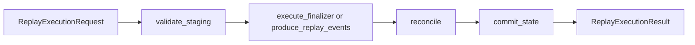

# Replay integration gate

The replay integration gate validates that `dpone resync` and `dpone resume` can execute through the same adapter contracts that production backends use: staging validation, finalization, reconciliation, and state commit.

It is intentionally separate from the full source -> sink integration matrix. Replay is a recovery/control-plane gate, while the matrix is a data-plane gate.

## What it covers

| Area | Coverage |
|---|---|
| DB replay adapters | MSSQL-style staged finalization through an injected SQL client |
| Kafka replay adapters | Keyed replay event production through an injected Kafka client |
| Safety order | Validate staging before finalization, reconcile before state commit |
| State lifecycle | State is committed only after replay work succeeds |
| Artifacts | JUnit and future replay evidence under `test_artifacts/replay_integration` |

The default local version uses injected clients, so it does not require credentials. Real service clients can be wired later behind the same `ReplaySqlClient` and `ReplayKafkaClient` protocols.

## Local command

```bash
DPONE_RUN_INTEGRATION_REPLAY=1 uv run pytest -m integration_replay tests/integration/replay -q
```

Without `DPONE_RUN_INTEGRATION_REPLAY=1`, the gate skips by design:

```bash
uv run pytest -m integration_replay tests/integration/replay -q
```

## GitHub Actions

Run the manual workflow **Replay integration gate** from GitHub Actions.

The workflow writes JUnit output to:

```text
test_artifacts/replay_integration/junit.xml
```

## Expected operation order



State commit must stay last. If finalization or reconciliation fails, the backend must not advance offsets, XMin state, or run-state checkpoints.

## Runbook

| Symptom | Likely cause | Fix |
|---|---|---|
| Tests are skipped | `DPONE_RUN_INTEGRATION_REPLAY` is not set | Re-run with `DPONE_RUN_INTEGRATION_REPLAY=1` |
| Unknown marker warning | `integration_replay` marker missing from `pyproject.toml` | Restore the marker under `tool.pytest.ini_options.markers` |
| State committed before reconciliation | Backend contract regression | Fix the adapter/backend order before enabling live service clients |
| JUnit artifact missing in CI | Workflow did not create `test_artifacts/replay_integration` | Check the prepare-artifacts step and upload-artifact path |
| Real client implementation fails | Credentials or network/toolchain issue | First run the injected-client gate, then debug the service-specific client |

## Developer contract

Live replay clients should implement one narrow protocol:

| Client | Required behavior |
|---|---|
| `ReplaySqlClient` | `exists`, `scalar`, `execute` |
| `ReplayKafkaClient` | `produce`, `flush`, `scalar` |

Keep real database and Kafka SDK imports out of `dpone.strategy_intelligence` module import paths. Optional dependencies must be loaded lazily by concrete infrastructure adapters.

## Live backend CLI mode

The manual replay gate can also validate CLI wiring without writing custom Python. `dpone resync` and `dpone resume` stay artifact-only unless both `--live-backend` and `--yes` are present.

`RuntimeReplayBackendFactory` builds live replay backends from the same connection providers as ordinary manifests: `env`, `vault`, `airflow`, and `params`.

```bash
dpone resync \
  --run-id 01JREPLAY000000000000000101 \
  --source-type postgres \
  --sink-type mssql \
  --strategy incremental_merge \
  --yes \
  --live-backend \
  --connection-type env \
  --connection-id mssql_dwh \
  --target-schema dbo \
  --target-table orders \
  --staging-schema staging \
  --format json
```

Runbook additions:

| Symptom | Likely cause | Fix |
|---|---|---|
| `Live replay backend requires --connection-id` | `--live-backend` was enabled without a connection reference | Add `--connection-id` and the correct `--connection-type` |
| `Live replay backend requires --target-table` | The target table/topic was not provided | Add `--target-table`, using a Kafka topic for Kafka sinks |
| Command plans but does not execute | `--yes` is missing | Re-run with `--yes` only after checking the generated artifact |
| Driver import error | The target extra/toolchain is not installed | Install `dpone[mssql]`, `dpone[postgres]`, `dpone[clickhouse]`, or `dpone[kafka]` as appropriate |

## Service-backed replay gate

The injected-client replay gate proves adapter ordering without credentials. The service-backed gate proves the public CLI path against local services through `RuntimeReplayBackendFactory`.

Start local services:

```bash
docker compose -f docker/docker-compose.integration.yml up -d postgres kafka schema-registry clickhouse mssql
```

Run service-backed replay tests:

```bash
DPONE_RUN_INTEGRATION_REPLAY_SERVICES=1 \
uv run pytest -m integration_replay_services tests/integration/replay -q
```

The current service-backed gate covers:

| Service | CLI path | What is verified |
|---|---|---|
| Postgres | `dpone resync --live-backend --yes` | Runtime credential params, staging validation, delete+insert finalizer, reconciliation, `etl_state.__dpone__loads` commit |
| Kafka | `dpone resume --live-backend --yes` | Runtime Kafka connector, producer creation, replay event serialization, topic delivery |
| ClickHouse | `dpone resync --live-backend --yes` | Runtime ClickHouse connector, `TRUNCATE` + `INSERT FROM staging`, sync metadata mutation |
| MSSQL | `dpone resync --live-backend --yes` | Runtime pyodbc connector, transactional delete+insert, `etl_state.__dpone__loads` update |

Manual GitHub Actions:

1. Open **Replay integration gate**.
2. Keep `run_replay_gate=true`.
3. Set `run_service_backed_gate=true`.
4. Download `replay-integration-artifacts` if the gate fails.

Runbook:

| Symptom | Likely cause | Fix |
|---|---|---|
| Postgres test cannot connect | Compose service is not healthy or port is different | Check `docker compose -f docker/docker-compose.integration.yml ps` and `DPONE_IT_PG_PORT_FORWARD` |
| Kafka test cannot consume event | Broker is not healthy or topic auto-create has not completed | Check Kafka container logs and re-run the single Kafka replay test |
| ClickHouse test cannot connect | Native port is unavailable or credentials do not match compose env | Check `DPONE_IT_CH_PORT_FORWARD`, `DPONE_IT_CH_USER`, and ClickHouse container logs |
| MSSQL test is skipped | `ODBC Driver 18 for SQL Server` is not installed on the runner | Install `msodbcsql18` or run on the prepared local dev machine |
| MSSQL test cannot connect | SQL Server is still starting or password/port changed | Check SQL Server healthcheck, `DPONE_IT_MSSQL_PORT_FORWARD`, and `DPONE_IT_MSSQL_PASSWORD` |
| `integration_replay_services` tests are skipped | `DPONE_RUN_INTEGRATION_REPLAY_SERVICES=1` is not set | Re-run with the env flag after local services are healthy |
| Service-backed workflow times out | Docker service startup exceeded runner budget | Re-run the manual workflow or start only the affected service locally |

## Replay evidence artifacts

Every `dpone resync` and `dpone resume` run writes the ordinary replay JSON artifact and two audit evidence files next to it:

| Artifact | Purpose |
|---|---|
| `<action>_<run_id>.json` | Raw replay execution payload used by tools |
| `<action>_<run_id>_evidence.json` | Machine-readable production evidence with schema version `dpone.replay.evidence.v1` |
| `<action>_<run_id>_evidence.md` | Human-readable evidence summary for incidents, release gates, and certification reviews |

Evidence JSON includes:

| Field | Meaning |
|---|---|
| `schema_version` | Evidence schema, currently `dpone.replay.evidence.v1` |
| `service` | Target replay service such as `postgres`, `mssql`, `clickhouse`, or `kafka` |
| `commands` | CLI commands used to reproduce or continue the replay |
| `operations` | Adapter operation order, for example `validate_staging`, `execute_finalizer`, `reconcile`, `commit_state` |
| `row_count_checks` | Row-count evidence emitted by backends when available |
| `status_checks` | Status evidence for staging validation, finalization, reconciliation, and state commit |
| `runbook` | Link target for this runbook: `docs/testing/replay-integration.md` |

Example evidence command:

```bash
cat test_artifacts/replay_integration/resync_01JREPLAY_evidence.json
```

Runbook:

| Symptom | Likely cause | Fix |
|---|---|---|
| `_evidence.json` is missing | Replay exited before artifact writing or artifact directory is wrong | Check `--artifact-dir` and command exit code |
| `status_checks` contains `failed` | Backend returned a failed replay step | Inspect `diagnostics` in the same evidence JSON before rerunning |
| `row_count_checks` is empty | Backend did not emit row counts for this replay mode | Use service-specific table counts when investigating data-plane issues |
| Markdown evidence link is broken in a copied artifact | Artifact was moved outside the repository layout | Use the `runbook` JSON field as canonical link target |
