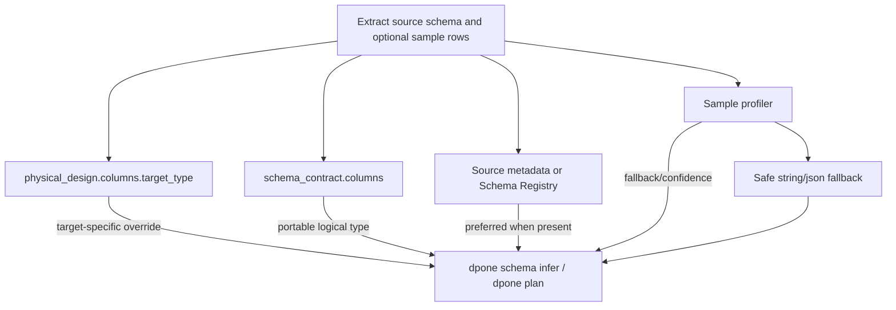

# Type inference

`dpone` can infer source column types without requiring users to write target
DDL. The inference layer is intentionally conservative: it prefers source
metadata, uses sampled rows only as a fallback or confidence signal, and never
silently narrows an existing target type.

## Decision flow



Precedence:

1. `sink.options.physical_design.columns.<column>.target_type.<sink>`.
2. `schema_contract.columns.<column>`.
3. Source metadata or Kafka Schema Registry metadata.
4. Sampled rows.
5. Safe string or JSON landing.

## Configuration

```yaml
sink:
  options:
    type_inference:
      enabled: true
      prefer_source_metadata: true
      sample_rows: 10000
      max_sample_rows: 100000
      confidence_threshold: 0.98
      empty_string_is_null: false
      conflict_policy: fail
```

Defaults are production-safe:

| Option | Default | Meaning |
| --- | --- | --- |
| `enabled` | `true` | Build logical type decisions before target DDL planning. |
| `prefer_source_metadata` | `true` | Use database metadata or Schema Registry before sampled values. |
| `sample_rows` | `10000` | Planned sample size for sources without stable metadata. |
| `max_sample_rows` | `100000` | Hard guardrail for local profiling. |
| `confidence_threshold` | `0.98` | Emit warning when sample confidence is lower. |
| `empty_string_is_null` | `false` | Keep `""` distinct from `NULL` by default. |
| `conflict_policy` | `fail` | Fail closed on incompatible type conflicts. |

## Empty string vs NULL

`dpone` treats empty string and `NULL` as different values by default. This is
important for MSSQL bcp, REST APIs, CSV-like files, and audit workloads where
`""` often means "known blank" while `NULL` means "unknown".

```yaml
sink:
  options:
    type_inference:
      empty_string_is_null: false
```

Set `empty_string_is_null: true` only for sources where the upstream contract
states that empty strings are null markers.

## Offset timestamp fidelity

Sources can expose offset-aware timestamps through different type names:
MSSQL `datetimeoffset`, Postgres `timestamptz`, Kafka Schema Registry logical
timestamps, or REST/API ISO-8601 strings with offsets. `dpone` uses one
portable policy for those values:

```yaml
source:
  options:
    type_fidelity:
      temporal:
        offset_timestamp:
          mode: preserve_offset
          timezone: UTC
```

Supported modes:

| Mode | Meaning | Lossless for original offset |
| --- | --- | --- |
| `utc_instant` | Store the instant normalized to UTC. | No |
| `fixed_timezone` | Convert the instant to a configured business timezone. | No |
| `preserve_offset` | Store the instant plus `__dpone__tz_offset_minutes__<column>`. | Yes |
| `preserve_text` | Store the original offset timestamp text. | Yes |

`preserve_offset` is the recommended production mode when source offsets are
part of the data contract. It keeps analytical timestamp operations available
while adding a small generated companion column for the original offset minutes.

`dpone plan --format json` surfaces this under `type_fidelity` with selected
mode, target type, generated columns, and warnings. If schema evolution is
disabled, pre-create the companion columns before running a `preserve_offset`
pipeline.

For per-column overrides, malformed-value handling, runtime materialization
details, target DDL behavior, and troubleshooting, see
[Temporal fidelity](temporal-fidelity.md).

## CLI

Infer from a manifest:

```bash
dpone schema infer --manifest manifests/orders.batch.yaml --format json
```

Infer from explicit source columns:

```bash
dpone schema infer --source source-columns.json --format md
```

Infer from a JSON/JSONL sample:

```bash
dpone schema infer --rows sample-orders.jsonl --format text
```

## Runbook

| Symptom | Action |
| --- | --- |
| Confidence is below threshold | Add `schema_contract.columns` for important columns or increase sample quality. |
| Decimal inferred as string | Declare `type: decimal`, `precision`, and `scale` in the schema contract. |
| Empty strings unexpectedly become nullable | Verify `empty_string_is_null` and source null markers. |
| A mixed-type API field keeps changing | Use `schema_contract.enforcement: quarantine` or `schema_evolution.data_type: variant_column`. |
| Target type is not what you want | Add a target-specific `physical_design.columns.<column>.target_type.<sink>` override. |

## Related docs

- [Schema contracts](schema-contracts.md)
- [Physical design](physical-design.md)
- [Type mapping matrix](type-mapping-matrix.md)
- [Online schema evolution](online-schema-evolution.md)
