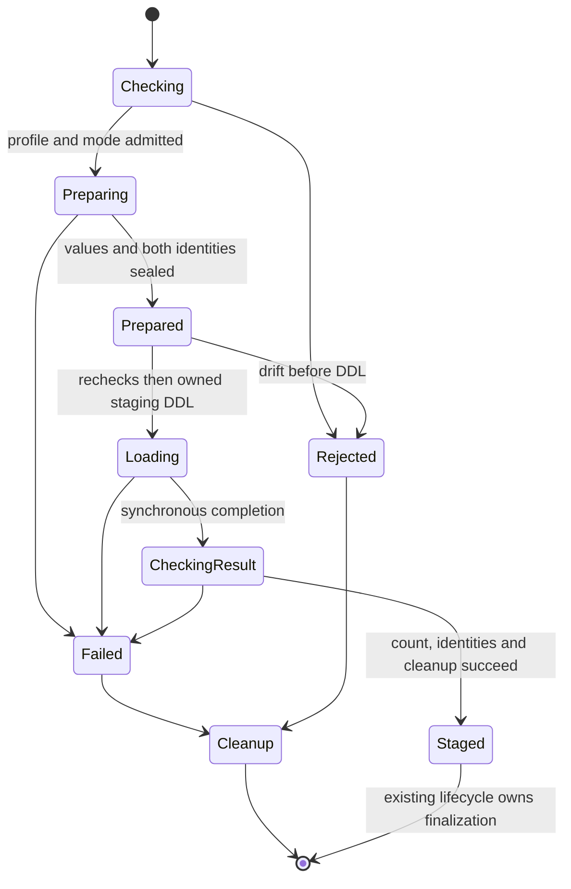
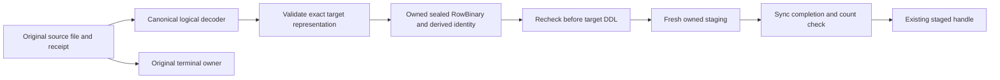

# Feature design: receipted character files at the ClickHouse staging boundary

- Status: **APPROVED — implementation authorized by maintainer on 2026-09-14**
- Owner: dpone maintainer; programme coordinator is the proposed integrator
- Issue: B02, retained in [the rejected review](rejected-b02-review.md); no implementation issue assigned
- Target release: TBD
- Last verified: 2026-09-14
- Source assessed: `dad0f8c5781320933ee93ddd849bc81dbda30ae0`
- Rejected predecessor: `69013d51dbdaff578767cee54ae49a2119cebc40`

This artifact is separate from the frozen B01 candidate in draft PR53. It grants
no decoder, source-route, schema, dependency or publication changes. Status stays
RESEARCHED after independent design review and the coordinator's final status
instruction. The recommendations require maintainer approval and later evidence.
Research is not approval. The concrete proposed ADR and path contract are in the
[approval appendix](b02-contract-appendix.md), which is part of this decision package.

## Executive summary

A genuine `FileContractValidationReceipt` proves the logical values decoded from
one source file. It does not prove that ClickHouse interprets those bytes the same
way. The rejected B02 dispatch admitted encoded empty/control markers and stripped
literal quotes while reporting success. Baseline behavior rejects the wrapper;
the B01 integration candidate preserves that rejection.

Propose a bounded preparation service: verify the original source, decode with
the same canonical character-wire rules used by its validator, validate the
target representation, and produce a separately identified RowBinary spool before
target mutation. Only a specifically admitted synchronous consumer can load that
spool. Source evidence and terminal ownership remain attached to the original
artifact. This belongs in dpone's artifact lifecycle because every admitted
consumer must preserve logical values, even when source and target formats differ.

Recommended v1 is a new explicit public `ClickHouseSink.stage_validated_file`
API, with a required bounded policy. It prepares and loads within one call using
client/HTTP RowBinary; Python/auto/native_tcp are denied. It does not participate
in `stage_payload`, ordinary CLI execution or schema evolution. This narrower
journey makes the pre-mutation guarantee implementable without a new cross-layer
plan carrier. Neither transport is currently supported for B02; implementation,
exact transport tests and authorized readback remain required after approval.

## Personas and customer journey

| Persona | Goal | Current pain | Success signal |
| --- | --- | --- | --- |
| Pipeline author | Keep strict contracts and exact values | Boolean hints, format labels and a valid receipt imply more support than exists | Explicitly admitted mode; meaningful refusal before target mutation |
| Data platform operator | Diagnose and retry failed staging | Matching counts can conceal wrong strings | Source and derived identities, phase and cleanup outcome; value readback in certification |
| Connector developer | Reuse validation semantics | Separate parsers disagree on quotes, NULL and binary | One canonical decoder, independent value fixtures and a finite type/mode matrix |

Journey for a connector developer: obtain a genuine producer-validated artifact;
choose an explicit admitted mode and private attempt directory; call the new API;
inspect its returned handle and attempt JSON; compare target values in a synthetic
probe; abort using the existing staged-load API. On failure, inspect phase and
cleanup status, recover any retained attempt, and explicitly call again with a
new attempt. A data-platform integrator may use the returned handle through the
existing validation/finalization lifecycle under separate authority. Never advise
disabling strict contracts, inventing receipts or promoting a stage automatically.

The currently automatic producer attachment is restricted to PostgreSQL exports
targeting MSSQL. This design does not extend that selection. Ordinary
PostgreSQL→ClickHouse `export_format: csv` examples are not demonstrations of B02.
The first reproducible journey uses public Python artifact/sink entrypoints and
synthetic files; a new manifest producer journey needs separate scope.

## Scope

### In scope

- One concrete, uncompressed `FileExportArtifact` carrying the existing genuine
  source-issued receipt and the default version-2 `BulkTextCodec` profile.
- Exact source and payload column order/names; text, NULL, empty text, binary
  representations and a finite set of accompanying scalar types below.
- Canonical source decoding, full preparation before target mutation, immutable
  derived RowBinary identity, explicit mode admission, staged counts and cleanup.
- Local public-DI evidence and a separately gated live value-readback plan.

### Non-goals

- Generic artifact unwrapping or a public `load_with`/capability framework.
- New exporter/route selection, native BCP parsing, CSV support, partition loading,
  snapshots, nested relations, renaming, schema projection or column reordering.
- Altered business NULL defaults, timezone policy, temporal narrowing, B03–B08 fixes.
- Checkpoint, source commit, promotion, merge, publication or exactly-once authority.
- Async inserts, distributed staging, automatic transport fallback or server retry.
- Normal CLI/manifest activation and the earlier runtime schema-evolution path.

### Assumptions and constraints

Supported profile proposed for v1: exact default `BulkTextCodec` v2 parameters
(prefix U+001D, empty marker U+001D E, TAB field and LF row terminators), UTF-8,
no header/compression, ordinary local regular file, original ordered schema and
receipt. Custom marker configurations may pass today's producer checks; v1 must
explicitly reject them before target mutation until separately specified/tested.
That admission restriction is public behavior requiring approval.

The framework producer boundary is trusted; the current verifier checks type and
identity, not authenticated producer provenance. Genuine reissue before attempt
binding is permitted by the existing API. B02 must never fabricate a receipt,
replace it after binding, or relabel/reissue it to authorize derived bytes. A digest
is integrity evidence, not a signature or proof of database provenance. Source
races must be detected from actual bytes read; path checks alone are insufficient.

## Public contract

### CLI

**N/A for v1.** No command, manifest activation, CLI numeric exit, output envelope
or `--retry-attempts` behavior is introduced. The ordinary runtime calls
`stage_payload` after schema evolution; it cannot inherit the new API's guarantee.
The new method itself prints nothing to stdout/stderr. Existing logging may
record safe metadata. Do not publish a `dpone run` example as B02 acceptance.

### Python API

Add the following explicit method; keep `stage_payload`, `load`, existing wrapper
construction and their successful capabilities unchanged:

```python
ClickHouseSink.stage_validated_file(
    load_config: LoadConfig,
    payload: LoadPayload,
    *,
    policy: ClickHouseValidatedFilePolicy,
) -> StagedLoadHandle
```

`ClickHouseValidatedFilePolicy` is a frozen dataclass exported from
`dpone.runtime.sinks.clickhouse_validated_file_models`. Required constructor fields
are `work_directory: Path` and `max_spool_bytes: int`; finite defaults for other
fields are fixed below. The tutorial uses `max_spool_bytes=1_073_741_824` (1GiB).
No mode is duplicated in policy. No generic sink port gains this method.

Add one concrete wrapper operation, not separate public start/finish/accessor
methods: `file_validation_attempt(attempt_id: str) ->
AbstractContextManager[FileValidationAttempt]`. Entry acquires a per-wrapper busy
guard before resetting its latest summary to zero/opaque_file, preserves cached
denial, and captures a frozen `FileValidationBinding(artifact, receipt,
source_schema, contract_sha256)` with fresh verification. A rejected concurrent
entry does not reset the active attempt. Source schema is an ordered tuple of
name/type tuples. Artifact and receipt retain their existing concrete types; the
attempt privately retains the original mutable contract and rechecks its digest.
Yielded attempt exposes `.binding`, `.verify_unchanged() -> None` and
`.complete(staged_rows: int) -> None`. Verification checks the original object,
receipt, wire, ordered schema, bytes and contract at preparation seal, immediately
before DDL, after consumption and again in complete. Completion is callable once
while active; it requires an
exact non-bool integer equal to receipt.rows_validated and unchanged original
identity before setting the summary. Any exceptional context exit resets the
summary and always releases the guard. Historical immutable journal events remain.

Extract this cohesive wrapper/context to
`dpone.runtime.etl.validated_file_artifact`; `contract_artifacts` re-exports the
existing class, preserving import identity. Put frozen binding/attempt models in
the same cohesive module unless the budget requires a responsibility-based model
module. No generic forwarding or terminal authority is added. Genuine pre-entry
reissue can be captured; replacement after entry fails even if valid for a later
attempt. Nonconcurrent later calls use fresh attempt IDs.

Proposed new stable sink error code: `DPONE_CLICKHOUSE_FILE_CONSUMPTION_BLOCKED`,
with `blocker`, `phase`, safe column name/row ordinal where relevant, and original
exception chaining. Source `FileContractValidationError` and
`ArtifactIntegrityError` remain their existing types/codes. A sink's lack of codec
support must not masquerade as a missing source receipt.

Frozen proposed blockers: `explicit_mode_required`, `transport_unsupported`,
`codec_profile_unsupported`, `source_type_unsupported`,
`target_representation_unsupported`, `schema_changed`, `source_changed`,
`transport_changed`, `value_not_representable`, `resource_limit`,
`staging_count_mismatch`, `attempt_in_progress`, `settings_unsupported`,
`remote_execution_unknown`, `attempt_journal_unavailable`. These are proposed API,
not current behavior. Preserve source/integrity/connector/timeout/cancellation
exceptions as primary; attach the structured record to exception
`details['validated_file_consumption']` using the existing failure-details pattern.
The new typed error is for this service's own admission/fidelity failures.

### Manifest/schema and existing transport options

No YAML key/version, route selection or boolean proof. The new Python API reads
existing `load_config.options['clickhouse_bulk']['mode']`; its absence/auto is
rejected before target I/O. Existing global auto behavior is unchanged. The
admitted plan normalizes explicit aliases once and never resolves environment or
executable-dependent fallback during loading.

| Requested mode | Proposed v1 result for this artifact | Reason / required proof |
| --- | --- | --- |
| `client`, `clickhouse-client`, `native_client` | Admit only synchronous explicit RowBinary client configuration after full preparation | Existing runner accepts stream bytes and explicit format; value/readback/count/error proof still required |
| `http` | Admit only synchronous RowBinary, success body checked, local staging count read from same target | Existing HTTP byte-stream seam; transport acceptance does not establish B02 support |
| `python`, `driver`, `native_driver` | Typed pre-mutation denial | Current driver API accepts rows, not the proposed sealed wire; typed direct mode needs separate parity proof |
| `native_tcp`, `native-tcp` | Typed pre-mutation denial | Direct native framing/selection is outside this slice |
| absent / `auto` | `explicit_mode_required`, before runner construction or target SQL | No environment-dependent fallback |

The B02 adapter pins RowBinary, `async_insert=0`, input-error allowances to zero,
and generated query IDs per operation. Explicit contradictory format/async/skip-error,
query_id or insert-deduplication-token overrides are rejected rather than silently
overwritten. Other custom
parser/session settings are rejected by this v1 API; credentials, TLS, endpoint,
client executable and positive transport timeout remain configurable through the
existing options. No cluster, replica/distributed staging, load balancer or
reconnect-to-another-node configuration is admitted. Transport and control queries
must target the same explicitly configured single node.

If client/HTTP cannot meet synchronous acknowledgment, cancellation/join, exact
format/settings and count-readback requirements, they remain denied. No integer
exception, marker scan shortcut, filename inference, or HTTP fallback is allowed.

### Target representation and value rules

Freeze the resolved target schema and existing explicit type policy in the plan.
Proposed v1 handles the following families; every other family is rejected before
DDL even for an empty file. This is a finite, value-complete capability boundary,
including text and binary, rather than the withdrawn integer-only workaround.

| Source logical type | Target representation | Rule |
| --- | --- | --- |
| char/varchar/nchar/nvarchar/text/ntext/json/xml/string | String or Nullable(String) | UTF-8 bytes exactly; no trim, Unicode normalization, JSON parse/reserialize, quote removal or backslash interpretation |
| binary/varbinary/image in producer-recognized canonical schema | String or Nullable(String) | Decode source style-2 hex to bytes first; existing `type_fidelity.binary_encoding` applies: `none` default means raw bytes, `hex` lowercase ASCII hex, `base64` RFC4648 ASCII with padding |
| tinyint/smallint/int/bigint | matching UInt8/Int16/Int32/Int64, optionally Nullable | Strict integer conversion and range validation; no coercion of fractional values |
| bit | Bool, optionally Nullable | Only canonical source 0/1; no truthiness conversion |
| decimal(p,s)/numeric(p,s), explicit p/s | matching Decimal(p,s), optionally Nullable | Decimal arithmetic, exact finite value, no precision/scale loss |
| Other scalar, float, temporal, UUID, nested, FixedString or target mismatch | Deny | Further type/policy proof is required; do not inherit permissive target coercion |

Raw empty source field is NULL. A nonempty empty-string marker is empty text (or
empty bytes for the binary family). Literal `\N`, `NULL`, quotes and spaces are
data. NULL to non-null target is rejected, even if a business default could fill
it. The proposed binary `none` behavior matches the native binary encoder's
policy, but differs from the current Python row coercer's unconditional hex;
it must be explicitly approved and documented. Arbitrary bytes are not decoded
as UTF-8. Ambiguous binary schema spellings not decoded as binary by the genuine
producer are rejected, not silently repaired in the sink.

### Artifacts and evidence

The original `FileContractValidationReceipt` stays unchanged. New internal
`PreparedClickHouseFile` owns a private attempt spool and an immutable binding:

```text
preparation_version = 1
source_receipt_sha256 = SHA256(canonical UTF-8 JSON of all original receipt fields)
source_sha256, source_size_bytes, source_wire_sha256, source_schema, source_contract_sha256
target_schema_ordered, representation_policy, codec_id/version/parameters
mode, input_format = RowBinary, relevant synchronous/parser settings
transport_sha256, transport_size_bytes, rows_prepared
semantic_id = SHA256(canonical JSON of the above stable fields)
attempt_id = fresh runtime attempt identity; excluded from semantic_id
```

Canonical JSON uses sorted object keys, compact separators, ordered schema arrays,
no floats/NaN or path/environment/credential values. The source receipt digest
includes validator_version and rows_validated. Semantic identity is deterministic
for identical inputs/policies; temp filenames and attempt identities are not.
It is neither a source receipt nor authority to finalize a target.

Internal spool `transport.partial` is created exclusively under an attempt-owned
private directory and sealed as `transport.rowbinary` after complete preparation.
It is never a user output or cross-run cache. A new narrow runtime producer
`ClickHouseFileAttemptJournal` writes immutable events with
the descriptor-relative `materialize_immutable_local_tree_at` under
`<work_directory>/<attempt_id>/events/<six-digit-sequence>/attempt.json`.
Use the existing helper's create-or-compare, fsync and no-replace guarantees;
never overwrite an older event or treat a merely visible, not durably confirmed
event as a successful checkpoint. Folders are0700, files0600, UTF-8 canonical JSON.
The source path/values/credentials are excluded; the private spool is separately
owned. Attempt IDs are UUID4 hex; supplied work directory is pinned against
replacement. No symlink traversal, absolute member paths or global temp discovery.

Every event has `schema='dpone.clickhouse-file-consumption.v1'`, `sequence`,
`previous_event_sha256` (null only for the first event),
`attempt_id`, `semantic_id` (null until prepared), `phase`, `outcome`,
`requested_mode`, `resolved_mode`, `source_identity`, `derived_identity`,
`rows_prepared`, `rows_observed`, `query_id`, `query_kind`, `endpoint_identity`, `owned_staging`, `local_sender_state`,
`remote_execution_state`, `cleanup`, `blocker` and `primary_error_code`.
Unknown identities/counts are null, not zero. `source_identity` contains the
original receipt/hash/schema/wire fields; `derived_identity` contains the bound
plan/hash/bytes; `owned_staging` holds database, table, UUID and ownership marker.
`cleanup` separately records `source='unchanged'`, `spool` and `staging` as
`not_created|owned|released|retained_unknown|failed|transferred`.
For the empty-input branch, the verifying/final record has query_kind `insert`,
query_id null and both sender/execution state `not_submitted_empty`; the separate
identified COUNT result still records observed zero. No synthetic INSERT receipt
is created. Other executed queries use their actual identified result states.

Phases are `checking|preparing|prepared|creating_staging|loading|verifying|cleanup`.
Outcomes are `running|staged|failed_cleaned|retained_unknown|cleanup_failed`.
No outcome means committed/published/certified. `created_at_utc` is diagnostic and
excluded from semantic_id. Journal writes precede DDL and insert submission;
the final staged event follows source/transport/count checks and spool cleanup.
Durability failure before DDL rejects; after DDL it triggers failure cleanup,
never a returned successful handle. If failure recording also fails, the last
durable pre-action record conservatively identifies outstanding resources.

On success the exact final record plus `journal_directory` is placed at
`handle.metadata['validated_file_consumption']`. On failure the latest record is
attached to `exception.details['validated_file_consumption']`. This Python API
prints nothing and adds no CLI serialization promise. Prior attempt events are
immutable even when the wrapper's latest-attempt summary resets. Journal retention
is caller-managed: never automatically purge unknown attempts; completed journals
are kept until explicit caller archival. No new daemon/reaper or state writer.

### Compatibility and migration

Before: the generic validated-wrapper path fails dispatch; forwarding raw files
can corrupt text. Proposed after: only explicit calls to the new API can admit
the contracted file/type/mode. `stage_payload` and the automatic runtime gain no
support or pre-mutation guarantee. This is an additive public Python capability,
not a `none` impact repair. Raw unwrapped codec behavior remains a separate risk.

Old manifests and existing consumers remain unchanged. Auto refusal applies only
to the new method. Materialize-based custom consumers and non-ClickHouse routes
need compatibility tests. No deprecation is proposed. Activation is the deliberate
new-method call with required bounded policy. Rollback stops those calls and
rolls back caller/package together; any rollback patch retaining the method must
raise a typed disabled/unsupported failure. Never substitute generic stage_payload
or forward encoded bytes. Rollback cannot undo a separately promoted load.

## Detailed algorithm

1. Acquire the original wrapper/file and immutable validation binding. Preserve
   cached construction errors; a later supplied receipt cannot bypass that denial.
   Reject partitions/projections/nested or arbitrary wrappers. Reset only this
   attempt's summary; reject concurrent use of the same in-memory attempt.
2. Before any target SQL or runner construction, verify source receipt, exact
   payload schema, profile, mode, limits and type-policy matrix. Type resolution
   must be pure or read-only. Resolve and freeze target schema/config once.
3. Open the source as a binary regular-file stream and hash the **bytes actually
   read** while decoding. Retain original byte/receipt/wire checks before and after
   preparation. A pathname change, truncation, receipt replacement or disagreement
   between the read digest and the original receipt rejects the attempt.
4. Parse LF-terminated records without `csv.reader`, newline translation, BOM
   stripping, whitespace trimming, quote handling or universal backslash escapes.
   Enforce record width and bounds. Split on TAB, retaining empty cells. Raw empty
   is NULL. Strictly decode nonempty text cells as UTF-8. Decode control tokens
   before prefix tokens; recognize the exact whole-cell empty marker first.
5. Share these logical rules with the source validator by extracting its existing
   decoder into one bounded module. Binary decodes the empty marker then uses
   existing `bytes.fromhex` grammar, including its ASCII whitespace handling.
   B02 accepts those producer-valid values and encodes their resulting bytes;
   do not silently narrow the source grammar. Limits are explicit per-call reader
   inputs: B02 supplies bounded values; existing source-validator callers preserve
   their prior behavior/defaults. No profile or type expansion in that refactor.
   Apply the frozen finite target representation rules, checking each value before
   it can reach the driver. Preserve order and duplicates.
6. Encode every logical row to canonical RowBinary using existing bounded encoder
   functions where their semantics match. For nullable values write null flag1
   alone, or flag0 plus the underlying encoding. Strings use byte-length LEB128
   then exact bytes. No CSV/TSV intermediate is loaded. Seal spool/hash only after
   EOF, exact row-count agreement and source/receipt rechecks succeed.
7. `stage_validated_file` calls its composed dedicated service, which owns the
   wrapper context, prepared resource and journal for the entire call. It never
   calls `PayloadLifecyclePreparer` or generic `stage_payload`; there is no carrier
   between schema-evolution phases. Preparation and plan rechecks precede the
   dedicated staging creation call. Earlier caller/runtime schema changes are
   outside this API's guarantee. Ordinary CLI routes remain unsupported for B02.
8. Write a durable planned-resource journal event, then create a fresh exclusively
   owned local staging table with the frozen schema. Require an existing database;
   do not create databases or apply target schema evolution. Use an attempt-derived
   unique staging name and ownership comment `dpone-b02:<attempt_id>` in CREATE;
   read and journal its actual UUID/owner comment before sending. No DROP is
   allowed for a table whose ownership cannot be verified.
   The attempt's private staging namespace excludes external concurrent DDL by
   contract. UUID/comment verification followed by DROP is not an atomic CAS;
   v1 makes no ownership guarantee against an actor replacing that table between
   those operations. Detectable drift denies cleanup and retains the inventory.
   Read back and verify its actual ordered names and physical types before insert.
   Send the sealed spool once through the admitted synchronous runner, explicit
   RowBinary format, with no input-error skipping, async insertion or fallback.
   For zero rows, skip INSERT and record `not_submitted_empty`, no INSERT query ID
   and no sender receipt. Verify zero spool bytes and SHA256(empty) locally.
9. When rows_prepared>0, require successful INSERT completion/acknowledgment and
   exact consumed spool byte count/digest. In both branches require exactly one
   canonical nonnegative integer `COUNT(*)` from that fresh staging
   table. It must equal rows_prepared and original receipt.rows_validated. Ignore
   estimated_rows and do not substitute a runner estimate. Reverify source and
   derived identity after consumption. Matching counts are necessary but not a
   substitute for the tested logical encoding or live value reconciliation.
10. Release/join the runner, clean the derived spool, complete the wrapper attempt,
    durably record staged status, then return the existing staged handle. A failed
    final journal write raises within the context and resets the summary. Source
    terminal authority is unchanged. Failure returns no successful handle/summary;
    cleanup follows the remote-known/unknown rules below and preserves the primary
    error. Later finalize/state calls remain entirely governed by existing owners.

### Pseudocode

```text
prepare(original, schema, config):
    binding = active_wrapper_attempt.binding
    require_explicit_supported_mode_types_and_profile(binding, schema, config)
    with owned_partial_spool() as spool:
        for row in canonical_source_reader(open_source(), bound_limits):
            spool.write(encode_rowbinary(validate_target_values(row, frozen_plan)))
        require_read_bytes_equal_original_receipt()
        require_unchanged_receipt_wire_schema_source()
        require_rows_equal_receipt()
        return seal_attempt_spool_and_binding()

stage(prepared):
    require_plan_current_before_any_mutation()
    with owned_fresh_staging_and_remote_state() as stage:
        if prepared.rows > 0:
            send_once_and_join(prepared.sealed_stream, admitted_synchronous_runner)
            require_successful_ack_and_exact_stream_consumption()
        else:
            require_local_zero_bytes_and_sha256_empty()
            record_not_submitted_empty_without_insert_query_id_or_sender_receipt()
        active_wrapper_attempt.verify_unchanged()
        require(count(stage) == prepared.rows == original_receipt.rows_validated)
        cleanup_derived_spool_or_fail()
        active_wrapper_attempt.complete(observed_rows)
        journal_staged_durably_or_raise()
        return existing_staged_handle(stage, original_source_ownership)
```

### State machine



### Edge cases: failure, concurrency and resource semantics

Pre-mutation denial means zero target DDL/DML or sender invocation by the new
method. Read-only metadata queries and local bounded preparation are allowed.
It cannot undo or prevent target mutation by an earlier caller. No full-runtime
schema-evolution hook is added; that journey is explicitly deferred.

Frozen proposed policy limits (positive finite integers; bool/zero/negative/None
rejected):

| Limit | Value/default | Reason |
| --- | --- | --- |
| `work_directory` | Required explicit Path | Caller-controlled local storage; no implicit temp-root discovery |
| `max_spool_bytes` | Required; tutorial1,073,741,824 bytes (1GiB) | No unlimited derived file; caller chooses an explicit workload budget |
| `max_source_bytes` |4,294,967,296 bytes (4GiB) | Bounded source scan; larger workloads require deliberate policy override |
| `max_record_bytes` |16,777,216 bytes (16MiB), including terminating LF | Prevent unbounded line allocation; applies before decode |
| `min_free_bytes` |1,073,741,824 bytes (1GiB) | Reuse existing RuntimeStoragePolicy reserve |
| `preparation_timeout_seconds` |3600 seconds | Bounded full scan; monotonic deadline |
| `verification_timeout_seconds` |3600 seconds | One finite deadline for source/derived rechecks after transport; timeout fails the attempt |
| Selected existing transport timeout | Positive configured value; absent becomes3600 seconds for this method | Matches HTTP default; removes client's unbounded None in this isolated adapter |
| Local abort/join |5 seconds per terminate/kill/drain phase | Reuse process_io abort budget |
| Remote confirmation/control query |30 seconds total | Bounded recovery attempt; timeout means unknown, never success |
| Fixed chunks / response / journal event |1MiB /64KiB /256KiB | Bound sender buffers, response/error capture and metadata |

`StoragePreflightService.require_spool_admission` and its refresh use a composed
worker-local `RuntimeStoragePolicy` with the explicit work directory/reserve.
Effective spool budget is the lesser of required max_spool_bytes and admitted
free bytes minus reserve; refresh capacity while writing. Map its existing
MSSQL-named internal storage errors to the B02 resource blocker without changing
other callers. Do not call the broader storage check that creates checkpoint/debug
directories. Each file/event byte counts toward attempt storage; journal failures
remain fail closed. Filesystem capacity can still change externally; disk-full
is handled as failure, not promised away by preflight.

Memory is O(record bound + encoder buffer + fixed chunks), disk is O(spool cap).
No all-row collection. Existing source-validator callers retain their previous
reader limits/grammar; these B02 bounds are passed explicitly. Empty input still
checks types, mode and limits. These are recommended engineering defaults with
documented override units, not numbers the maintainer must invent.
All pre-DDL source scans/rechecks share the preparation deadline. Read-only endpoint
preflight uses the selected finite transport timeout. Post-transport identity
checks share the verification deadline; no phase silently reverts to unbounded I/O.

Cancellation during preparation removes owned partial data and closes readers.
During loading, local sender stop is **not** proof of server completion. Every
mutation uses query_id `dpone-b02-<attempt_id>-<create|insert|drop>` and a separately controlled connection
to the same node. On timeout/error/cancel, stop and join the local sender within
the fixed abort budget, then request `KILL QUERY ... WHERE query_id=<exact id> SYNC`
within30 seconds. The control adapter must parameterize/escape the fixed ID and
never kill by user/database wildcard. A terminal successful acknowledgment or an
exact-ID `finished` result is remote completion proof. An empty query/process list,
connection closure, HTTP200 alone, missing log row or timed-out KILL is not proof.

All mutations, including CREATE and cleanup DROP, require a durable query intent
before execution and an identified result afterwards. A timed-out CREATE is not
assumed absent; a timed-out DROP is not assumed complete. Read-only schema/count
queries have distinct `describe`/`count` IDs and the same endpoint identity. No
other mutation or query-ID reuse is allowed. EndpointBinding freezes explicitly
configured single node, database and server identity from read-only preflight;
redirects/failover/different control endpoint reject before the next mutation.

If remote state is known stopped, verify staging UUID and ownership comment before
DROP and release the spool. If local sender or remote execution remains unknown,
retain the identified staging, spool and journal, report `retained_unknown`, and
return no handle/success. Do not close a reader that a live local sender owns; its
controlled execution object retains it until join/process termination. If that
cannot be guaranteed for an adapter, that adapter must fail its implementation
gate and cannot be enabled. HTTP success requires a complete bounded empty/whitespace
response without server exception indication; client success requires zero exit
and complete bounded output handling. Both still require exact stream/count checks.

There is no automatic retry and no CLI retry integration. Explicit subsequent
calls make fresh attempts and never resume partial staging. Unknown/cleanup-failed
attempts require manual reconciliation of the exact query ID, server, staging UUID
and ownership marker first. No autonomous recovery/delete API is introduced in v1.
The journal supplies a concrete resource inventory, not a crash-cleanup guarantee.
If crash occurs after CREATE but before UUID evidence, the planned name/comment
are retained for operator investigation; absence of durable ownership proof forbids
automatic DROP. Do not infer safety merely because system.processes is empty.

Source authority and checkpoint/finalization owners remain unchanged. Separate
calls can read one immutable source with separate resources, while the same wrapper
context is busy-guarded. No distributed lock, global deduplication or exactly-once
claim. A process crash has no successful return or source terminal decision.

## Architecture

### Components and responsibilities

| Component | Existing/new proposal | Responsibility |
| --- | --- | --- |
| `runtime/connectors/bulk_text_codec.py` | Existing, reuse | Exact default profile decode alphabet; no ClickHouse SQL methods added |
| `runtime/support/bulk_text_file_reader.py` | New bounded function module | Binary records to logical values; shared with source receipt scan |
| `runtime/etl/file_contract_validation.py` | Existing adapter change | Preserve source validator behavior while using shared reader |
| `runtime/sinks/clickhouse_validated_file_preparation.py` | New service | Finite admission, frozen target plan, spool construction and ownership |
| `runtime/sinks/clickhouse_validated_file_ingestion.py` | New service | Synchronous transport/stream/count checks and failure cleanup coordination |
| `runtime/etl/validated_file_artifact.py` | Extract cohesive wrapper/context; old module re-exports | Binding, busy guard and latest-attempt summary without renewed module debt |
| `runtime/sinks/clickhouse_validated_file_models.py` | New frozen runtime models | Required public policy, plan, source/derived identity and attempt record |
| `runtime/sinks/clickhouse_validated_file_journal.py` | New bounded producer | Immutable events through existing local-tree writer; no checkpoint writes |
| `runtime/clickhouse_file_stage_contract.py` | New shared runtime protocol/value types | Identified query, endpoint, result and cancellation contracts without connector→sink imports |
| `runtime/connectors/clickhouse_file_stage_client.py`, `clickhouse_file_stage_http.py` | New controlled adapters | Bounded client/HTTP I/O, exact query IDs and separate local/remote outcomes |
| `runtime/sinks/clickhouse_sink.py` | Add method and constructor DI composition | Dedicated service; existing generic staged-load/finalize paths remain unchanged |
| `runtime/etl/payload_lifecycle.py` | Read-only/out of scope | No normal-runtime or pre-schema integration in v1 |
| `runtime/clickhouse_binary_encoding.py` | Read-only reuse | Existing exact RowBinary primitives and policy; B01 remains frozen |

### Ports, adapters, and composition root

Frozen recommended internal signatures (new proposal, not current APIs):

```text
BulkTextFileReader.iter_rows(stream: BinaryIO, schema: SourceSchema,
    codec: BulkTextCodec, *, max_record_bytes: int | None) -> Iterator[LogicalRow]
ClickHouseValidatedFilePreparer.prepare(attempt: FileValidationAttempt,
    plan: ClickHouseFilePlan, policy: ClickHouseValidatedFilePolicy,
    journal: ClickHouseFileAttemptJournal) -> PreparedClickHouseFile
ClickHouseValidatedFileService.stage(load_config: LoadConfig, payload: LoadPayload,
    *, policy: ClickHouseValidatedFilePolicy) -> StagedLoadHandle

ClickHouseFileStageRunner.preflight(plan: ClickHouseFilePlan) -> EndpointBinding
ClickHouseFileStageRunner.execute(request: IdentifiedStageQuery,
    *, chunks: Iterable[bytes] | None,
    deadline_monotonic: float) -> StageQueryResult
ClickHouseFileStageRunner.cancel_and_observe(query: QueryIdentity,
    *, deadline_monotonic: float) -> QueryObservation
```

The preparer reads `attempt.binding` and calls `attempt.verify_unchanged()` before
sealing; it receives no mutable contract and does not complete the attempt.

`IdentifiedStageQuery` is a frozen runtime value carrying `kind` restricted to
`probe|create|describe|insert|count|drop`, generated SQL, exact query_id and the
frozen endpoint. It is internal to this service, not an arbitrary SQL API exposed
to callers. `StageQueryResult` records query_id, `remote_state='completed'`, actual
emitted bytes/hash and bounded response bytes; the service parses the one count
response into the existing canonical non-bool integer. The transport does not
invent a row count or commit authority. `QueryObservation` holds separate local
`stopped|unknown` and remote `completed|cancelled|unknown` states plus safe evidence.
The execute adapter owns its live process/socket and joins on every BaseException;
cancel_and_observe settles any retained local handle before querying remote state.

Add one optional keyword-only constructor dependency on ClickHouseSink:
`validated_file_runner_factory: Callable[[LoadConfig, ClickHouseValidatedFilePolicy],
ClickHouseFileStageRunner] | None = None`. The composition root constructs the real
stage service using the existing physical resolver, pure SQL rendering, canonical
reader/encoder, storage preflight, journal writer, UUID/monotonic clock and this
factory. The service constructor takes its dependencies explicitly for focused
unit tests. Public-boundary tests inject a recording runner factory and the
existing resolver/connector; they still exercise the real service and decode
actual captured bytes. No fake service returns a fabricated handle.

New controlled client and HTTP adapters live in
`runtime/connectors/clickhouse_file_stage_client.py` and
`clickhouse_file_stage_http.py`; their shared protocol/value types live in
`runtime/clickhouse_file_stage_contract.py` to avoid connector→sink import cycles.
They own bounded I/O and cancellation. Reuse public request construction; add a
pure client `build_query_command(sql)` helper alongside existing command builders,
and reuse HTTP `build_insert_url(..., query=sql)`. Existing insert_stream
semantics/runner-class DI remain unchanged and do not certify this new path.
Current HTTP status-only success and incomplete BaseException handling are not
delegated as authority. Separate same-node control uses the same exact query
identity contract; absent evidence yields unknown.

`PreparedClickHouseFile` is the typed carrier entirely owned inside `service.stage`:
frozen plan/binding plus private spool/held reader resource. The method transfers
only the existing staged handle on success; no payload mutation or schema-phase
carrier exists. No hidden environment resolution, global clients, import-time I/O,
SDK imports on help paths, service locator or polymorphism by method presence.

### Data and control flow



### Alternatives and tradeoffs

| Alternative | Advantages | Disadvantages | Recommendation |
| --- | --- | --- | --- |
| Sealed RowBinary, explicit client/HTTP | One deterministic target wire; preserves text/binary bytes; bounded preflight | Disk and full scan cost; requires transport completion proof | Recommended v1 |
| Python typed direct via same decoder | Smaller initial transport change; natural recording-driver oracle | Current coercer changes binary to hex; type/precision parity and preflight snapshot still required | Valid alternative, not jointly implicit support |
| Decode in ClickHouse staging SQL | Existing decoder concept | New SQL codec, raw staging/null/quote transport ambiguity, postchecks occur after mutation | Reject for this slice |
| Forward/relabel original file or accept only marker-free rows | Fast | Receipt does not establish consumer semantics; quotes/backslashes/NULL still differ | Reject |
| Full format plugin/capability registry | Extensible | One profile does not justify broad public surface | Reject |

### ADR and quality budgets

ADR is mandatory before implementation approval: original versus derived identity,
explicit API boundary, query/attempt ownership and durable staged-only evidence
are long-lived semantics. The appendix fixes the proposed ADR decisions and path
`docs/adr/0064-validated-file-clickhouse-staging.md` (next number in the observed
integration candidate). A later number collision is administrative and requires
an explicit path-contract correction; it does not reopen the technical decisions.
No broader runtime schema-preflight integration is proposed.

Use `docs/benchmarks/quality_budgets.yml` and existing metric tooling without
baseline relaxation. Target coherent reader/preparation/ingestion modules below
the repository warning budget (planning estimates ~120/220/150 SLOC; not certified
measurements), with a tiny wrapper bridge. The rejected addition reached367SLOC
and failed unbaselined debt; do not repeat it. Review every new graph edge; shared
reader depends on codec/value types, not sink/service composition. No generic
mechanical splits or budget-file edits are proposed.

## Market comparison

Checked 2026-09-14. Facts are limited to linked official sources; recommendations
and limits of applying them to dpone are design inference. These products are not
claimed to accept dpone's custom receipt or codec.

| System/version | Relevant capability / observed fact | Strength and applicable limit | Adopt / reject | Source and date |
| --- | --- | --- | --- | --- |
| dlt 1.30.0 docs | ClickHouse destination lists JSONL/Parquet/model loader formats and destination-specific capabilities | Explicit format boundary; does not establish custom BulkTextCodec support | Adopt explicit destination/format matrix; reject inferring compatibility from a generic file label | [ClickHouse destination](https://dlthub.com/docs/dlt-ecosystem/destinations/clickhouse), checked2026-09-14 |
| Informatica PowerCenter10.5 | Official Workflow Basics excerpt describes separate delimited properties and a switch collapsing consecutive delimiters | Makes NULL/field shape choices visible; configurable parsing can change logical shape | Adopt explicit delimiter/NULL semantics; reject delimiter collapsing for this exact-row contract | [Workflow Basics Guide](https://docs.informatica.com/content/dam/source/GUID-7/GUID-7D547585-D0CF-4692-9CB1-9AEF344711E5/36/en/PC_105_WorkflowBasicsGuide_en.pdf), official indexed excerpt checked2026-09-14; direct PDF retrieval unavailable, broader claims UNVERIFIED |
| Airbyte | N/A for this narrow custom receipt-to-staging adapter contract | Connector/service-level comparison would require a separate route/type study | No support/quality inference from N/A | Scope decision2026-09-14 |
| Fivetran | N/A for this runtime adapter and caller-owned file receipt | Managed end-to-end sync guarantees are a different comparison boundary | No support/quality inference from N/A | Scope decision2026-09-14 |
| Pentaho current PDI docs, release not pinned | Text File Input exposes separator/enclosure/escape, encoding and preview | Value preview is useful; parser configuration is not custom receipt evidence | Adopt independent parsed-value preview/tests; reject permissive skipping/normalization | [Text File Input](https://docs.pentaho.com/pdia-data-integration/pdi-transformation-steps-reference-overview/text-file-input-cp), checked2026-09-14 |
| Microsoft SSIS SQLServer17-view docs | Flat File Connection Manager configures format, delimiters, text qualifiers and per-column metadata | Explicit parsing contract; qualifier behavior must match the producer | Adopt exact format metadata; reject default CSV quote interpretation for unquoted dpone wire | [Flat File Connection Manager](https://learn.microsoft.com/en-us/sql/integration-services/connection-manager/flat-file-connection-manager?view=sql-server-ver17), updated2026-01-21, checked2026-09-14 |
| gusty | N/A: DAG authoring, not this value/wire adapter boundary | No claim about end-to-end ETL fidelity | None | Scope decision2026-09-14 |
| Astronomer Cosmos | N/A: dbt/Airflow orchestration, not this file consumer | No orchestration authority is added here | None | Scope decision2026-09-14 |
| Apache Beam current programming guide, release not pinned | Distinguishes internal coders from explicit external parsing/formatting transforms | Separates logical values from byte representation; does not certify dpone or give this staging lifecycle | Adopt explicit decode/encode boundary; reject treating generic coder presence as route certification | [Programming guide](https://beam.apache.org/documentation/programming-guide/#data-encoding-and-type-safety), checked2026-09-14 |

Wire references: ClickHouse documents RowBinary strings as byte-length plus raw
bytes, and Nullable as a flag followed by the value only when non-NULL. This
supports the proposed wire, not current transport certification.
[RowBinary documentation](https://clickhouse.com/docs/reference/formats/RowBinary/RowBinary),
current unversioned docs checked2026-09-14. PostgreSQL18 COPY documents CSV
quoting/NULL distinctions; dpone's custom producer must be checked against its
own explicit delimiter/quote settings, not assumed identical to defaults.
[COPY documentation](https://www.postgresql.org/docs/current/sql-copy.html), checked2026-09-14.

Remote execution references: ClickHouse's synchronous KILL reports per-query
completion; asynchronous cancellation is not confirmation. HTTP response status
and disconnect handling require explicit result processing. These references
motivate separate local/remote states; they do not prove current adapters meet
the proposal. [KILL QUERY](https://clickhouse.com/docs/reference/statements/kill)
and [HTTP interface](https://clickhouse.com/docs/concepts/features/interfaces/http),
current unversioned official docs checked2026-09-14.

## Measurable differentiation

```yaml
axis: logical value fidelity and explicit pre-mutation rejection
scenario: genuine default BulkTextCodec receipt with text/binary boundary fixtures
baseline: rejected dpone 69013d51dbdaff578767cee54ae49a2119cebc40; current wrapper refusal
metric: unequal target values; false successful stages; mutating calls for rejected combinations
target: zero unequal values; zero false successes; zero mutations for preflight rejection
procedure: independently authored source bytes and value oracle; public DI per mode; later live readback
artifact: test_artifacts/b02-codec-certification/<candidate>/<mode>/value-reconciliation.json
limitations: proposed target, not achieved; no competitor benchmark, live proof, throughput or exactly-once claim
```

## Security, privacy and operations

Use only public synthetic fixtures in this programme. Production/live checks need
a separately approved environment and credentials. Temp files use private
permissions and bounded storage; logs expose no cell data, connection strings or
secrets. Existing SQL identifier quoting/connector composition remains mandatory.
Safe ordinal/reason metadata is enough to diagnose a fixture; operators obtain
business samples only through their own approved process.

Record preparation bytes/time, load bytes/time, exact stage rows and cleanup
outcome. Alert on failure or cleanup leakage, not a fabricated success rate.
No latency or throughput SLO is asserted before measurement. On mode/profile error,
choose a documented admitted combination; on identity drift, re-export; on target
value incompatibility, choose an approved lossless target representation or
correct/re-export the source without weakening its contract or defaulting NULL;
on partial load, recover the identified staging attempt before explicit retry.

## Test and certification plan

### Independent value fixtures

Use twelve text rows with `i=1..12`, `before=1000+i`, `after=-1000-i` around one nullable value.
C-style escapes below denote actual controls unless the value is explicitly marked
literal. Source byte literals follow Python bytes-literal semantics; the letter
`P` is ASCII50 and must not be confused with the prefix byte1d. Add a separate
duplicate-row fixture and require duplicates to remain duplicates.
The raw file and expected tuples must not both be generated using production
`BulkTextCodec.encode/decode`. A separate test checks the genuine producer yields
the independently authored file before it issues a receipt.

| Logical value | Expected source cell | Expected target String bytes |
| --- | --- | --- |
| NULL | zero bytes | Nullable flag01, no string bytes |
| empty string | `b"\x1dE"` | Nullable flag00, length00 |
| `tab\ttext` | `b"tab\x1dTtext"` | `74 61 62 09 74 65 78 74` |
| `line\ntext` | `b"line\x1dNtext"` | LF byte0a retained |
| `carriage\rtext` | `b"carriage\x1dRtext"` | CR byte0d retained |
| prefix U+001D | `b"\x1dP"` | byte1d retained |
| `\x1f\|\x1e` | `b"\x1dU\|\x1dS"` | bytes `1f 7c 1e` retained |
| `\x1dE\|\x1dT\|\x1dN\|\x1dR\|\x1dU\|\x1dS\|\x1dP` | `b"\x1dPE\|\x1dPT\|\x1dPN\|\x1dPR\|\x1dPU\|\x1dPS\|\x1dPP"` | literal prefix+letters unchanged, not decoded twice |
| `"quoted"\|a""b\|'single'` | identical literal quote bytes | quotes remain22/27, pipes remain7c |
| literal `\N\|\t\|\n\|\r\|\\\|\x1dE` | identical backslash bytes | backslashes remain5c; neither NULL nor an escape |
| `é\|e\u0301\|Ж\|😀` (combining mark is actual U+0301) | `c3 a9 7c 65 cc 81 7c d0 96 7c f0 9f 98 80` | identical UTF-8 bytes, no normalization |
| repeated/mixed `\x1d\x1dT\t\x1dE` | hex `1d 50 1d 50 54 1d 54 1d 50 45` | hex `1d 1d 54 09 1d 45` |

Binary fixtures are separate, with explicit expected target bytes for each
approved representation: NULL; empty bytes;00;ff;00ff; all256 byte values. For00ff,
`none` target bytes are00ff, `hex` ASCII bytes30306666, `base64` ASCII `AP8=`.
Empty remains distinct from NULL in every representation. Corrupt/odd hex, invalid
UTF-8 and malformed rows must be refused by the genuine producer or preparation;
tests must identify which boundary actually rejected them and never forge a receipt.

Independent RowBinary oracle: before/after Int32 little-endian; nullable flag;
LEB128 **byte** length for text/binary representations. Include127/128/16383/16384
length boundaries. Decode captured client/HTTP output with a separate test parser
or an authorized real ClickHouse engine, never only compare receipt/count or
round-trip using the production encoder on both sides.

Add standalone whole-cell controls `r'\N'`, `'NULL'`, one space, and logical
`'\x1dE'` with source `b'\x1dPE'`; composite strings alone miss erroneous NULL/empty
recognition. The independent parser must require exact EOF, N rows/arity, flag0/1,
and valid byte lengths. Frozen boundary length prefixes are `7f`, `80 01`,
`ff 7f`, `80 80 01`. Prove the oracle rejects same-count changed values, dropped,
duplicated/reordered rows and trailing bytes. An identical complete-row duplicate
control must remain duplicated; a mode expected to ADMIT cannot relabel itself
as a passing DENY when it raises unexpectedly.

| Layer | Scenario | Environment / expected evidence |
| --- | --- | --- |
| Unit | Canonical parsing, empty/NULL, decode ordering, binary and type/range boundaries | Local synthetic; exact values/bytes and first failing ordinal |
| Source compatibility | Shared decoder before/after refactor on current source validator fixtures | Existing file-contract tests; receipt fields and admission unchanged |
| Public sink contract | Every admitted mode × text/binary/type fixtures, zero/one/multiple batches | Real stage entrypoint, genuine receipt, constructor-injected connector/runners; captured target wire and exact handle counts |
| Controlled adapter contract | Real new client/HTTP adapters against a local child-process fixture or local synthetic HTTP server: bounded send/response, complete error body, acknowledgment, BaseException, joined sender and cancellation control | Exercise adapters beneath public runner DI; a recording runner alone cannot establish actual I/O, acknowledgment or join semantics; no external/live service |
| Rejected mode/profile | Python/aliases, native_tcp, auto, custom profile, unsupported schema/settings | Zero mutating SQL and runner constructions/calls; no accepted summary |
| API boundary | Call only new stage_validated_file; prove no generic stage_payload/schema-evolution invocation | Public DI; zero mutations before this method's admission, no checkpoint or promotion |
| Identity | Changed file/receipt/version/columns/contract/codec before preparation, during read, before DDL and during insert | Phase-specific failure; genuine pre-binding reissue accepted, replacement after binding denied; source producer's hex whitespace grammar unchanged |
| Row authority | estimates None,0,N+7; runner estimate differs; COUNT -1,bool/noninteger,N-1,N+1; empty input | Exactly one observed canonical stage count; nonempty requires successful INSERT completion; empty requires local empty hash, no INSERT and COUNT==0 |
| Failure/replay | CREATE/INSERT/DROP errors, timeout/cancel, short stream, HTTP200 with failure body, postcount/journal error | Local stopped is not remote stopped; unknown state retains exact owned resources; no success/retry |
| Journal fault ordering | Inject intent write/fsync failure separately before CREATE, INSERT and DROP; final event write/fsync failure after completion | No affected mutation after failed intent; final failure returns no handle and resets latest summary; preserve primary error and last durable resource inventory |
| Journal integrity | Sequence/previous hash, immutable create-or-compare, collision/no-replace, missing or altered event | Deterministic independently recomputed hashes; no overwritten history or success from merely visible unconfirmed writes; damaged history requires manual investigation |
| Cancellation proof | Local stopped plus remote unknown, empty KILL result, waiting/timeout, exact finished, CREATE/DROP response loss, endpoint drift | Unknown retains stage/spool/journal with no DROP or automatic reuse; only proved terminal execution permits verified cleanup; exact query IDs, no wildcard cancellation |
| Concurrency | Same attempt reused concurrently; two independent attempts; mutation races | Reject busy same attempt; no shared spool; no global dedup claim |
| Resource/security | max record/spool exceeded, disk full, no file permissions, secret-like values | Pre-DDL failure where detectable; bounded memory, redacted evidence |
| Resource boundaries | Source/record/spool/response/event bytes at each cap and cap+1; changed free capacity; bool/zero/negative/unbounded limits | Admit limit where representable, reject overflow before unbounded allocation, include LF/event bytes, preserve reserve, no partial successful stage |
| Deadline boundaries | Inject monotonic clock at preparation/verification/transport/local abort/remote confirmation deadlines and cancellation in each phase | Bounded phase termination, no unbounded inherited timeout; local stop and remote proof remain separate; cleanup/retention follows observed state |
| Compatibility | Non-ClickHouse consumers, raw files, existing streaming/native paths, old manifests | No unrelated behavior change; explicit B02 errors only |
| Live certification | Exact values queried from fresh staging via each admitted transport and actual producer/server versions | SKIP now; later separately authorized target readback includes hex/NULL and per-row reconciliation |
| Performance | Large synthetic rows/files; preflight/disk/transport memory | New proposed benchmark, UNVERIFIED; correctness gates cannot be bypassed for speed |

Tests use public entrypoints and supported constructor/registry DI. No SDK/module/
instance method replacement, private consumer invocation or manual evidence edits.
Statically passing fake runners prove local contracts, not database correctness.
Run focused tests, change-aware selector, required Python/docs/architecture checks,
full non-live and clean installed-runtime gates on the later implementation commit;
fresh independent exact-commit review is mandatory. No tests were implemented by
this design artifact. Ordinary CLI route/exit/retry validation is N/A for this v1;
legacy CLI/non-ClickHouse regression coverage still verifies no capability changed.

## Documentation plan

Update tutorial/how-to/reference only after the capability is approved and proven.
`docs/runtime-fast-path-contracts.md` and `docs/data-contract-runtime.md` must
replace boolean-only/bypass advice with producer, receipt, consumer and recovery
boundaries. Add a developer example using genuine public producer/sink calls,
transport/type matrix, source-versus-derived identity diagram, explicit errors,
cleanup runbook and an operator value-reconciliation example.

Route docs must explain that current automatic receipt attachment does not create
a new PostgreSQL→ClickHouse route. Link from connector SDK/certification guidance;
update architecture/ADR and compatibility notes. Shared CHANGELOG, navigation and
any generated references belong to the integrator. Validate documentation links,
language contracts, examples, strict build and first-run/error/retry journey.

## Rollout and rollback

No activation now. After APPROVED status and implementation, start with
synthetic local acceptance, authorized ephemeral live staging/readback, then a
documented controlled release of the exact finite matrix. Activation is a new
explicit `stage_validated_file` call with required policy, no global feature flag
or manifest auto-dispatch. The caller opts in by code change only after its
documented package version. Global mode/defaults and source selection stay
unchanged. No certification follows merely from a prepared artifact.

Rollback trigger: any unequal target value, false success, source-authority leak,
mutation before expected denial or unbounded resource use. Disable the new
invocations; recover identified attempts and roll back caller/package together.
A rollback patch retaining the API raises the stable unsupported/disabled error.
Never fall back to forwarding encoded source or generic stage_payload. Existing
handles retain their current cleanup/finalization owner. Evidence schema v1 stays
readable; no publication or data rollback is performed by the method.

## Agent execution plan

Recommend one integrator as the sole implementation writer for this coupled v1;
explorer, architecture, test/certification and docs/UX roles remain independent
read-only reviewers. The [approval appendix](b02-contract-appendix.md) supplies the
complete proposed template-shaped task contract, exact owned/read-only/forbidden
paths, checks and stop conditions. There are no parallel writer ownership overlaps.
If writers are later split, new disjoint contracts and separate worktrees are
required before their first write.

Shared owner: programme coordinator. Existing B01/B02 grants do not authorize this
implementation. Neither this researched document nor its proposed contract changes
frozen B01. Independent final exact-commit review remains mandatory after coding.

## Recommended decision package and remaining maintainer decisions

The recommended v1 package is concrete: explicit Python stage API only; client/HTTP
controlled RowBinary; no auto/Python-driver/native_tcp mode; finite text/binary/
integer/bit/decimal matrix; required work directory and spool cap with stated finite
defaults; wrapper attempt context; typed intra-call prepared resource; immutable
journal; exact query identities; unknown-remote retention; no CLI/runtime schema
integration, automatic retry/recovery or publication authority. Alternatives are
Python typed first or a broader automatic runtime capability, both requiring a
revised design rather than an implementer's silent choice.

Only these product/authority decisions remain for the maintainer:

1. Accept this narrower additive API and support matrix as useful v1, including
   raw-byte default binary representation and explicit rejection of other modes
   and types, or request a different product scope.
2. Accept bounded full-file preparation cost, required local storage, mandatory
   journaling and manual recovery for unknown execution; the implementation is
   not offering general crash recovery or automatic CLI operation.
3. Authorize implementation through APPROVED status, the required ADR and concrete
   path contracts; separately choose the target release and any future live
   certification environment. Those authorizations are not granted by this draft.

Interface names, limits, lifecycle ordering, evidence schema and rollout behavior
are recommendations already specified, not technical placeholders for the user.
Remaining technical validation is an implementation/review gate, not evidence that
the proposed transports or solution currently work.

## Approval checklist

- [x] User problem and CJM are described.
- [x] Candidate algorithm, alternatives and failure boundaries are reviewable.
- [x] Proposed public behavior and compatibility impact are explicit.
- [x] Relevant primary-source research is recorded with limitations.
- [x] Differentiation is measurable without an unqualified superiority claim.
- [x] Tests, value oracles, documentation and rollback plans are specified.
- [ ] Maintainer accepts the coherent recommended v1 product/operational scope.
- Independent architecture/test/UX verdicts and finding dispositions are recorded
  in a separate review receipt bound to this artifact's SHA256.
- [ ] New path contracts and any required ADR approved.
- [ ] Maintainer changed status to APPROVED.
