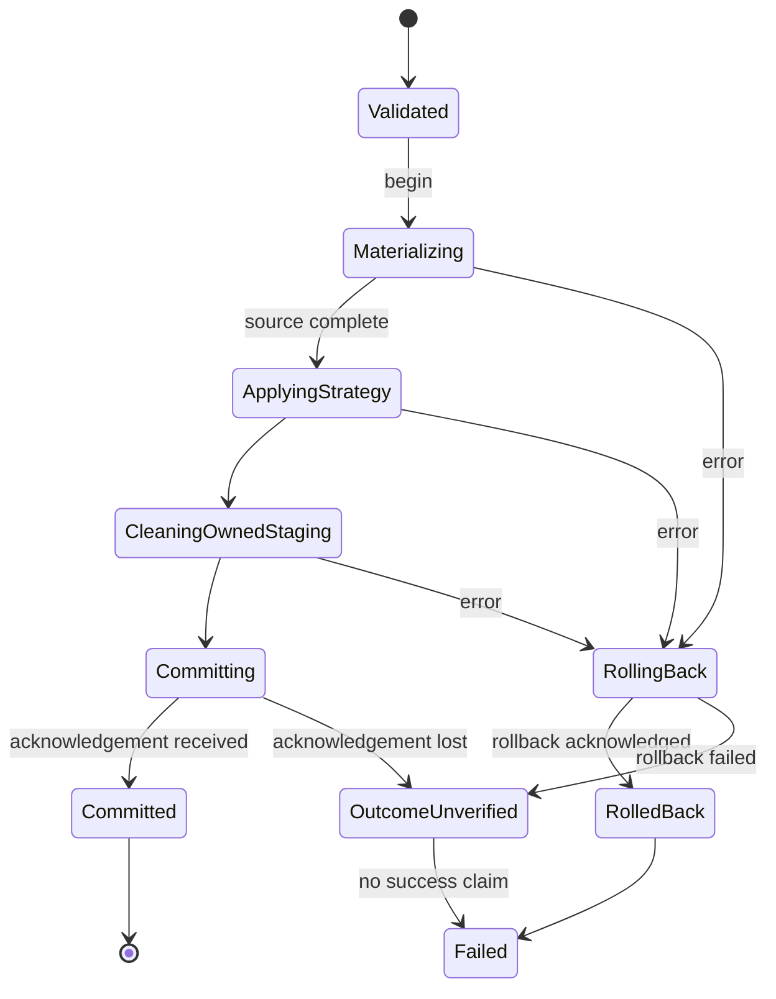

# PostgreSQL strategy preservation and transactional full refresh

- Status: APPROVED
- Owner/integrator: root agent; maintainer: Paul
- Baseline: `2b61988be32906650846fcd8759987a477593d9b`
- Original live runtime: `e501cf87a4e482960d4445dbe27d43bdbdd8064a`
- Target release: unassigned; no publication authority
- Last verified: 2026-09-10

## Problem and observed evidence

A table includes its rows and the database rules protecting those rows. Default
PostgreSQL full refresh promises to replace rows inside an existing table.
For `InternalQueryArtifact`, the common strategy helper instead calls a CTAS
loader, which renames the target, creates another table under its name and
drops the old object. The selected strategy handler never runs.

The approved local Kubernetes test proved that the first run copied all three
expected rows but removed the primary key and NOT NULL constraints. The second
run correctly failed schema validation. This is confirmed metadata damage;
that successful first run did not demonstrate missing business rows.

Original failure remains **FAIL** in
[the retained report](../airflow-hooks-resources/live-minikube-e501cf8-20260910/postgres-constrained-replay-failure.md).
No prior evidence is overwritten or promoted to a pass.

Read-only analysis also found two related hazards: exchange starts/commits a
transaction inside the transaction-owning sink, and its exception handler
performs DROP/restore after rollback. PostgreSQL rollback already reverses
transactional DDL. Those hazards require new negative live proof; they were not
observed as data loss in the original successful refresh.

## Personas and customer journey

| Persona | Need | Success signal |
|---|---|---|
| Data engineer | Refresh a pre-provisioned warehouse table | New exact rows, unchanged target object and constraints |
| Operator | Understand failure and retry | Previous committed rows remain after rejected insertion; useful original error |
| Data architect | Keep database-managed structure | PK, NOT NULL, indexes, defaults, privileges and dependencies are not silently replaced |

Discover the default versus explicit exchange in the PostgreSQL guide. Prepare
the approved target DDL and staging/TRUNCATE permissions. Keep the same manifest,
run the existing CLI or Python entry point, and inspect rows plus catalog
metadata. Diagnose constraint and dependency errors without weakening the schema.
Recover affected old tables from approved DDL only after checking their data.
Upgrade the runtime before resuming repeatable refreshes. No new user option is
needed to obtain the already documented default.

## Scope and public contract

Restore the existing contract in `docs/postgres.md`: omitted overwrite mode and
`truncate_insert` preserve an existing target; only explicit `exchange` selects
object replacement. Artifact format must not override a selected load strategy.

Scope includes the shared PostgreSQL materialization/strategy boundary, full
refresh transaction ownership, error/cleanup behavior, strategy-parity guards,
and user/developer recovery documentation. Keep CLI, Python imports/signatures,
manifest fields/defaults, runtime evidence schemas and checkpoint models.
The corrected behavior can reject invalid rows or missing TRUNCATE privileges
that the defective replacement route previously bypassed; this is enforcement
of existing database and strategy contracts, not a new fallback mode.

Non-goals: automatic reconstruction of lost constraints; replication of source
PKs into newly created tables; dependency-preserving exchange; new route support;
distributed transactions; new snapshot freshness ordering; exactly-once claims;
other database connectors; release/publication. No automatic CASCADE, constraint
removal, mode switching or retries of a lazy source query are introduced.

## Proposed algorithm

The transaction algorithm below covers full refresh (default and explicit
exchange). Shared artifact dispatch must respect other strategies, but existing
append `micro_batch_commit` transaction boundaries remain unchanged. This is
not a redesign of every PostgreSQL transaction mode.

1. Preserve existing preflight/schema checks and resolve the configured sink
   strategy. `PostgresSink.load` owns the target transaction.
2. Materialize each supported artifact through its existing interface. For an
   internal query, execute parameterized `INSERT INTO staging (...) SELECT ...`
   in PostgreSQL. Do not stream those rows through Python or choose an overwrite
   strategy inside the transport. Preserve extraction lifecycle and real count.
3. Only after materialization succeeds, invoke the selected strategy handler.
   For default refresh, ensure the target using current creation policy; if it
   already exists, TRUNCATE it and INSERT the staged rows. Keep the object.
4. Explicit exchange continues to replace the object using its selected handler.
   Remove its nested begin/commit/rollback so it participates in the sink-owned
   transaction. Retain supported cross-schema movement and staging ownership.
5. Clean up only the staging object owned by the run. Cleanup must not mask the
   primary failure or run compensating DROP against a restored target. An error
   before commit propagates to the transaction owner and rolls back.
6. Commit only after handler and required cleanup succeed; return success only
   after commit returns. Preserve primary errors if rollback/cleanup also fails.
   Do not turn an uncertain commit acknowledgement into a success receipt.
7. Keep framework state/evidence ordering. Extraction completion is separate
   from target commit. PostgreSQL full refresh is stateless by default, so its
   checkpoint checks are N/A; no checkpoint system is added for this correction.
   Preserve every strategy-specific `LoadResult` field when adding staging row
   counts; do not reconstruct a partial result that loses replaced/deleted counts.
8. A retry starts a fresh staging attempt and re-executes the source boundary.
   Unchanged input produces the same business rows for full refresh; technical
   load timestamps can change. Changed input is a fresh full snapshot.

```text
PostgresSink.load:
    resolve strategy
    begin target transaction
    try:
        stage = artifact.materialize(existing staging manager)
        result = selected strategy.apply(stage)
        release owned staging, preserving any primary exception
        commit target transaction
        return result
    on failure:
        rollback without destructive compensating target DDL
        propagate original failure
```

This pseudocode describes responsibilities, not a new method/API requirement.
Reuse existing `load`, `_consume_with_staging` and handler interfaces.



Commit acknowledgement loss has an uncertain database outcome and a failed
client operation; it is not proof of rollback. Keep this limitation explicit.

## Edge cases and transaction limits

- Empty source: existing target becomes empty while its structure remains; counts
  are zero. Missing target still follows current create policy.
- Invalid duplicate keys, NULL or CHECK violations: actual insertion rejects
  the rows; rollback restores previous committed rows and metadata.
- Query error during materialization: no destructive target operation has run.
- Incoming foreign key: default TRUNCATE rejects the operation without CASCADE;
  both tables retain their data. No silent exchange fallback.
- TRUNCATE takes an exclusive table lock and has PostgreSQL MVCC limitations.
  This change does not promise uninterrupted reads or zero downtime.
- Concurrent refreshes use isolated staging identities and database locks;
  cancellation/timeout must not publish success. Existing lock serialization
  does not establish ordering by source-snapshot freshness.
- An existing view should keep the same dependency and observe refreshed rows
  in default mode. Exchange may reject dependent-object replacement; it must
  roll back safely, not bypass dependency checks.
- Cancellation and process loss need tests at the production connector boundary;
  database connection loss before commit rolls back a live transaction. Do not
  assume generic mock rollback proves this or promise every crash outcome.

## Architecture and compatibility

| Existing component | Responsibility after correction |
|---|---|
| `PostgresSink` | Sole transaction owner for the full-refresh paths corrected here |
| `PostgresStrategyBase` | Materialize, dispatch selected handler, release owned staging |
| `InternalQueryArtifact` | Same-database query transport and extraction lifecycle |
| `PostgresStagingManager` | Parameterized server-side staging ingestion and owned cleanup |
| Full refresh handler | Default row replacement versus explicitly chosen object replacement |
| Composition factory | Existing injected connector/logger/staging construction |

No new global client, registry, generic transaction framework or
`owns_transaction` flag is needed. Keep canonical runtime packages and thin
compatibility shims. Preserve established imports/signatures; audit direct
loader callers before removing a callable. An obsolete direct loader must not
remain an unguarded alternative that silently selects exchange. A compatibility
adapter must delegate to the approved transaction/strategy entry point rather
than duplicate its policy.

Direct standalone full-refresh `strategy.load` has no independently documented
atomic contract in the reviewed docs. Document `PostgresSink.load` as its
transaction entry point; do not invent ownership through introspection. Preserve
the separately configured append micro-batch commit contract and test it for
regressions if changes touch that route.

The shared helper serves more than full refresh. Prove strategy behavior for
every reachable artifact/strategy combination before changing it. `replace` and
`partition_replace` can reach it through full extraction, making preservation
of out-of-scope rows a required regression. Backfill forwards its artifact to
an inner strategy. Ordinary append/merge sources use file artifacts; internal
queries are a latent sink/direct-API case. Normal snapshot-diff/SCD2 preparation
rejects internal queries during metadata enrichment before the sink. Preserve
those rejections instead of silently adding support. Do not label all routes
production-certified from a full-refresh test.

Preserving an existing target does not fix the separate bootstrap limitation:
current missing-target creation derives names/types, not every constraint of
the source. Do not claim automatic source PK/nullability replication or a fix
for every possible second-run schema mismatch.

Alternatives rejected: restoring only PK/NOT NULL after CTAS leaves identity,
other metadata and strategy bypass defects; a full-refresh-only special case
leaves the common violation; forcing file export adds transport cost and hides
the wrong dependency direction; an automatic exchange fallback violates choice.

An ADR is not required to restore the documented strategy and sink transaction.
A broader exchange metadata guarantee or new standalone transaction API would
need a separate design. Use existing SLOC/import budgets from
`docs/benchmarks/quality_budgets.yml`; remove duplicate policy rather than grow it.

## External design references

Official sources checked 2026-09-10. These are design references, not comparative
live benchmarks or an unqualified product-superiority claim.

| System/version | Fact and adopted/rejected pattern | Source |
|---|---|---|
| PostgreSQL 16 | CTAS makes a new table from query output. TRUNCATE is transactional, locks the table and restricts incoming FKs. Adopt database rollback; reject post-rollback target DROP and automatic CASCADE. | [CTAS](https://www.postgresql.org/docs/16/sql-createtableas.html), [TRUNCATE](https://www.postgresql.org/docs/16/sql-truncate.html) |
| dlt 1.30.0 docs | Distinguishes truncate-and-insert, insert-from-staging, staging-optimized; insert-from-staging performs replacement in one transaction, while PostgreSQL staging-optimized replaces tables. Adopt explicit strategy distinction and staged transaction; reject implicit object replacement. No dpone-versus-dlt performance result is claimed. | [Full loading](https://dlthub.com/docs/general-usage/full-loading) |
| Airbyte current protocol | Separates full source extraction from destination append/overwrite behavior. Adopt the distinction between transport/extraction and write intent; the protocol alone does not certify preservation of PostgreSQL constraints. | [Protocol](https://github.com/airbytehq/airbyte/blob/master/docs/platform/understanding-airbyte/airbyte-protocol.md) |
| Microsoft SSIS, SQL Server 17 docs | Participating tasks can roll their database updates back as one transaction on failure. Adopt clear transaction ownership; reject adding distributed transaction machinery to this local PostgreSQL correction. | [Transactions](https://learn.microsoft.com/en-us/sql/integration-services/integration-services-transactions?view=sql-server-ver17) |

Informatica, Fivetran and Pentaho are N/A to this bounded code-path decision:
their broader configurable/managed loading products are not being selected,
migrated or benchmarked. No claim is made about their metadata guarantees.
Gusty and Astronomer Cosmos are N/A at the PostgreSQL sink transaction layer;
Apache Beam's pipeline model is not needed to correct this existing same-database
artifact dispatch. The same-layer pattern comparison uses dlt above.

Measurable improvement over current dpone: the unchanged logical table OID,
constraint/index/default/view metadata and exact expected business rows survive
two refreshes and one unchanged replay; invalid insertion preserves the previous
state. Target: every required assertion passes on the exact tested source/image.
The existing first-run constraint-loss observation is the failure baseline.
No throughput improvement is claimed; extra database staging work is a tradeoff.

## Test and certification plan

| Layer | Required proof | Environment / artifact |
|---|---|---|
| Unit RED/GREEN | Omitted/explicit truncate modes use genuine internal query materialization and forward parameters; selected handler is honored | Focused PostgreSQL strategy tests and original logs |
| Contract | Artifact × reachable strategy matrix; actual counts; extraction lifecycle; memory/file compatibility; technical columns | Focused tests, with unsupported combinations explicitly distinguished |
| Failure | Primary insertion/query error survives cleanup; no commit/success; rollback owner; no compensating target DROP | Public sink tests and processor state/evidence tests |
| Live default | Existing PK/NOT NULL/CHECK/index/default/grant/trigger/view fixture; changed-source refresh twice and unchanged replay | Real local PostgreSQL, independent observer connection, catalog/row JSON |
| Live rejection | Duplicate PK, NULL and CHECK violations after TRUNCATE; failing source SQL; corrected retry | Original errors, unchanged previous rows/OID/metadata |
| Live boundaries | Empty source; absent target creation; incoming FK safe rejection; explicit exchange success/failure; bounded lock contention | Separate synthetic fixtures with scoped results |
| Live Kubernetes | Constrained target, two strict runs, rejected load, corrected retry | New exact source image, Pod UIDs/digests, logs, original service files, outcome/XCom and independent database observations |
| Broad checks | Change selector, Ruff/format/mypy/import/layer/module budgets, non-live pytest, docs/language/strict MkDocs | Current-commit receipts, skips reported separately |

Existing seams: `tests/test_runtime_postgres_strategy_split.py`,
`tests/integration/postgres/test_postgres_sink_full_refresh_integration.py`,
`tests/integration/postgres/postgres_live_support.py`,
`tests/test_lineage_processor_contracts.py`,
`tests/test_runtime_etl_processor_split.py`.

Existing integration tests use in-memory rows and miss the faulty query route.
New tests must enter through the real `PostgresSink.load`. A preflight rejection
does not prove rollback after TRUNCATE. Check logical `pg_class.oid`, not physical
`relfilenode`, which may change during a normal truncate.

Use the previously approved local Docker/minikube environment and fresh isolated
schemas. Never export credentials. Preserve all original failures and generate
new evidence through producers under this campaign. Full refresh checkpoint
advancement: N/A under the stateless default; processor failure/no-success
ordering still requires coverage. Other connectors: N/A, no certification claim.

## Documentation, recovery and rollout

Update `docs/postgres.md`, `docs/load-strategies.md`, PostgreSQL-to-PostgreSQL
route runbook, architecture and extraction-lifecycle explanations, source-mode
logging, compatibility notes and changelog. Review schema descriptions promising
unconditional zero downtime/dependency preservation; make PostgreSQL limits
accurate without silently redefining other connectors. Preserve field schemas.

Recovery for already affected targets is separate from prevention:

1. Pause affected writers and retain current data plus schema evidence.
2. Obtain the approved target DDL from migrations/schema backup.
3. Check NULLs, duplicate keys and other violations; resolve them according to
   the data owner's rules. Do not automatically delete duplicates or guess keys.
4. Restore missing constraints and other objects from that authority.
5. Run the corrected version and verify rows plus metadata through two runs.

An upgrade cannot reconstruct absent constraints or prove what they used to be.
No automatic production repair is authorized by a local regression test.
Ship the behavior correction without a flag for the unsafe default. If validation
finds row/metadata loss or an incorrect success, stop rollout; rolling back to
the affected runtime does not repair tables and should not resume these routes.

## Agent execution plan and current status

Use an isolated correction branch/worktree from the recorded baseline so the
new PostgreSQL correction does not expand Airflow MR #22. One integrator writes
production code and shared semantic files; fresh reviewers remain read-only.
Create the explicit task contract before any delegated writer is used.

| Role | Ownership | Read-only / forbidden |
|---|---|---|
| Integrator | Approved PostgreSQL runtime paths, related tests/docs; shared schemas/changelog only if needed | Other connector implementations, Airflow feature code, workflows and dependencies remain outside scope |
| Explorer/architect | No writes; trace routes, transaction boundaries and compatibility callers | All source/evidence mutation forbidden |
| Test certifier | No parallel production writes; independent evidence review | Credentials and manufactured evidence forbidden |
| Docs/UX reviewer | No writes during review; novice recovery and defaults review | Shared docs/schema mutation reserved to integrator |

Design-time checks: **PASS** read-only code/contract/evidence review by explorer,
architect, test certifier and docs/UX reviewer; **FAIL** retained original live
constraint-loss case; **SKIP** new unit/live/broad suites (planning only).
No production files, live data, runtime images or remote PR state changed during
that planning phase. These planning statuses are superseded by the implementation
and validation results in [README.md](README.md).

Design ready for review. No merge/release readiness is asserted. Maintainer approval is recorded below.

Independent architecture review corrections incorporated: transaction ownership
is limited to full refresh; the existing append micro-batch contract is excluded;
the state diagram distinguishes failed/uncertain rollback and commit outcomes;
source-level artifact reachability is explicit. This is design review evidence,
not proof of implemented behavior.

## Implementation authorization and current base

On 2026-09-10 the maintainer delegated this separate task with explicit direction
to implement the researched correction, run local Docker/minikube synthetic
proof, commit and create a separate MR. This is approval of the scope above.
No repeat approval is required. Publication and merge remain unauthorized.

Implementation base: `d5ad9aaecc900c24df421b160ed36b4cfc726e45` (`origin/master`).
Branch: `codex/postgres-strategy-preservation`; isolated Codex worktree `ec30`.
The original design and live FAIL are retained unchanged in the source worktree.
A copy of the FAIL is in `original/postgres-constrained-replay-failure.md`; its
relative raw-evidence links resolve in the original campaign directory only.
The baseline paragraph above records research provenance, not this branch base.

### Current-base safety refinements (2026-09-10)

Current-code review found the old file loader compatibility entries contain the
same strategy/transaction bypass. Their constructors and callable signatures
remain as adapters to the selected sink strategy; base helper aliases delegate
to their selected strategy inside the existing transaction. No separate DDL
implementation or CASCADE remains in these paths.

The promised owned staging identity needs a bounded 63-byte UTF-8 name with an
intact UUID and CREATE without IF NOT EXISTS, preventing identifier truncation
from accepting another run's table. Native partition replacement can erase other
values in a wider physical partition; lock the target during scope inspection,
and use the existing predicate fallback (or native_mode=required failure) for
out-of-scope rows or multiple staged values mapped to one child. Database rollback
cleans transactional replacement DDL. These bounded bug fixes enforce the approved
no-loss/isolation criteria and add no route, flag or metadata guarantee.

### Fresh review corrections

Real PostgreSQL RED proved that nullable partition values did not match under
SQL equality and retained old rows on replay. Predicate replacement now uses
IS NOT DISTINCT FROM; native NULL input falls back or rejects required mode.
Standalone file compatibility restores historical best-effort file cleanup.
SQL errors from target diagnostic samples propagate as primary failures because
swallowing them leaves PostgreSQL's transaction aborted. None adds a new option.

### Implementation disposition

Implemented in `1ff83879fc7640d358cad15402672eafddcabf41`, with 40 frozen-source
direct PostgreSQL cases and five strict Kubernetes/Airflow DAG cases passing.
Independent code/architecture and bounded proof reviews approved this source.
Documentation/proof follow-ups preserve its production and test bytes.
The [campaign report](README.md) records broader checks, baseline failures,
remaining CI status and the limits of this evidence. No publication is authorized.
